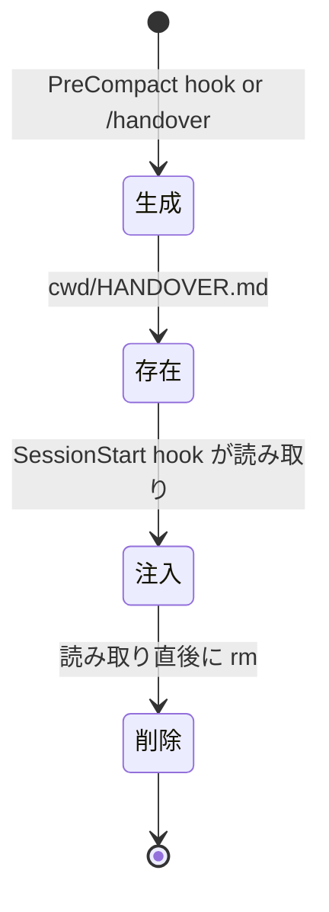

# データモデル

## トランスクリプト（JSONL）

Claude Code が保存するセッションログ。1行1JSONのJSONL形式。

### パス

```
~/.claude/projects/{project-hash}/{session-id}.jsonl
```

### レコードタイプ

| type | 内容 | サイズ影響 |
|------|------|-----------|
| `assistant` | Agent の応答（text, tool_use, thinking） | 大 |
| `user` | ユーザー入力（text）+ ツール結果（tool_result） | 大 |
| `progress` | 進捗表示（spinner等） | ノイズ |
| `system` | システムメッセージ | 小 |
| `file-history-snapshot` | ファイル変更スナップショット | 中 |

### assistant レコード

```json
{
  "type": "assistant",
  "message": {
    "content": [
      {"type": "text", "text": "..."},
      {"type": "tool_use", "name": "Read", "input": {...}},
      {"type": "thinking", "thinking": "..."}
    ]
  }
}
```

### user レコード

```json
{
  "type": "user",
  "message": {
    "content": [
      {"type": "text", "text": "ユーザーの入力"},
      {"type": "tool_result", "content": "（ツール実行結果、巨大になりがち）"}
    ]
  }
}
```

content が文字列の場合もある:

```json
{
  "type": "user",
  "message": {
    "content": "テキストのみ"
  }
}
```

## jq フィルタリング

### 抽出対象

| type | 抽出する content | 除外する content |
|------|-----------------|-----------------|
| assistant | text, tool_use | thinking |
| user | text | tool_result |
| progress | - （全体除外） | - |
| system | - （全体除外） | - |
| file-history-snapshot | - （全体除外） | - |

### サイズ比較（実測値）

| 抽出レベル | サイズ | トークン数 |
|-----------|--------|-----------|
| フル JSONL（加工なし） | ~700KB | - |
| text + tool_result 除外 | ~412KB | ~103k |
| text + tool_use | ~139KB | ~35k |
| text のみ | ~49KB | ~13k |
| text + tool_use + thinking | ~284KB | ~71k |

**採用**: text + tool_use（~139KB / ~35k tokens）— Sonnet のコンテキストに収まり、作業内容の把握に十分な情報量

## PreCompact hook の stdin

`hooks.json` で `PreCompact` に登録された hook は、以下の JSON を stdin で受け取る:

```json
{
  "transcript_path": "/Users/.../.claude/projects/.../session-id.jsonl",
  "cwd": "/Users/.../project",
  "session_id": "abc123-...",
  "source": "compact",
  "model": "claude-opus-4-6",
  "permission_mode": "default",
  "agent_type": "main"
}
```

| フィールド | 用途 |
|-----------|------|
| `transcript_path` | トランスクリプト JSONL のパス（jq フィルタの入力） |
| `cwd` | HANDOVER.md の出力先ディレクトリ |

## SessionStart hook の stdin

```json
{
  "cwd": "/path/to/project",
  "session_id": "abc123-...",
  "source": "compact",
  "model": "claude-opus-4-6"
}
```

| フィールド | 用途 |
|-----------|------|
| `cwd` | HANDOVER.md の検索先ディレクトリ |

### stdout

hook の stdout はセッションコンテキストに注入される。

```
=== 前回セッションからの引き継ぎ ===
# セッション引き継ぎ
## 取り組みと完了状況
- ...
=== 引き継ぎ終了 ===
```

## HANDOVER.md

### テンプレート構造

```markdown
# セッション引き継ぎ

## 取り組みと完了状況
- （何に取り組み、何が完了したか）

## 成功と課題
- （うまくいったこと、いかなかったこと）

## 主要な意思決定と理由
- （重要な判断とその根拠）

## 教訓と注意点
- （学んだこと、ハマりポイント）

## ネクストステップ
- （次のアクション、優先度順）

## 重要ファイルマップ
- （重要ファイルの絶対パスと役割）
```

### ライフサイクル



### 特性

| 項目 | 値 |
|------|-----|
| 典型的なサイズ | 2〜3 KB |
| 生成コスト | ~$0.16（Sonnet） |
| 生成時間 | 30〜60 秒 |
| gitignore | 対象（`.gitignore` に記載） |
| 永続性 | 一時的（注入後に削除） |
