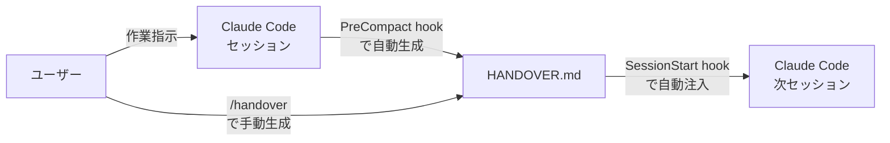
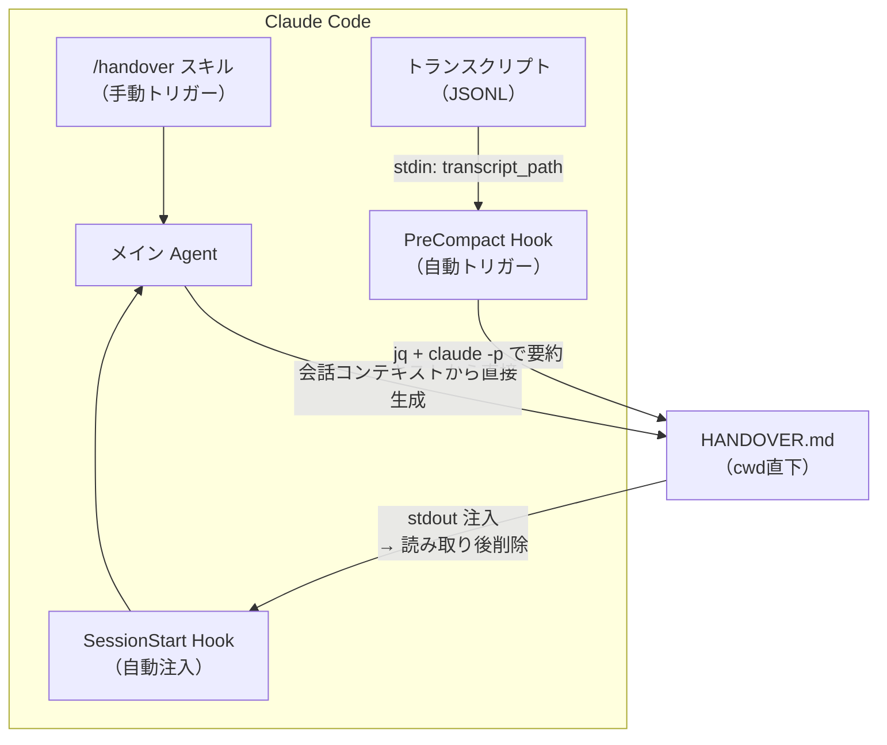
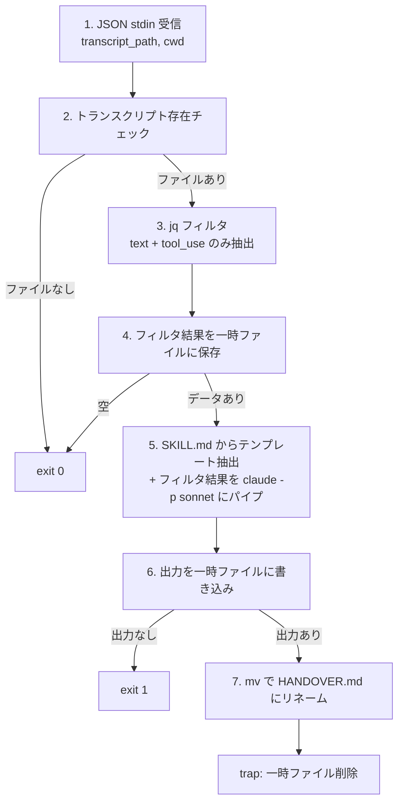
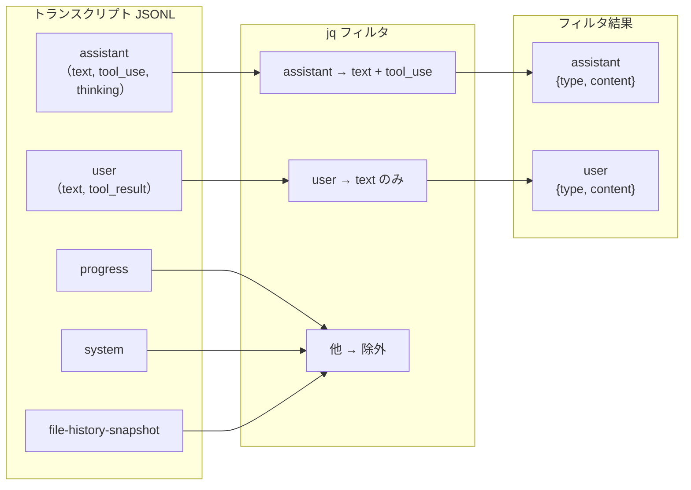
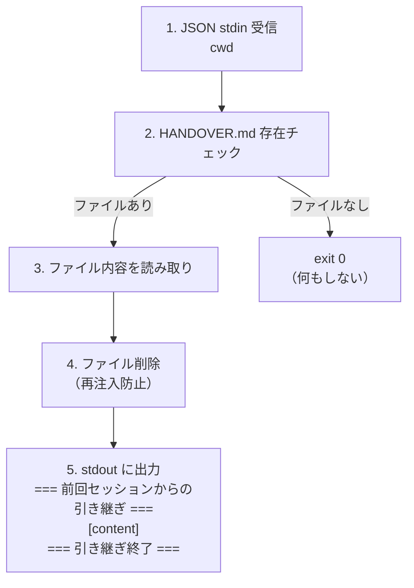

# 構造（C4 Model）

## Level 1: System Context

**ユーザー**: Claude Code を利用する開発者
**システム**: Claude Code のセッション管理 + hooks 機構

## Level 2: Container

| コンテナ | 役割 | スクリプト |
|---------|------|-----------|
| /handover スキル | 手動でメイン Agent に引き継ぎ生成を指示 | `skills/handover/SKILL.md` |
| PreCompact hook | コンパクション前にトランスクリプトを要約 | `hooks/pre_compact.sh` |
| SessionStart hook | HANDOVER.md を読み取りコンテキストに注入 | `hooks/session_start.sh` |
| メイン Agent | セッションの主体。/handover 実行時は自ら生成 | - |

## Level 3: Component（PreCompact hook）

### jq フィルタの詳細

## Level 3: Component（SessionStart hook）

