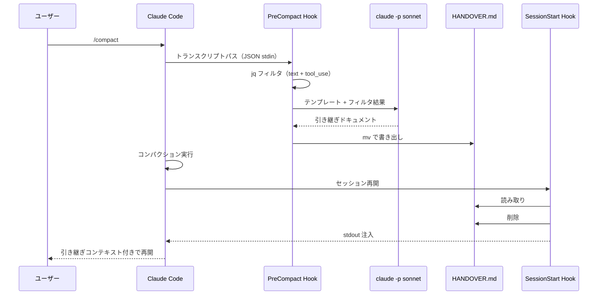

# 利用方法

## 前提条件

### 必要なツール

| ツール | 用途 | インストール |
|-------|------|-------------|
| claude CLI | セッション管理、`claude -p` パイプ実行 | `npm install -g @anthropic-ai/claude-code` |
| jq | トランスクリプトのフィルタリング | `brew install jq` |

### プラグインのインストール

```
/plugin install suwa-sh/claude-code-handover
```

インストールすると PreCompact / SessionStart hook が自動登録される。

## 手動生成: `/handover`

作業の区切りで、明示的に引き継ぎドキュメントを生成する。

```
/handover
```

メイン Agent が現在の会話コンテキストから HANDOVER.md を生成し、cwd に書き出す。

### オプション: 追加の指示

```
/handover 特にXXXの設計判断を詳しく残してほしい
```

引数として追加の指示やメモを渡せる。

### 生成後の流れ

1. `HANDOVER.md` が cwd に作成される
2. 次のセッション開始時（`/compact`、再起動、resume）に SessionStart hook が自動注入
3. 注入後にファイルは削除される

## 自動生成: 自動コンパクション or `/compact`

コンパクション実行時に自動で引き継ぎドキュメントが生成される。

```
/compact
```

### 自動で行われる処理



ユーザーの操作は `/compact` のみ。以降は全自動。

## セッション再開時の確認

SessionStart hook が正常に動作した場合、セッション開始時に以下のメッセージが表示される:

```
SessionStart:compact hook success: === 前回セッションからの引き継ぎ ===
```

このメッセージが表示されれば、引き継ぎコンテキストが注入されている。

## HANDOVER.md が不要な場合

HANDOVER.md が存在しない場合、SessionStart hook は何もせず正常終了する（exit 0）。
エラーは発生しない。

## 注意事項

- `/clear` ではSessionStart hook のmatcher（`startup|resume|compact`）に該当しないため、HANDOVER.md は注入されない
- HANDOVER.md は `.gitignore` に追加することを推奨（誤コミット防止）
- 手動生成（`/handover`）と自動生成（PreCompact hook）は同じテンプレートを使用するため、品質は同等
