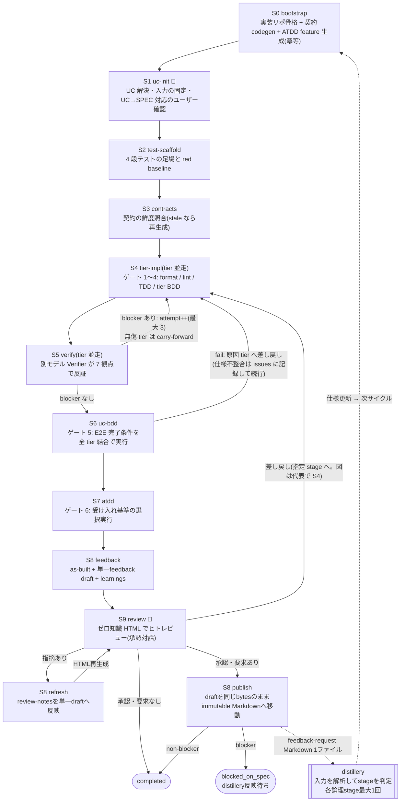

# distillery-impl

distilleryが生成した仕様書から、テストと実装を作るpluginです。
中断時は保存済みの状態から再開できます。

distillery-implは仕様書から4段階のテストを作ります。
Implementerがコードを書き、別モデルのVerifierが検証します。

## 特徴

- **契約駆動**：OpenAPIとAsyncAPIから型、クライアント、スタブを生成します。
  frontendはdist-design-systemが生成したStorybook componentを使います。
- **4段階のテスト**：ATDD、UC BDD、tier BDD、TDDの順に期待動作を固定します。
  実装前にred baselineを確認します。
- **独立検証**：Implementerとは別のVerifierが、仕様整合性を含む7項目を検証します。
- **再開可能な状態管理**：`docs/impl/`へevent、snapshot、完了判定を保存します。
- **tier並走**：tierごとにwrite-setを分けて実装します。
- **仕様への還流**：仕様起因の問題を1つのMarkdownへまとめます。
  dist-pipelineが所有stage、分割、依存stageを決めます。

## パイプライン



💬は利用者の判断が必要なstageです。
破線は、実装で見つけた仕様課題をdistilleryへ戻す流れです。
図は主要な分岐だけを示します。
全分岐は[workflow.html](docs/workflow.html)を参照してください。

## スキル一覧

| skill | 役割 |
|---|---|
| `distillery-impl:dist-impl-run` | オーケストレータ。UC 指定で S0〜S9 を運転(通常はこれだけ呼べばよい) |
| `distillery-impl:dist-impl-bootstrap` | 実装リポの骨格生成・契約 codegen・Storybook 取り込み(冪等) |
| `distillery-impl:dist-impl-implement` | Implementer(test-scaffold / tier-impl / uc-bdd / atdd の 4 mode) |
| `distillery-impl:dist-impl-verify` | Verifier(反証専用・7 観点) |
| `distillery-impl:dist-impl-feedback` | 変更要求・learnings・skill/コンテキスト改善提案 |
| `distillery-impl:dist-impl-review` | レビュー用 HTML レポート生成 |

## 前提条件

- distillery の出力(`docs/specs/latest/` ほか)が存在すること
- Node.js(契約 codegen は npx で実行)
- Java(openapi-generator 用。無い場合は `_api-summary.yaml` 起点の縮退モードで動作)
- ddd plugin(`ddd:ddd-tactical-implementation`)推奨。未導入でも dev-rules のみで動作

## 使い方

```
# UC を指定して実装開始(初回は bootstrap から自動で走る)
/distillery-impl:dist-impl-run 貸出管理業務/貸出管理フロー/書籍を貸出する

# 中断からの再開(同じ指定でよい。完了済み stage は skip される)
/distillery-impl:dist-impl-run 書籍を貸出する
```

オーケストレータは、利用者の判断が必要なときだけ質問します。

仕様起因の変更要求がある場合、S8は1つのdraftへ集約します。
S9の承認後、S8は承認済みのbytesを次の場所へ公開します。

```text
docs/impl/latest/{uc_id}/feedback-requests/{feedback_id}.md
```

公開Markdownにはstage名とレビュー情報を含めません。
レビュー情報はdist-implのevent履歴へ残します。
公開時はdraftのID、SHA-256、要求数、review evidenceを再検証します。
不一致なら公開せず、S8 refreshとS9 reviewへ戻ります。

公開後、distillery workspaceで次を実行します。

```text
/distillery:dist-pipeline {feedback-request.md}
```

所有stageが曖昧な場合、dist-pipelineは推奨案、代替案、影響、根拠を提示します。
`--recommended-auto`は、要求の意味を変えない安全なroutingだけを自動採用します。
それ以外は利用者の回答を待ちます。

feedbackの作成と公開は[dist-impl-feedback](skills/dist-impl-feedback/SKILL.md)を参照してください。
pipeline側の実行契約は[distillery README](../distillery/README.md#distillery-impl-の複数フィードバックを1回で反映)を参照してください。

## 設計の出自

Cloudflare Vulnerability Research Harnessの設計原則を、仕様駆動実装へ応用しています。
採用した原則は、独立検証、状態の外部化、再開可能なstage分割、human-in-the-loopです。

- 解説記事: [技術調査 - Cloudflare 脆弱性探索ハーネス (VDH/VVS)](https://suwa-sh.github.io/zenn-contents/articles/cloudflare-vulnerability-harness_20260619/)
- 一次情報: [Build your own vulnerability harness — Cloudflare Blog](https://blog.cloudflare.com/build-your-own-vulnerability-harness/)
