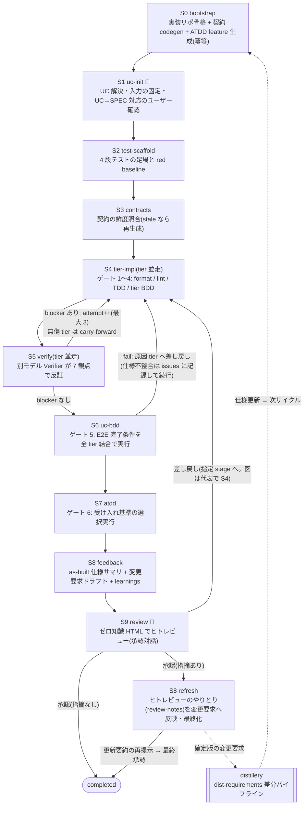

# distillery-impl

distillery が生成した仕様書を入力に、「実装」を継続稼働パイプラインで回す実装ハーネス plugin です。

distillery は「要望テキスト → USDM 要件 → RDRA → 仕様書(ユースケースごと・ティアごとの BDD 完了条件つき)」までを自動生成します。distillery-impl はその続きを担当します: 仕様書からテストを 4 段先に生成し、実装エージェント(Implementer)が書き、別モデルの検証エージェント(Verifier)が反証し、途中で切れても再開できる形で「動くコード」まで運びます。

## 特徴

- **契約駆動**: openapi / asyncapi から型・クライアント・スタブを生成し、実装はその生成物起点で書きます。frontend の UI は design(dist-design-system)が生成した Storybook コンポーネントだけを使います
- **4 段テスト先行**: ① ATDD(USDM の受け入れ基準)② UC BDD(仕様書の E2E 完了条件)③ tier BDD(ティア完了条件)④ TDD(単体)。上 3 段は仕様の gherkin をそのまま転写し、実装前に「期待した理由で fail する」red baseline を作ります
- **二段独立検証**: Implementer と別モデルの Verifier が 7 観点(仕様整合 / 可読性・保守性 / セキュリティ / パフォーマンス / 運用性 / 耐障害性 / リファクタリング)で反証します。自己採点を排除します
- **ファイル駆動の冪等再開**: 状態は `docs/impl/`(events 追記 + latest スナップショット + 完了判定ファイル)。セッションが切れても未完了 stage から再開します
- **tier 並走**: mono repo で tier ごとにディレクトリを分け、書き込み範囲(write-set)を分離して並列実装します
- **仕様への還流**: 実装で見つけた仕様の問題は、dist-requirements の差分パイプラインへそのまま渡せる変更要求ファイルとして出力します

## パイプライン



💬 = ユーザー対話ポイント。破線 = 仕様への還流(実装 → as-built → ヒトレビュー確定 → distillery で仕様更新 → 次サイクル)。
図は簡略化しています(S7 fail の分岐・blocked_on_spec 終了・S9 差し戻し先の任意 stage 指定は SKILL.md 本文が正)。
状態ファイル・fail 時の分岐まで含めた詳細図解は [docs/workflow.html](docs/workflow.html)(ブラウザで開いてください)。

## スキル一覧

| skill | 役割 |
|---|---|
| `distillery-impl:dist-impl-run` | オーケストレータ。UC 指定で S0〜S9 を運転(通常はこれだけ呼べばよい) |
| `distillery-impl:dist-impl-bootstrap` | 実装リポの骨格生成・契約 codegen・Storybook 取り込み(冪等) |
| `distillery-impl:dist-impl-implement` | Implementer(test-scaffold / tier-impl / uc-bdd / atdd の 4 mode) |
| `distillery-impl:dist-impl-verify` | Verifier(反証専用・7 観点) |
| `distillery-impl:dist-impl-feedback` | 変更要求・learnings・skill/コンテキスト改善提案 |
| `distillery-impl:dist-impl-review` | レビュー用 HTML レポート生成 |

## 前提条件

- distillery の出力(`docs/specs/latest/` ほか)が存在すること
- Node.js(契約 codegen は npx で実行)
- Java(openapi-generator 用。無い場合は `_api-summary.yaml` 起点の縮退モードで動作)
- ddd plugin(`ddd:ddd-tactical-implementation`)推奨。未導入でも dev-rules のみで動作

## 使い方

```
# UC を指定して実装開始(初回は bootstrap から自動で走る)
/distillery-impl:dist-impl-run 貸出管理業務/貸出管理フロー/書籍を貸出する

# 中断からの再開(同じ指定でよい。完了済み stage は skip される)
/distillery-impl:dist-impl-run 書籍を貸出する
```

進行中の対話(tier 構成の確認・UC→SPEC 対応の確定・Verifier 超過時の判断・最終承認)は
オーケストレータが必要な時だけ発話します。

## 設計の出自

Cloudflare の Vulnerability Research Harness(VDH/VVS)の設計原則 — 二段独立検証・状態の外部化と
冪等再開・コンテキストを絞った stage 分割・PoC 必須・モデル非依存・human-in-the-loop — を
「脆弱性探索」から「仕様駆動実装」に転用したものです。

- 解説記事: [技術調査 - Cloudflare 脆弱性探索ハーネス (VDH/VVS)](https://suwa-sh.github.io/zenn-contents/articles/cloudflare-vulnerability-harness_20260619/)
- 一次情報: [Build your own vulnerability harness — Cloudflare Blog](https://blog.cloudflare.com/build-your-own-vulnerability-harness/)
