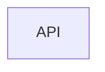
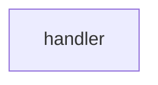
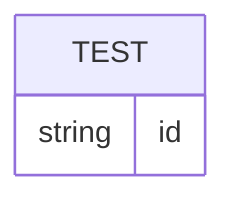

# アーキテクチャ設計書

## 概要

| 項目 | 内容 |
|------|------|
| イベントID | 20260624_120000_test_domain_minimal |
| 作成日時 | 2026-06-24T12:00:00 |
| ソース | PR1 動作確認用 minimal fixture |
| 言語 | TypeScript |
| フレームワーク | Next.js |
| 技術的制約 | テスト用最小構成 |

## ドメインアーキテクチャ

### サブドメイン分類

| ID | 名前 | 分類 | 投資方針 | 関連 BUC | confidence | 根拠 |
|----|------|:----:|---------|---------|:----------:|------|
| SD-001 | テスト中核業務 | core | 最優先で投資 | BUC-001 | 中 | テスト中核業務が事業の中核 |

### 境界づけられたコンテキスト (Bounded Context)

| ID | 名前 | 所属 SD | 所有 entity | 所有 BUC | チーム | confidence | 根拠 |
|----|------|:------:|-----------|---------|--------|:----------:|------|
| BC-001 | テスト BC | SD-001 | E-001 | BUC-001 | - | 中 | 1 サブドメイン 1 BC |

#### ユビキタス言語

**BC-001 テスト BC**

| 用語 | 定義 |
|------|------|
| テスト対象 | BC-001 における管理対象 |

### 集約境界の仮説

> 注: これらは戦略段階の仮説です。最終確定は dist-spec or ddd-tactical-implementation で行います。

| ID | BC | root entity | members | invariants | confidence | 備考 |
|----|----|-----------|---------|-----------|:----------:|------|
| AG-001 | BC-001 | E-001 | - | - | 低 | 仮説。最終確定は dist-spec で行う |

## システムアーキテクチャ

### システム構成図

### ティア構成

| ID | ティア名 | 説明 | テクノロジー候補 |
|-----|---------|------|----------------|
| tier-api | API | テスト API ティア | CaaS(k8s) |

## アプリケーションアーキテクチャ

### tier-api のレイヤー構成

#### レイヤー依存図

| ID | レイヤー名 | 責務 | 依存許可先 |
|-----|---------|------|----------|
| L-api-handler | handler | リクエスト受付 | - |

## データアーキテクチャ

### ER 図

### エンティティ一覧

#### E-001: テスト情報

- **参照元**: 情報: テスト情報
- **モデル種別**: リソース

| 属性名 | 型 | 説明 | NULL | PK |
|--------|-----|------|:----:|:--:|
| id | string | テストID | No | Yes |

### ストレージマッピング

| エンティティID | ストレージ種別 | 根拠 | 確信度 |
|---------------|:------------:|------|:------:|
| E-001 | RDB | シンプルなマスタ | デフォルト |

## 凡例

### 確信度

| 確信度 | 意味 |
|:------:|------|
| 高 | RDRA/NFR モデルから明確に推論 |
| 中 | RDRA/NFR モデルから間接推論 |
| 低 | 弱い根拠での推論 |
| デフォルト | 一般的なベストプラクティスを適用 |
| ユーザー指定 | 対話でユーザーが指定 |
