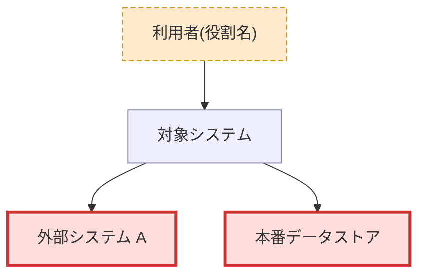
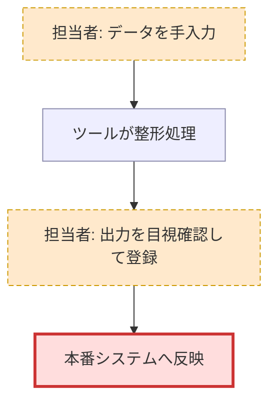
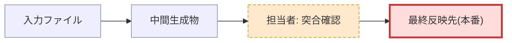

# preflight: 影響範囲の事前調査(軽量パス)

変更の影響範囲を、実装内部を読む前に絞り込む。対象はブラックボックスな資産全般:
全自動化された小さなツール、Excel/Access マクロ、業務の現場で使うアプリ(スマホアプリの現場での使われ方)、
大規模 web app の変更前調査。コードリポジトリが無くても、外側から読める資料があれば実行できる。

- **出力**: `docs/harvest/preflight/events/{event_id}/preflight.md` を生成し、
  `docs/harvest/preflight/latest/preflight.md` へ置換コピーする
- **event_id**: `date '+%Y%m%d_%H%M%S'` の実行結果 + `_preflight`(日時を LLM が推測してはならない)
- **evidence / confidence**: `references/evidence-rules.md` の 事実/推測 の 2 分類と
  high/medium/low に準拠する。locator は本ファイルの「locator 拡張」節に従う

## 不変の規範: 実装内部を読まない

絞り込みが終わるまで、次を開かない:

- **プログラム本文**(VBA / スクリプト / ソースコードの中身)
- **バイナリ**(xlsx / xlsm / accdb / 実行ファイル等)

許可する証拠源(外側から読める資料):

- 手順書・運用手順・README・構成資料・画面遷移資料
- テキストの設定ファイル・ジョブ定義・ファイル/ディレクトリ名・テキスト化されたシート名一覧
- 読み取り可能な実出力(CSV / TSV / ログ等のテキスト)
- 回答メモ(担当者ヒアリングの記録。「回答メモ」節参照)

**開始条件**: 処理・業務の流れまたは構成を説明するテキスト(手順書・README・構成資料・
画面遷移資料/ユーザーフロー・ジョブ定義など)が**最低 1 つ**あること。判定基準は資料の種類名ではなく、
**「その資料から少なくとも 1 つの view と影響境界の候補を証拠付きで構築できるか」**とする。
次の場合は調査を開始せず、「手順・構成のテキスト化(シート名一覧・操作手順のメモ化)を用意してから
再実行してください」と案内して終了する:

- テキスト資料が無くバイナリしか無い場合
- 実出力(CSV / ログ)だけしか無い場合(実出力は突合の証拠にはなるが、それだけでは
  処理の流れ・境界を組み立てられない)

## 変更内容(--change)の扱い

影響判定には「何を変えようとしているか」が要る。

- `--change` の指定値が**実在するテキストファイルのパスならその内容を読み込んで**変更内容とする。
  パスらしい値だが存在しない・読めない場合は、その旨を理由にして影響判定を「保留」にする
  (文字列をそのまま変更内容と誤解釈しない)
- `--change` が未指定なら、**対話で 1 回だけ**変更内容を質問する
- 質問できない実行環境・回答が得られない場合は、影響判定を「保留」にして続行する(エラーにしない)

## 進め方: 3 つの整理 view → 影響判定

対象の規模・性質に応じて**該当する view だけ**描く。該当しない view は preflight.md に
`N/A + 理由` を記録する(図を捏造しない)。迷ったら 3 つとも描いてよい。

| view | 何を描くか | 主役になる対象の例 |
|---|---|---|
| 1. システムコンテキスト | 利用者・外部システム・対象システムの境界(C4 コンテキスト/コンテナ相当) | 大規模 web app、業務アプリ |
| 2. 業務フロー | 人の作業手順と機械処理の連鎖。**手運用を一級市民として**ノード化 | 現場運用のあるアプリ、手順書ベースの業務 |
| 3. 成果物チェーン | 入力 → 処理 → 中間生成物 → 最終反映先(データの流れ) | バッチ、マクロ、パイプライン |

### View 1: システムコンテキスト

誰が使い、何と繋がっているかを図にする。**外部接続の先に影響境界の候補が現れる**。
単機能の小ツールなら数ノードで済む。



### View 2: 業務フロー

人の作業と機械処理を**同じ粒度で**ノード化する。手運用(手動登録・目視突合・現場の運用ルール)は
省略しやすいが、**過去のトラブル由来の暗黙の安全装置**であることが多い。
各手運用ノードに「なぜ残っているか」の推測(confidence 付き)を添える。



### View 3: 成果物チェーン

入力から最終反映先までのデータの流れを描く。中間生成物(ファイル / シート / 一時テーブル)を
1 つずつノードにする。



classDef は 3 区分で固定する: `machine`(機械処理)/ `manual`(手運用。破線)/
`boundary`(最終反映先・外部影響境界。太枠)。View 1 では外部接続先を `boundary` で強調する。

### 影響判定

3 view から**外部影響境界**(本番オブジェクト / 本番データ / 外部システムとの契約)を特定し、次の基準で判定する:

> **外部影響境界で観測される内容(値・件数・形式・タイミング・副作用)が変わるか**

反映先オブジェクトが同じでも、そこへ届く内容が変われば影響ありとする(YES)。
途中の中間生成物の形式が変わっても、境界で観測される内容が同じなら影響なしとする(NO)。

**比較の基準は「現行運用の実態」**(手運用による補正込みで、いま境界に届いている内容)とする。
機械処理の仕様だけを見て判定しない。典型的な落とし穴: **既存の手運用を自動化する変更**は、
手運用が既に同じ結果を作っているなら境界の内容を変えない(NO)。手運用の実態(本当に毎回
行われているか、細部の仕様)が不明なら、YES に倒さず「保留」にして残質問で確定する。

判定は 3 値:

| 判定 | 条件 |
|---|---|
| YES | 境界で観測される内容が変わる根拠がある |
| NO | 境界で観測される内容が変わらない根拠がある |
| 保留 | ①変更内容が未指定 ②影響境界を特定できない ③因果を証拠から確定できない(証拠不足・矛盾) |

保留の場合は**理由**と、**解消に必要な質問**(残質問リストへ)を必ず出力する。

## locator 拡張と confidence 目安

evidence-rules.md の `事実: {path:行}` / `推測: {手がかり}` に、preflight では次の locator を加える:

| locator | 使える条件 |
|---|---|
| `path:行` | テキスト資料から直接読めた |
| `手順書名 §節` | 手順書の該当節から読めた |
| `ファイル名#シート名` | **実体(シート一覧等)を列挙・確認できた場合のみ**。構成説明テキスト由来なら locator は `構成説明ファイル:行` とし、シート名は注記に書く |
| `回答メモ path:行` | 担当者の回答メモ(下記)から読めた |

**未確認の伝聞は locator にしない。** 確認できていない事項は残質問リストへ回す。

confidence の目安(「文書上の記載」と「現行実態」を混同しない):

| 証拠の状態 | confidence |
|---|---|
| 手順書と実出力ファイル・複数資料の突合で一致 | high |
| 手順書単独の記載(現行運用がそのとおりである保証はない) | medium |
| ファイル名・シート名からの推定 | medium |
| ドメイン一般論からの補完 | low |

## 回答メモ(担当者ヒアリングの反映経路)

残質問リストへの回答は、次の形式のテキストにして**対象パスに含めて再実行**する(専用の引数は無い):

```markdown
# 回答メモ(2026-01-15 ヒアリング)
- Q1(手作業スケジュールシートは誰が使う?): 現場リーダーが週次の人員配置に使う。
  回答者: 山田さん(運用担当) / 日付: 2026-01-15
```

## 出力フォーマット(preflight.md)

次の構成・順序で固定する。**保留時も全セクションを出力する**(影響判定欄を「保留 + 理由」にする)。
変更内容・境界に依存して確定できない項目は、確定値を捏造せず「未確定 + 理由」と書く。

セクション別の契約:

- **ノード一覧**: **3 view に登場する全ノードを列挙する**。複数 view の同義ノードや集約ノード
  (例: ツール 3 本を 1 ノードにまとめた場合)は、1 行に統合してよいが対応関係を説明列に明示する。
  一覧に載らない図ノードを残さない
- **影響範囲の絞り込み**: 「読まなくてよい / 読む必要がある / 未確定」の**排他的な 3 分類**で書く。
  「読まなくてよい」に入れられるのは**前提が証拠で確定している場合のみ**。未確認の前提
  (「〜のはず」「〜している模様」)に依存する除外は「未確定」に分類し、確定に必要な質問を
  残質問リストへ出す。**スコープに影響する残質問には、対応する「未確定」項目が必ず存在する**
  ことを出力前に検査する(質問だけあって絞り込みに現れない対象を残さない)
- **次の一手**: 成果物単体を読んだ人が次の行動を取れるよう、後続案内(「完了報告と後続案内」節の
  内容: 成果物単位の分類・回答メモの書き方と置き場所・再実行コマンド)を成果物の末尾にも書く

```markdown
# preflight: {対象名} への変更影響調査

## 結論
- 影響判定: YES | NO | 保留({保留理由})
- 根拠: {一行。境界で観測される内容が変わる/変わらない理由}
- 調べた変更内容: {--change の内容。未指定なら「未指定」}

## 整理 view
### システムコンテキスト
{mermaid 図 または N/A + 理由}
### 業務フロー
{mermaid 図 または N/A + 理由}
### 成果物チェーン
{mermaid 図 または N/A + 理由}

## ノード一覧
| ノード | 区分(machine/manual/boundary) | 説明 | 確度 | 根拠 |
|---|---|---|---|---|

## 影響範囲の絞り込み
- 読まなくてよい範囲: {列挙 + 理由(前提が証拠で確定しているもののみ)}
- 読む必要がある範囲: {列挙 + 理由}
- 未確定: {列挙 + 理由 + 対応する残質問番号}

## 手運用ノード
| 手運用 | なぜ残っていると考えられるか(推測) | 確度 | 根拠 |
|---|---|---|---|

## 残質問リスト(担当者へ)
- Q1: {質問}(なぜ聞くか: {理由})

## 次の一手
- {読む必要がある範囲の項目ごとの後続案内(全量解析 / ヒアリング→回答メモ→再実行)}
- 回答メモの置き場所と再実行コマンド: {対象パス} に回答メモを置き、
  `/distillery:dist-harvest --preflight {対象パス} --change "{変更内容}"` を再実行
```

## 完了報告と後続案内

完了報告では、「読む必要がある範囲」の**各項目(成果物単位)ごと**に次を案内する(入力全体の二分にしない):

- **コードリポジトリ内の範囲** → 所属リポジトリの**実在するディレクトリに正規化**して
  「`/distillery:dist-harvest <ディレクトリ>` で全量解析に進めます」と案内する
  (全量パスはディレクトリ入力が前提のため)
- **非コード資産**(手順書・Excel・手運用)→ 残質問リストの担当者ヒアリング →
  回答メモを対象パスに含めて preflight を再実行、と案内する
- 混在する場合は両方を併記する

preflight から全量解析への自動接続は行わない(案内のみ)。
