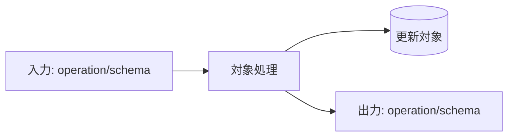
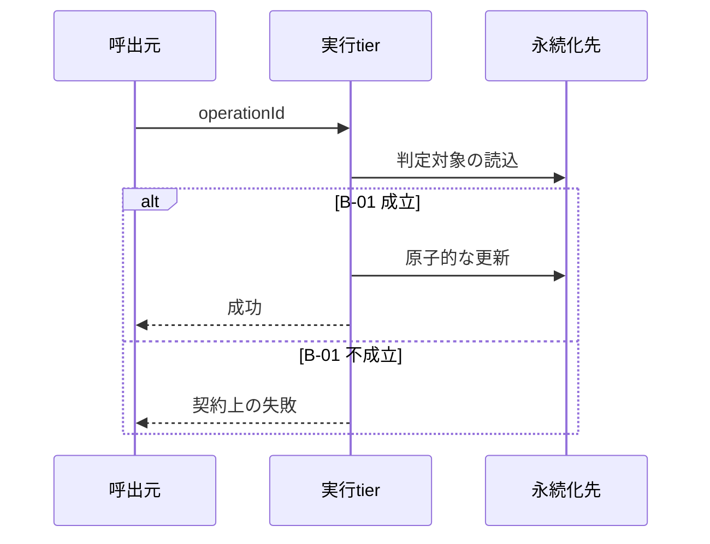

# Spec テンプレート定義

> 新規生成は `references/specs/latest-linked-spec.md` を優先する。業務条件・状態遷移はRDRA latest、部品契約はdesign latestのStorybookへ参照し、再定義しない。分割OpenAPIを直接編集し、不足はpipelineへ還流する。

> Step3 で使用。共通の出力規約と spec.md のフォーマット。

catalog modeを明示された場合は `references/specs/contract-catalog.md` の派生物/参照規約を優先する。
APIの入出力型表とsummaryを手書きする以下の規約はlegacy modeに限る。

`product-spec-writing.md`の本文分離とテクニカルライティングを適用する。

## 出力規約

- 業務条件・計算・状態はRDRA latest、UI部品契約はdesign latestのStorybookを正本にする。
- 技術条件は所有tier、複数UCへ同じ意味で適用する技術規則だけ_cross-cuttingに定義する。
- API型は分割OpenAPIの正本にだけ定義する。summary/slice/bundleは派生物として生成する。
- 参照はlatestのファイル + 要素キーを指定する。現在生成中の出力内部は相対リンクを使い、昇格時に位置を再計算する。
- データフローは情報の移動、シーケンスは処理順序・分岐・commitと失敗の出口を示す。
- 同じ図を文章や表で言い換えない。分岐接続表は図から参照する条件の所在を特定する。
- 本文は具体的な変更提案を採用した場合のシステムを説明する。提案内容と採用状況は変更要求とproposal-baselineで管理する。
- 具体的なGiven / When / Thenを残す。提案に根拠のない期待値を追加しない。
- 原子性、認可、再送、障害時の副作用等の判断は参照先を含め実装可能性を検査する。
- legacyイベントは読取互換を維持し、新規生成で旧型表・業務ルール表を要求しない。

## ディレクトリ構成

```text
{業務名}/{BUC名}/
  buc-spec.md
  {UC名}/
    spec.md
    tier-{tier_id}.md
    _api-summary.yaml       # API / 非同期契約がある場合
    _model-summary.yaml
```

ティアは arch-design.yaml の `system_architecture.tiers` から選定する。
対象 kind の `references/specs/tier-templates/` のファイルだけを読む。

## spec.md フォーマット

````markdown
# {UC名}

## 概要

{アクターがどの契機に何を行い、どの業務結果を得るかを1〜3文で記述}

## データフロー


```mermaid
flowchart LR
  Input[入力: operation/schema] --> Service[対象処理]
  Service --> Store[(更新対象)]
  Service --> Output[出力: operation/schema]
```

## シーケンス


```mermaid
sequenceDiagram
  participant UI as 呼出元
  participant API as 実行tier
  participant DB as 永続化先
  UI->>API: operationId
  API->>DB: 判定対象の読込
  alt B-01 成立
    API->>DB: 原子的な更新
    API-->>UI: 成功
  else B-01 不成立
    API-->>UI: 契約上の失敗
  end
```

{図は対象UCの実際の順序・分岐・競合・失敗境界へ置き換える。単なるレイヤー往復で終えない。}

## 分岐条件の接続

| 分岐ID | 条件の正本 | 成立 / 不成立の行先 |
|---|---|---|
| B-01 | {RDRA latestの条件名へのリンク、またはtier内の技術条件ID} | {図の行先} |

## 状態遷移参照

{RDRA latest/状態.tsvへのリンクと状態モデル+遷移UC。原子的な更新は_model-summary.yamlへのリンクで示す。}

## 関連 RDRA モデル

| モデル種別 | 要素名 | 関連 / 適用箇所 |
|-----------|--------|----------------|
| 業務 | {業務名} | 所属 |
| BUC | {BUC名} | 所属 |
| アクター | {アクター名} | 操作 |
| 情報 | {情報名と対象属性} | {_model-summary.yaml の model / table、または契約のschema / property} |
| 条件 / バリエーション | {要素名・値} | {分岐ID} |
| 状態 | {状態モデル名} | {状態モデル+遷移UC} |
| 外部システム | {要素名} | {tier md の連携定義} |

## E2E 完了条件（BDD）

```gherkin
Feature: {UC名}

  Scenario: {正常系の業務結果}
    Given {具体的な前提}
    When {アクターの操作}
    Then {観測可能な結果}

  Scenario: {不成立時の業務結果}
    Given {具体的な不成立条件}
    When {アクターの操作}
    Then {観測可能な失敗と変更されない情報}
```

## ティア別仕様

- [{ティア名}](tier-{tier_id}.md)
- [OpenAPI](../../../_cross-cutting/api/openapi/openapi.yaml): `{operationId}`
- [AsyncAPI](../../../_cross-cutting/api/asyncapi/asyncapi.yaml): `{channel / operation}`（存在する場合のみ）
````

`概要`、`関連 RDRA モデル`、`E2E 完了条件`、`ティア別仕様` は必須。
新規生成はデータフロー・シーケンス・分岐接続を含める。状態遷移参照は該当時のみ。
分岐IDは文書内で一意とし、更新時に維持する。既存の業務ルール表は読取互換のみ。

## ティア別フォーマット

| kind | ファイル |
|------|----------|
| presentation | `references/specs/tier-templates/presentation.md` |
| api | `references/specs/tier-templates/api.md` |
| worker | `references/specs/tier-templates/worker.md` |
| cli | `references/specs/tier-templates/cli.md` |

design 無しモードでは、画面仕様・コンポーネント設計・デザイントークン参照・screens を生成しない。
BUC のフォーマットは `references/specs/buc-spec-template.md`。
