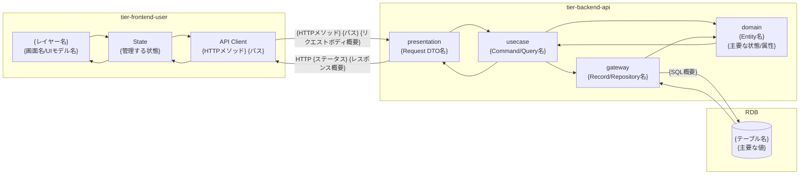
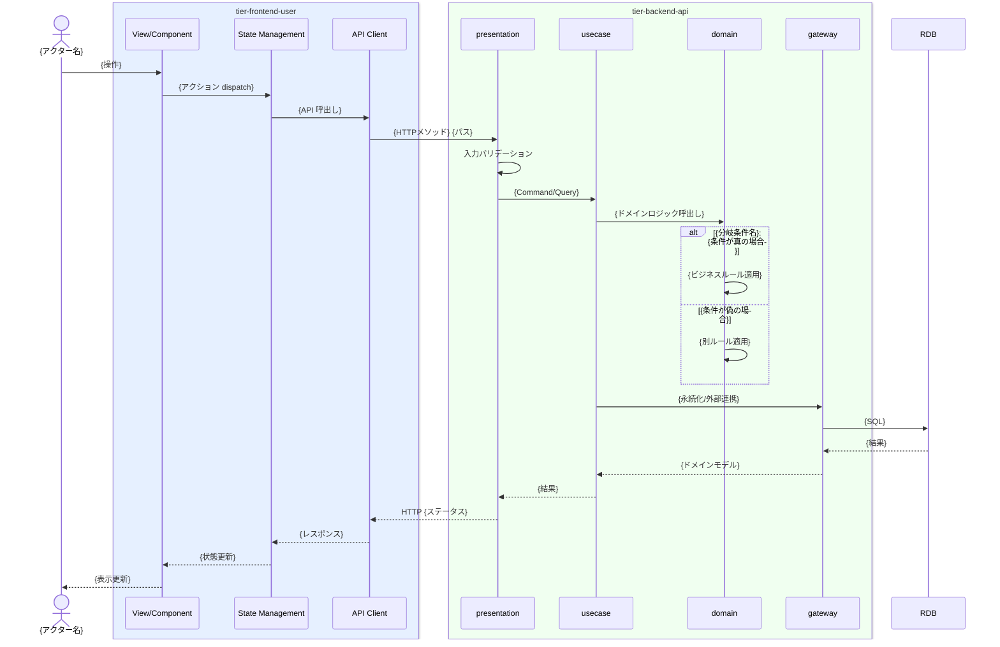

# Spec テンプレート定義

> **読み込みタイミング**: Step3 で使用。UC/BUC Spec のフォーマット定義。
>
> **正規リファレンス実装**: `docs/specs/latest/会議室利用業務/会議室予約フロー/バーチャル会議室を予約する/spec.md` を参照

BUC 単位・UC 単位の仕様ドキュメントのフォーマットを定義する。

## ディレクトリ構成

```
{業務名}/
  {BUC名}/
    buc-spec.md                         # BUC 俯瞰仕様（UC 横断データフロー、状態遷移全体図）
    {UC名}/
      spec.md                           # UC の仕様概要（RDRA トレーサビリティ含む）
      tier-{tier_id}.md                 # ティア別仕様（arch-design.yaml の tiers[].id ごと）
```

ティア構成は `docs/arch/latest/arch-design.yaml` の `system_architecture.tiers` から動的に決定する。
ファイル名の `{tier_id}` は `tiers[].id` をそのまま使用する（例: `tier-frontend.md`, `tier-backend-api.md`）。

## spec.md フォーマット

```markdown
# {UC名}

## 概要

{UC の目的と概要を1-3文で記述}

## データフロー

この UC で扱うデータがティア/レイヤーをどう流れ、変換されるかを示す。
ティアごとに subgraph を描き、各ノードは `"レイヤー名\nモデル名"` 形式で記述する。
arch-design.yaml の `app_architecture.tier_layers` からレイヤー構成を参照すること。


```mermaid
graph LR
  subgraph FE["tier-frontend-user"]
    FE_View["{レイヤー名}\n{画面名/UIモデル名}"]
    FE_State["State\n{管理する状態}"]
    FE_API["API Client\n{HTTPメソッド} {パス}"]
    FE_View --> FE_State --> FE_API
  end
  subgraph BE["tier-backend-api"]
    BE_Pres["presentation\n{Request DTO名}"]
    BE_UC["usecase\n{Command/Query名}"]
    BE_Domain["domain\n{Entity名}\n{主要な状態/属性}"]
    BE_GW["gateway\n{Record/Repository名}"]
    BE_Pres --> BE_UC --> BE_Domain
    BE_UC --> BE_GW
  end
  subgraph DB["RDB"]
    DB_Table[("{テーブル名}\n{主要な値}")]
  end
  FE_API -->|"{HTTPメソッド} {パス} {リクエストボディ概要}"| BE_Pres
  BE_GW -->|"{SQL概要}"| DB_Table
  DB_Table --> BE_GW --> BE_Domain --> BE_UC --> BE_Pres -->|"HTTP {ステータス} {レスポンス概要}"| FE_API --> FE_State --> FE_View
```

| レイヤー | データモデル | 変換内容 |
|---------|------------|---------|
| FE View | {画面での入力/表示内容} | {ユーザー操作 → 状態/リクエスト変換} |
| BE presentation | {Request DTO名}({主要パラメータ}) | {バリデーション + Command 変換} |
| BE gateway | {SQL / テーブル操作概要} | {レコード作成/更新} |
| Response | {レスポンスボディ概要} | {表示メッセージ用途} |

## 処理フロー

この UC の処理がティア内のレイヤーをどう call stack で辿るかを示す。
分岐条件・計算ルールを含む処理フローを、レイヤー単位で可視化する。


```mermaid
sequenceDiagram
  actor User as {アクター名}

  box rgb(230,240,255) tier-frontend-user
    participant View as View/Component
    participant State as State Management
    participant APIClient as API Client
  end

  box rgb(240,255,240) tier-backend-api
    participant Pres as presentation
    participant UC as usecase
    participant Domain as domain
    participant GW as gateway
  end

  participant DB as RDB

  User->>View: {操作}
  View->>State: {アクション dispatch}
  State->>APIClient: {API 呼出し}
  APIClient->>Pres: {HTTPメソッド} {パス}
  Pres->>Pres: 入力バリデーション
  Pres->>UC: {Command/Query}
  UC->>Domain: {ドメインロジック呼出し}
  alt {分岐条件名}: {条件が真の場合}
    Domain->>Domain: {ビジネスルール適用}
  else {条件が偽の場合}
    Domain->>Domain: {別ルール適用}
  end
  UC->>GW: {永続化/外部連携}
  GW->>DB: {SQL}
  DB-->>GW: {結果}
  GW-->>UC: {ドメインモデル}
  UC-->>Pres: {結果}
  Pres-->>APIClient: HTTP {ステータス}
  APIClient-->>State: {レスポンス}
  State-->>View: {状態更新}
  View-->>User: {表示更新}
```

## バリエーション一覧

| バリエーション名 | 値 | 処理内容 | 適用 tier | 適用箇所 |
|----------------|---|---------|----------|---------|
| {バリエーション.tsv のバリエーション名} | {値} | {表示切替/フィルター/ルート分岐等} | {tier-id} | {処理名/API名/画面名} |

## 分岐条件一覧

| 条件名 | 判定ルール | 適用 tier | 適用箇所 | BDD Scenario |
|--------|----------|----------|---------|-------------|
| {条件.tsv の条件名} | {条件の説明から抽出した具体的なルール} | {tier-id} | {処理名/API名/画面名} | {対応する BDD Scenario 名} |

## 計算ルール一覧

| 計算名 | 入力情報 | 計算式/ロジック | 出力情報 | 適用 tier |
|--------|---------|---------------|---------|----------|
| {計算ルール名} | {情報.tsv の属性} | {具体的な計算式} | {結果の属性} | {tier-id} |

## 状態遷移一覧

| 状態モデル | 遷移元 | 遷移先 | トリガー | 事前条件 | 事後処理 | 適用 tier |
|-----------|--------|--------|---------|---------|---------|----------|
| {状態.tsv の状態モデル} | {遷移元状態} | {遷移先状態} | {この UC の操作} | {遷移の前提条件} | {遷移後の副作用} | {tier-id} |

## 関連 RDRA モデル

| モデル種別 | 要素名 | 関連 |
|-----------|--------|------|
| 業務 | {業務名} | このUCが属する業務 |
| BUC | {BUC名} | このUCを含むBUC |
| アクター | {アクター名} | 操作するアクター |
| 情報 | {情報名} | 参照・更新する情報 |
| 状態 | {状態名} | 関連する状態遷移 |
| 条件 | {条件名} | 適用される条件 |
| 外部システム | {外部システム名} | 連携する外部システム |

## E2E 完了条件（BDD）

### 正常系

```gherkin
Feature: {UC名}

  Scenario: {シナリオ名}
    Given {前提条件}
    When {操作}
    Then {期待結果}

  Scenario: {シナリオ名2}
    Given {前提条件}
    When {操作}
    Then {期待結果}
```

### 異常系

```gherkin
  Scenario: {異常シナリオ名}
    Given {前提条件}
    When {異常操作}
    Then {エラーハンドリング結果}
```

## ティア別仕様

{arch-design.yaml の tiers から動的にリンクを生成}

- [{ティア名}](tier-{tier_id}.md)

### 統合 API Spec

- [OpenAPI Spec](../../_cross-cutting/api/openapi.yaml)（全 UC 統合、Contract First 開発用）
- [AsyncAPI Spec](../../_cross-cutting/api/asyncapi.yaml)（全 UC 統合、非同期イベントがある場合のみ）
```

## tier-{tier_id}.md フォーマット（ティア種別ごとに別ファイル）

ティア別フォーマットは `references/specs/tier-templates/` に種別（kind）ごとに分離されている。
**対象ティアの kind に一致するファイルだけを読む**（kind は Step1 でオーケストレータが確定し、subagent 指示に渡される）:

| kind | ファイル | 対象ティア id の例 |
|------|---------|------------------|
| presentation | `references/specs/tier-templates/presentation.md` | id に `frontend` / `presentation` / `ui` を含む |
| api | `references/specs/tier-templates/api.md` | id に `backend` / `api` / `bff` を含む |
| worker | `references/specs/tier-templates/worker.md` | id に `worker` / `batch` / `event` を含む |
| cli | `references/specs/tier-templates/cli.md` | id に `cli` / `command` / `tui` を含む（design 無しモード） |

1 つのティアが複数の種別の特徴を持つ場合は、主要な kind のファイルをベースに必要なセクションを追加する。

## buc-spec.md フォーマット

BUC Spec のテンプレートは別ファイルに分離されている。Step3.5 で生成する際に以下を読み込むこと:

**→ `references/specs/buc-spec-template.md` を参照**

## 注意事項

- ティア構成は `docs/arch/latest/arch-design.yaml` の `system_architecture.tiers` から動的に決定する
- 各ティアの `tier-{tier_id}.md` のフォーマットは、ティアの種別（Presentation系 / API系 / 非同期処理系）に応じて選択する
- 1つのティアが複数の種別の特徴を持つ場合は、主要な種別のフォーマットをベースに必要なセクションを追加する
- OpenAPI/AsyncAPI は UC 単位では生成しない。全 UC 統合で `_cross-cutting/api/openapi.yaml` / `_cross-cutting/api/asyncapi.yaml` として生成する
- tier-*.md 内の API 仕様テーブルや非同期イベント仕様は設計ドキュメントとしてそのまま記述する。OpenAPI/AsyncAPI への参照リンクは `_cross-cutting/` のファイルを指す
- **BDD シナリオは必ず Given/When/Then の3キーワードをすべて含めること**。Given のみ + Then（When 省略）は不可。バリデーションで検出される
- BDD シナリオは具体的な値を含める（「適切な値」のような曖昧表現は避ける）
- 関連 RDRA モデルは `docs/rdra/latest/*.tsv` の実際の要素名を使用する
- spec.md の E2E 完了条件はティア横断のシナリオ、tier-*.md の完了条件はティア内で閉じたシナリオにする
- tier-{tier_id}.md（Presentation系）のコンポーネント設計は design-event.yaml のコンポーネントを参照する。UI の実装（Storybook Story）は後続作業
- design 無しモード（design-event.yaml が無い）では、画面仕様・コンポーネント設計・デザイントークン参照・`screens` を生成しない。
  CLI 系ティアは `references/specs/tier-templates/cli.md` のフォーマットを使う

