# distillery2 の処理と入出力 (DFD)

> 生成物。手で直さない。正本は [dataflow.yaml](dataflow.yaml)、生成は `scripts/genDataflow.js`。
> 整合性は `tests/distillery2/integration/dataflow.test.js` が手順書と照合する。

凡例: 箱 = 処理 (スキル・d2-run・スクリプト)、円筒 = ファイル (store)、矢印 = 読み (store → 処理) / 書き (処理 → store)。
`<run>` = `.distillery/runs/<slug>`。

## 全体図 (段階と、段階をまたいで受け渡すファイル)

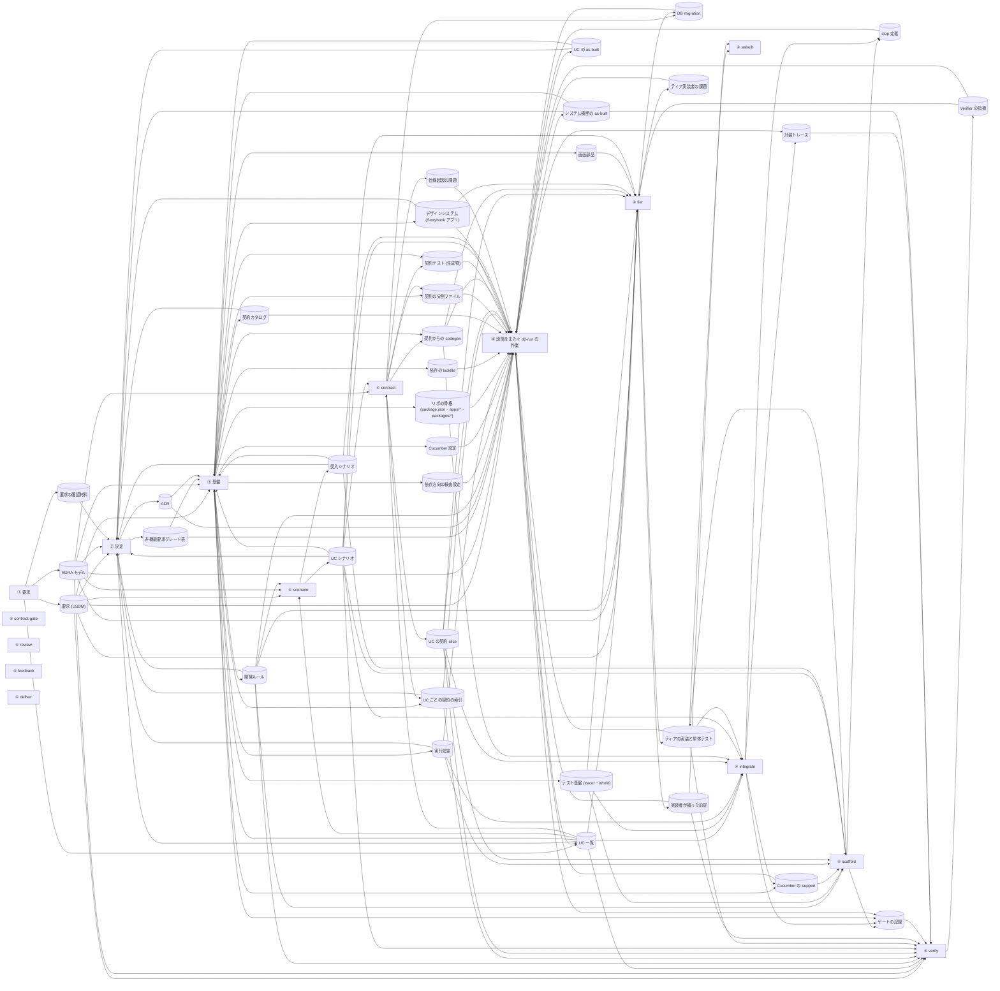

| ファイル | 書く段階 | 読む段階 (書く段階以外) |
|---|---|---|
| 要求 (USDM) | ① 要求 | ② 決定、④ scenario、④ tier、④ verify、③ 基盤、④ 段階をまたぐ d2-run の作業 |
| RDRA モデル | ① 要求 | ② 決定、③ 基盤、④ scenario、④ contract、④ tier、④ verify、④ 段階をまたぐ d2-run の作業 |
| UC 一覧 | ① 要求、④ 段階をまたぐ d2-run の作業 | ② 決定、③ 基盤、④ scenario、④ contract、④ tier、④ integrate、④ verify |
| 要求の確認材料 | ① 要求 | ② 決定 |
| 非機能要求グレード表 | ② 決定 | ③ 基盤、④ 段階をまたぐ d2-run の作業 |
| ADR | ② 決定 | ③ 基盤、④ 段階をまたぐ d2-run の作業 |
| 開発ルール | ③ 基盤 | ④ scenario、④ scaffold、④ tier、④ verify、② 決定、④ 段階をまたぐ d2-run の作業 |
| 依存方向の検査設定 | ③ 基盤 | ④ 段階をまたぐ d2-run の作業 |
| テスト基盤 (tracer・World) | ③ 基盤 | ④ scaffold、④ tier、④ integrate |
| Cucumber の support | ③ 基盤、④ integrate | ④ scaffold、④ 段階をまたぐ d2-run の作業 |
| Cucumber 設定 | ③ 基盤 | ④ 段階をまたぐ d2-run の作業 |
| 実行設定 | ③ 基盤 | ④ scaffold、④ integrate、② 決定、④ 段階をまたぐ d2-run の作業 |
| リポの骨格 (package.json・apps/*・packages/*) | ③ 基盤 | ④ 段階をまたぐ d2-run の作業 |
| 依存の lockfile | ③ 基盤 | ④ 段階をまたぐ d2-run の作業 |
| 契約カタログ | ③ 基盤 | ② 決定、④ 段階をまたぐ d2-run の作業 |
| 契約の分割ファイル | ③ 基盤、④ contract | ④ 段階をまたぐ d2-run の作業 |
| UC ごとの契約の索引 | ③ 基盤、④ contract | ④ verify、② 決定、④ 段階をまたぐ d2-run の作業 |
| UC の契約 slice | ④ contract | ④ scaffold、④ tier、④ integrate、④ verify、④ 段階をまたぐ d2-run の作業 |
| 契約テスト (生成物) | ④ contract、③ 基盤 | ④ 段階をまたぐ d2-run の作業 |
| DB migration | ④ contract、④ tier | ④ 段階をまたぐ d2-run の作業 |
| 契約からの codegen | ④ contract、③ 基盤 | ④ tier、④ integrate、④ 段階をまたぐ d2-run の作業 |
| デザインシステム (Storybook アプリ) | ③ 基盤 | ④ tier、② 決定、④ 段階をまたぐ d2-run の作業 |
| 画面部品 | ③ 基盤 | ④ tier |
| UC シナリオ | ④ scenario | ④ contract、④ scaffold、④ tier、④ integrate、④ verify、② 決定、③ 基盤、④ 段階をまたぐ d2-run の作業 |
| 受入シナリオ | ④ scenario | ④ scaffold、② 決定、③ 基盤、④ 段階をまたぐ d2-run の作業 |
| step 定義 | ④ scaffold、④ integrate | ④ 段階をまたぐ d2-run の作業 |
| ティアの実装と単体テスト | ④ scaffold、④ tier | ④ integrate、④ verify、④ asbuilt、④ 段階をまたぐ d2-run の作業 |
| 実装者が補った前提 | ④ tier | ④ verify、④ asbuilt、④ 段階をまたぐ d2-run の作業 |
| Verifier の指摘 | ④ verify | ④ tier、④ 段階をまたぐ d2-run の作業 |
| 仕様起因の課題 | ④ contract | ④ 段階をまたぐ d2-run の作業 |
| ティア実装者の課題 | ④ tier | ④ 段階をまたぐ d2-run の作業 |
| ゲートの記録 | ④ scaffold、④ integrate、③ 基盤、④ 段階をまたぐ d2-run の作業 | ④ verify |
| 計装トレース | ④ integrate、④ 段階をまたぐ d2-run の作業 | ④ verify |
| UC の as-built | ④ 段階をまたぐ d2-run の作業 | ② 決定、③ 基盤 |
| システム横断の as-built | ④ 段階をまたぐ d2-run の作業 | ④ verify、② 決定、③ 基盤 |

## 段階ごとの詳細

### ① 要求

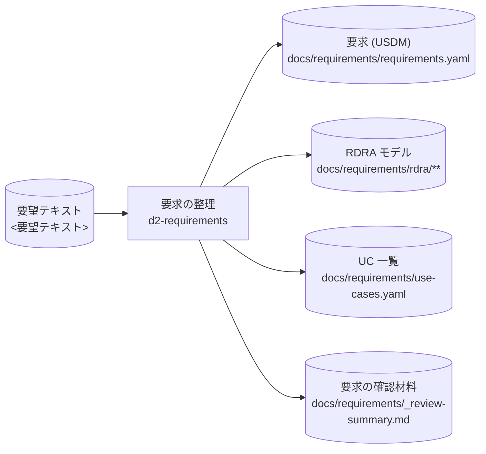

### ② 決定

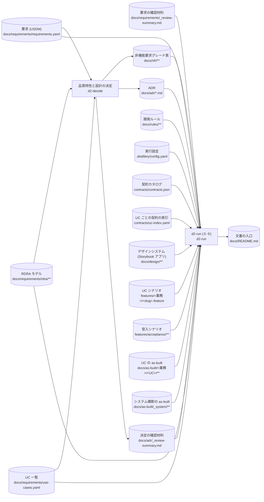

| 内訳 | 読む | 書く |
|---|---|---|
| 文書の入口の更新 (① ②) | 実行設定、RDRA モデル、要求 (USDM)、UC 一覧、UC シナリオ、受入シナリオ、契約カタログ、UC ごとの契約の索引、デザインシステム (Storybook アプリ)、システム横断の as-built、UC の as-built、ADR、非機能要求グレード表、開発ルール | 文書の入口 |

### ③ 基盤

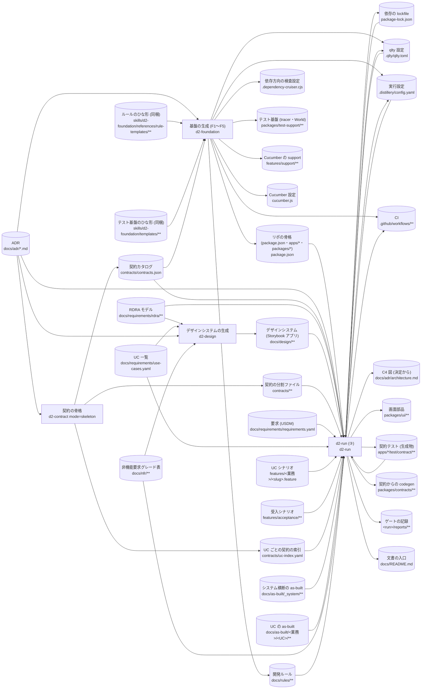

| 内訳 | 読む | 書く |
|---|---|---|
| F1 ルール | ADR、ルールのひな形 (同梱) | 開発ルール |
| F2 依存方向の検査 | ADR | 依存方向の検査設定 |
| F3 テスト基盤 | テスト基盤のひな形 (同梱) | テスト基盤 (tracer・World)、Cucumber の support、Cucumber 設定 |
| F4 契約テスト (d2-contract に委譲) | (契約の差分 に委譲) | — |
| F5 設定・骨格・CI・qlty | ADR、契約カタログ | 実行設定、リポの骨格 (package.json・apps/*・packages/*)、CI、qlty 設定 |
| 依存を入れる | リポの骨格 (package.json・apps/*・packages/*) | 依存の lockfile |
| qlty の提案を足す (③) | リポの骨格 (package.json・apps/*・packages/*)、依存の lockfile、qlty 設定 | qlty 設定 |
| 実行設定を契約込みで作り直す | ADR、契約カタログ | 実行設定 |
| CI を作り直す | 実行設定 | CI |
| C4 図を契約込みで作り直す | ADR、契約カタログ、RDRA モデル | C4 図 (決定から) |
| F6 画面部品の取り込み | デザインシステム (Storybook アプリ) | 画面部品 |
| 契約テストの生成 (骨格分) | 契約の分割ファイル、実行設定 | 契約テスト (生成物)、契約からの codegen |
| 基盤のチェックポイント (runGates --uc bootstrap) | 実行設定、リポの骨格 (package.json・apps/*・packages/*)、qlty 設定、契約テスト (生成物) | ゲートの記録 |
| 文書の入口の更新 (③) | 実行設定、RDRA モデル、要求 (USDM)、UC 一覧、UC シナリオ、受入シナリオ、契約カタログ、UC ごとの契約の索引、デザインシステム (Storybook アプリ)、システム横断の as-built、UC の as-built、ADR、非機能要求グレード表、開発ルール | 文書の入口 |

### ④ scenario

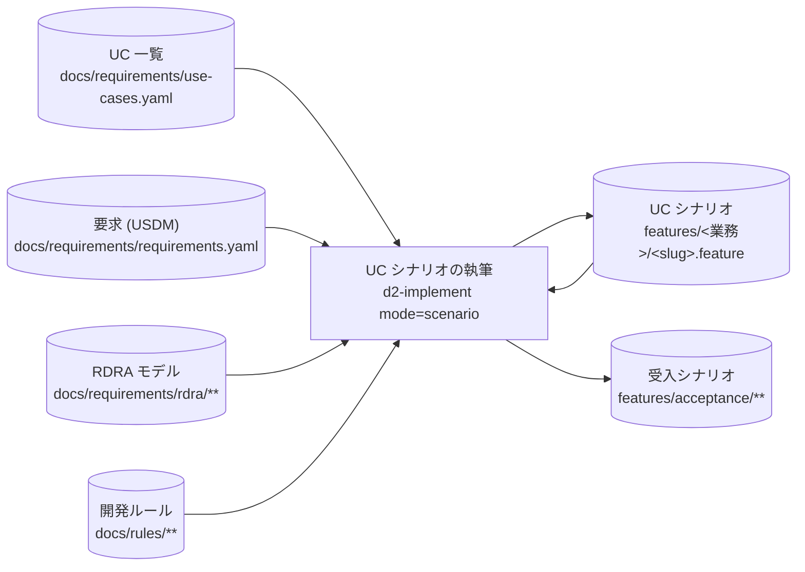

### ④ contract

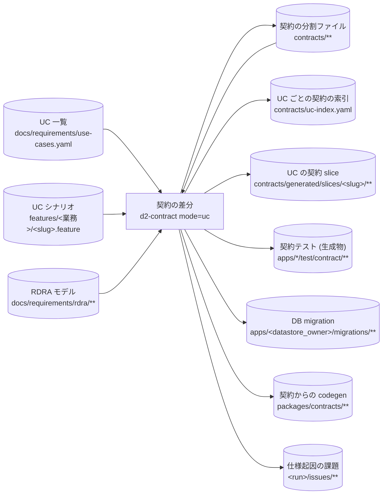

### ④ scaffold

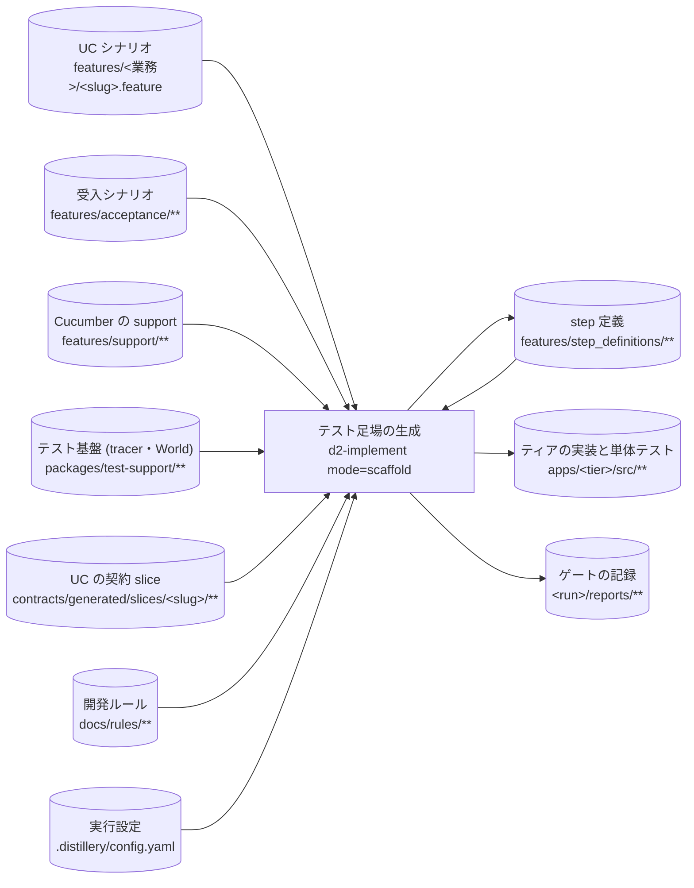

### ④ tier

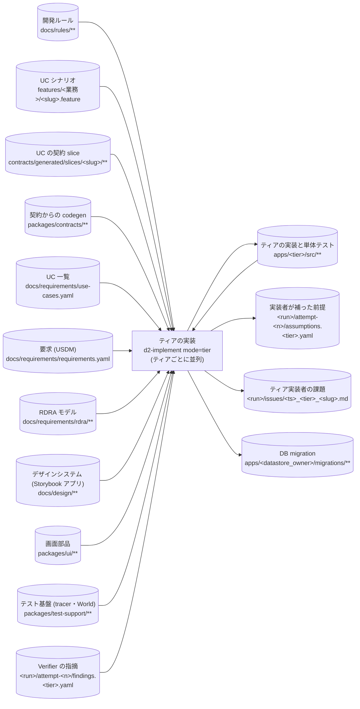

### ④ integrate

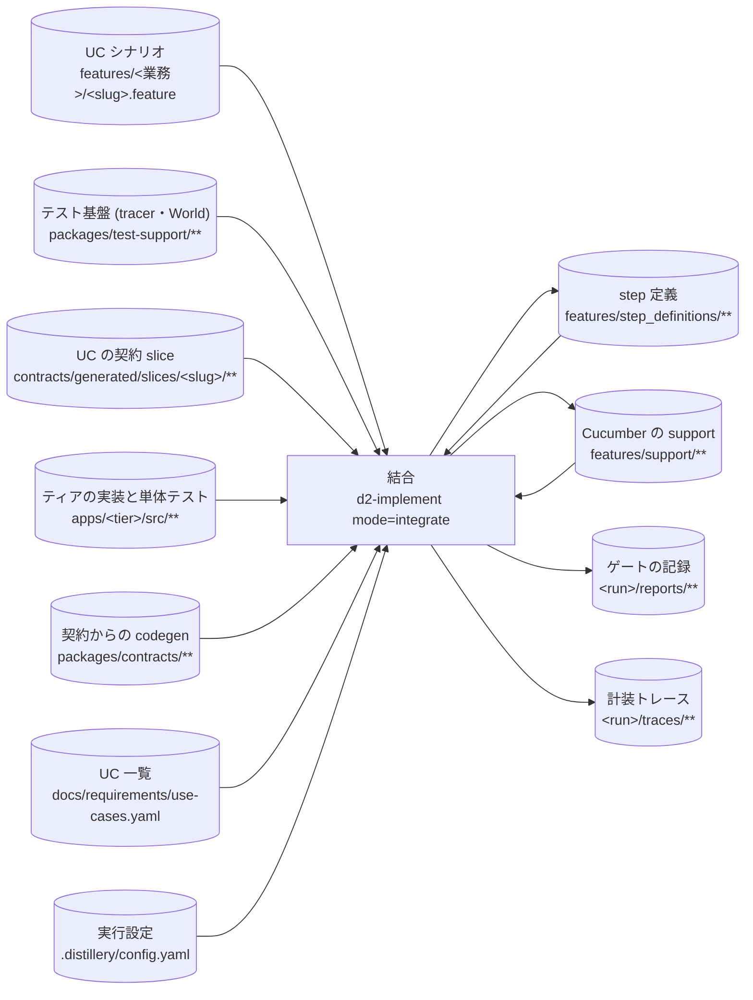

### ④ verify

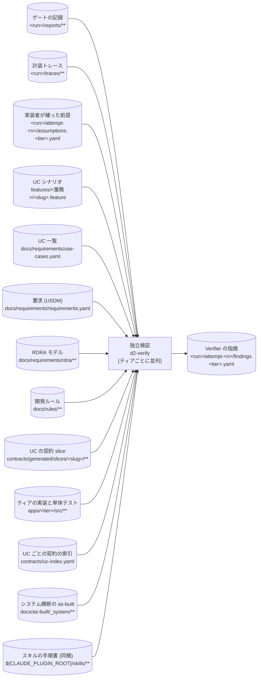

### ④ asbuilt

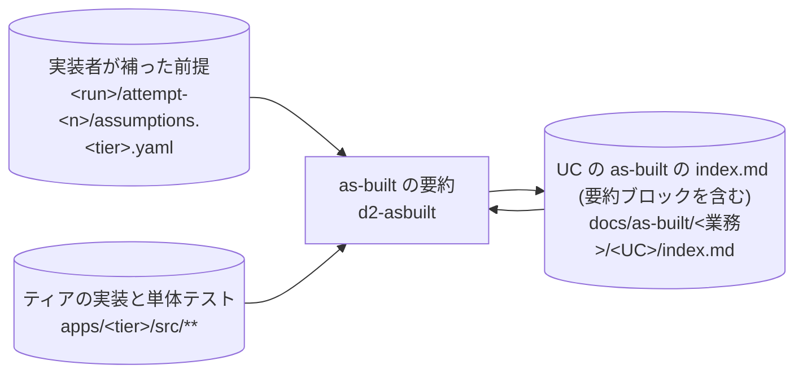

### ④ 段階をまたぐ d2-run の作業

```mermaid
flowchart LR
  s_req_usdm[("要求 (USDM)<br/>docs/requirements/requirements.yaml")]
  s_req_rdra[("RDRA モデル<br/>docs/requirements/rdra/**")]
  s_use_cases[("UC 一覧<br/>docs/requirements/use-cases.yaml")]
  s_nfr[("非機能要求グレード表<br/>docs/nfr/**")]
  s_adr[("ADR<br/>docs/adr/*.md")]
  s_rules[("開発ルール<br/>docs/rules/**")]
  s_depcruise_config[("依存方向の検査設定<br/>.dependency-cruiser.cjs")]
  s_features_support[("Cucumber の support<br/>features/support/**")]
  s_cucumber_config[("Cucumber 設定<br/>cucumber.js")]
  s_config[("実行設定<br/>.distillery/config.yaml")]
  s_skeleton[("リポの骨格 (package.json・apps/*・packages/*)<br/>package.json")]
  s_lockfile[("依存の lockfile<br/>package-lock.json")]
  s_qlty_config[("qlty 設定<br/>.qlty/qlty.toml")]
  s_contracts_catalog[("契約カタログ<br/>contracts/contracts.json")]
  s_contracts_src[("契約の分割ファイル<br/>contracts/**")]
  s_uc_index[("UC ごとの契約の索引<br/>contracts/uc-index.yaml")]
  s_contract_slice[("UC の契約 slice<br/>contracts/generated/slices/#lt;slug#gt;/**")]
  s_contract_tests[("契約テスト (生成物)<br/>apps/*/test/contract/**")]
  s_migrations[("DB migration<br/>apps/#lt;datastore_owner#gt;/migrations/**")]
  s_contracts_code[("契約からの codegen<br/>packages/contracts/**")]
  s_design[("デザインシステム (Storybook アプリ)<br/>docs/design/**")]
  s_feature[("UC シナリオ<br/>features/#lt;業務#gt;/#lt;slug#gt;.feature")]
  s_acceptance[("受入シナリオ<br/>features/acceptance/**")]
  s_steps[("step 定義<br/>features/step_definitions/**")]
  s_tier_src[("ティアの実装と単体テスト<br/>apps/#lt;tier#gt;/src/**")]
  s_run_events[("実行の記録 (events / done)<br/>#lt;run#gt;/events.jsonl")]
  s_assumptions[("実装者が補った前提<br/>#lt;run#gt;/attempt-#lt;n#gt;/assumptions.#lt;tier#gt;.yaml")]
  s_findings[("Verifier の指摘<br/>#lt;run#gt;/attempt-#lt;n#gt;/findings.#lt;tier#gt;.yaml")]
  s_issues[("仕様起因の課題<br/>#lt;run#gt;/issues/**")]
  s_issues_tier[("ティア実装者の課題<br/>#lt;run#gt;/issues/#lt;ts#gt;_#lt;tier#gt;_#lt;slug#gt;.md")]
  s_reports[("ゲートの記録<br/>#lt;run#gt;/reports/**")]
  s_traces[("計装トレース<br/>#lt;run#gt;/traces/**")]
  s_asbuilt_uc[("UC の as-built<br/>docs/as-built/#lt;業務#gt;/#lt;UC#gt;/**")]
  s_asbuilt_index[("UC の as-built の index.md (要約ブロックを含む)<br/>docs/as-built/#lt;業務#gt;/#lt;UC#gt;/index.md")]
  s_asbuilt_system[("システム横断の as-built<br/>docs/as-built/_system/**")]
  s_docs_readme[("文書の入口<br/>docs/README.md")]
  s_github[("GitHub (PR / issue)<br/>(GitHub)")]
  p_run_uc["d2-run (④)<br/>d2-run"]
  s_config --> p_run_uc
  s_use_cases --> p_run_uc
  s_run_events --> p_run_uc
  s_reports --> p_run_uc
  s_findings --> p_run_uc
  s_assumptions --> p_run_uc
  s_issues --> p_run_uc
  s_issues_tier --> p_run_uc
  s_uc_index --> p_run_uc
  s_asbuilt_system --> p_run_uc
  s_feature --> p_run_uc
  s_acceptance --> p_run_uc
  s_req_usdm --> p_run_uc
  s_contracts_src --> p_run_uc
  s_contract_tests --> p_run_uc
  s_contracts_code --> p_run_uc
  s_migrations --> p_run_uc
  s_contract_slice --> p_run_uc
  s_skeleton --> p_run_uc
  s_lockfile --> p_run_uc
  s_cucumber_config --> p_run_uc
  s_qlty_config --> p_run_uc
  s_tier_src --> p_run_uc
  s_steps --> p_run_uc
  s_features_support --> p_run_uc
  s_depcruise_config --> p_run_uc
  s_adr --> p_run_uc
  s_traces --> p_run_uc
  s_design --> p_run_uc
  s_asbuilt_uc --> p_run_uc
  s_asbuilt_index --> p_run_uc
  s_req_rdra --> p_run_uc
  s_contracts_catalog --> p_run_uc
  s_nfr --> p_run_uc
  s_rules --> p_run_uc
  p_run_uc --> s_run_events
  p_run_uc --> s_use_cases
  p_run_uc --> s_github
  p_run_uc --> s_reports
  p_run_uc --> s_traces
  p_run_uc --> s_qlty_config
  p_run_uc --> s_asbuilt_uc
  p_run_uc --> s_asbuilt_index
  p_run_uc --> s_asbuilt_system
  p_run_uc --> s_docs_readme
```

| 内訳 | 読む | 書く |
|---|---|---|
| シナリオの静的確認 | UC シナリオ、受入シナリオ、UC 一覧、要求 (USDM) | — |
| 契約の bundle の鮮度 (--check) | 契約の分割ファイル | — |
| RDB スキーマの鮮度 (--check) | 契約の分割ファイル | — |
| UC の契約の索引の検査 | UC ごとの契約の索引、契約の分割ファイル | — |
| 契約の変更の分類 | UC ごとの契約の索引、契約テスト (生成物)、契約からの codegen、DB migration、UC の契約 slice | — |
| ゲートの実行 | 実行設定、リポの骨格 (package.json・apps/*・packages/*)、依存の lockfile、Cucumber 設定、qlty 設定、ティアの実装と単体テスト、契約テスト (生成物)、DB migration、UC シナリオ、受入シナリオ、step 定義、Cucumber の support | ゲートの記録、計装トレース |
| qlty の提案を足す (④) | リポの骨格 (package.json・apps/*・packages/*)、依存の lockfile、qlty 設定、ティアの実装と単体テスト | qlty 設定 |
| 依存グラフの実態 | 依存方向の検査設定、ティアの実装と単体テスト | ゲートの記録 |
| as-built の抽出 | 実行設定、UC 一覧、要求 (USDM)、ADR、ゲートの記録、計装トレース、実装者が補った前提、Verifier の指摘、実行の記録 (events / done)、仕様起因の課題、ティア実装者の課題、UC の契約 slice、契約の分割ファイル、デザインシステム (Storybook アプリ)、UC シナリオ、UC の as-built、UC の as-built の index.md (要約ブロックを含む)、システム横断の as-built | UC の as-built、UC の as-built の index.md (要約ブロックを含む)、システム横断の as-built |
| as-built の書式の検査 | UC の as-built の index.md (要約ブロックを含む) | — |
| 文書の入口の更新 (④) | 実行設定、RDRA モデル、要求 (USDM)、UC 一覧、UC シナリオ、受入シナリオ、契約カタログ、UC ごとの契約の索引、デザインシステム (Storybook アプリ)、システム横断の as-built、UC の as-built、ADR、非機能要求グレード表、開発ルール | 文書の入口 |
| 配送 (squash・PR) | UC 一覧、ゲートの記録、実行の記録 (events / done) | GitHub (PR / issue)、ゲートの記録 |

## ファイル (store) の一覧

| ファイル | パス | 由来 | 書く処理 | 読む処理 |
|---|---|---|---|---|
| 要望テキスト | `<要望テキスト>` | 外部入力 | — | 要求の整理 |
| ルールのひな形 (同梱) | `skills/d2-foundation/references/rule-templates/**` | プラグイン同梱 | — | 基盤の生成 (F1〜F5)、F1 ルール |
| テスト基盤のひな形 (同梱) | `skills/d2-foundation/templates/**` | プラグイン同梱 | — | 基盤の生成 (F1〜F5)、F3 テスト基盤 |
| スキルの手順書 (同梱) | `${CLAUDE_PLUGIN_ROOT}/skills/**` | プラグイン同梱 | — | 独立検証 |
| 要求 (USDM) | `docs/requirements/requirements.yaml` | 生成 | 要求の整理 | 品質特性と設計の決定、UC シナリオの執筆、ティアの実装、独立検証、文書の入口の更新 (① ②)、文書の入口の更新 (③)、シナリオの静的確認、as-built の抽出、文書の入口の更新 (④) |
| RDRA モデル | `docs/requirements/rdra/**` | 生成 | 要求の整理 | 品質特性と設計の決定、デザインシステムの生成、UC シナリオの執筆、契約の差分、ティアの実装、独立検証、文書の入口の更新 (① ②)、C4 図を契約込みで作り直す、文書の入口の更新 (③)、文書の入口の更新 (④) |
| UC 一覧 | `docs/requirements/use-cases.yaml` | 生成 | 要求の整理、d2-run (④) | 品質特性と設計の決定、デザインシステムの生成、UC シナリオの執筆、契約の差分、ティアの実装、結合、独立検証、文書の入口の更新 (① ②)、文書の入口の更新 (③)、d2-run (④)、シナリオの静的確認、as-built の抽出、文書の入口の更新 (④)、配送 (squash・PR) |
| 要求の確認材料 | `docs/requirements/_review-summary.md` | 生成 | 要求の整理 | d2-run (① ②) |
| 非機能要求グレード表 | `docs/nfr/**` | 生成 | 品質特性と設計の決定 | デザインシステムの生成、文書の入口の更新 (① ②)、文書の入口の更新 (③)、文書の入口の更新 (④) |
| ADR | `docs/adr/*.md` | 生成 | 品質特性と設計の決定 | 基盤の生成 (F1〜F5)、F1 ルール、F2 依存方向の検査、F5 設定・骨格・CI・qlty、契約の骨格、デザインシステムの生成、文書の入口の更新 (① ②)、実行設定を契約込みで作り直す、C4 図を契約込みで作り直す、文書の入口の更新 (③)、as-built の抽出、文書の入口の更新 (④) |
| C4 図 (決定から) | `docs/adr/architecture.md` | 生成 (最終成果物) | C4 図を契約込みで作り直す | — |
| 決定の確認材料 | `docs/adr/_review-summary.md` | 生成 | 品質特性と設計の決定 | d2-run (① ②) |
| 開発ルール | `docs/rules/**` | 生成 | 基盤の生成 (F1〜F5)、F1 ルール | UC シナリオの執筆、テスト足場の生成、ティアの実装、独立検証、文書の入口の更新 (① ②)、文書の入口の更新 (③)、文書の入口の更新 (④) |
| 依存方向の検査設定 | `.dependency-cruiser.cjs` | 生成 | 基盤の生成 (F1〜F5)、F2 依存方向の検査 | 依存グラフの実態 |
| テスト基盤 (tracer・World) | `packages/test-support/**` | 生成 | 基盤の生成 (F1〜F5)、F3 テスト基盤 | テスト足場の生成、ティアの実装、結合 |
| Cucumber の support | `features/support/**` | 生成 | 基盤の生成 (F1〜F5)、F3 テスト基盤、結合 | テスト足場の生成、結合、ゲートの実行 |
| Cucumber 設定 | `cucumber.js` | 生成 | 基盤の生成 (F1〜F5)、F3 テスト基盤 | ゲートの実行 |
| 実行設定 | `.distillery/config.yaml` | 生成 | 基盤の生成 (F1〜F5)、F5 設定・骨格・CI・qlty、実行設定を契約込みで作り直す | テスト足場の生成、結合、文書の入口の更新 (① ②)、d2-run (③)、CI を作り直す、契約テストの生成 (骨格分)、基盤のチェックポイント (runGates --uc bootstrap)、文書の入口の更新 (③)、d2-run (④)、ゲートの実行、as-built の抽出、文書の入口の更新 (④) |
| リポの骨格 (package.json・apps/*・packages/*) | `package.json` | 生成 | 基盤の生成 (F1〜F5)、F5 設定・骨格・CI・qlty | 依存を入れる、qlty の提案を足す (③)、基盤のチェックポイント (runGates --uc bootstrap)、ゲートの実行、qlty の提案を足す (④) |
| 依存の lockfile | `package-lock.json` | 生成 | 依存を入れる | qlty の提案を足す (③)、ゲートの実行、qlty の提案を足す (④) |
| CI | `.github/workflows/**` | 生成 (最終成果物) | 基盤の生成 (F1〜F5)、F5 設定・骨格・CI・qlty、CI を作り直す | — |
| qlty 設定 | `.qlty/qlty.toml` | 生成 | 基盤の生成 (F1〜F5)、F5 設定・骨格・CI・qlty、qlty の提案を足す (③)、qlty の提案を足す (④) | qlty の提案を足す (③)、基盤のチェックポイント (runGates --uc bootstrap)、ゲートの実行、qlty の提案を足す (④) |
| 契約カタログ | `contracts/contracts.json` | 生成 | 契約の骨格 | 基盤の生成 (F1〜F5)、F5 設定・骨格・CI・qlty、文書の入口の更新 (① ②)、実行設定を契約込みで作り直す、C4 図を契約込みで作り直す、文書の入口の更新 (③)、文書の入口の更新 (④) |
| 契約の分割ファイル | `contracts/**` | 生成 | 契約の骨格、契約の差分 | 契約の差分、契約テストの生成 (骨格分)、契約の bundle の鮮度 (--check)、RDB スキーマの鮮度 (--check)、UC の契約の索引の検査、as-built の抽出 |
| UC ごとの契約の索引 | `contracts/uc-index.yaml` | 生成 | 契約の骨格、契約の差分 | 独立検証、文書の入口の更新 (① ②)、文書の入口の更新 (③)、d2-run (④)、UC の契約の索引の検査、契約の変更の分類、文書の入口の更新 (④) |
| UC の契約 slice | `contracts/generated/slices/<slug>/**` | 生成 | 契約の差分 | テスト足場の生成、ティアの実装、結合、独立検証、契約の変更の分類、as-built の抽出 |
| 契約テスト (生成物) | `apps/*/test/contract/**` | 生成 | 契約の差分、契約テストの生成 (骨格分) | 基盤のチェックポイント (runGates --uc bootstrap)、契約の変更の分類、ゲートの実行 |
| DB migration | `apps/<datastore_owner>/migrations/**` | 生成 | 契約の差分、ティアの実装 | 契約の変更の分類、ゲートの実行 |
| 契約からの codegen | `packages/contracts/**` | 生成 | 契約の差分、契約テストの生成 (骨格分) | ティアの実装、結合、契約の変更の分類 |
| デザインシステム (Storybook アプリ) | `docs/design/**` | 生成 | デザインシステムの生成 | ティアの実装、文書の入口の更新 (① ②)、F6 画面部品の取り込み、文書の入口の更新 (③)、as-built の抽出、文書の入口の更新 (④) |
| 画面部品 | `packages/ui/**` | 生成 | F6 画面部品の取り込み | ティアの実装 |
| UC シナリオ | `features/<業務>/<slug>.feature` | 生成 | UC シナリオの執筆 | UC シナリオの執筆、契約の差分、テスト足場の生成、ティアの実装、結合、独立検証、文書の入口の更新 (① ②)、文書の入口の更新 (③)、シナリオの静的確認、ゲートの実行、as-built の抽出、文書の入口の更新 (④) |
| 受入シナリオ | `features/acceptance/**` | 生成 | UC シナリオの執筆 | テスト足場の生成、文書の入口の更新 (① ②)、文書の入口の更新 (③)、シナリオの静的確認、ゲートの実行、文書の入口の更新 (④) |
| step 定義 | `features/step_definitions/**` | 生成 | テスト足場の生成、結合 | テスト足場の生成、結合、ゲートの実行 |
| ティアの実装と単体テスト | `apps/<tier>/src/**` | 生成 | テスト足場の生成、ティアの実装 | ティアの実装、結合、独立検証、as-built の要約、ゲートの実行、qlty の提案を足す (④)、依存グラフの実態 |
| 実行の記録 (events / done) | `<run>/events.jsonl` | 生成 | d2-run (④) | d2-run (④)、as-built の抽出、配送 (squash・PR) |
| 実装者が補った前提 | `<run>/attempt-<n>/assumptions.<tier>.yaml` | 生成 | ティアの実装 | 独立検証、as-built の要約、d2-run (④)、as-built の抽出 |
| Verifier の指摘 | `<run>/attempt-<n>/findings.<tier>.yaml` | 生成 | 独立検証 | ティアの実装、d2-run (④)、as-built の抽出 |
| 仕様起因の課題 | `<run>/issues/**` | 生成 | 契約の差分 | d2-run (④)、as-built の抽出 |
| ティア実装者の課題 | `<run>/issues/<ts>_<tier>_<slug>.md` | 生成 | ティアの実装 | d2-run (④)、as-built の抽出 |
| ゲートの記録 | `<run>/reports/**` | 生成 | テスト足場の生成、結合、基盤のチェックポイント (runGates --uc bootstrap)、ゲートの実行、依存グラフの実態、配送 (squash・PR) | 独立検証、d2-run (④)、as-built の抽出、配送 (squash・PR) |
| 計装トレース | `<run>/traces/**` | 生成 | 結合、ゲートの実行 | 独立検証、as-built の抽出 |
| UC の as-built | `docs/as-built/<業務>/<UC>/**` | 生成 | as-built の抽出 | 文書の入口の更新 (① ②)、文書の入口の更新 (③)、as-built の抽出、文書の入口の更新 (④) |
| UC の as-built の index.md (要約ブロックを含む) | `docs/as-built/<業務>/<UC>/index.md` | 生成 | as-built の要約、as-built の抽出 | as-built の要約、as-built の抽出、as-built の書式の検査 |
| システム横断の as-built | `docs/as-built/_system/**` | 生成 | as-built の抽出 | 独立検証、文書の入口の更新 (① ②)、文書の入口の更新 (③)、d2-run (④)、as-built の抽出、文書の入口の更新 (④) |
| 文書の入口 | `docs/README.md` | 生成 (最終成果物) | 文書の入口の更新 (① ②)、文書の入口の更新 (③)、文書の入口の更新 (④) | — |
| GitHub (PR / issue) | `(GitHub)` | 生成 (最終成果物) | d2-run (④)、配送 (squash・PR) | — |
