# distillery2 の処理と入出力 (DFD)

> 生成物。手で直さない。正本は [dataflow.yaml](dataflow.yaml)、生成は `scripts/genDataflow.js`。
> 整合性は `tests/distillery2/integration/dataflow.test.js` が手順書と照合する。

凡例: 全体図は 箱 = 段階、矢印 = 受け渡し (ラベルはファイル群)。処理ごとの図は 箱 = 処理、円筒 = ファイル (またはファイル群)、矢印 = 読み (ファイル → 処理) / 書き (処理 → ファイル)。
`<run>` = `.distillery/runs/<slug>`。

## 目次

1. 全体図: ① 〜 ④
2. 全体図: ④ 実装まで (scenario 〜 integrate)
3. 全体図: ④ 検証と as-built
4. 処理ごとの図 (段階ごと。処理 1 つにつき 1 枚)
5. ファイルの一覧

## 全体図: ① 〜 ④

④ の中の段階は 1 つの箱にまとめた (中は次の図)。

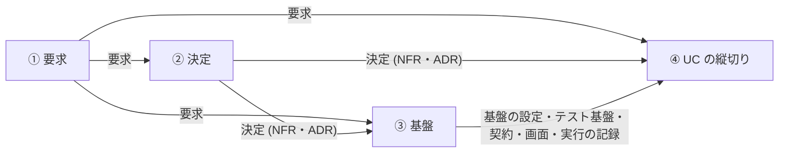

| 書く段階 | 読む段階 | 受け渡すファイル群 | 受け渡すファイル |
|---|---|---|---|
| ① 要求 | ② 決定 | 要求 | 要求 (USDM)、RDRA モデル、UC 一覧 |
| ① 要求 | ③ 基盤 | 要求 | RDRA モデル、UC 一覧 |
| ① 要求 | ④ UC の縦切り | 要求 | 要求 (USDM)、RDRA モデル、UC 一覧 |
| ② 決定 | ③ 基盤 | 決定 (NFR・ADR) | 非機能要求グレード表、ADR |
| ② 決定 | ④ UC の縦切り | 決定 (NFR・ADR) | ADR |
| ③ 基盤 | ④ UC の縦切り | 基盤の設定、テスト基盤、契約、画面、実行の記録 | 開発ルール、依存方向の検査設定、Cucumber 設定、実行設定、リポの骨格 (package.json・apps/*・packages/*)、依存の lockfile、qlty 設定 / テスト基盤 (tracer・World)、Cucumber の support / 契約の分割ファイル、UC ごとの契約の索引、契約テスト (生成物)、契約からの codegen / デザインシステム (Storybook アプリ)、画面部品 / ゲートの記録 |

後ろ向きの受け渡し (後の段階が書き戻し、次の UC や再実行で前の段階が読む。図には描かない):

| 書く段階 | 読む段階 | 受け渡すファイル群 | 受け渡すファイル |
|---|---|---|---|
| ④ UC の縦切り | ② 決定 | 要求 | UC 一覧 |
| ④ UC の縦切り | ③ 基盤 | 要求、基盤の設定、契約、実行の記録 | UC 一覧 / qlty 設定 / 契約の分割ファイル、契約テスト (生成物) / ゲートの記録 |

## 全体図: ④ 実装まで (scenario 〜 integrate)

④ の実装の段階どうしで受け渡すファイル群。① 〜 ③ から来るものは前の図。段階をまたぐ d2-run の作業 (ゲートの実行・as-built の抽出・配送など) はほぼ全部のファイル群に触れるので、この図から外して処理ごとの図に回した。

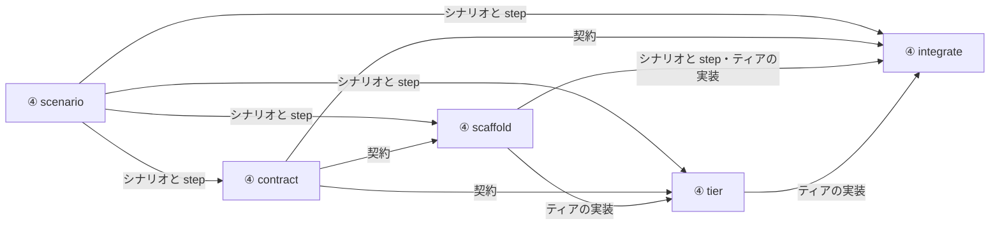

| 書く段階 | 読む段階 | 受け渡すファイル群 | 受け渡すファイル |
|---|---|---|---|
| ④ scenario | ④ contract | シナリオと step | UC シナリオ |
| ④ scenario | ④ scaffold | シナリオと step | UC シナリオ、受入シナリオ |
| ④ scenario | ④ tier | シナリオと step | UC シナリオ |
| ④ scenario | ④ integrate | シナリオと step | UC シナリオ |
| ④ contract | ④ scaffold | 契約 | UC の契約 slice |
| ④ contract | ④ tier | 契約 | UC の契約 slice、契約からの codegen |
| ④ contract | ④ integrate | 契約 | UC の契約 slice、契約からの codegen |
| ④ scaffold | ④ tier | ティアの実装 | ティアの実装と単体テスト |
| ④ scaffold | ④ integrate | シナリオと step、ティアの実装 | step 定義 / ティアの実装と単体テスト |
| ④ tier | ④ integrate | ティアの実装 | ティアの実装と単体テスト |

後ろ向きの受け渡し (後の段階が書き戻し、次の UC や再実行で前の段階が読む。図には描かない):

| 書く段階 | 読む段階 | 受け渡すファイル群 | 受け渡すファイル |
|---|---|---|---|
| ④ integrate | ④ scaffold | テスト基盤、シナリオと step | Cucumber の support / step 定義 |

## 全体図: ④ 検証と as-built

実装までの段階が書き、検証 (verify) と as-built の要約 (asbuilt) が読むファイル群。① 〜 ③ から来るものは前の図。段階をまたぐ d2-run の作業 (ゲートの実行・as-built の抽出・配送など) はほぼ全部のファイル群に触れるので、この図から外して処理ごとの図に回した。

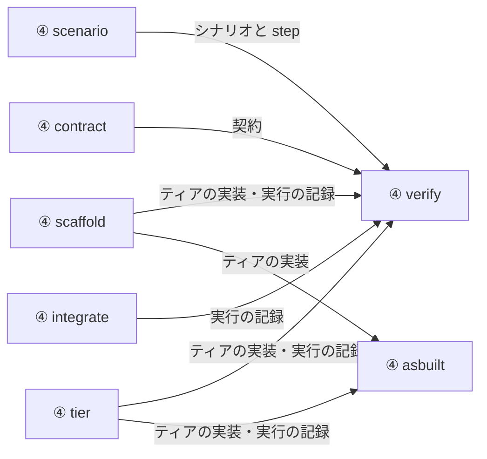

| 書く段階 | 読む段階 | 受け渡すファイル群 | 受け渡すファイル |
|---|---|---|---|
| ④ scenario | ④ verify | シナリオと step | UC シナリオ |
| ④ contract | ④ verify | 契約 | UC ごとの契約の索引、UC の契約 slice |
| ④ scaffold | ④ verify | ティアの実装、実行の記録 | ティアの実装と単体テスト / ゲートの記録 |
| ④ scaffold | ④ asbuilt | ティアの実装 | ティアの実装と単体テスト |
| ④ tier | ④ verify | ティアの実装、実行の記録 | ティアの実装と単体テスト / 実装者が補った前提 |
| ④ tier | ④ asbuilt | ティアの実装、実行の記録 | ティアの実装と単体テスト / 実装者が補った前提 |
| ④ integrate | ④ verify | 実行の記録 | ゲートの記録、計装トレース |

## 処理ごとの図

ファイルが 8 を超える処理は、図ではファイル群にまとめた。正確なパスは図の下の表にある。

### ① 要求

#### 要求の整理

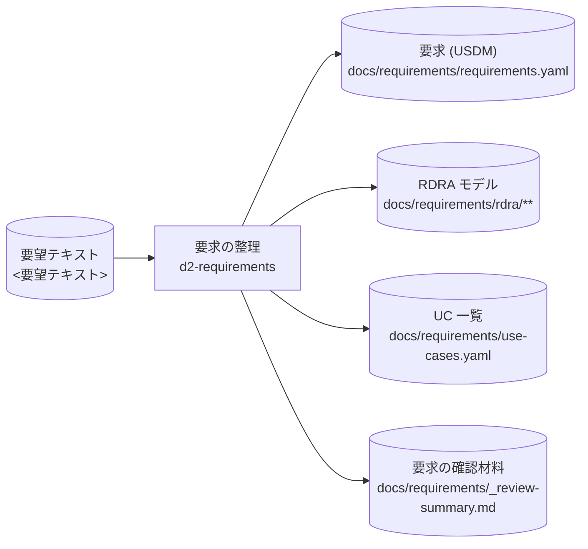

| 読む | 書く |
|---|---|
| `<要望テキスト>` | `docs/requirements/requirements.yaml`<br>`docs/requirements/rdra/**`<br>`docs/requirements/use-cases.yaml`<br>`docs/requirements/_review-summary.md` |

### ② 決定

#### 品質特性と設計の決定

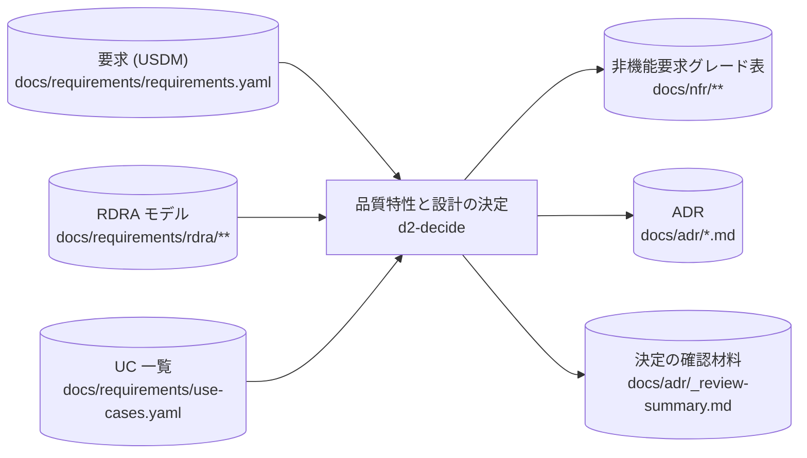

| 読む | 書く |
|---|---|
| `docs/requirements/requirements.yaml`<br>`docs/requirements/rdra/**`<br>`docs/requirements/use-cases.yaml` | `docs/nfr/**`<br>`docs/adr/*.md`<br>`docs/adr/_review-summary.md` |

#### d2-run (① ②)

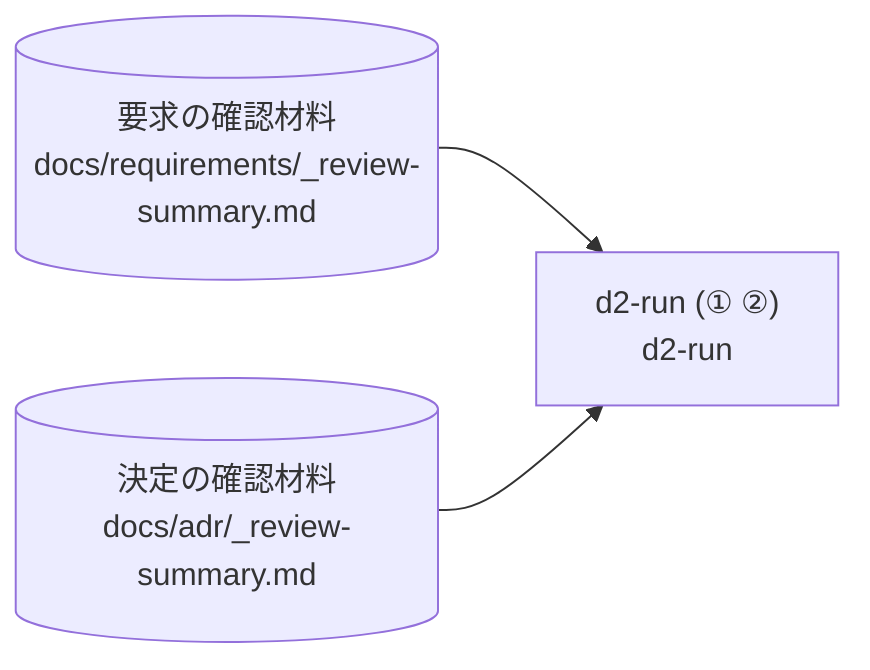

| 読む | 書く |
|---|---|
| `docs/requirements/_review-summary.md`<br>`docs/adr/_review-summary.md` | — |

#### 文書の入口の更新 (① ②)

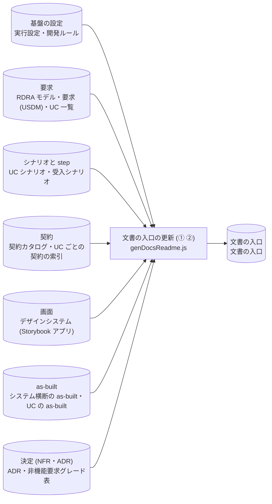

| 読む | 書く |
|---|---|
| `.distillery/config.yaml`<br>`docs/requirements/rdra/**`<br>`docs/requirements/requirements.yaml`<br>`docs/requirements/use-cases.yaml`<br>`features/<業務>/<slug>.feature`<br>`features/acceptance/**`<br>`contracts/contracts.json`<br>`contracts/uc-index.yaml`<br>`docs/design/**`<br>`docs/as-built/_system/**`<br>`docs/as-built/<業務>/<UC>/**`<br>`docs/adr/*.md`<br>`docs/nfr/**`<br>`docs/rules/**` | `docs/README.md` |

### ③ 基盤

#### 基盤の生成 (F1〜F5)

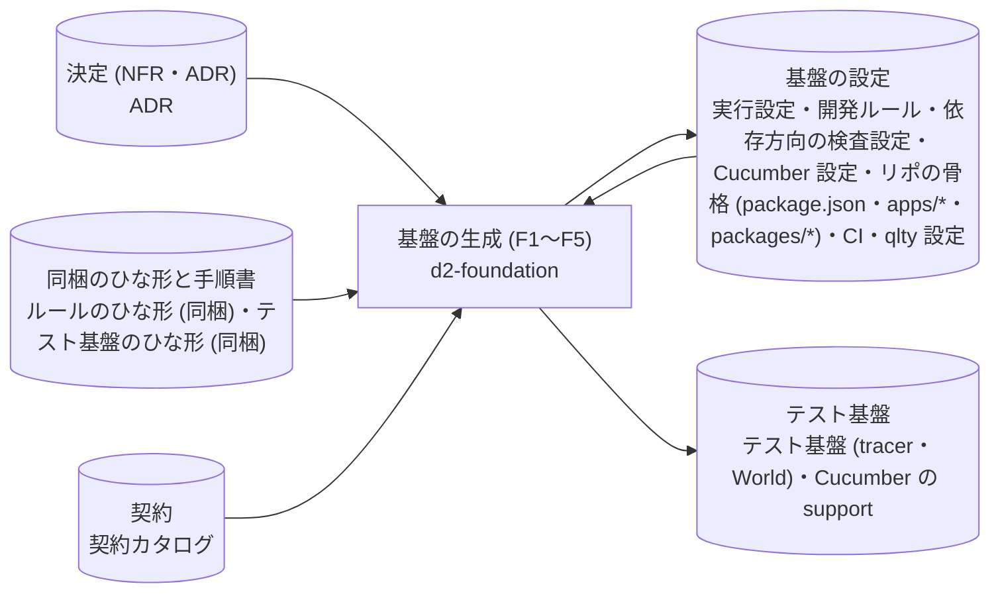

| 読む | 書く |
|---|---|
| `docs/adr/*.md`<br>`skills/d2-foundation/references/rule-templates/**`<br>`skills/d2-foundation/templates/**`<br>`contracts/contracts.json`<br>`.distillery/config.yaml` | `docs/rules/**`<br>`.dependency-cruiser.cjs`<br>`packages/test-support/**`<br>`features/support/**`<br>`cucumber.js`<br>`.distillery/config.yaml`<br>`package.json`<br>`.github/workflows/**`<br>`.qlty/qlty.toml` |

| 内訳 | 読む | 書く |
|---|---|---|
| F1 ルール | ADR、ルールのひな形 (同梱) | 開発ルール |
| F2 依存方向の検査 | ADR | 依存方向の検査設定 |
| F3 テスト基盤 | テスト基盤のひな形 (同梱) | テスト基盤 (tracer・World)、Cucumber の support、Cucumber 設定 |
| F4 契約テスト (d2-contract に委譲) | (契約の差分 に委譲) | — |
| F5 設定・骨格・CI・qlty | ADR、契約カタログ、実行設定 | 実行設定、リポの骨格 (package.json・apps/*・packages/*)、CI、qlty 設定 |

#### 契約の骨格

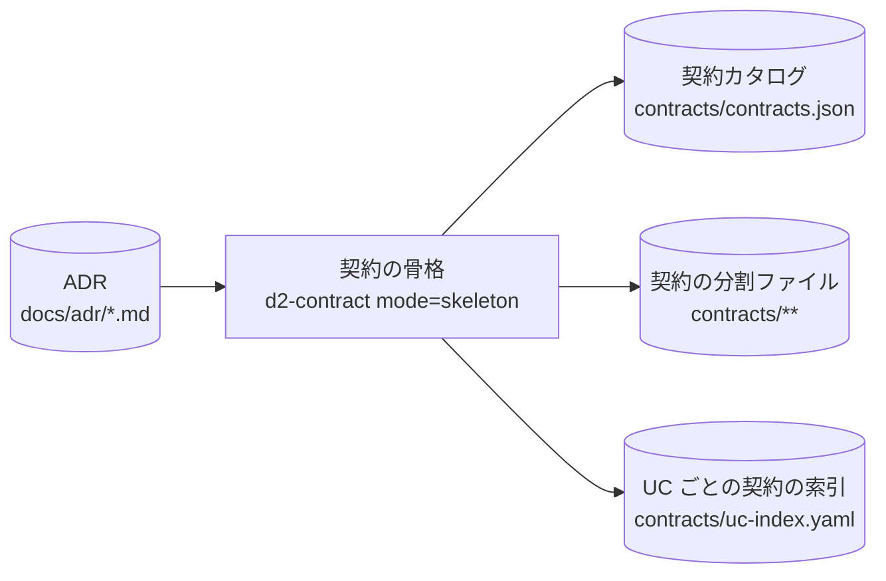

| 読む | 書く |
|---|---|
| `docs/adr/*.md` | `contracts/contracts.json`<br>`contracts/**`<br>`contracts/uc-index.yaml` |

#### デザインシステムの生成

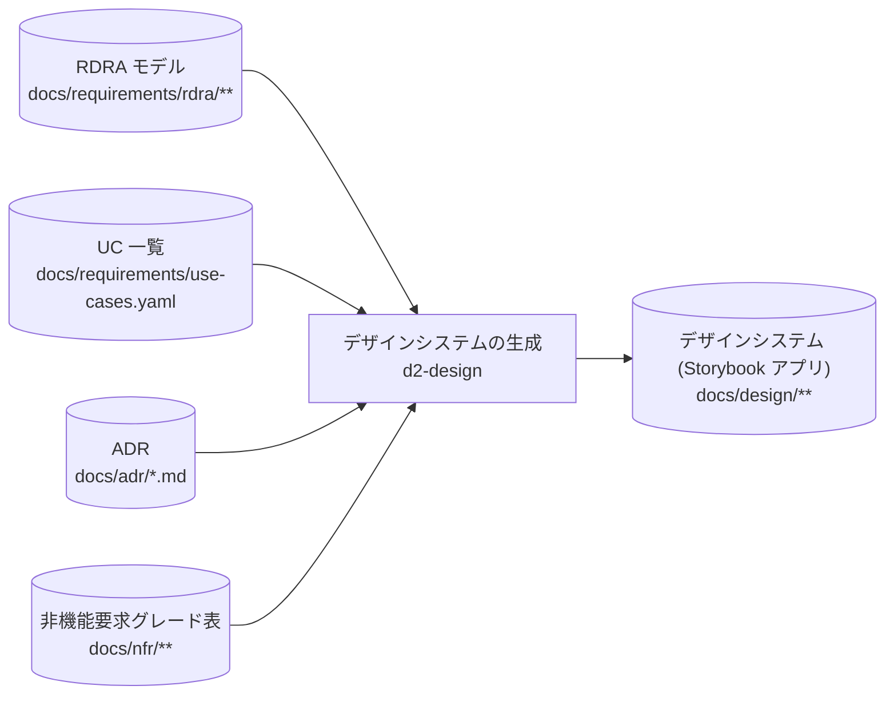

| 読む | 書く |
|---|---|
| `docs/requirements/rdra/**`<br>`docs/requirements/use-cases.yaml`<br>`docs/adr/*.md`<br>`docs/nfr/**` | `docs/design/**` |

#### d2-run (③)

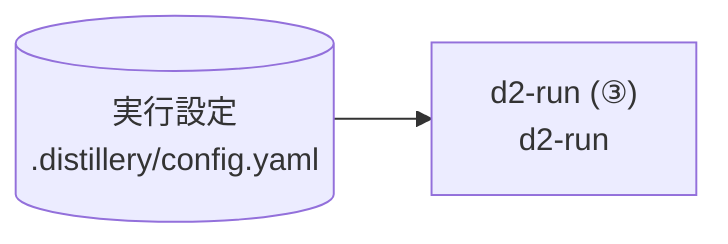

| 読む | 書く |
|---|---|
| `.distillery/config.yaml` | — |

#### 依存を入れる

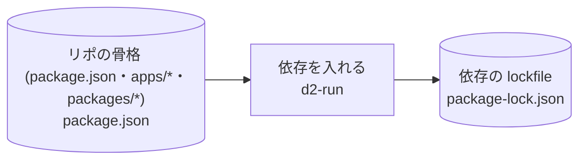

| 読む | 書く |
|---|---|
| `package.json` | `package-lock.json` |

#### qlty の提案を足す (③)

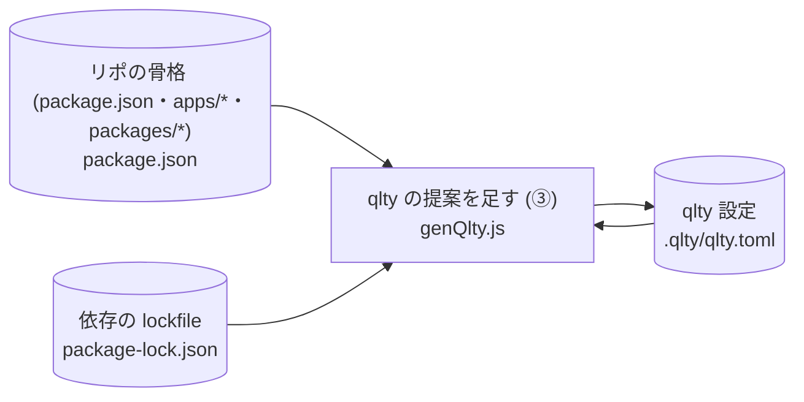

| 読む | 書く |
|---|---|
| `package.json`<br>`package-lock.json`<br>`.qlty/qlty.toml` | `.qlty/qlty.toml` |

#### 実行設定を契約込みで作り直す

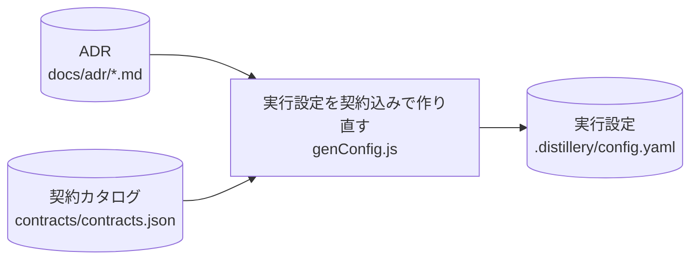

| 読む | 書く |
|---|---|
| `docs/adr/*.md`<br>`contracts/contracts.json` | `.distillery/config.yaml` |

#### CI を作り直す

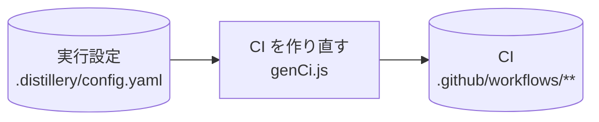

| 読む | 書く |
|---|---|
| `.distillery/config.yaml` | `.github/workflows/**` |

#### C4 図を契約込みで作り直す

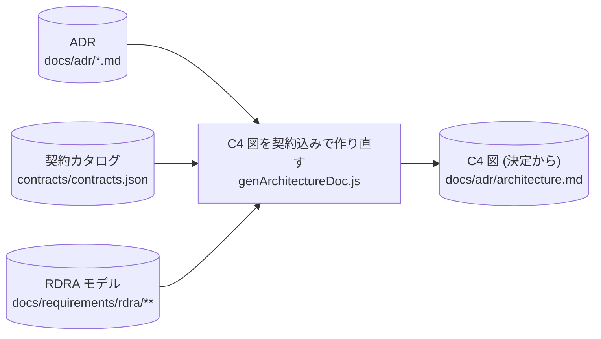

| 読む | 書く |
|---|---|
| `docs/adr/*.md`<br>`contracts/contracts.json`<br>`docs/requirements/rdra/**` | `docs/adr/architecture.md` |

#### F6 画面部品の取り込み

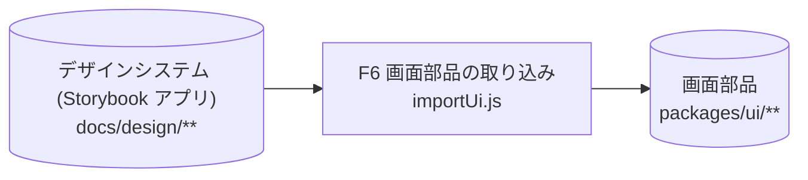

| 読む | 書く |
|---|---|
| `docs/design/**` | `packages/ui/**` |

#### 契約テストの生成 (骨格分)

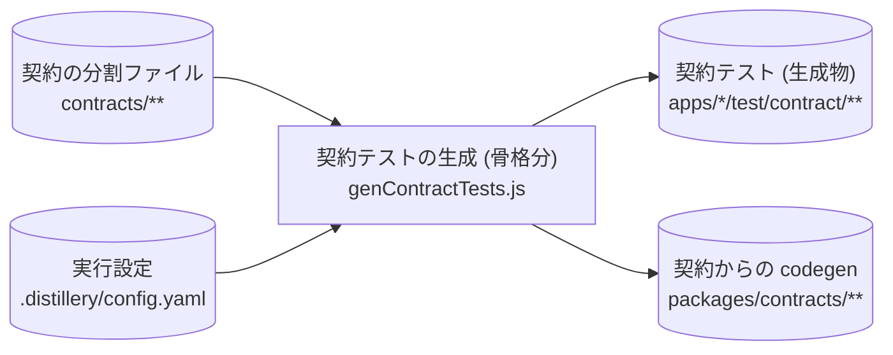

| 読む | 書く |
|---|---|
| `contracts/**`<br>`.distillery/config.yaml` | `apps/*/test/contract/**`<br>`packages/contracts/**` |

#### 基盤のチェックポイント (runGates --uc bootstrap)

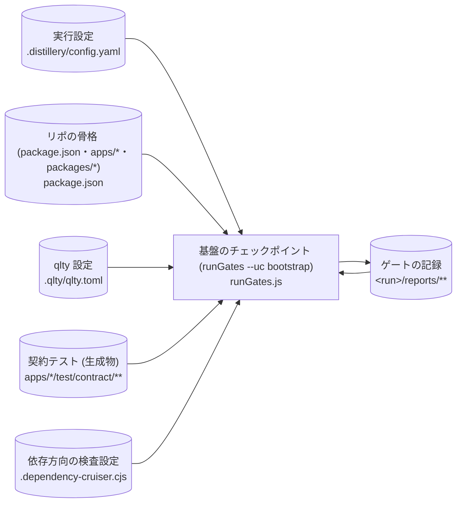

| 読む | 書く |
|---|---|
| `.distillery/config.yaml`<br>`package.json`<br>`.qlty/qlty.toml`<br>`apps/*/test/contract/**`<br>`.dependency-cruiser.cjs`<br>`<run>/reports/**` | `<run>/reports/**` |

#### 文書の入口の更新 (③)

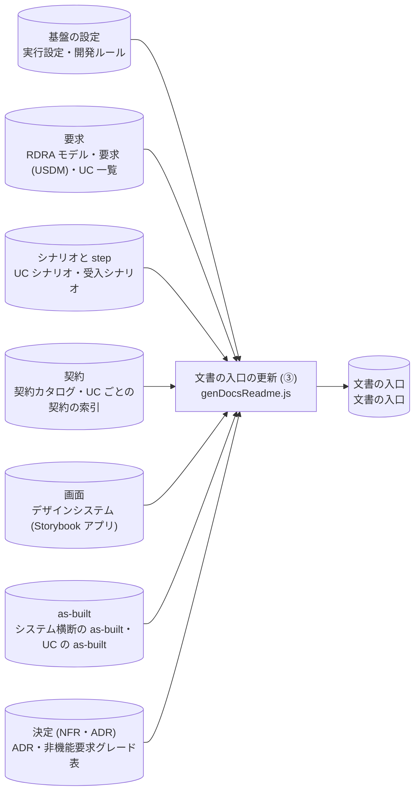

| 読む | 書く |
|---|---|
| `.distillery/config.yaml`<br>`docs/requirements/rdra/**`<br>`docs/requirements/requirements.yaml`<br>`docs/requirements/use-cases.yaml`<br>`features/<業務>/<slug>.feature`<br>`features/acceptance/**`<br>`contracts/contracts.json`<br>`contracts/uc-index.yaml`<br>`docs/design/**`<br>`docs/as-built/_system/**`<br>`docs/as-built/<業務>/<UC>/**`<br>`docs/adr/*.md`<br>`docs/nfr/**`<br>`docs/rules/**` | `docs/README.md` |

### ④ scenario

#### UC シナリオの執筆

```mermaid
flowchart LR
  p_implement_scenario["UC シナリオの執筆<br/>d2-implement mode=scenario"]
  s_use_cases[("UC 一覧<br/>docs/requirements/use-cases.yaml")]
  s_req_usdm[("要求 (USDM)<br/>docs/requirements/requirements.yaml")]
  s_req_rdra[("RDRA モデル<br/>docs/requirements/rdra/**")]
  s_rules[("開発ルール<br/>docs/rules/**")]
  s_feature[("UC シナリオ<br/>features/#lt;業務#gt;/#lt;slug#gt;.feature")]
  s_acceptance[("受入シナリオ<br/>features/acceptance/**")]
  s_use_cases --> p_implement_scenario
  s_req_usdm --> p_implement_scenario
  s_req_rdra --> p_implement_scenario
  s_rules --> p_implement_scenario
  s_feature --> p_implement_scenario
  p_implement_scenario --> s_feature
  p_implement_scenario --> s_acceptance
```

| 読む | 書く |
|---|---|
| `docs/requirements/use-cases.yaml`<br>`docs/requirements/requirements.yaml`<br>`docs/requirements/rdra/**`<br>`docs/rules/**`<br>`features/<業務>/<slug>.feature` | `features/<業務>/<slug>.feature`<br>`features/acceptance/**` |

### ④ contract

#### 契約の差分

```mermaid
flowchart LR
  p_contract_uc["契約の差分<br/>d2-contract mode=uc"]
  g_requirements[("要求<br/>UC 一覧・RDRA モデル")]
  g_scenarios[("シナリオと step<br/>UC シナリオ")]
  g_contracts[("契約<br/>契約の分割ファイル・UC ごとの契約の索引・UC の契約 slice・契約テスト (生成物)・DB migration (datastore_owner のティア)・契約からの codegen")]
  g_run[("実行の記録<br/>仕様起因の課題")]
  g_requirements --> p_contract_uc
  g_scenarios --> p_contract_uc
  g_contracts --> p_contract_uc
  p_contract_uc --> g_contracts
  p_contract_uc --> g_run
```

| 読む | 書く |
|---|---|
| `docs/requirements/use-cases.yaml`<br>`features/<業務>/<slug>.feature`<br>`docs/requirements/rdra/**`<br>`contracts/**` | `contracts/**`<br>`contracts/uc-index.yaml`<br>`contracts/generated/slices/<slug>/**`<br>`apps/*/test/contract/**`<br>`apps/<tier>/migrations/**`<br>`packages/contracts/**`<br>`<run>/issues/**` |

### ④ scaffold

#### テスト足場の生成

```mermaid
flowchart LR
  p_implement_scaffold["テスト足場の生成<br/>d2-implement mode=scaffold"]
  g_scenarios[("シナリオと step<br/>UC シナリオ・受入シナリオ・step 定義")]
  g_test_infra[("テスト基盤<br/>Cucumber の support・テスト基盤 (tracer・World)")]
  g_contracts[("契約<br/>UC の契約 slice")]
  g_settings[("基盤の設定<br/>開発ルール・実行設定")]
  g_code[("ティアの実装<br/>ティアの実装と単体テスト")]
  g_run[("実行の記録<br/>ゲートの記録")]
  g_scenarios --> p_implement_scaffold
  g_test_infra --> p_implement_scaffold
  g_contracts --> p_implement_scaffold
  g_settings --> p_implement_scaffold
  p_implement_scaffold --> g_scenarios
  p_implement_scaffold --> g_code
  p_implement_scaffold --> g_run
```

| 読む | 書く |
|---|---|
| `features/<業務>/<slug>.feature`<br>`features/acceptance/**`<br>`features/step_definitions/**`<br>`features/support/**`<br>`packages/test-support/**`<br>`contracts/generated/slices/<slug>/**`<br>`docs/rules/**`<br>`.distillery/config.yaml` | `features/step_definitions/**`<br>`apps/<tier>/src/**`<br>`<run>/reports/**` |

### ④ tier

#### ティアの実装

```mermaid
flowchart LR
  p_implement_tier["ティアの実装<br/>d2-implement mode=tier<br/>(ティアごとに並列)"]
  g_settings[("基盤の設定<br/>開発ルール")]
  g_scenarios[("シナリオと step<br/>UC シナリオ")]
  g_contracts[("契約<br/>UC の契約 slice・契約からの codegen・DB migration (datastore_owner のティア)")]
  g_requirements[("要求<br/>UC 一覧・要求 (USDM)・RDRA モデル")]
  g_design[("画面<br/>デザインシステム (Storybook アプリ)・画面部品")]
  g_code[("ティアの実装<br/>ティアの実装と単体テスト")]
  g_test_infra[("テスト基盤<br/>テスト基盤 (tracer・World)")]
  g_run[("実行の記録<br/>Verifier の指摘・実装者が補った前提・ティア実装者の課題")]
  g_settings --> p_implement_tier
  g_scenarios --> p_implement_tier
  g_contracts --> p_implement_tier
  g_requirements --> p_implement_tier
  g_design --> p_implement_tier
  g_code --> p_implement_tier
  g_test_infra --> p_implement_tier
  g_run --> p_implement_tier
  p_implement_tier --> g_code
  p_implement_tier --> g_run
  p_implement_tier --> g_contracts
```

| 読む | 書く |
|---|---|
| `docs/rules/**`<br>`features/<業務>/<slug>.feature`<br>`contracts/generated/slices/<slug>/**`<br>`packages/contracts/**`<br>`docs/requirements/use-cases.yaml`<br>`docs/requirements/requirements.yaml`<br>`docs/requirements/rdra/**`<br>`docs/design/**`<br>`packages/ui/**`<br>`apps/<tier>/src/**`<br>`packages/test-support/**`<br>`<run>/attempt-<n>/findings.<tier>.yaml` | `apps/<tier>/src/**`<br>`<run>/attempt-<n>/assumptions.<tier>.yaml`<br>`<run>/issues/<ts>_<tier>_<slug>.md`<br>`apps/<tier>/migrations/**` |

### ④ integrate

#### 結合

```mermaid
flowchart LR
  p_implement_integrate["結合<br/>d2-implement mode=integrate"]
  g_scenarios[("シナリオと step<br/>UC シナリオ・step 定義")]
  g_test_infra[("テスト基盤<br/>Cucumber の support・テスト基盤 (tracer・World)")]
  g_contracts[("契約<br/>UC の契約 slice・契約からの codegen")]
  g_code[("ティアの実装<br/>ティアの実装と単体テスト")]
  g_requirements[("要求<br/>UC 一覧")]
  g_settings[("基盤の設定<br/>実行設定")]
  g_run[("実行の記録<br/>ゲートの記録・計装トレース")]
  g_scenarios --> p_implement_integrate
  g_test_infra --> p_implement_integrate
  g_contracts --> p_implement_integrate
  g_code --> p_implement_integrate
  g_requirements --> p_implement_integrate
  g_settings --> p_implement_integrate
  p_implement_integrate --> g_scenarios
  p_implement_integrate --> g_test_infra
  p_implement_integrate --> g_run
```

| 読む | 書く |
|---|---|
| `features/<業務>/<slug>.feature`<br>`features/step_definitions/**`<br>`features/support/**`<br>`packages/test-support/**`<br>`contracts/generated/slices/<slug>/**`<br>`apps/<tier>/src/**`<br>`packages/contracts/**`<br>`docs/requirements/use-cases.yaml`<br>`.distillery/config.yaml` | `features/step_definitions/**`<br>`features/support/**`<br>`<run>/reports/**`<br>`<run>/traces/**` |

### ④ verify

#### 独立検証

```mermaid
flowchart LR
  p_verify["独立検証<br/>d2-verify<br/>(ティアごとに並列)"]
  g_run[("実行の記録<br/>ゲートの記録・計装トレース・実装者が補った前提・Verifier の指摘")]
  g_scenarios[("シナリオと step<br/>UC シナリオ")]
  g_requirements[("要求<br/>UC 一覧・要求 (USDM)・RDRA モデル")]
  g_settings[("基盤の設定<br/>開発ルール")]
  g_contracts[("契約<br/>UC の契約 slice・UC ごとの契約の索引")]
  g_code[("ティアの実装<br/>ティアの実装と単体テスト")]
  g_asbuilt[("as-built<br/>システム横断の as-built")]
  g_packaged[("同梱のひな形と手順書<br/>スキルの手順書 (同梱)")]
  g_run --> p_verify
  g_scenarios --> p_verify
  g_requirements --> p_verify
  g_settings --> p_verify
  g_contracts --> p_verify
  g_code --> p_verify
  g_asbuilt --> p_verify
  g_packaged --> p_verify
  p_verify --> g_run
```

| 読む | 書く |
|---|---|
| `<run>/reports/**`<br>`<run>/traces/**`<br>`<run>/attempt-<n>/assumptions.<tier>.yaml`<br>`features/<業務>/<slug>.feature`<br>`docs/requirements/use-cases.yaml`<br>`docs/requirements/requirements.yaml`<br>`docs/requirements/rdra/**`<br>`docs/rules/**`<br>`contracts/generated/slices/<slug>/**`<br>`apps/<tier>/src/**`<br>`contracts/uc-index.yaml`<br>`docs/as-built/_system/**`<br>`${CLAUDE_PLUGIN_ROOT}/skills/**` | `<run>/attempt-<n>/findings.<tier>.yaml` |

### ④ asbuilt

#### as-built の要約

```mermaid
flowchart LR
  p_asbuilt["as-built の要約<br/>d2-asbuilt"]
  s_asbuilt_index[("UC の as-built の index.md (要約ブロックを含む)<br/>docs/as-built/#lt;業務#gt;/#lt;UC#gt;/index.md")]
  s_assumptions[("実装者が補った前提<br/>#lt;run#gt;/attempt-#lt;n#gt;/assumptions.#lt;tier#gt;.yaml")]
  s_tier_src[("ティアの実装と単体テスト<br/>apps/#lt;tier#gt;/src/**")]
  s_asbuilt_index --> p_asbuilt
  s_assumptions --> p_asbuilt
  s_tier_src --> p_asbuilt
  p_asbuilt --> s_asbuilt_index
```

| 読む | 書く |
|---|---|
| `docs/as-built/<業務>/<UC>/index.md`<br>`<run>/attempt-<n>/assumptions.<tier>.yaml`<br>`apps/<tier>/src/**` | `docs/as-built/<業務>/<UC>/index.md` |

### ④ 段階をまたぐ d2-run の作業

#### d2-run (④)

```mermaid
flowchart LR
  p_run_uc["d2-run (④)<br/>d2-run"]
  g_settings[("基盤の設定<br/>実行設定")]
  g_requirements[("要求<br/>UC 一覧")]
  g_run[("実行の記録<br/>実行の記録 (events / done)・ゲートの記録・Verifier の指摘・実装者が補った前提・仕様起因の課題・ティア実装者の課題")]
  g_contracts[("契約<br/>UC ごとの契約の索引")]
  g_asbuilt[("as-built<br/>システム横断の as-built")]
  g_github[("GitHub<br/>GitHub (PR / issue)")]
  g_settings --> p_run_uc
  g_requirements --> p_run_uc
  g_run --> p_run_uc
  g_contracts --> p_run_uc
  g_asbuilt --> p_run_uc
  p_run_uc --> g_run
  p_run_uc --> g_requirements
  p_run_uc --> g_github
```

| 読む | 書く |
|---|---|
| `.distillery/config.yaml`<br>`docs/requirements/use-cases.yaml`<br>`<run>/events.jsonl`<br>`<run>/reports/**`<br>`<run>/attempt-<n>/findings.<tier>.yaml`<br>`<run>/attempt-<n>/assumptions.<tier>.yaml`<br>`<run>/issues/**`<br>`<run>/issues/<ts>_<tier>_<slug>.md`<br>`contracts/uc-index.yaml`<br>`docs/as-built/_system/**` | `<run>/events.jsonl`<br>`docs/requirements/use-cases.yaml`<br>GitHub (PR / issue) |

#### シナリオの静的確認

```mermaid
flowchart LR
  p_run_uc_check_scenario["シナリオの静的確認<br/>checkScenario.js"]
  s_feature[("UC シナリオ<br/>features/#lt;業務#gt;/#lt;slug#gt;.feature")]
  s_acceptance[("受入シナリオ<br/>features/acceptance/**")]
  s_use_cases[("UC 一覧<br/>docs/requirements/use-cases.yaml")]
  s_req_usdm[("要求 (USDM)<br/>docs/requirements/requirements.yaml")]
  s_feature --> p_run_uc_check_scenario
  s_acceptance --> p_run_uc_check_scenario
  s_use_cases --> p_run_uc_check_scenario
  s_req_usdm --> p_run_uc_check_scenario
```

| 読む | 書く |
|---|---|
| `features/<業務>/<slug>.feature`<br>`features/acceptance/**`<br>`docs/requirements/use-cases.yaml`<br>`docs/requirements/requirements.yaml` | — |

#### 契約の bundle の鮮度 (--check)

```mermaid
flowchart LR
  p_run_uc_compile_contracts["契約の bundle の鮮度 (--check)<br/>compileContracts.js"]
  s_contracts_src[("契約の分割ファイル<br/>contracts/**")]
  s_contracts_src --> p_run_uc_compile_contracts
```

| 読む | 書く |
|---|---|
| `contracts/**` | — |

#### RDB スキーマの鮮度 (--check)

```mermaid
flowchart LR
  p_run_uc_compile_rdb["RDB スキーマの鮮度 (--check)<br/>compileRdbSchema.js"]
  s_contracts_src[("契約の分割ファイル<br/>contracts/**")]
  s_contracts_src --> p_run_uc_compile_rdb
```

| 読む | 書く |
|---|---|
| `contracts/**` | — |

#### UC の契約の索引の検査

```mermaid
flowchart LR
  p_run_uc_validate_uc_index["UC の契約の索引の検査<br/>validateUcIndex.js"]
  s_uc_index[("UC ごとの契約の索引<br/>contracts/uc-index.yaml")]
  s_contracts_src[("契約の分割ファイル<br/>contracts/**")]
  s_uc_index --> p_run_uc_validate_uc_index
  s_contracts_src --> p_run_uc_validate_uc_index
```

| 読む | 書く |
|---|---|
| `contracts/uc-index.yaml`<br>`contracts/**` | — |

#### 契約の変更の分類

```mermaid
flowchart LR
  p_run_uc_classify["契約の変更の分類<br/>classifyContractChanges.js"]
  s_uc_index[("UC ごとの契約の索引<br/>contracts/uc-index.yaml")]
  s_contract_tests[("契約テスト (生成物)<br/>apps/*/test/contract/**")]
  s_contracts_code[("契約からの codegen<br/>packages/contracts/**")]
  s_migrations[("DB migration (datastore_owner のティア)<br/>apps/#lt;tier#gt;/migrations/**")]
  s_contract_slice[("UC の契約 slice<br/>contracts/generated/slices/#lt;slug#gt;/**")]
  s_uc_index --> p_run_uc_classify
  s_contract_tests --> p_run_uc_classify
  s_contracts_code --> p_run_uc_classify
  s_migrations --> p_run_uc_classify
  s_contract_slice --> p_run_uc_classify
```

| 読む | 書く |
|---|---|
| `contracts/uc-index.yaml`<br>`apps/*/test/contract/**`<br>`packages/contracts/**`<br>`apps/<tier>/migrations/**`<br>`contracts/generated/slices/<slug>/**` | — |

#### ゲートの実行

```mermaid
flowchart LR
  p_run_uc_gates["ゲートの実行<br/>runGates.js"]
  g_settings[("基盤の設定<br/>実行設定・リポの骨格 (package.json・apps/*・packages/*)・依存の lockfile・Cucumber 設定・qlty 設定・依存方向の検査設定")]
  g_code[("ティアの実装<br/>ティアの実装と単体テスト")]
  g_contracts[("契約<br/>契約テスト (生成物)・DB migration (datastore_owner のティア)")]
  g_scenarios[("シナリオと step<br/>UC シナリオ・受入シナリオ・step 定義")]
  g_test_infra[("テスト基盤<br/>Cucumber の support")]
  g_run[("実行の記録<br/>ゲートの記録・計装トレース")]
  g_settings --> p_run_uc_gates
  g_code --> p_run_uc_gates
  g_contracts --> p_run_uc_gates
  g_scenarios --> p_run_uc_gates
  g_test_infra --> p_run_uc_gates
  g_run --> p_run_uc_gates
  p_run_uc_gates --> g_run
```

| 読む | 書く |
|---|---|
| `.distillery/config.yaml`<br>`package.json`<br>`package-lock.json`<br>`cucumber.js`<br>`.qlty/qlty.toml`<br>`apps/<tier>/src/**`<br>`apps/*/test/contract/**`<br>`apps/<tier>/migrations/**`<br>`features/<業務>/<slug>.feature`<br>`features/acceptance/**`<br>`features/step_definitions/**`<br>`features/support/**`<br>`.dependency-cruiser.cjs`<br>`<run>/reports/**` | `<run>/reports/**`<br>`<run>/traces/**` |

#### qlty の提案を足す (④)

```mermaid
flowchart LR
  p_run_uc_qlty["qlty の提案を足す (④)<br/>genQlty.js"]
  s_skeleton[("リポの骨格 (package.json・apps/*・packages/*)<br/>package.json")]
  s_lockfile[("依存の lockfile<br/>package-lock.json")]
  s_qlty_config[("qlty 設定<br/>.qlty/qlty.toml")]
  s_tier_src[("ティアの実装と単体テスト<br/>apps/#lt;tier#gt;/src/**")]
  s_skeleton --> p_run_uc_qlty
  s_lockfile --> p_run_uc_qlty
  s_qlty_config --> p_run_uc_qlty
  s_tier_src --> p_run_uc_qlty
  p_run_uc_qlty --> s_qlty_config
```

| 読む | 書く |
|---|---|
| `package.json`<br>`package-lock.json`<br>`.qlty/qlty.toml`<br>`apps/<tier>/src/**` | `.qlty/qlty.toml` |

#### 依存グラフの実態

```mermaid
flowchart LR
  p_run_uc_depcruise["依存グラフの実態<br/>d2-run"]
  s_depcruise_config[("依存方向の検査設定<br/>.dependency-cruiser.cjs")]
  s_tier_src[("ティアの実装と単体テスト<br/>apps/#lt;tier#gt;/src/**")]
  s_reports[("ゲートの記録<br/>#lt;run#gt;/reports/**")]
  s_depcruise_config --> p_run_uc_depcruise
  s_tier_src --> p_run_uc_depcruise
  p_run_uc_depcruise --> s_reports
```

| 読む | 書く |
|---|---|
| `.dependency-cruiser.cjs`<br>`apps/<tier>/src/**` | `<run>/reports/**` |

#### as-built の抽出

```mermaid
flowchart LR
  p_run_uc_extract_asbuilt["as-built の抽出<br/>extractAsBuilt.js"]
  g_settings[("基盤の設定<br/>実行設定")]
  g_requirements[("要求<br/>UC 一覧・要求 (USDM)")]
  g_decisions[("決定 (NFR・ADR)<br/>ADR")]
  g_run[("実行の記録<br/>ゲートの記録・計装トレース・実装者が補った前提・Verifier の指摘・実行の記録 (events / done)・仕様起因の課題・ティア実装者の課題")]
  g_contracts[("契約<br/>UC の契約 slice・契約の分割ファイル")]
  g_design[("画面<br/>デザインシステム (Storybook アプリ)")]
  g_scenarios[("シナリオと step<br/>UC シナリオ")]
  g_asbuilt[("as-built<br/>UC の as-built・UC の as-built の index.md (要約ブロックを含む)・システム横断の as-built")]
  g_settings --> p_run_uc_extract_asbuilt
  g_requirements --> p_run_uc_extract_asbuilt
  g_decisions --> p_run_uc_extract_asbuilt
  g_run --> p_run_uc_extract_asbuilt
  g_contracts --> p_run_uc_extract_asbuilt
  g_design --> p_run_uc_extract_asbuilt
  g_scenarios --> p_run_uc_extract_asbuilt
  g_asbuilt --> p_run_uc_extract_asbuilt
  p_run_uc_extract_asbuilt --> g_asbuilt
```

| 読む | 書く |
|---|---|
| `.distillery/config.yaml`<br>`docs/requirements/use-cases.yaml`<br>`docs/requirements/requirements.yaml`<br>`docs/adr/*.md`<br>`<run>/reports/**`<br>`<run>/traces/**`<br>`<run>/attempt-<n>/assumptions.<tier>.yaml`<br>`<run>/attempt-<n>/findings.<tier>.yaml`<br>`<run>/events.jsonl`<br>`<run>/issues/**`<br>`<run>/issues/<ts>_<tier>_<slug>.md`<br>`contracts/generated/slices/<slug>/**`<br>`contracts/**`<br>`docs/design/**`<br>`features/<業務>/<slug>.feature`<br>`docs/as-built/<業務>/<UC>/**`<br>`docs/as-built/<業務>/<UC>/index.md`<br>`docs/as-built/_system/**` | `docs/as-built/<業務>/<UC>/**`<br>`docs/as-built/<業務>/<UC>/index.md`<br>`docs/as-built/_system/**` |

#### as-built の書式の検査

```mermaid
flowchart LR
  p_run_uc_check_asbuilt["as-built の書式の検査<br/>checkAsBuilt.js"]
  s_asbuilt_index[("UC の as-built の index.md (要約ブロックを含む)<br/>docs/as-built/#lt;業務#gt;/#lt;UC#gt;/index.md")]
  s_asbuilt_index --> p_run_uc_check_asbuilt
```

| 読む | 書く |
|---|---|
| `docs/as-built/<業務>/<UC>/index.md` | — |

#### 文書の入口の更新 (④)

```mermaid
flowchart LR
  p_run_uc_docs_readme["文書の入口の更新 (④)<br/>genDocsReadme.js"]
  g_settings[("基盤の設定<br/>実行設定・開発ルール")]
  g_requirements[("要求<br/>RDRA モデル・要求 (USDM)・UC 一覧")]
  g_scenarios[("シナリオと step<br/>UC シナリオ・受入シナリオ")]
  g_contracts[("契約<br/>契約カタログ・UC ごとの契約の索引")]
  g_design[("画面<br/>デザインシステム (Storybook アプリ)")]
  g_asbuilt[("as-built<br/>システム横断の as-built・UC の as-built")]
  g_decisions[("決定 (NFR・ADR)<br/>ADR・非機能要求グレード表")]
  g_docs[("文書の入口<br/>文書の入口")]
  g_settings --> p_run_uc_docs_readme
  g_requirements --> p_run_uc_docs_readme
  g_scenarios --> p_run_uc_docs_readme
  g_contracts --> p_run_uc_docs_readme
  g_design --> p_run_uc_docs_readme
  g_asbuilt --> p_run_uc_docs_readme
  g_decisions --> p_run_uc_docs_readme
  p_run_uc_docs_readme --> g_docs
```

| 読む | 書く |
|---|---|
| `.distillery/config.yaml`<br>`docs/requirements/rdra/**`<br>`docs/requirements/requirements.yaml`<br>`docs/requirements/use-cases.yaml`<br>`features/<業務>/<slug>.feature`<br>`features/acceptance/**`<br>`contracts/contracts.json`<br>`contracts/uc-index.yaml`<br>`docs/design/**`<br>`docs/as-built/_system/**`<br>`docs/as-built/<業務>/<UC>/**`<br>`docs/adr/*.md`<br>`docs/nfr/**`<br>`docs/rules/**` | `docs/README.md` |

#### 配送 (squash・PR)

```mermaid
flowchart LR
  p_run_uc_deliver["配送 (squash・PR)<br/>prTrailers.js"]
  s_use_cases[("UC 一覧<br/>docs/requirements/use-cases.yaml")]
  s_reports[("ゲートの記録<br/>#lt;run#gt;/reports/**")]
  s_run_events[("実行の記録 (events / done)<br/>#lt;run#gt;/events.jsonl")]
  s_github[("GitHub (PR / issue)<br/>(GitHub)")]
  s_use_cases --> p_run_uc_deliver
  s_reports --> p_run_uc_deliver
  s_run_events --> p_run_uc_deliver
  p_run_uc_deliver --> s_github
  p_run_uc_deliver --> s_reports
```

| 読む | 書く |
|---|---|
| `docs/requirements/use-cases.yaml`<br>`<run>/reports/**`<br>`<run>/events.jsonl` | GitHub (PR / issue)<br>`<run>/reports/**` |

## ファイルの一覧

| ファイル | ファイル群 | パス | 由来 | 書く処理 | 読む処理 |
|---|---|---|---|---|---|
| 要望テキスト | 要望 (外部入力) | `<要望テキスト>` | 外部入力 | — | 要求の整理 |
| ルールのひな形 (同梱) | 同梱のひな形と手順書 | `skills/d2-foundation/references/rule-templates/**` | プラグイン同梱 | — | 基盤の生成 (F1〜F5)、F1 ルール |
| テスト基盤のひな形 (同梱) | 同梱のひな形と手順書 | `skills/d2-foundation/templates/**` | プラグイン同梱 | — | 基盤の生成 (F1〜F5)、F3 テスト基盤 |
| スキルの手順書 (同梱) | 同梱のひな形と手順書 | `${CLAUDE_PLUGIN_ROOT}/skills/**` | プラグイン同梱 | — | 独立検証 |
| 要求 (USDM) | 要求 | `docs/requirements/requirements.yaml` | 生成 | 要求の整理 | 品質特性と設計の決定、UC シナリオの執筆、ティアの実装、独立検証、文書の入口の更新 (① ②)、文書の入口の更新 (③)、シナリオの静的確認、as-built の抽出、文書の入口の更新 (④) |
| RDRA モデル | 要求 | `docs/requirements/rdra/**` | 生成 | 要求の整理 | 品質特性と設計の決定、デザインシステムの生成、UC シナリオの執筆、契約の差分、ティアの実装、独立検証、文書の入口の更新 (① ②)、C4 図を契約込みで作り直す、文書の入口の更新 (③)、文書の入口の更新 (④) |
| UC 一覧 | 要求 | `docs/requirements/use-cases.yaml` | 生成 | 要求の整理、d2-run (④) | 品質特性と設計の決定、デザインシステムの生成、UC シナリオの執筆、契約の差分、ティアの実装、結合、独立検証、文書の入口の更新 (① ②)、文書の入口の更新 (③)、d2-run (④)、シナリオの静的確認、as-built の抽出、文書の入口の更新 (④)、配送 (squash・PR) |
| 要求の確認材料 | 要求 | `docs/requirements/_review-summary.md` | 生成 | 要求の整理 | d2-run (① ②) |
| 非機能要求グレード表 | 決定 (NFR・ADR) | `docs/nfr/**` | 生成 | 品質特性と設計の決定 | デザインシステムの生成、文書の入口の更新 (① ②)、文書の入口の更新 (③)、文書の入口の更新 (④) |
| ADR | 決定 (NFR・ADR) | `docs/adr/*.md` | 生成 | 品質特性と設計の決定 | 基盤の生成 (F1〜F5)、F1 ルール、F2 依存方向の検査、F5 設定・骨格・CI・qlty、契約の骨格、デザインシステムの生成、文書の入口の更新 (① ②)、実行設定を契約込みで作り直す、C4 図を契約込みで作り直す、文書の入口の更新 (③)、as-built の抽出、文書の入口の更新 (④) |
| C4 図 (決定から) | 決定 (NFR・ADR) | `docs/adr/architecture.md` | 生成 (最終成果物) | C4 図を契約込みで作り直す | — |
| 決定の確認材料 | 決定 (NFR・ADR) | `docs/adr/_review-summary.md` | 生成 | 品質特性と設計の決定 | d2-run (① ②) |
| 開発ルール | 基盤の設定 | `docs/rules/**` | 生成 | 基盤の生成 (F1〜F5)、F1 ルール | UC シナリオの執筆、テスト足場の生成、ティアの実装、独立検証、文書の入口の更新 (① ②)、文書の入口の更新 (③)、文書の入口の更新 (④) |
| 依存方向の検査設定 | 基盤の設定 | `.dependency-cruiser.cjs` | 生成 | 基盤の生成 (F1〜F5)、F2 依存方向の検査 | 基盤のチェックポイント (runGates --uc bootstrap)、ゲートの実行、依存グラフの実態 |
| テスト基盤 (tracer・World) | テスト基盤 | `packages/test-support/**` | 生成 | 基盤の生成 (F1〜F5)、F3 テスト基盤 | テスト足場の生成、ティアの実装、結合 |
| Cucumber の support | テスト基盤 | `features/support/**` | 生成 | 基盤の生成 (F1〜F5)、F3 テスト基盤、結合 | テスト足場の生成、結合、ゲートの実行 |
| Cucumber 設定 | 基盤の設定 | `cucumber.js` | 生成 | 基盤の生成 (F1〜F5)、F3 テスト基盤 | ゲートの実行 |
| 実行設定 | 基盤の設定 | `.distillery/config.yaml` | 生成 | 基盤の生成 (F1〜F5)、F5 設定・骨格・CI・qlty、実行設定を契約込みで作り直す | 基盤の生成 (F1〜F5)、F5 設定・骨格・CI・qlty、テスト足場の生成、結合、文書の入口の更新 (① ②)、d2-run (③)、CI を作り直す、契約テストの生成 (骨格分)、基盤のチェックポイント (runGates --uc bootstrap)、文書の入口の更新 (③)、d2-run (④)、ゲートの実行、as-built の抽出、文書の入口の更新 (④) |
| リポの骨格 (package.json・apps/*・packages/*) | 基盤の設定 | `package.json` | 生成 | 基盤の生成 (F1〜F5)、F5 設定・骨格・CI・qlty | 依存を入れる、qlty の提案を足す (③)、基盤のチェックポイント (runGates --uc bootstrap)、ゲートの実行、qlty の提案を足す (④) |
| 依存の lockfile | 基盤の設定 | `package-lock.json` | 生成 | 依存を入れる | qlty の提案を足す (③)、ゲートの実行、qlty の提案を足す (④) |
| CI | 基盤の設定 | `.github/workflows/**` | 生成 (最終成果物) | 基盤の生成 (F1〜F5)、F5 設定・骨格・CI・qlty、CI を作り直す | — |
| qlty 設定 | 基盤の設定 | `.qlty/qlty.toml` | 生成 | 基盤の生成 (F1〜F5)、F5 設定・骨格・CI・qlty、qlty の提案を足す (③)、qlty の提案を足す (④) | qlty の提案を足す (③)、基盤のチェックポイント (runGates --uc bootstrap)、ゲートの実行、qlty の提案を足す (④) |
| 契約カタログ | 契約 | `contracts/contracts.json` | 生成 | 契約の骨格 | 基盤の生成 (F1〜F5)、F5 設定・骨格・CI・qlty、文書の入口の更新 (① ②)、実行設定を契約込みで作り直す、C4 図を契約込みで作り直す、文書の入口の更新 (③)、文書の入口の更新 (④) |
| 契約の分割ファイル | 契約 | `contracts/**` | 生成 | 契約の骨格、契約の差分 | 契約の差分、契約テストの生成 (骨格分)、契約の bundle の鮮度 (--check)、RDB スキーマの鮮度 (--check)、UC の契約の索引の検査、as-built の抽出 |
| UC ごとの契約の索引 | 契約 | `contracts/uc-index.yaml` | 生成 | 契約の骨格、契約の差分 | 独立検証、文書の入口の更新 (① ②)、文書の入口の更新 (③)、d2-run (④)、UC の契約の索引の検査、契約の変更の分類、文書の入口の更新 (④) |
| UC の契約 slice | 契約 | `contracts/generated/slices/<slug>/**` | 生成 | 契約の差分 | テスト足場の生成、ティアの実装、結合、独立検証、契約の変更の分類、as-built の抽出 |
| 契約テスト (生成物) | 契約 | `apps/*/test/contract/**` | 生成 | 契約の差分、契約テストの生成 (骨格分) | 基盤のチェックポイント (runGates --uc bootstrap)、契約の変更の分類、ゲートの実行 |
| DB migration (datastore_owner のティア) | 契約 | `apps/<tier>/migrations/**` | 生成 | 契約の差分、ティアの実装 | 契約の変更の分類、ゲートの実行 |
| 契約からの codegen | 契約 | `packages/contracts/**` | 生成 | 契約の差分、契約テストの生成 (骨格分) | ティアの実装、結合、契約の変更の分類 |
| デザインシステム (Storybook アプリ) | 画面 | `docs/design/**` | 生成 | デザインシステムの生成 | ティアの実装、文書の入口の更新 (① ②)、F6 画面部品の取り込み、文書の入口の更新 (③)、as-built の抽出、文書の入口の更新 (④) |
| 画面部品 | 画面 | `packages/ui/**` | 生成 | F6 画面部品の取り込み | ティアの実装 |
| UC シナリオ | シナリオと step | `features/<業務>/<slug>.feature` | 生成 | UC シナリオの執筆 | UC シナリオの執筆、契約の差分、テスト足場の生成、ティアの実装、結合、独立検証、文書の入口の更新 (① ②)、文書の入口の更新 (③)、シナリオの静的確認、ゲートの実行、as-built の抽出、文書の入口の更新 (④) |
| 受入シナリオ | シナリオと step | `features/acceptance/**` | 生成 | UC シナリオの執筆 | テスト足場の生成、文書の入口の更新 (① ②)、文書の入口の更新 (③)、シナリオの静的確認、ゲートの実行、文書の入口の更新 (④) |
| step 定義 | シナリオと step | `features/step_definitions/**` | 生成 | テスト足場の生成、結合 | テスト足場の生成、結合、ゲートの実行 |
| ティアの実装と単体テスト | ティアの実装 | `apps/<tier>/src/**` | 生成 | テスト足場の生成、ティアの実装 | ティアの実装、結合、独立検証、as-built の要約、ゲートの実行、qlty の提案を足す (④)、依存グラフの実態 |
| 実行の記録 (events / done) | 実行の記録 | `<run>/events.jsonl` | 生成 | d2-run (④) | d2-run (④)、as-built の抽出、配送 (squash・PR) |
| 実装者が補った前提 | 実行の記録 | `<run>/attempt-<n>/assumptions.<tier>.yaml` | 生成 | ティアの実装 | 独立検証、as-built の要約、d2-run (④)、as-built の抽出 |
| Verifier の指摘 | 実行の記録 | `<run>/attempt-<n>/findings.<tier>.yaml` | 生成 | 独立検証 | ティアの実装、d2-run (④)、as-built の抽出 |
| 仕様起因の課題 | 実行の記録 | `<run>/issues/**` | 生成 | 契約の差分 | d2-run (④)、as-built の抽出 |
| ティア実装者の課題 | 実行の記録 | `<run>/issues/<ts>_<tier>_<slug>.md` | 生成 | ティアの実装 | d2-run (④)、as-built の抽出 |
| ゲートの記録 | 実行の記録 | `<run>/reports/**` | 生成 | テスト足場の生成、結合、基盤のチェックポイント (runGates --uc bootstrap)、ゲートの実行、依存グラフの実態、配送 (squash・PR) | 独立検証、基盤のチェックポイント (runGates --uc bootstrap)、d2-run (④)、ゲートの実行、as-built の抽出、配送 (squash・PR) |
| 計装トレース | 実行の記録 | `<run>/traces/**` | 生成 | 結合、ゲートの実行 | 独立検証、as-built の抽出 |
| UC の as-built | as-built | `docs/as-built/<業務>/<UC>/**` | 生成 | as-built の抽出 | 文書の入口の更新 (① ②)、文書の入口の更新 (③)、as-built の抽出、文書の入口の更新 (④) |
| UC の as-built の index.md (要約ブロックを含む) | as-built | `docs/as-built/<業務>/<UC>/index.md` | 生成 | as-built の要約、as-built の抽出 | as-built の要約、as-built の抽出、as-built の書式の検査 |
| システム横断の as-built | as-built | `docs/as-built/_system/**` | 生成 | as-built の抽出 | 独立検証、文書の入口の更新 (① ②)、文書の入口の更新 (③)、d2-run (④)、as-built の抽出、文書の入口の更新 (④) |
| 文書の入口 | 文書の入口 | `docs/README.md` | 生成 (最終成果物) | 文書の入口の更新 (① ②)、文書の入口の更新 (③)、文書の入口の更新 (④) | — |
| GitHub (PR / issue) | GitHub | `(GitHub)` | 生成 (最終成果物) | d2-run (④)、配送 (squash・PR) | — |
