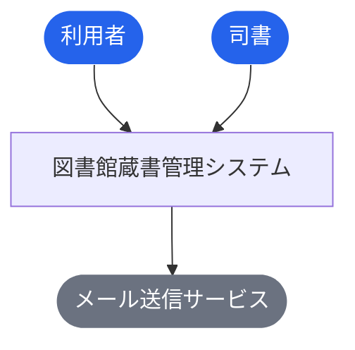
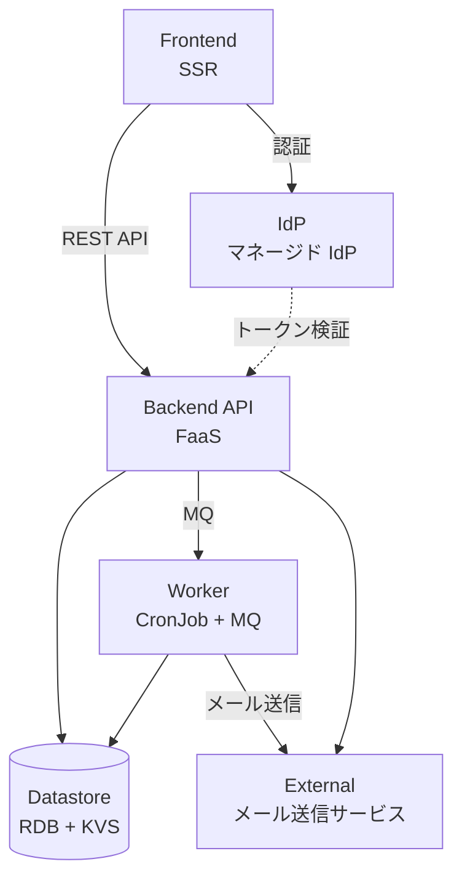
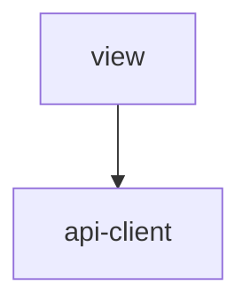
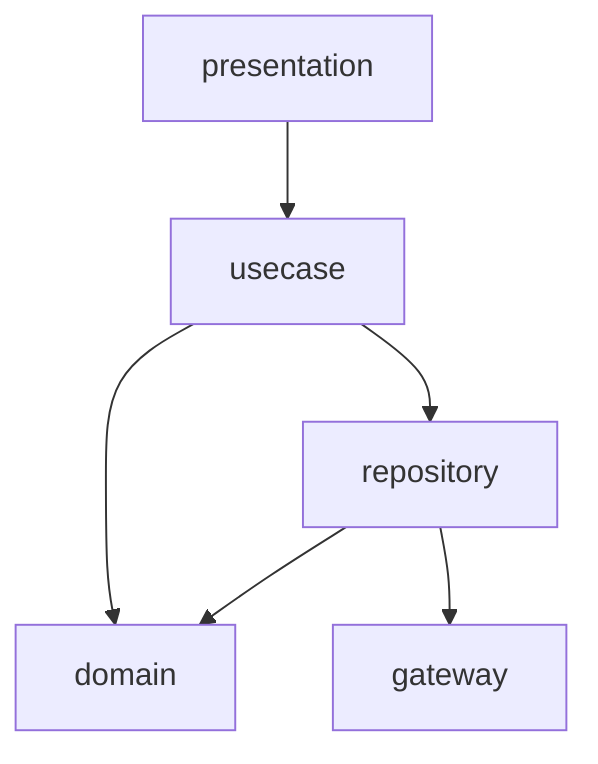
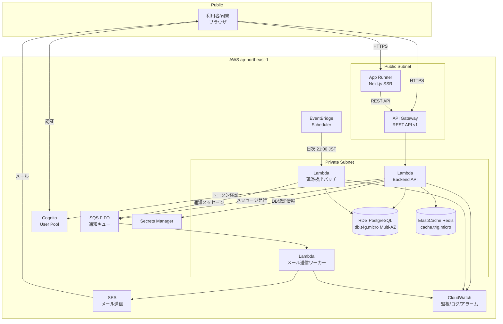

# 図書館蔵書管理システム

> undefined

**最終更新**: 2026-04-12 20:52:45 spec stories (design)

## 成果物一覧

| ドメイン | 最新 | イベント数 |
|---------|------|-----------:|
| [USDM（要求分解）](#usdm要求分解) | [usdm/latest/](usdm/latest/) | 1 |
| [RDRA（要件定義）](#rdra要件定義) | [rdra/latest/](rdra/latest/) | 1 |
| [NFR（非機能要求）](#nfr非機能要求) | [nfr/latest/](nfr/latest/) | 1 |
| [Arch（アーキテクチャ）](#archアーキテクチャ) | [arch/latest/](arch/latest/) | 2 |
| [Infra（インフラ設計）](#infraインフラ設計) | [infra/latest/](infra/latest/) | 1 |
| [Design（デザイン）](#designデザイン) | [design/latest/](design/latest/) | 2 |
| [Specs（詳細仕様）](#specs詳細仕様) | [specs/latest/](specs/latest/) | 1 |

## USDM（要求分解）

### 主要な成果物

- [requirements.md](usdm/latest/requirements.md)
- [requirements.yaml](usdm/latest/requirements.yaml)

| 項目 | 値 |
|------|-----|
| 要求数 | 6 |
| 仕様数 | 13 |

## RDRA（要件定義）

### 主要な成果物

- [アクター.tsv](rdra/latest/アクター.tsv)
- [外部システム.tsv](rdra/latest/外部システム.tsv)
- [情報.tsv](rdra/latest/情報.tsv)
- [状態.tsv](rdra/latest/状態.tsv)
- [条件.tsv](rdra/latest/条件.tsv)
- [バリエーション.tsv](rdra/latest/バリエーション.tsv)
- [BUC.tsv](rdra/latest/BUC.tsv)
- [関連データ.txt](rdra/latest/関連データ.txt)
- [ZeroOne.txt](rdra/latest/ZeroOne.txt)
- [システム概要.json](rdra/latest/システム概要.json)

| 項目 | 値 |
|------|-----|
| アクター | 2 |
| 外部システム | 1 |
| 情報 | 5 |
| 状態モデル | 2 |
| 条件 | 4 |
| バリエーション | 3 |
| 業務 | 6 |
| BUC | 8 |
| UC | 18 |

### 外部ツール連携

| ツール | データファイル | 手順 |
|--------|-------------|------|
| [RDRA Graph](https://vsa.co.jp/rdratool/graph/v0.94/) | [関連データ.txt](rdra/latest/関連データ.txt) | ファイル内容をコピーし、RDRA Graph に貼り付け |
| [RDRA Sheet](https://docs.google.com/spreadsheets/d/1h7J70l6DyXcuG0FKYqIpXXfdvsaqjdVFwc6jQXSh9fM/) | [ZeroOne.txt](rdra/latest/ZeroOne.txt) | ファイル内容をコピーし、テンプレートに貼り付け |

### システムコンテキスト図



## NFR（非機能要求）

### 主要な成果物

- [nfr-grade.md](nfr/latest/nfr-grade.md)
- [nfr-grade.yaml](nfr/latest/nfr-grade.yaml)

| 項目 | 値 |
|------|-----|
| モデルシステム | model1 |
| カテゴリ | 6 |
| 重要項目 | 46 |

## Arch（アーキテクチャ）

### 主要な成果物

- [arch-design.md](arch/latest/arch-design.md)
- [arch-design.yaml](arch/latest/arch-design.yaml)
- [coverage-report.md](arch/latest/coverage-report.md)

| 項目 | 値 |
|------|-----|
| 言語 | TypeScript |
| ティア | 5 |
| ポリシー | 10 |
| ルール | 5 |
| エンティティ | 6 |

### コンテナ図（システム構成）



### コンポーネント図（レイヤー依存）

**tier-frontend**



**tier-backend-api**



**tier-worker**


## Infra（インフラ設計）

### 主要な成果物

- [_changes.md](infra/latest/_changes.md)
- [_inference.md](infra/latest/_inference.md)
- [infra-event.md](infra/latest/infra-event.md)
- [infra-event.yaml](infra/latest/infra-event.yaml)
- [product-input.yaml](infra/latest/product-input.yaml)

### ワークロード全体構成図

> 出典: [architecture-overview.md](infra/latest/docs/cloud-context/generated-md/product/architecture-overview.md)



## Design（デザイン）

### 主要な成果物

- [design-event.md](design/latest/design-event.md)
- [design-event.yaml](design/latest/design-event.yaml)
- [assets/](design/latest/assets) (SVG 16 ファイル)

### ブランド

| 項目 | 値 |
|------|-----|
| 名称 | LibraShelf |
| プライマリカラー | `#1E40AF` |
| セカンダリカラー | `#334155` |
| トーン | 信頼・堅実 |

### ポータル一覧

| ポータル | アクター | カラー |
|---------|---------|--------|
| 利用者ポータル | 利用者 | `#2563EB` |
| 司書ポータル | 司書 | `#334155` |

### Storybook

```bash
cd docs/design/latest/storybook-app && npm run storybook
```

Stories: 23 ファイル

## Specs（詳細仕様）

### 主要な成果物

- [spec-event.md](specs/latest/spec-event.md)
- [spec-event.yaml](specs/latest/spec-event.yaml)

| 項目 | 値 |
|------|-----|
| UC | 18 |
| API | 20 |
| 非同期イベント | 2 |

### 横断設計

| 仕様 | ファイル |
|------|---------|
| UX デザイン仕様 | [ux-ui/ux-design.md](specs/latest/_cross-cutting/ux-ui/ux-design.md) |
| UI デザイン仕様 | [ux-ui/ui-design.md](specs/latest/_cross-cutting/ux-ui/ui-design.md) |
| データ可視化仕様 | [ux-ui/data-visualization.md](specs/latest/_cross-cutting/ux-ui/data-visualization.md) |
| 共通コンポーネント設計 | [ux-ui/common-components.md](specs/latest/_cross-cutting/ux-ui/common-components.md) |
| OpenAPI 3.1 | [api/openapi.yaml](specs/latest/_cross-cutting/api/openapi.yaml) |
| AsyncAPI 3.0 | [api/asyncapi.yaml](specs/latest/_cross-cutting/api/asyncapi.yaml) |
| RDB スキーマ | [datastore/rdb-schema.yaml](specs/latest/_cross-cutting/datastore/rdb-schema.yaml) |
| KVS スキーマ | [datastore/kvs-schema.yaml](specs/latest/_cross-cutting/datastore/kvs-schema.yaml) |
| トレーサビリティマトリクス | [traceability-matrix.md](specs/latest/_cross-cutting/traceability-matrix.md) |

### 蔵書管理業務

**蔵書管理フロー**

- [書籍を登録する](specs/latest/蔵書管理業務/蔵書管理フロー/書籍を登録する/spec.md)
- [書籍情報を編集する](specs/latest/蔵書管理業務/蔵書管理フロー/書籍情報を編集する/spec.md)
- [書籍を削除する](specs/latest/蔵書管理業務/蔵書管理フロー/書籍を削除する/spec.md)

### 貸出管理業務

**貸出管理フロー**

- [書籍を貸出する](specs/latest/貸出管理業務/貸出管理フロー/書籍を貸出する/spec.md)
- [書籍を返却する](specs/latest/貸出管理業務/貸出管理フロー/書籍を返却する/spec.md)
- [貸出状況を確認する](specs/latest/貸出管理業務/貸出管理フロー/貸出状況を確認する/spec.md)

**延滞管理フロー**

- [延滞を検出する](specs/latest/貸出管理業務/延滞管理フロー/延滞を検出する/spec.md)
- [督促通知を送信する](specs/latest/貸出管理業務/延滞管理フロー/督促通知を送信する/spec.md)

### 予約管理業務

**予約管理フロー**

- [書籍を予約する](specs/latest/予約管理業務/予約管理フロー/書籍を予約する/spec.md)
- [予約通知を送信する](specs/latest/予約管理業務/予約管理フロー/予約通知を送信する/spec.md)
- [予約をキャンセルする](specs/latest/予約管理業務/予約管理フロー/予約をキャンセルする/spec.md)

### 利用者管理業務

**利用者管理フロー**

- [利用者を登録する](specs/latest/利用者管理業務/利用者管理フロー/利用者を登録する/spec.md)
- [利用者情報を編集する](specs/latest/利用者管理業務/利用者管理フロー/利用者情報を編集する/spec.md)

### 閲覧業務

**蔵書検索フロー**

- [書籍を検索する](specs/latest/閲覧業務/蔵書検索フロー/書籍を検索する/spec.md)

**利用者マイページフロー**

- [貸出履歴を確認する](specs/latest/閲覧業務/利用者マイページフロー/貸出履歴を確認する/spec.md)
- [予約状況を確認する](specs/latest/閲覧業務/利用者マイページフロー/予約状況を確認する/spec.md)

### 統計業務

**統計・レポートフロー**

- [在庫状況を確認する](specs/latest/統計業務/統計・レポートフロー/在庫状況を確認する/spec.md)
- [統計レポートを閲覧する](specs/latest/統計業務/統計・レポートフロー/統計レポートを閲覧する/spec.md)

> 6 業務 / 8 BUC / 18 UC

## ADRs（設計判断記録）

| # | ドメイン | 判断 | ステータス |
|---|---------|------|----------|
| 1 | Arch | [TypeScript 統一スタック採用](arch/events/20260412_161337_initial_arch/decisions/arch-decision-001.yaml) | approved |
| 2 | Arch | [バックエンド API に FaaS を選定](arch/events/20260412_161337_initial_arch/decisions/arch-decision-002.yaml) | approved |
| 3 | Arch | [イミュータブルデータモデル（event_snapshot）の採用](arch/events/20260412_161337_initial_arch/decisions/arch-decision-003.yaml) | approved |
| 4 | Arch | [RBAC + Backend 作り込みによる認可方式](arch/events/20260412_161337_initial_arch/decisions/arch-decision-004.yaml) | approved |
| 5 | Arch | [バックエンド API に 5 層レイヤリングを採用](arch/events/20260412_161337_initial_arch/decisions/arch-decision-005.yaml) | approved |
| 6 | Infra | [コンピュートモデルの選定: Serverless (Lambda + App Runner)](infra/events/20260412_162437_infra_product_design/docs/cloud-context/decisions/product/product-decision-compute-model.yaml) | accepted |
| 7 | Infra | [データベースエンジンの選定: RDS for PostgreSQL](infra/events/20260412_162437_infra_product_design/docs/cloud-context/decisions/product/product-decision-database-engine.yaml) | accepted |
| 8 | Design | [ブランドアイデンティティ方向性: 信頼・堅実路線の採用](design/events/20260412_164650_design_system/decisions/design-decision-001.yaml) | approved |
| 9 | Design | [ポータル構成戦略: 利用者/司書の2ポータル構成](design/events/20260412_164650_design_system/decisions/design-decision-002.yaml) | approved |
| 10 | Design | [トークンアーキテクチャ: 3層構造の採用](design/events/20260412_164650_design_system/decisions/design-decision-003.yaml) | approved |
| 11 | Design | [コンポーネント戦略: RDRAモデル駆動のコンポーネント設計](design/events/20260412_164650_design_system/decisions/design-decision-004.yaml) | approved |
| 12 | Specs | [REST API スタイルの採用と命名規則](specs/events/20260412_195542_spec_generation/decisions/spec-decision-001.yaml) | approved |
| 13 | Specs | [非同期イベント駆動パターンの採用範囲](specs/events/20260412_195542_spec_generation/decisions/spec-decision-002.yaml) | approved |
| 14 | Specs | [RDB 正規化レベルと統計テーブルの非正規化](specs/events/20260412_195542_spec_generation/decisions/spec-decision-003.yaml) | approved |
| 15 | Specs | [横断関心事の解決方針](specs/events/20260412_195542_spec_generation/decisions/spec-decision-004.yaml) | approved |

## イベント履歴

| 日時 | ドメイン | イベントID |
|------|---------|-----------|
| 2026-04-12 14:05:35 | USDM（要求分解） | [20260412_140535_initial_build](usdm/events/20260412_140535_initial_build) |
| 2026-04-12 14:05:35 | RDRA（要件定義） | [20260412_140535_initial_build](rdra/events/20260412_140535_initial_build) |
| 2026-04-12 15:43:04 | NFR（非機能要求） | [20260412_154304_initial_nfr](nfr/events/20260412_154304_initial_nfr) |
| 2026-04-12 16:13:37 | Arch（アーキテクチャ） | [20260412_161337_initial_arch](arch/events/20260412_161337_initial_arch) |
| 2026-04-12 16:24:37 | Infra（インフラ設計） | [20260412_162437_infra_product_design](infra/events/20260412_162437_infra_product_design) |
| 2026-04-12 16:40:19 | Arch（アーキテクチャ） | [20260412_164019_arch_infra_feedback](arch/events/20260412_164019_arch_infra_feedback) |
| 2026-04-12 16:46:50 | Design（デザイン） | [20260412_164650_design_system](design/events/20260412_164650_design_system) |
| 2026-04-12 19:55:42 | Specs（詳細仕様） | [20260412_195542_spec_generation](specs/events/20260412_195542_spec_generation) |
| 2026-04-12 20:52:45 | Design（デザイン） | [20260412_205245_spec_stories](design/events/20260412_205245_spec_stories) |

---

*このファイルは `generateReadme.js` により自動生成されています。手動編集しないでください。*
