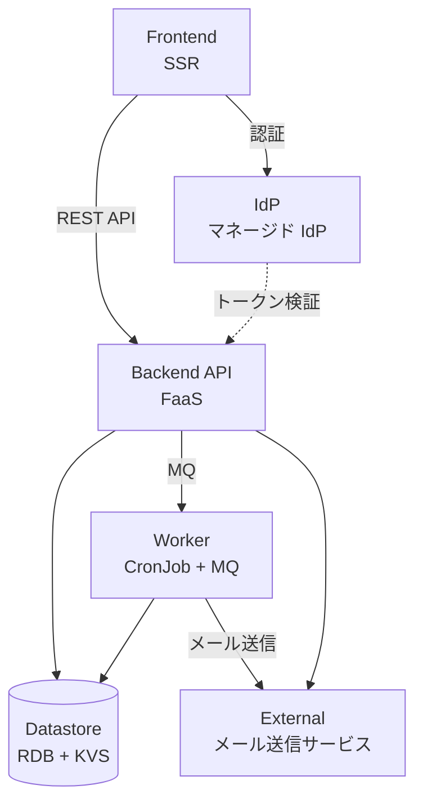
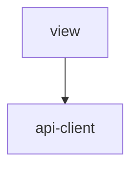
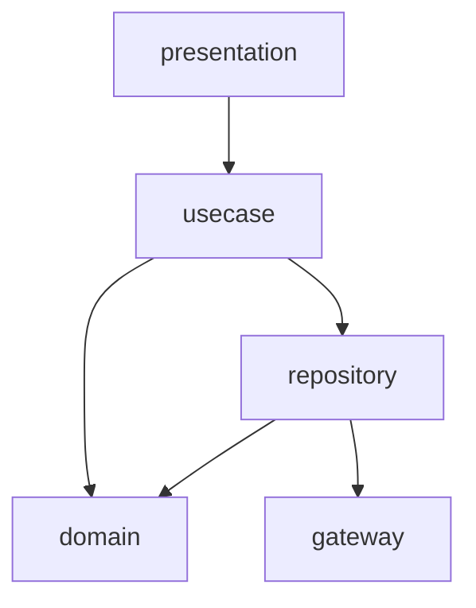
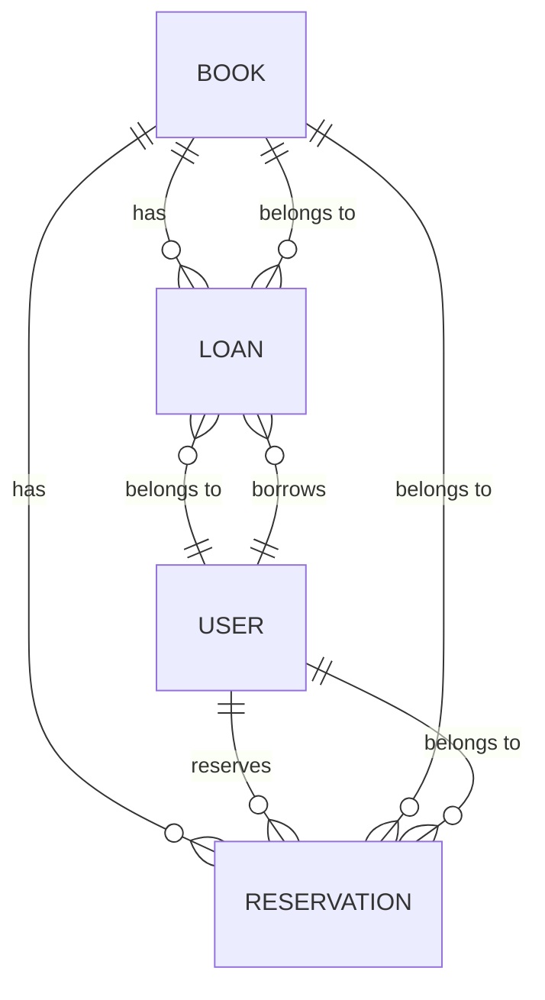

# アーキテクチャ設計書

## 概要

| 項目 | 内容 |
|------|------|
| イベントID | 20260412_164019_arch_infra_feedback |
| 作成日時 | 2026-04-12T16:40:19 |
| ソース | インフラ設計 20260412_162437_infra_product_design に基づくアーキテクチャフィードバック |
| 言語 | TypeScript |
| フレームワーク | Next.js |
| 技術的制約 | RDB 接続プール上限 100（マネージド RDB 小規模インスタンスの共通制約。product-impl-aws.yaml の max_connections: 100 に基づく）, FaaS API 連携時実行時間上限 29 秒（API ゲートウェイ連携の共通制約。product-impl-aws.yaml の FaaS timeout: 29 に基づく） |

## システムアーキテクチャ

### システム構成図

### ティア構成

| ID | ティア名 | 説明 | テクノロジー候補 |
|-----|---------|------|----------------|
| tier-frontend | フロントエンド | 利用者・司書向け Web UI。蔵書検索・貸出手続き・管理画面を提供する | SSR |
| tier-backend-api | バックエンド API | 蔵書管理・貸出管理・予約管理・利用者管理・統計の業務ロジックを提供する REST API | FaaS |
| tier-worker | バックエンドワーカー | 延滞検出（定期バッチ）と督促通知・予約通知のメール送信（非同期処理）を担う | CronJob, MQ |
| tier-datastore | データストア | 書籍・利用者・貸出・予約・統計データの永続化とセッション管理 | RDB, KVS |
| tier-external | 外部連携 | メール送信サービスとの連携を担うアダプタ層 | アダプタパターン |

### フロントエンド (tier-frontend) の方針・ルール

#### 方針

| ID | 方針名 | 内容 | 根拠 | RDRA/NFR 要素 | 確信度 |
|-----|---------|------|------|--------------|:------:|
| SP-001 | サーバーサイドレンダリング | 蔵書検索画面等の公開ページは SSR で初回表示速度と SEO を確保する | 外部アクター「利用者」向け蔵書検索画面があり、公共図書館として検索エンジンからのアクセスが想定されるため | BUC: 蔵書検索フロー, NFR F.1.1.2 | ユーザー指定 |
| SP-002 | 主要ブラウザ対応 | Chrome, Firefox, Safari の主要ブラウザ 2-3 種に対応する | NFR F.1.1.2 対応ブラウザ Lv2（主要ブラウザ 2-3 種対応）への対応 | NFR F.1.1.2 | 中 |

#### ルール

| ID | ルール名 | 内容 | 根拠 | RDRA/NFR 要素 | 確信度 |
|-----|---------|------|------|--------------|:------:|
| SR-001 | API 経由のデータアクセス | フロントエンドからデータストアへの直接アクセスを禁止し、必ず Backend API を経由する | セキュリティとデータ整合性の確保 | NFR E.5.2.1 | デフォルト |

### バックエンド API (tier-backend-api) の方針・ルール

#### 方針

| ID | 方針名 | 内容 | 根拠 | RDRA/NFR 要素 | 確信度 |
|-----|---------|------|------|--------------|:------:|
| SP-003 | モノリシック API | 全業務ドメイン（蔵書管理・貸出管理・予約管理・利用者管理・統計）を単一の API サービスとして構成する | BUC が 6 業務・UC 16 件の小規模システムで、ドメイン境界が明確に分離するほどの規模ではないため | BUC: 蔵書管理業務, 貸出管理業務, 予約管理業務, 利用者管理業務, 閲覧業務, 統計業務 | 中 |
| SP-004 | 入力バリデーション | API 境界で全入力をバリデーションする。貸出期限ルール・貸出可否判定ルール・延滞判定ルール・予約優先ルールを含む | 条件.tsv に 4 件のビジネスルールがあり、外部入力の安全性確保が必要 | 条件: 貸出期限ルール, 貸出可否判定ルール, 延滞判定ルール, 予約優先ルール | 高 |

#### ルール

| ID | ルール名 | 内容 | 根拠 | RDRA/NFR 要素 | 確信度 |
|-----|---------|------|------|--------------|:------:|
| SR-002 | REST API スタイル | リソース指向の REST API を採用する。エンドポイントは /api/v1/{resource} 形式 | 一般的なベストプラクティスとして適用 | なし | デフォルト |

### バックエンドワーカー (tier-worker) の方針・ルール

#### 方針

| ID | 方針名 | 内容 | 根拠 | RDRA/NFR 要素 | 確信度 |
|-----|---------|------|------|--------------|:------:|
| SP-005 | 延滞検出バッチ | 返却期限超過の貸出を日次バッチで検出し、延滞フラグを設定する | BUC「延滞管理フロー」に「延滞を検出する」アクティビティがあり、定期的な検出処理が必要 | BUC: 延滞管理フロー, NFR B.2.2.1 | 高 |
| SP-006 | 非同期メール送信 | 督促通知・予約通知のメール送信を MQ 経由の非同期処理で実行する | BUC「延滞管理フロー」「予約管理フロー」にメール送信アクティビティがあり、外部システム「メール送信サービス」との連携で非同期処理が適切 | BUC: 延滞管理フロー, 予約管理フロー, 外部システム: メール送信サービス | 中 |

#### ルール

| ID | ルール名 | 内容 | 根拠 | RDRA/NFR 要素 | 確信度 |
|-----|---------|------|------|--------------|:------:|
| SR-003 | バッチ処理時間制約 | バッチ処理は夜間（21 時〜翌 9 時）の停止時間帯に完了すること | NFR B.2.2.1 バッチ処理時間 Lv1（翌営業日開始まで）および運用時間 Lv2（9 時〜21 時）への対応 | NFR B.2.2.1, NFR A.1.1.1 | 中 |

### データストア (tier-datastore) の方針・ルール

#### 方針

| ID | 方針名 | 内容 | 根拠 | RDRA/NFR 要素 | 確信度 |
|-----|---------|------|------|--------------|:------:|
| SP-007 | トランザクション整合性 | 貸出・予約の状態遷移を伴うデータ更新は RDB のトランザクションで整合性を保証する | 状態.tsv に書籍貸出状態（4 状態 5 遷移）と予約状態（4 状態 4 遷移）の状態モデルがあり、整合性が必要 | 状態: 書籍貸出状態, 予約状態 | 高 |
| SP-008 | 日次バックアップ | RDB のフル + 増分バックアップを日次で実施し、30 日以上保持する | NFR C.1.2.1 バックアップ方式 Lv3（フル + 増分日次）、C.1.2.3 世代管理 Lv3（30 日以上）への対応 | NFR C.1.2.1, NFR C.1.2.3 | 中 |
| SP-009 | 個人情報暗号化 | 利用者情報（氏名・連絡先・メールアドレス）は保管時に暗号化する | NFR E.6.1.1 データ暗号化（保管時）Lv1（機密データのみ暗号化）への対応。個人情報保護法準拠 | NFR E.6.1.1, NFR E.1.2.1, 情報: 利用者 | 高 |

#### ルール

| ID | ルール名 | 内容 | 根拠 | RDRA/NFR 要素 | 確信度 |
|-----|---------|------|------|--------------|:------:|
| SR-004 | RPO 日次 | 目標復旧地点（RPO）は前日の最終バックアップまでとする | NFR A.4.1.1 RPO Lv1（前日の最終バックアップまで）への対応 | NFR A.4.1.1 | ユーザー指定 |

### 外部連携 (tier-external) の方針・ルール

#### 方針

| ID | 方針名 | 内容 | 根拠 | RDRA/NFR 要素 | 確信度 |
|-----|---------|------|------|--------------|:------:|
| SP-010 | 外部サービスアダプタ | メール送信サービスとの連携はアダプタパターンで実装し、サービス固有の実装を隔離する | 外部システム「メール送信サービス」との連携があり、将来のサービス変更に備える | 外部システム: メール送信サービス | 高 |

#### ルール

| ID | ルール名 | 内容 | 根拠 | RDRA/NFR 要素 | 確信度 |
|-----|---------|------|------|--------------|:------:|
| SR-005 | TLS 通信 | 外部サービスとの通信は TLS で暗号化する | NFR E.6.1.2 データ暗号化（通信時）Lv1（外部通信のみ暗号化）への対応 | NFR E.6.1.2 | 高 |

### ティア共通の方針

| ID | 方針名 | 内容 | 根拠 | RDRA/NFR 要素 | 確信度 |
|-----|---------|------|------|--------------|:------:|
| CTP-001 | 認証方式 | マネージド IdP による OAuth2/OIDC ベースの認証を採用する。パスワードポリシー（複雑性・有効期限）を IdP 側で設定する | 外部アクター「利用者」が存在し、NFR E.5.1.1 認証方式 Lv2（パスワードポリシー）を効率的に満たすためマネージド IdP を採用 | アクター: 利用者, 司書, NFR E.5.1.1 | ユーザー指定 |
| CTP-002 | 認可方式 | RBAC（ロールベースアクセス制御）を採用する。利用者ロールと司書ロールの 2 種でアクセス制御を行い、Backend API で作り込む | アクターが 2 種（利用者/司書）で所有権ベースの認可パターンが限定的。NFR E.5.2.1 Lv2（RBAC）と合致 | アクター: 利用者, 司書, NFR E.5.2.1 | ユーザー指定 |
| CTP-003 | 構造化ログ | 全ティアで JSON 形式の構造化ログを出力する。trace_id, span_id, service, timestamp を必須フィールドとする | NFR C.6.1.1 ログ保管期間 Lv1（1 ヶ月）、C.6.1.2 ログ種別 Lv1（アクセスログ・エラーログ）への対応 | NFR C.6.1.1, NFR C.6.1.2 | 中 |
| CTP-004 | トレーサビリティ ID 体系 | OpenTelemetry 標準（trace_id + span_id）でリクエストの全処理経路を追跡する。認証済みリクエストのログには session_id, user_id を context に含める | 外部アクター「利用者」が存在し、NFR E.7.1.1 監査ログ Lv2（データアクセスログ）への対応 | アクター: 利用者, NFR E.7.1.1 | 中 |
| CTP-005 | 冪等性方針 | 状態変更を伴う操作（貸出/返却/予約/キャンセル）に冪等キー（UUID）を適用する。フロントエンドでリクエストごとに冪等キーを生成し X-Idempotency-Key ヘッダに付与。Backend API で KVS を用いて重複リクエストを検知。RDB で冪等キーカラムに UNIQUE 制約を設定 | 状態モデルに状態遷移あり、外部ユーザーがアクター、BUC に予約・貸出等の状態変更操作あり（3 条件該当） | 状態: 書籍貸出状態, 予約状態, アクター: 利用者, BUC: 貸出管理フロー, 予約管理フロー | ユーザー指定 |
| CTP-006 | ヘルスチェック | 全ティアにヘルスチェックエンドポイントを実装し、依存サービスの死活監視を行う | NFR A.2.1.1 サーバ冗長化 Lv4（完全冗長化・自動切替）への対応。自動切替の前提としてヘルスチェックが必要 | NFR A.2.1.1 | 中 |
| CTP-007 | i18n 方針 | 日本語のみ対応とする。i18n 対応不要。テキストはコード内に直接記述可能 | RDRA/NFR に i18n シグナルなし。アクターに外国語名なし、BUC に多言語キーワードなし、システム概要に国際展開の言及なし | なし | ユーザー指定 |
| CTP-008 | 監査ログ | 状態遷移を伴うビジネスイベント（貸出・返却・予約・キャンセル）の操作ログを記録する。誰が、何を、どうしたかを構造化ログで出力する | NFR E.7.1.1 監査ログ Lv2（データアクセスログ）への対応。個人情報へのアクセスを記録する必要あり | NFR E.7.1.1, 情報: 利用者 | 中 |
| CTP-009 | 計画停止方針 | 月次の定期メンテナンス枠（夜間 21 時〜翌 9 時）を設け、パッチ適用・DB メンテナンスを実施する | NFR A.1.1.3 計画停止 Lv1（定期的に計画停止あり）への対応 | NFR A.1.1.3 | デフォルト |
| CTP-010 | サービス切替方針 | 障害発生時は 24 時間以内に部品交換またはインスタンス再起動による復旧を行う | NFR A.1.2.1 サービス切替時間 Lv1（24 時間未満）への対応 | NFR A.1.2.1 | デフォルト |
| CTP-011 | ネットワーク冗長化方針 | 全ネットワーク経路を冗長化し、単一障害点を排除する | NFR A.2.3.1 ネットワーク機器の冗長化 Lv3（全経路の冗長化）への対応 | NFR A.2.3.1 | 中 |
| CTP-012 | ストレージ冗長化方針 | データストアのストレージをダブルパリティ相当で冗長化し、データ消失リスクを低減する | NFR A.2.5.1 ストレージの冗長化 Lv3（RAID6 相当）への対応 | NFR A.2.5.1 | 中 |
| CTP-013 | 電源冗長化方針 | マネージドサービスの電源冗長化に依存する。個別の電源冗長化対策は不要 | NFR A.2.6.2 電源の冗長化 Lv1（冗長化なし）への対応。クラウド利用のため実質的には冗長化済み | NFR A.2.6.2 | デフォルト |
| CTP-014 | RTO 方針 | 目標復旧時間（RTO）は 1 営業日以内とする。バックアップからの復元手順を事前に整備する | NFR A.4.1.2 RTO Lv1（1 営業日以内）への対応 | NFR A.4.1.2 | ユーザー指定 |
| CTP-015 | 同時アクセス・スループット方針 | 同時アクセス 100 ユーザー以下、スループット 10 TPS 以下を前提とした構成とする。FaaS の Auto Scaling でピーク時（通常の 1.5 倍）に対応する | NFR B.1.1.1 同時アクセス Lv1（~100）、B.1.1.3 リクエスト件数 Lv1（~1,000/日）、B.1.2.1 ピーク時 Lv1（1.5 倍）、B.2.1.2 スループット Lv1（~10 TPS）への対応 | NFR B.1.1.1, NFR B.1.1.3, NFR B.1.2.1, NFR B.2.1.2 | ユーザー指定 |
| CTP-016 | レスポンスタイム方針 | オンラインリクエストのレスポンスタイムを 10 秒以内とする。SSR による初回表示最適化と API レスポンス最適化で対応する | NFR B.2.1.1 レスポンスタイム Lv2（10 秒以内）への対応 | NFR B.2.1.1 | 中 |
| CTP-017 | リソース拡張方針 | CPU・メモリはスケールアップ（インスタンスサイズ変更）で対応する。FaaS の場合はメモリ割当量の変更で対応 | NFR B.3.1.1 CPU 拡張性 Lv1（スケールアップ）への対応 | NFR B.3.1.1 | デフォルト |
| CTP-018 | 性能テスト方針 | 単体での性能テストを実施する。主要 API エンドポイントのレスポンスタイムを計測し、NFR B.2.1.1 の基準を満たすことを確認する | NFR B.4.1.1 性能テスト Lv1（単体での性能テスト）への対応 | NFR B.4.1.1 | デフォルト |
| CTP-019 | 運用監視時間方針 | 運用監視は営業時間内（9 時〜17 時）に実施する。営業時間外の障害はアラートメール通知で翌営業日に対応する | NFR C.1.1.1 運用監視時間 Lv1（定時内）への対応 | NFR C.1.1.1 | 中 |
| CTP-020 | パッチ適用方針 | セキュリティパッチのみ随時適用する。計画停止枠（月次メンテナンス）で適用することを原則とする | NFR C.2.1.2 パッチ適用方針 Lv1（セキュリティパッチのみ随時）への対応 | NFR C.2.1.2 | デフォルト |
| CTP-021 | 障害検知方針 | 障害検知はユーザーからの申告を主とする。ヘルスチェック（CTP-006）のアラートを補助的に活用する | NFR C.3.1.1 障害検知方式 Lv1（ユーザからの申告）への対応 | NFR C.3.1.1 | デフォルト |
| CTP-022 | テスト環境方針 | 本番環境と同等のテスト環境は設けない。ローカル開発環境でのテストを主とする | NFR C.4.1.1 テスト環境 Lv1（テスト環境なし）への対応 | NFR C.4.1.1 | デフォルト |
| CTP-023 | サポート体制方針 | サポートは営業時間内（9 時〜17 時）に開発チームが直接対応する | NFR C.5.1.1 サポート時間 Lv1（営業時間内）への対応 | NFR C.5.1.1 | 中 |
| CTP-024 | 移行方針 | 新規構築のため移行作業は発生しない。将来的にデータ投入が必要な場合は一括移行（ビッグバン方式）を採用する | NFR D.2.1.1 移行方式 Lv1（一括移行）への対応。新規構築のため | NFR D.2.1.1, NFR D.4.1.1, NFR D.5.1.1 | ユーザー指定 |
| CTP-025 | セキュリティポリシー方針 | 簡易的なセキュリティガイドラインを策定し、開発チーム内で共有する。OWASP Top 10 をベースとする | NFR E.1.1.1 セキュリティポリシー Lv1（簡易的なガイドラインあり）への対応 | NFR E.1.1.1 | 中 |
| CTP-026 | セキュリティリスク分析方針 | 簡易チェックリストによるセキュリティリスク確認を実施する | NFR E.2.1.1 セキュリティリスク分析 Lv1（簡易チェックリスト）への対応 | NFR E.2.1.1 | デフォルト |
| CTP-027 | セキュリティ診断方針 | セキュリティ診断は実施しない。OWASP Top 10 対応（CTR-005）で基本的なセキュリティを確保する | NFR E.3.1.1 セキュリティ診断 Lv0（診断なし）への対応 | NFR E.3.1.1 | デフォルト |
| CTP-028 | ファイアウォール方針 | パケットフィルタリングによる基本的なネットワークアクセス制御を実施する。パブリック/プライベートサブネットの分離を行う | NFR E.8.1.1 ファイアウォール Lv1（パケットフィルタリング）への対応 | NFR E.8.1.1 | デフォルト |
| CTP-029 | マルウェア対策方針 | サーバ側のマルウェア対策を実施する。マネージドサービス利用の場合はプロバイダの対策に依存する | NFR E.9.1.1 マルウェア対策 Lv1（ウイルス対策ソフト導入）への対応 | NFR E.9.1.1 | デフォルト |
| CTP-030 | WAF 方針 | WAF は導入しない。OWASP Top 10 対応（CTR-005）でアプリケーションレベルの防御を行う | NFR E.10.1.1 WAF Lv0（WAF なし）への対応 | NFR E.10.1.1 | デフォルト |
| CTP-031 | インシデント対応方針 | 基本的な連絡体制を整備する。インシデント発生時のエスカレーションフローを文書化する | NFR E.11.1.1 インシデント対応計画 Lv1（基本的な連絡体制のみ）への対応 | NFR E.11.1.1 | デフォルト |
| CTP-032 | サーバ OS 方針 | サーバ OS は Linux 単一とする。FaaS 利用の場合はランタイム（Node.js）の指定のみ | NFR F.1.1.1 対応 OS Lv1（単一 OS）への対応 | NFR F.1.1.1 | デフォルト |
| CTP-033 | 災害対策方針 | 災害対策は実施しない。マネージドサービスの AZ 間冗長で最低限の可用性を確保する | NFR A.3.1.1 災害対策 Lv0（対策なし）、A.3.1.2 業務継続 Lv0（不要）への対応 | NFR A.3.1.1, NFR A.3.1.2 | ユーザー指定 |
| CTP-034 | SLI/SLO ベースのオブザーバビリティ方針 | 可用性 SLI（API 成功率 99.9%）、レイテンシ SLI（p99 < 1s）、エラー率 SLI（< 5%）を定義し、30 日ローリングウィンドウで SLO を監視する。エラーバジェットの消費速度（burn rate）に基づくアラートを設定する | インフラ設計（MCL product-design）の結果に基づく: product-observability.yaml で SLI/SLO 定義が具体化されたため、アーキテクチャレベルの方針として追加 | infra: product-observability.yaml -> sli_definitions, slo_definitions | 中 |

### ティア共通のルール

| ID | ルール名 | 内容 | 根拠 | RDRA/NFR 要素 | 確信度 |
|-----|---------|------|------|--------------|:------:|
| CTR-001 | TLS 必須 | 全ティア間の通信および外部通信は TLS で暗号化する | NFR E.6.1.2 データ暗号化（通信時）Lv1（外部通信のみ暗号化）への対応 | NFR E.6.1.2 | 高 |
| CTR-002 | API バージョニング | REST API は URL パスベースのバージョニング（/api/v1/）を採用する | 一般的なベストプラクティスとして適用 | なし | デフォルト |
| CTR-003 | エラー通知 | サーバエラー（5xx）発生時にメール通知を送信する | NFR C.3.2.1 障害通知方式 Lv1（メール通知）への対応 | NFR C.3.2.1 | デフォルト |
| CTR-004 | トークンライフサイクル管理 | アクセストークンの有効期限を短く設定し（15 分程度）、リフレッシュトークンで自動更新する。リフレッシュトークンはローテーション方式で管理する | マネージド IdP 導入に伴い、セッションハイジャック防止のためトークン管理方針が必要 | NFR E.5.1.1 | 中 |
| CTR-005 | OWASP Top 10 対応 | OWASP Top 10 に基づく Web アプリケーションセキュリティ対策を実施する | NFR E.10.2.1 Web アプリケーション対策 Lv1（OWASP Top 10 対応）への対応 | NFR E.10.2.1 | 中 |

## アプリケーションアーキテクチャ

### tier-frontend のレイヤー構成

#### レイヤー依存図

| ID | レイヤー名 | 責務 | 依存許可先 |
|-----|---------|------|----------|
| L-frontend-view | ビュー層 | ページコンポーネント、UI コンポーネント、レイアウト、ルーティング | L-frontend-api-client |
| L-frontend-api-client | API クライアント層 | Backend API との HTTP 通信、リクエスト/レスポンスの型定義、エラーハンドリング | - |

#### レイヤー共通の方針

| ID | 方針名 | 内容 | 根拠 | RDRA/NFR 要素 | 確信度 |
|-----|---------|------|------|--------------|:------:|
| CLP-001 | コンポーネント設計 | ページコンポーネントと UI コンポーネントを分離し、UI コンポーネントは再利用可能な設計とする | 一般的なベストプラクティスとして適用 | なし | デフォルト |

#### レイヤー共通のルール

| ID | ルール名 | 内容 | 根拠 | RDRA/NFR 要素 | 確信度 |
|-----|---------|------|------|--------------|:------:|
| CLR-001 | 冪等キー生成 | 状態変更を伴う API リクエスト（POST/PUT/DELETE）ごとに冪等キー（UUID）を生成し X-Idempotency-Key ヘッダに付与する。ダブルクリック防止の UI 制御も併用する | 冪等性方針 CTP-005 のフロントエンド側対応 | CTP-005 | ユーザー指定 |

### tier-backend-api のレイヤー構成

#### レイヤー依存図

| ID | レイヤー名 | 責務 | 依存許可先 |
|-----|---------|------|----------|
| L-backend-api-presentation | プレゼンテーション層 | HTTP リクエスト/レスポンスの変換、入力バリデーション、アクセスログ出力、trace_id 発行 | L-backend-api-usecase |
| L-backend-api-usecase | ユースケース層 | ビジネスフロー制御、トランザクション境界管理、監査ログ記録 | L-backend-api-domain, L-backend-api-repository |
| L-backend-api-domain | ドメイン層 | ビジネスルール（貸出期限・貸出可否・延滞判定・予約優先）、エンティティ、値オブジェクト、状態遷移の整合性保証 | - |
| L-backend-api-repository | リポジトリ層 | domain のデータアクセス方法。aggregate root と 1:1 で定義。gateway/adapter を利用してデータを永続化・取得する | L-backend-api-domain, L-backend-api-gateway |
| L-backend-api-gateway | ゲートウェイ層 | Driven Side の入出力。adapter は RDB テーブル等の datastore model と 1:1 で定義し datastore アクセスを担う。client は datastore SDK のラッパー | - |

#### プレゼンテーション層 (L-backend-api-presentation) の方針・ルール

**方針**

| ID | 方針名 | 内容 | 根拠 | RDRA/NFR 要素 | 確信度 |
|-----|---------|------|------|--------------|:------:|
| LP-001 | 入力バリデーション | API 境界で全入力をバリデーションする | 外部入力の安全性確保。条件.tsv に貸出期限ルール・貸出可否判定ルール・延滞判定ルール・予約優先ルールがあり、入力検証が必要 | 条件: 貸出期限ルール, 貸出可否判定ルール, 延滞判定ルール, 予約優先ルール | 高 |
| LP-002 | アクセスログ | HTTP リクエスト/レスポンスのメタデータを構造化ログで出力する。trace_id を発行し後続レイヤーに伝播する | NFR C.1.3.1 監視範囲 Lv1 および外部アクターあり | NFR C.1.3.1, アクター: 利用者 | 中 |

#### ユースケース層 (L-backend-api-usecase) の方針・ルール

**方針**

| ID | 方針名 | 内容 | 根拠 | RDRA/NFR 要素 | 確信度 |
|-----|---------|------|------|--------------|:------:|
| LP-003 | トランザクション管理 | 貸出・予約の状態遷移を伴うビジネスフローはトランザクション境界をユースケース層で管理する | 情報.tsv に貸出・予約等の状態遷移を伴うエンティティがあり、トランザクション整合性が必要 | 情報: 貸出, 予約, 状態: 書籍貸出状態, 予約状態 | 高 |
| LP-004 | 監査ログ | 状態遷移を伴うビジネスイベントを構造化ログで記録する（誰が、何を、どうしたか） | NFR E.7.1.1 監査ログ Lv2（データアクセスログ）への対応 | NFR E.7.1.1, 状態: 書籍貸出状態, 予約状態 | 高 |

#### ドメイン層 (L-backend-api-domain) の方針・ルール

**方針**

| ID | 方針名 | 内容 | 根拠 | RDRA/NFR 要素 | 確信度 |
|-----|---------|------|------|--------------|:------:|
| LP-005 | 状態遷移 | 書籍貸出状態（在庫あり/貸出中/延滞中）と予約状態（予約受付中/予約確保済/予約キャンセル）の状態遷移をドメインモデル内で整合性保証する | 状態.tsv に 2 つの状態モデル（計 8 状態 9 遷移）があり、ドメインモデルでの状態整合性保証が必要 | 状態: 書籍貸出状態, 予約状態 | 高 |
| LP-006 | ログ出力禁止 | domain 層は直接ログ出力を行わない。ドメインイベントの発行または例外のスローで状態変化を通知する | 一般的なベストプラクティスとして適用。domain 層の純粋性を保つ | なし | 高 |

#### リポジトリ層 (L-backend-api-repository) の方針・ルール

**ルール**

| ID | ルール名 | 内容 | 根拠 | RDRA/NFR 要素 | 確信度 |
|-----|---------|------|------|--------------|:------:|
| LR-001 | Aggregate Root 対応 | repository は domain の aggregate root と 1:1 で定義する。複数テーブルにアクセスする場合は複数の gateway/adapter を利用する | DDD の集約パターンに従い、データアクセスの責務を明確化 | なし | デフォルト |
| LR-002 | Event/Snapshot 併用パターン | event_snapshot 型エンティティ（書籍・利用者・貸出・予約）の場合、repository.save(domain) は historyAdapter.insert + snapshotAdapter.upsert を実行する | イミュータブルデータモデルの永続化パターンを repository で隠蔽 | 情報: 書籍, 利用者, 貸出, 予約 | デフォルト |
| LR-003 | メソッド命名規約 | method 名は JPA に寄せる: save, findById, findAll, deleteById など | 広く知られた命名規約に統一し、学習コストを低減 | なし | デフォルト |

#### ゲートウェイ層 (L-backend-api-gateway) の方針・ルール

**方針**

| ID | 方針名 | 内容 | 根拠 | RDRA/NFR 要素 | 確信度 |
|-----|---------|------|------|--------------|:------:|
| LP-007 | 冪等性 | 外部呼出し（メール送信サービス）の冪等性を保証する | 外部システム「メール送信サービス」との連携で冪等性が必要 | 外部システム: メール送信サービス, CTP-005 | 高 |
| LP-008 | 依存関係ログ | 外部 DB/API 呼び出しの開始・終了、処理時間、成否を構造化ログで出力する | NFR C.1.3.1 監視範囲 Lv1 への対応。外部システムとの連携箇所の可観測性確保 | NFR C.1.3.1, 外部システム: メール送信サービス | 中 |

**ルール**

| ID | ルール名 | 内容 | 根拠 | RDRA/NFR 要素 | 確信度 |
|-----|---------|------|------|--------------|:------:|
| LR-004 | Adapter の責務 | adapter は RDB テーブル等の datastore model と 1:1 で定義する。adapter/client や外部ライブラリの client を利用する。method 名は datastore の操作に寄せる: insert, update, delete など。ORM 利用時は自動生成コードの配置場所となる | datastore モデルとの対応を明確にし、変更影響範囲を限定する | なし | デフォルト |
| LR-005 | Client の責務 | client は datastore を操作する SDK。外部ライブラリの使い方に共通ルールがある場合や SDK が提供されていない場合に作成する | SDK の利用方法を一箇所に集約し、横断的な設定変更を容易にする | なし | デフォルト |

#### レイヤー共通の方針

| ID | 方針名 | 内容 | 根拠 | RDRA/NFR 要素 | 確信度 |
|-----|---------|------|------|--------------|:------:|
| CLP-002 | IF なし（直接依存） | レイヤー間は直接依存とし、開発スピードを優先する。外部サービス API 変更や DB 製品乗り換え時に凹型（IF 導入）で依存を内側に向ける | 新規構築のため IF による疎結合化は過剰。前提条件が崩れた場合に凹型へ移行 | なし | ユーザー指定 |
| CLP-003 | ログ運用方針 | 非同期ログ出力を原則とする。DEBUG/TRACE は本番無効がデフォルト。ログローテーションはサイズ + 時間ベースの併用。保持期間は 1 ヶ月（NFR C.6.1.1 準拠）。ログ出力先は stdout/stderr に統一 | NFR C.6.1.1 ログ保管期間 Lv1（1 ヶ月）への対応 | NFR C.6.1.1 | 中 |
| CLP-004 | ログアンチパターン防止 | 多重ログ禁止、catch 握り潰し禁止、機密情報マスキング必須、ループ内逐次ログ禁止、構造化ログ強制、TZ は UTC 統一 | 一般的なベストプラクティスとして適用 | なし | デフォルト |

#### レイヤー共通のルール

| ID | ルール名 | 内容 | 根拠 | RDRA/NFR 要素 | 確信度 |
|-----|---------|------|------|--------------|:------:|
| CLR-002 | エラーハンドリング伝播 | domain の例外は usecase で集約キャッチし 1 回だけログ出力。presentation で HTTP ステータスに変換。cause chain を context に保持。多重ログ防止 | レイヤー責務の分離 | なし | デフォルト |

### tier-worker のレイヤー構成

#### レイヤー依存図

| ID | レイヤー名 | 責務 | 依存許可先 |
|-----|---------|------|----------|
| L-worker-presentation | プレゼンテーション層 | CronJob トリガー / MQ メッセージの受信、trace_id 取得・発行 | L-worker-usecase |
| L-worker-usecase | ユースケース層 | 延滞検出・督促通知送信・予約通知送信のビジネスフロー制御 | L-worker-domain, L-worker-repository |
| L-worker-domain | ドメイン層 | 延滞判定ルール等のビジネスルール。Backend API と domain を共有 | - |
| L-worker-repository | リポジトリ層 | 延滞検出対象の貸出データ取得、延滞フラグ更新。Backend API と repository を共有 | L-worker-domain, L-worker-gateway |
| L-worker-gateway | ゲートウェイ層 | RDB アクセス、メール送信サービス連携。Backend API と gateway を共有 | - |

#### レイヤー共通のルール

| ID | ルール名 | 内容 | 根拠 | RDRA/NFR 要素 | 確信度 |
|-----|---------|------|------|--------------|:------:|
| CLR-003 | ジョブ冪等性 | CronJob はジョブ実行 ID で重複実行を検知する。MQ ワーカーは MessageId で重複メッセージを検知する | 冪等性方針 CTP-005 のワーカー側対応 | CTP-005 | ユーザー指定 |

## データアーキテクチャ

### ER 図

### エンティティ一覧

#### E-001: 書籍

- **参照元**: 情報: 書籍
- **モデル種別**: イベント+スナップショット

| 属性名 | 型 | 説明 | NULL | PK |
|--------|-----|------|:----:|:--:|
| book_id | string | 書籍ID | No | Yes |
| title | string | タイトル | No |  |
| author | string | 著者 | No |  |
| isbn | string | ISBN | Yes |  |
| publisher | string | 出版社 | Yes |  |
| genre | string | ジャンル（文学/理工/児童書/社会科学/自然科学/芸術/その他） | No |  |
| material_type | string | 資料種別（紙書籍/電子書籍） | No |  |
| shelf_location | string | 配架場所 | Yes |  |
| current_status | string | 現在の貸出状態（在庫あり/貸出中/延滞中） | No |  |

**リレーション**

| 対象エンティティ | カーディナリティ | 説明 |
|-----------------|:---------------:|------|
| E-003 | 1:N | 書籍は複数の貸出記録を持つ |
| E-004 | 1:N | 書籍は複数の予約を持つ |

#### E-002: 利用者

- **参照元**: 情報: 利用者
- **モデル種別**: イベント+スナップショット

| 属性名 | 型 | 説明 | NULL | PK |
|--------|-----|------|:----:|:--:|
| user_number | string | 利用者番号 | No | Yes |
| full_name | string | 氏名 | No |  |
| contact | string | 連絡先 | Yes |  |
| email | string | メールアドレス | No |  |
| user_type | string | 利用者種別（一般/学生/児童） | No |  |
| registered_at | datetime | 登録日 | No |  |

**リレーション**

| 対象エンティティ | カーディナリティ | 説明 |
|-----------------|:---------------:|------|
| E-003 | 1:N | 利用者は複数の貸出記録を持つ |
| E-004 | 1:N | 利用者は複数の予約を持つ |

#### E-003: 貸出

- **参照元**: 情報: 貸出
- **モデル種別**: イベント+スナップショット

| 属性名 | 型 | 説明 | NULL | PK |
|--------|-----|------|:----:|:--:|
| loan_id | string | 貸出ID | No | Yes |
| book_id | string | 書籍ID（外部キー） | No |  |
| user_number | string | 利用者番号（外部キー） | No |  |
| loan_date | datetime | 貸出日 | No |  |
| due_date | datetime | 返却期限 | No |  |
| is_overdue | boolean | 延滞フラグ | No |  |
| current_status | string | 現在の貸出状態（貸出中/返却済/延滞中） | No |  |
| idempotency_key | string | 冪等キー（UNIQUE 制約） | No |  |

**リレーション**

| 対象エンティティ | カーディナリティ | 説明 |
|-----------------|:---------------:|------|
| E-001 | N:1 | 貸出は 1 つの書籍に紐づく |
| E-002 | N:1 | 貸出は 1 人の利用者に紐づく |

#### E-004: 予約

- **参照元**: 情報: 予約
- **モデル種別**: イベント+スナップショット

| 属性名 | 型 | 説明 | NULL | PK |
|--------|-----|------|:----:|:--:|
| reservation_id | string | 予約ID | No | Yes |
| book_id | string | 書籍ID（外部キー） | No |  |
| user_number | string | 利用者番号（外部キー） | No |  |
| reserved_at | datetime | 予約日 | No |  |
| reservation_order | integer | 予約順 | No |  |
| current_status | string | 予約状態（予約受付中/予約確保済/予約キャンセル） | No |  |
| idempotency_key | string | 冪等キー（UNIQUE 制約） | No |  |

**リレーション**

| 対象エンティティ | カーディナリティ | 説明 |
|-----------------|:---------------:|------|
| E-001 | N:1 | 予約は 1 つの書籍に紐づく |
| E-002 | N:1 | 予約は 1 人の利用者に紐づく |

#### E-005: 統計情報

- **参照元**: 情報: 統計情報
- **モデル種別**: リソース

| 属性名 | 型 | 説明 | NULL | PK |
|--------|-----|------|:----:|:--:|
| period | string | 集計期間 | No | Yes |
| loan_count | integer | 貸出回数 | No |  |
| popular_books_ranking | text | 人気書籍ランキング（JSON 形式） | Yes |  |

#### E-006: セッション情報

- **参照元**: なし
- **モデル種別**: リソース

| 属性名 | 型 | 説明 | NULL | PK |
|--------|-----|------|:----:|:--:|
| session_id | string | セッションID | No | Yes |
| user_id | string | ユーザーID | No |  |
| access_token | string | アクセストークン | No |  |
| refresh_token | string | リフレッシュトークン | No |  |
| role | string | ロール（利用者/司書） | No |  |
| expires_at | datetime | 有効期限 | No |  |

### ストレージマッピング

| エンティティID | ストレージ種別 | 根拠 | 確信度 |
|---------------|:------------:|------|:------:|
| E-001 | RDB | 状態モデル「書籍貸出状態」があり、トランザクション整合性が必要 | 高 |
| E-002 | RDB | 個人情報を含み、貸出・予約との外部キー関係があるためトランザクション整合性が必要 | 高 |
| E-003 | RDB | 書籍貸出状態の状態遷移を伴い、書籍・利用者との外部キー関係があるためトランザクション整合性が必要 | 高 |
| E-004 | RDB | 予約状態の状態遷移を伴い、書籍・利用者との外部キー関係があるためトランザクション整合性が必要 | 高 |
| E-005 | RDB | 統計データは貸出データからの集計結果であり、RDB で管理する | 中 |
| E-006 | キャッシュ | セッション情報は頻繁にアクセスされ、有効期限付きで管理するためキャッシュが適切 | 高 |

## 凡例

### 確信度

| 確信度 | 意味 |
|:------:|------|
| 高 | RDRA/NFR モデルから明確に推論 |
| 中 | RDRA/NFR モデルから間接推論 |
| 低 | 弱い根拠での推論 |
| デフォルト | 一般的なベストプラクティスを適用 |
| ユーザー指定 | 対話でユーザーが指定 |
