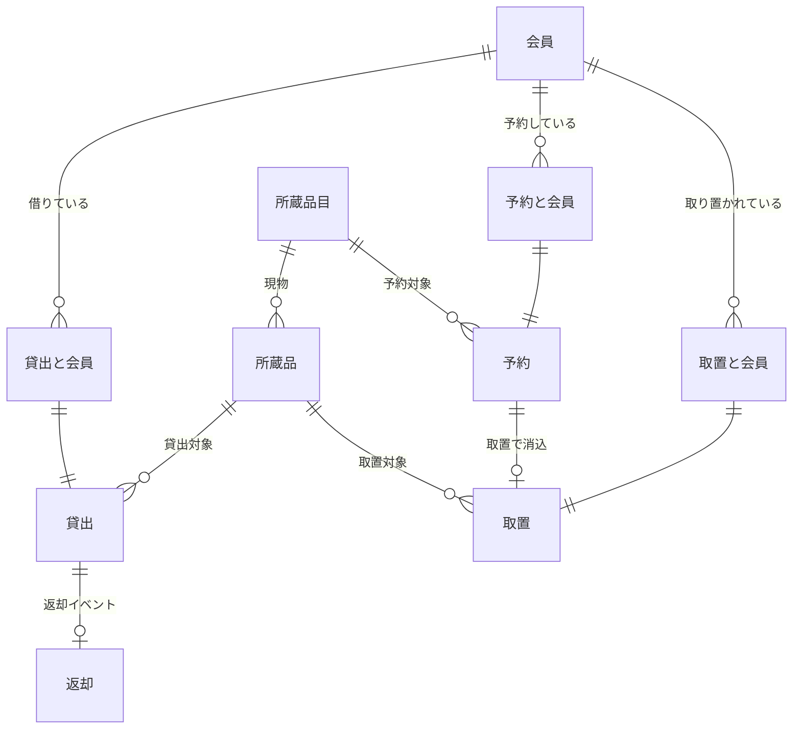

# 05 システムレイヤー

- 解析対象リポジトリ: `/Users/suwa_sh/src/github.com/suwa-sh/claude-code-rdra-rev/system-sekkei/library`
- 前提ドキュメント: `analysis/01-overview.md` 〜 `analysis/04-boundary.md`（コミット: `f460a75b843c484908b95b82e6fdd84186b4b5f8`）
- 解析日: 2026-07-03
- ※ 根拠の path はリポジトリルートからの相対パスで記載する。UC 名は Phase4（04-boundary.md）の定義に一致させる。
- ※ 主な証拠源: `src/main/resources/schema.sql`（スキーマ・テーブル定義。テーブル名は日本語）、
  `src/main/resources/data.sql`、ドメインモデル（`src/main/java/library/domain/model/`）、
  MyBatis マッパー（`src/main/java/library/infrastructure/datasource/**/*.xml`）、
  データソース実装（状態遷移の insert/delete）。
- ※ データ設計の特徴: 本システムは UPDATE を使わず、**イベント履歴テーブル（貸出.貸出、貸出.返却、
  取置.取置 等）と状態テーブル（`_` プレフィックス: `_貸出可能`/`_貸出中`/`_取置中`/`_未準備`/`_準備完了` 等）
  の行の有無**で状態を表現するイミュータブルデータモデルである（事実: data.sql:36 のコメント
  「イベント履歴テーブルと状態テーブル」、schema.sql:48-137 の状態テーブル群、
  infrastructure/datasource 全体に UPDATE 文が存在しない）。状態の導出はデータソース実装
  （ItemDatasource / MemberDataSource / ReservationDatasource の `status()`）が行う。

## コンテキスト一覧

DB スキーマ分割（schema.sql:3-19 の 6 スキーマ）とドメインパッケージ分割
（domain/model/{member, material, loan, returned, reservation, retention, delay}）に基づき、
以下の 5 コンテキストにグルーピングする（確度: high / 根拠: 事実: schema.sql:3-19、
src/main/java/library/domain/model/ のパッケージ構成）。

| コンテキスト | 対応 DB スキーマ | 対応ドメインパッケージ | 対応業務（Phase3） |
|-------------|----------------|----------------------|-------------------|
| 会員 | 会員 | member | 会員管理（未実装。データ参照のみ） |
| 資料 | 資料_所蔵品目、資料_所蔵品 | material（entry / item / instock） | 蔵書管理（未実装。データ参照のみ）、全業務の基盤 |
| 貸出 | 貸出 | loan（due / rule）、returned、delay | 貸出・返却、延滞管理・督促 |
| 予約 | 予約 | reservation（wait / availability / rule / request） | 予約・取置 |
| 取置 | 取置 | retention | 予約・取置 |

## 情報モデル一覧

| コンテキスト | 情報 | 属性（主要） | 関連情報 | 状態モデル | バリエーション | 確度 | 根拠 |
|-------------|-----|------|---------|-----------|---------------|------|------|
| 会員 | 会員 | 会員番号（PK）、氏名、会員種別、登録日時 | 貸出（会員._貸出と会員）、予約（会員._予約と会員）、取置（会員._取置と会員） | 会員状態 | 会員種別 | high | 事実: schema.sql:22-28（会員テーブル）、schema.sql:140-161（関連テーブル3種）、src/main/java/library/domain/model/member/Member.java:6-15 |
| 資料 | 所蔵品目 | 所蔵品目番号（PK）、タイトル、著者、所蔵品目種別、登録日時 | 所蔵品（1対多）、予約（予約.予約.所蔵品目番号） | （なし。在庫有無は所蔵品の状態から導出） | 所蔵品目種別 | high | 事実: schema.sql:31-38（所蔵品目テーブル）、src/main/java/library/domain/model/material/entry/Entry.java、infrastructure/datasource/material/MaterialMapper.xml:7-19（在庫数の導出クエリ） |
| 資料 | 所蔵品 | 所蔵品番号（PK、'1-A' 形式の文字列）、所蔵品目番号（FK）、登録日時 | 所蔵品目、貸出（貸出.貸出.所蔵品番号）、取置（取置.取置.所蔵品番号） | 所蔵品状態 | （なし） | high | 事実: schema.sql:41-46（所蔵品テーブル）、schema.sql:48-64（状態テーブル _貸出可能/_貸出中/_取置中）、src/main/java/library/domain/model/material/item/Item.java:8-19、data.sql:39-72（所蔵品番号の形式） |
| 貸出 | 貸出 | 貸出番号（PK、シーケンス採番）、所蔵品番号（FK）、貸出日、登録日時。会員との紐付けは関連テーブル（会員._貸出と会員）で保持 | 会員、所蔵品、返却 | （未返却/返却済は 貸出.返却 の行の有無で表現。遅延状態・貸出期限日は導出） | 遅延日数区分（導出） | high | 事実: schema.sql:67-75（貸出テーブルとシーケンス）、schema.sql:140-145（_貸出と会員）、src/main/java/library/domain/model/loan/Loan.java:10-25、infrastructure/datasource/loan/LoanMapper.xml:30-39（未返却の判定: 返却との LEFT JOIN で NULL） |
| 貸出 | 返却 | 貸出番号（PK/FK）、返却日、登録日時 | 貸出 | （イベント記録。状態モデルなし） | （なし） | high | 事実: schema.sql:77-82（返却テーブル）、src/main/java/library/domain/model/returned/Returned.java:5-16（クラスコメント「返却（イベント）」）、infrastructure/datasource/loan/LoanMapper.xml:25-28 |
| 予約 | 予約 | 予約番号（PK、シーケンス採番）、所蔵品目番号（FK）、登録日時。会員との紐付けは関連テーブル（会員._予約と会員）。待ち順番は予約番号順から導出 | 会員、所蔵品目、取置（取置.取置.予約番号） | 予約状態 | （なし） | high | 事実: schema.sql:86-105（予約テーブル・_未準備・予約取消）、schema.sql:148-153(_予約と会員)、src/main/java/library/domain/model/reservation/Reservation.java:11-24、infrastructure/datasource/reservation/ReservationMapper.xml:34-41（待ち順番の導出クエリ） |
| 取置 | 取置 | 取置番号（PK、シーケンス採番）、予約番号（FK）、所蔵品番号（FK）、取置日、登録日時。会員との紐付けは関連テーブル（会員._取置と会員）。取置期限は取置日から導出 | 予約、所蔵品、会員 | 取置状態 | （なし） | high | 事実: schema.sql:108-137（取置テーブル・_準備完了・取置解放・取置期限切れ）、schema.sql:156-161（_取置と会員）、src/main/java/library/domain/model/retention/Retained.java:13-26（取置期限の導出）、retention/RetentionMapper.xml:10-13 |

- 補足: 会員と貸出/予約/取置の紐付けを「会員」スキーマ側の関連テーブルに分離しているのは、
  返却時・取置時に**会員との紐付けだけを削除して個人情報を切り離す**ための構造である
  （確度: medium / 根拠: 事実: infrastructure/datasource/loan/LoanDataSource.java:74（返却時に
  deleteLoanMemberRelation）、retention/RetentionDatasource.java:66（取置時に delete予約と会員）、
  docs/specification.md:47-49。推測: 設計意図の明文はコード内になく仕様書の消去ルールからの対応付け）。

## 情報モデル間の連携

（根拠: 事実: schema.sql の FK 定義（44, 50-63, 72, 79, 91, 97-104, 113-136, 142-160 行）。高確度）

## 状態モデル一覧

状態は enum（ItemStatus / ReservationStatus / MemberStatus / DelayStatus）と状態テーブルの行の有無で
表現される。遷移はデータソース実装の insert/delete が担う（ステートマシンライブラリは不使用）。

### 所蔵品状態（情報: 所蔵品）

enum 定義: 未登録 / 在庫中 / 予約中 / 取置中 / 貸出中 / その他
（事実: src/main/java/library/domain/model/material/item/ItemStatus.java:6-13）。
導出: 所蔵品テーブルに無ければ未登録 → _貸出可能にあれば在庫中 → _貸出中にあれば貸出中 →
_取置中にあれば取置中 → いずれにも無ければその他
（事実: infrastructure/datasource/item/ItemDatasource.java:21-27）。

| コンテキスト | 状態モデル | 状態 | 遷移UC | 遷移先状態 | 確度 | 根拠 |
|-------------|-----------|------|--------|-----------|------|------|
| 資料 | 所蔵品状態 | 未登録（初期） | 蔵書を登録する（**未実装 UC**） | 在庫中 | low | 事実: ItemDatasource.java:22（存在しない所蔵品番号は未登録）、data.sql:74-107（初期データで全所蔵品を _貸出可能 に投入）。推測: 登録 UC が未実装のため、未登録→在庫中の遷移は data.sql の初期投入によってのみ発生する |
| 資料 | 所蔵品状態 | 在庫中 | 貸出を登録する | 貸出中 | high | 事実: infrastructure/datasource/loan/LoanDataSource.java:57-58（delete貸出可能 + insert貸出中）、item/ItemMapper.xml:36-54 |
| 資料 | 所蔵品状態 | 在庫中 | 取置を登録する | 取置中 | high | 事実: infrastructure/datasource/retention/RetentionDatasource.java:61-62（delete貸出可能 + insert取置中）。事前条件: 在庫中以外はエラー（presentation/retention/RetentionController.java:45-80、04-boundary.md より） |
| 資料 | 所蔵品状態 | 貸出中 | 返却を登録する | 在庫中 | high | 事実: infrastructure/datasource/loan/LoanDataSource.java:71-72（insert貸出可能 + delete貸出中） |
| 資料 | 所蔵品状態 | 取置中 | 取置を貸し出す | 貸出中 | high | 事実: infrastructure/datasource/loan/LoanDataSource.java:92-93（delete取置中 + insert貸出中） |
| 資料 | 所蔵品状態 | 取置中 | 取置を期限切れにする | 在庫中 | high | 事実: infrastructure/datasource/retention/RetentionDatasource.java:76-77（delete取置中 + insert貸出可能） |
| 資料 | 所蔵品状態 | 予約中 | （遷移UC なし。**どの処理からもこの状態に到達しない**） | ― | low | 事実: ItemStatus.java:9 に enum 値と説明「次の予約があります」が定義され、ItemLoanability.java:29 が判定に使用。FIXME: 状態テーブル `_予約中` が存在せず、ItemDatasource.status（ItemDatasource.java:21-27）もこの値を返さないため、実行時に到達不能（下記整合性チェック参照） |
| 資料 | 所蔵品状態 | その他 | （遷移UC なし。3つの状態テーブルのいずれにも無い場合のフォールバック） | ― | medium | 事実: ItemDatasource.java:26（フォールバック return）、ItemStatus.java:12（説明「図書館都合により貸出を停止中です」）。推測: この状態に意図的に入れる操作（貸出停止処理）は実装されておらず、説明文は将来用途と推定 |

### 予約状態（情報: 予約）

enum 定義: 未準備（「予約があるが、未取置」）/ 消込済（「貸出または取置期限切れにより取置を解放」）
（事実: src/main/java/library/domain/model/reservation/ReservationStatus.java:6-8）。
導出: 予約が存在しない→消込済、_未準備にあれば未準備、それ以外→消込済
（事実: infrastructure/datasource/reservation/ReservationDatasource.java:75-79）。

| コンテキスト | 状態モデル | 状態 | 遷移UC | 遷移先状態 | 確度 | 根拠 |
|-------------|-----------|------|--------|-----------|------|------|
| 予約 | 予約状態 | （新規） | 予約を登録する | 未準備 | high | 事実: infrastructure/datasource/reservation/ReservationDatasource.java:37-45（insertReservation + insert未準備 + insert予約と会員） |
| 予約 | 予約状態 | 未準備 | 取置を登録する | 消込済 | high | 事実: infrastructure/datasource/retention/RetentionDatasource.java:64-66（コメント「予約の状態」で delete未準備 + delete予約と会員）、ReservationDatasource.java:75-79（_未準備に無い予約は消込済と導出） |
| 予約 | 予約状態 | 未準備 | 予約を取り消す | 消込済（予約取消の記録あり） | high | 事実: infrastructure/datasource/reservation/ReservationDatasource.java:67-72（cancelReservation=予約取消へ insert、delete予約と会員、delete未準備）、ReservationMapper.xml:71-73。FIXME: 「取消」は独立した状態値として enum に存在せず、消込済に合流する（下記整合性チェック参照） |
| 予約 | 予約状態 | 消込済（終了） | ― | ― | high | 事実: ReservationStatus.java:8、ReservationDatasource.java:76-78（消込済から他状態へ遷移させる処理は存在しない） |

### 取置状態（情報: 取置）

enum は存在せず、状態テーブルの行の有無のみで表現される: _準備完了 / 取置解放 / 取置期限切れ
（事実: schema.sql:119-137。テーブルコメント「準備完了」「取置を貸し出した記録」「取置の期限切れ」）。

| コンテキスト | 状態モデル | 状態 | 遷移UC | 遷移先状態 | 確度 | 根拠 |
|-------------|-----------|------|--------|-----------|------|------|
| 取置 | 取置状態 | （新規） | 取置を登録する | 準備完了 | high | 事実: infrastructure/datasource/retention/RetentionDatasource.java:53-55(insert取置 + insert準備完了)、RetentionMapper.xml:10-18 |
| 取置 | 取置状態 | 準備完了 | 取置を貸し出す | 解放（取置解放） | high | 事実: infrastructure/datasource/loan/LoanDataSource.java:97-100（コメント「取置の状態変更」で insert取置解放 + delete準備完了 + delete取置と会員） |
| 取置 | 取置状態 | 準備完了 | 取置を期限切れにする | 期限切れ（取置期限切れ + 取置解放の両方に記録） | high | 事実: infrastructure/datasource/retention/RetentionDatasource.java:71-82（insert取置解放 + insert取置期限切れ + delete準備完了 + delete取置と会員）、application/service/retention/RetentionRecordService.java:53-58 |
| 取置 | 取置状態 | 解放 / 期限切れ（終了） | ― | ― | high | 事実: schema.sql:127-137。これらから他状態へ遷移させる処理は存在しない |

### 会員状態（情報: 会員）

enum 定義: 未登録 / 有効 / 無効（事実: src/main/java/library/domain/model/member/MemberStatus.java:6-11）。
導出: 会員テーブルに存在すれば有効、存在しなければ未登録
（事実: infrastructure/datasource/member/MemberDataSource.java:22-27）。

| コンテキスト | 状態モデル | 状態 | 遷移UC | 遷移先状態 | 確度 | 根拠 |
|-------------|-----------|------|--------|-----------|------|------|
| 会員 | 会員状態 | 未登録（初期） | 会員を登録する（**未実装 UC**） | 有効 | low | 事実: MemberDataSource.java:22-27（導出ロジック）。推測: 登録 UC が未実装（04-boundary.md）のため、遷移は data.sql:1-12 の初期投入によってのみ発生 |
| 会員 | 会員状態 | 有効 | （遷移UC なし） | ― | high | 事実: MemberDataSource.java:24 |
| 会員 | 会員状態 | 無効 | （遷移UC なし。**未使用**） | ― | low | 事実: MemberStatus.java:9-10（TODO コメント「現在未使用なので、どういうケースで利用する想定か確認する」）。推測: 会員カード有効期限3年（docs/specification.md:43）や利用停止（docs/specification.md:28）の表現用と推定されるが実装なし |

### 遅延状態（情報: 貸出。導出状態・非永続）

| コンテキスト | 状態モデル | 状態 | 遷移UC | 遷移先状態 | 確度 | 根拠 |
|-------------|-----------|------|--------|-----------|------|------|
| 貸出 | 遅延状態 | 遅延日数１５日未満 / 遅延日数２ヶ月未満 / 遅延日数２ヶ月以上 | （UC による遷移なし。会員の全未返却貸出の最大遅延期間から判定の都度導出） | ― | high | 事実: src/main/java/library/domain/model/delay/DelayStatus.java:6-15（判定ロジック: 15日未満かつ1ヶ月未満→１５日未満、15日以上かつ2ヶ月未満→２ヶ月未満、それ以外→２ヶ月以上）、loan/due/Dues.java:22-31、delay/DaysPeriods.java:15-23（最大遅延日数の選択） |

### 貸出期限状態（情報: 貸出。**未完成実装**）

| コンテキスト | 状態モデル | 状態 | 遷移UC | 遷移先状態 | 確度 | 根拠 |
|-------------|-----------|------|--------|-----------|------|------|
| 貸出 | 貸出期限状態 | 期限内 / 期限切れ | 貸出期限切れを確認する（`GET /expired`）が使用する想定 | ― | low | 事実: src/main/java/library/domain/model/loan/due/DueDateStatus.java:6-9（enum 定義）。FIXME: DueDate.status()（due/DueDate.java:34-36）が `return null` のスタブであり、判定ロジックが未実装。呼び出し元 LoanExpiredCheckService.expiredCheck（application/service/loan/LoanExpiredCheckService.java:17-20）も戻り値を捨てており、この状態モデルは実質機能していない（04-boundary.md の NPE FIXME と併せて未完成実装） |

## バリエーション一覧

| コンテキスト | バリエーション | 値 | 説明 | 確度 | 根拠 |
|-------------|---------------|----|----|------|------|
| 会員 | 会員種別 | 中学生以上, 小学生以下 | 貸出点数制限の軸。DB では VARCHAR(5) に enum 名を格納 | high | 事実: src/main/java/library/domain/model/member/MemberType.java:6-9、schema.sql:26、data.sql:1-12 |
| 資料 | 所蔵品目種別 | 図書, 視聴覚資料 | 図書と視聴覚資料（DVD/CD 等）で貸出・予約可能点数が異なる | high | 事実: src/main/java/library/domain/model/material/entry/EntryType.java:8-10（Javadoc「図書と視聴覚資料(DVD等)ごとに貸出可能数が異なる」）、schema.sql:36、data.sql:14-34 |
| 貸出 | 遅延日数区分 | 遅延日数１５日未満, 遅延日数２ヶ月未満, 遅延日数２ヶ月以上 | 延滞の罰則の段階。貸出制限の軸 | high | 事実: src/main/java/library/domain/model/delay/DelayStatus.java:6-9、docs/specification.md:27-28 |
| 貸出 | 貸出点数制限区分 | 貸出１５点_視聴覚資料5点まで, 貸出２０点_視聴覚資料5点まで | 会員種別ごとの貸出上限のセット（上限値 15/20/5 は NumberOfLoans の定数） | high | 事実: src/main/java/library/domain/model/loan/rule/RestrictionOfQuantity.java:13-15、loan/NumberOfLoans.java:9-11（_5点/_15点/_20点）、docs/specification.md:8-9 |
| 貸出 | 遅延制限区分 | 貸出可能, 新規貸出不可, 貸出停止 | 遅延状態による貸出制限の判定結果 | high | 事実: src/main/java/library/domain/model/loan/rule/RestrictionOfDelay.java:6-10 |
| 貸出 | 貸出可否 | 冊数制限により貸出不可, 視聴覚資料貸出不可, 新規貸出不可, 貸出一定期間停止, 貸出可能 | 貸出可否判定の最終結果（画面エラーメッセージ付き） | high | 事実: src/main/java/library/domain/model/loan/rule/Loanability.java:6-11 |
| 貸出 | 所蔵品の貸出可否 | 貸出可能, 貸出中により貸出不可能, 予約中により貸出不可能, その他の理由で貸出不可能 | 所蔵品状態からの貸出可否判定結果 | high | 事実: src/main/java/library/domain/model/loan/rule/ItemLoanability.java:10-14 |
| 予約 | 予約可否 | 冊数制限により予約不可, 視聴覚資料予約不可, 予約一定期間停止, 予約可能 | 予約制限判定の結果。「予約一定期間停止」は判定ロジック（ReservationRestriction.予約可否判定）からは返却されない未使用値 | high | 事実: src/main/java/library/domain/model/reservation/availability/ReservationAvailability.java:6-10、reservation/rule/ReservationRestriction.java:27-39（返す値は3種のみ） |
| 予約 | 取置可否 | 取置可能, 取置不可 | 未準備の予約一覧に表示する、待ち順番と在庫数からの取置可否 | high | 事実: src/main/java/library/domain/model/reservation/availability/RetentionAvailability.java:6-9、reservation/wait/ReservationWithWaitingOrder.java:52-58 |
| 予約 | 予約点数制限区分 | 予約点数まで貸出可, 予約停止 | **未使用 enum**。どこからも参照されていない | low | 事実: src/main/java/library/domain/model/reservation/rule/RestrictionOfReservationQuantity.java:6-9（定義のみ。grep で参照箇所ゼロ）。推測: 遅延による予約停止（ReservationAvailability.予約一定期間停止と対）を表す将来実装の骨格と推定（FIXME: 意図不明のため Phase3 確認対象） |
| 資料 | 在庫有無 | 在庫あり（〇）, 在庫なし（×） | 検索結果・予約一覧での在庫表示。_貸出可能 の件数 > 0 から導出 | high | 事実: src/main/java/library/domain/model/material/instock/InStock.java:6-18、infrastructure/datasource/material/MaterialMapper.xml:13-14（在庫数の導出クエリ） |
| 取置 | 資料照合結果 | 一致, 不一致 | 取置登録時の「予約された資料と確保した所蔵品の品目一致」検証結果 | high | 事実: src/main/java/library/domain/model/retention/MaterialMatching.java:8-24 |

## 条件一覧

| コンテキスト | 条件 | 条件の説明 | バリエーション | 状態モデル | 確度 | 根拠 |
|-------------|-----|-----------|---------------|-----------|------|------|
| 貸出 | 貸出点数制限 | 会員種別ごとに貸出上限を適用: 中学生以上=20点（うち視聴覚資料5点）、小学生以下=15点（うち視聴覚資料5点）。借りたい所蔵品を加えた冊数が上限を超えると「冊数制限により貸出不可」「視聴覚資料貸出不可」 | 会員種別 × 所蔵品目種別 × 貸出点数制限区分 | ―（現在の貸出リストを参照） | high | 事実: src/main/java/library/domain/model/loan/rule/RestrictionOfQuantityMap.java:19-22（表条件: 中学生以上→20点/小学生以下→15点）、RestrictionOfQuantity.java:25-37（判定）、docs/specification.md:8-9、src/test/java/library/application/scenario/loan/LoanFlowTest.java（貸出制限のフローテスト。03-environment.md より） |
| 貸出 | 遅延による貸出制限 | 会員の未返却貸出のうち最大の遅延期間で判定: 15日未満=貸出可能、15日以上2ヶ月未満=新規貸出不可、2ヶ月以上=貸出停止（貸出一定期間停止） | 遅延日数区分 × 遅延制限区分 | 遅延状態 | high | 事実: src/main/java/library/domain/model/loan/rule/RestrictionOfDelayMap.java:19-21（表条件）、Restriction.java:28-36（遅延判定を点数判定より優先）、docs/specification.md:27-28 |
| 貸出 | 所蔵品の貸出可否 | 所蔵品状態が在庫中のときのみ貸出可能。貸出中・予約中・その他は不可（理由つきエラー） | 所蔵品の貸出可否 | 所蔵品状態 | high | 事実: src/main/java/library/domain/model/loan/rule/ItemLoanability.java:26-32、application/scenario/loan/LoanScenario.java:75-81 |
| 貸出 | 貸出期限（最大貸出日数15日） | 貸出期限日 = 貸出日 + 15日 − 1日（借りた当日を含む）。遅延期間はこの期限日と判定日の差 | （なし） | 遅延状態（導出の起点） | high | 事実: src/main/java/library/domain/model/loan/due/DueDate.java:16-26（`最大貸出日数 = 15`、当日を含む調整のコメント）、docs/specification.md:8 |
| 貸出 | 二重貸出の防止 | 対象所蔵品に未返却の貸出が存在する場合、貸出登録を例外で拒否する（データ整合性ガード） | （なし） | 所蔵品状態（貸出中相当の判定） | high | 事実: src/main/java/library/infrastructure/datasource/loan/LoanDataSource.java:47-49, 82-84（RegisterLoanException）、loan/RegisterLoanException.java |
| 予約 | 予約点数制限 | ひとり15点まで、うち視聴覚資料5点まで予約可能（会員種別に依らず一律）。**シナリオ実装のみで画面フロー未接続** | 所蔵品目種別 | ―（現在の予約リストを参照） | medium | 事実: src/main/java/library/domain/model/reservation/rule/ReservationRestriction.java:19-20（上限 15/5 のハードコード）、ReservationRestriction.java:27-39、docs/specification.md:19。FIXME: presentation/reservation/ReservationController.java:41-65 が ReservationScenario.reservationAvailability（scenario/reservation/ReservationScenario.java:62-68）を呼び出しておらず、画面からは適用されない（03/04 から継続。ドメイン層の実装は完全であり、接続漏れは presentation 層のバグまたは意図的未接続） |
| 予約 | 取置可否（待ち順番 × 在庫数） | 在庫数 −（自身より前の未準備予約の人数）> 0 なら取置可能。待ち順番は同一所蔵品目の未準備予約を予約番号昇順で数えた順位 | 取置可否 | 予約状態（未準備のみ対象） | high | 事実: src/main/java/library/domain/model/reservation/wait/ReservationWithWaitingOrder.java:52-58、infrastructure/datasource/reservation/ReservationMapper.xml:34-41（待ち順番: 予約番号 <= 自身 の count）、MaterialMapper.xml:37-38（在庫数 = _貸出可能 の件数） |
| 取置 | 取置期限（取置日+7日） | 取置期限日 = 取置日 + 7日。期限日を過ぎた（today より前の）取置は期限切れ表示となり、期限切れ処理の対象になる | （なし） | 取置状態（準備完了→期限切れの前提条件） | high | 事実: src/main/java/library/domain/model/retention/ExpireDate.java:16-27（`取置の最大日数 = 7`、isExpired）、retention/Retained.java:19-26。FIXME: 仕様は「連絡をした日の翌日から7開館日（休館日=毎週月曜・年末年始を除く）」（docs/specification.md:22-23）だが、実装は休館日を考慮しない単純な暦日 +7 日であり不一致（下記整合性チェック参照） |
| 取置 | 取置登録の検証（3段階） | 取置登録時に (1) 所蔵品が未登録でないこと、(2) 予約された資料と所蔵品の品目が一致すること、(3) 所蔵品状態が在庫中であることを検証し、違反はエラー提示 | 資料照合結果 | 所蔵品状態、予約状態（未準備の予約が対象） | high | 事実: src/main/java/library/presentation/retention/RetentionController.java:45-80（3段階検証。04-boundary.md より）、application/service/retention/RetentionRecordService.java:32-36（materialMatching）、application/scenario/retention/RetentionScenario.java:58-70 |
| 会員 | 会員の有効性検証 | 貸出・予約の登録前に会員番号の存在を検証し、未登録会員はエラー提示 | （なし） | 会員状態 | high | 事実: src/main/java/library/infrastructure/datasource/member/MemberDataSource.java:22-27、application/scenario/loan/LoanScenario.java:45-47、scenario/reservation/ReservationScenario.java:55-57 |
| 貸出 | 貸出記録の消去（個人情報保護） | 返却登録時に会員と貸出の紐付け（会員._貸出と会員）を削除する。貸出.貸出・貸出.返却の行（所蔵品番号・日付）は履歴として残る | （なし） | 所蔵品状態（貸出中→在庫中と同一トランザクション） | medium | 事実: src/main/java/library/infrastructure/datasource/loan/LoanDataSource.java:65-75（deleteLoanMemberRelation）、docs/specification.md:47、src/test/java/library/application/scenario/returns/ReturnsFlowTest.java:37-50（03-environment.md より）。推測: 「記録の消去」の実装は会員紐付けの切り離しであり、匿名化された貸出イベント自体は残る（仕様の意図との一致は Phase3 確認対象） |
| 予約 | 予約記録の消去（個人情報保護） | 取置登録時に会員と予約の紐付け（会員._予約と会員）と _未準備 を削除する。予約.予約 の行は残る | （なし） | 予約状態（未準備→消込済と同一トランザクション） | medium | 事実: src/main/java/library/infrastructure/datasource/retention/RetentionDatasource.java:64-66、docs/specification.md:49。推測: 上記「貸出記録の消去」と同じく匿名化方式 |

## 整合性チェック（レイヤー間の矛盾検出）

Phase2〜4 の参照名と本フェーズの定義を突合した結果:

### 整合しているもの

- 04-boundary.md の UC が操作する情報（会員 / 所蔵品目 / 所蔵品 / 貸出 / 返却 / 予約 / 取置）は
  すべて本フェーズの情報モデル一覧に定義済み（high）。
- 本フェーズの状態遷移 UC（貸出を登録する / 返却を登録する / 予約を登録する / 予約を取り消す /
  取置を登録する / 取置を貸し出す / 取置を期限切れにする）はすべて 04-boundary.md の実装済み UC 一覧に
  存在する。未実装遷移（会員を登録する / 蔵書を登録する）も 04 の未実装 UC 候補と一致（high）。
- 04-boundary.md の仮置き遷移のうち「貸出を登録する: 在庫中→貸出中」「返却を登録する: 貸出中→在庫中」
  「取置を登録する: 所蔵品 在庫中→取置中」「取置を貸し出す: 所蔵品 取置中→貸出中」は実装と一致し検証済み（high）。
- 条件が参照するバリエーション（会員種別・所蔵品目種別・遅延日数区分等）・状態モデル
  （所蔵品状態・予約状態・会員状態・遅延状態）はすべて本ドキュメントで定義済み（high）。
- 02-value.md の非機能要求「貸出記録は返却時に消去・予約記録は取置時に消去」は、会員紐付けテーブルの
  削除として実装されていることを確認（条件一覧参照。ただし完全消去ではなく匿名化方式）。

### FIXME（矛盾・要確認）

- FIXME: **04-boundary.md の予約状態の仮置きを修正する。**04 は「取置を登録する: 予約 未準備→（取置済）」
  「取置を貸し出す / 取置を期限切れにする: 予約 →消込済」と仮置きしたが、実装では予約が消込済になるのは
  **取置登録の時点**（RetentionDatasource.java:65 の delete未準備）であり、「取置済」という予約状態は
  存在しない。取置の貸出・期限切れで遷移するのは**取置状態**（準備完了→解放/期限切れ）である。
  RDRA フルビルド時は本フェーズの状態モデル一覧を正とする。
- FIXME: **ReservationStatus.消込済 の説明と導出実装が不整合。**enum の説明は「貸出または取置期限切れに
  より取置を解放」（ReservationStatus.java:8）だが、実際には (1) 取置登録、(2) 予約取消（在庫なし）でも
  _未準備 が削除され status() は消込済を返す（ReservationDatasource.java:67-79）。また 予約.予約取消
  テーブル（schema.sql:101-105）に取消が記録されるにもかかわらず「取消」状態が enum に存在しない。
  状態モデルとしては「未準備→消込済（取置成立/取消の2経路）」が as-is。Phase3 で「取消」を独立状態と
  して扱うか確認する。
- FIXME: **ItemStatus.予約中 は到達不能。**enum 値・説明・貸出可否判定（ItemLoanability.java:29）まで
  存在するが、状態テーブル `_予約中` が無く、ItemDatasource.status（ItemDatasource.java:21-27）も
  この値を返さない。「予約中により貸出不可能」の判定分岐は実行時に発生しない（定義済み・未参照どころか
  到達不能）。予約は所蔵品目（品目）単位であり所蔵品（現物）単位ではないため、現物状態としての
  「予約中」は設計から外れた残骸と推測。Phase3 確認対象。
- FIXME: **取置期限の実装が仕様と不一致。**仕様は「連絡をした日の翌日から7開館日（開館日=休館日を除く。
  休館日は毎週月曜と年末年始）」（docs/specification.md:22-23）だが、実装は取置日 + 暦日7日で休館日を
  一切考慮しない（ExpireDate.java:16-27）。また期限の起点も「連絡をした日」ではなく「取置日」
  （RetainedDate.now()、RetentionDatasource.java:51）。as-is 仕様としては「取置日+7暦日」を正とし、
  仕様書とのギャップを Phase3 で確認する。
- FIXME: **貸出期限状態（DueDateStatus）が未完成。**enum（期限内/期限切れ）は定義されているが
  DueDate.status() が `return null` のスタブ（DueDate.java:34-36）で、唯一の利用箇所
  LoanExpiredCheckService.expiredCheck も戻り値を捨てている。04-boundary.md の
  「`GET /expired` は NPE の可能性が高い（notificationRepository 未注入）」と併せて、
  期限切れチェック機能は多重に未完成である。
- FIXME: **RetentionRepository.ensureStatus が TODO スタブ。**RetentionRecordService は取置登録前に
  ensureStatus(未準備)、期限切れ後に ensureStatus(消込済) を呼ぶ設計（RetentionRecordService.java:42, 57）
  だが、実装（RetentionDatasource.java:42-44）は「// TODO 実装」の空メソッドであり、状態事前・事後条件の
  検証は実際には行われない。
- FIXME: **定義済み・未参照の要素**（Phase3 で要否確認）: MemberStatus.無効（MemberStatus.java:9-10 の
  TODO コメントつき未使用）、RestrictionOfReservationQuantity（enum 全体が未参照）、
  ReservationAvailability.予約一定期間停止（判定ロジックから返却されない値。遅延による予約停止
  = docs/specification.md:27「予約など図書館カードが必要なサービスを受けることができない」の
  未実装部分に対応すると推測）。
- FIXME: **予約点数制限が画面フローから未適用**（03/04 から継続）。ドメイン層
  （ReservationRestriction.java:27-39）とシナリオ層（ReservationScenario.java:62-68）は完全に実装済みで、
  presentation 層（ReservationController.java:41-65）だけが呼び出していない。テスト
  （ReservationFlowTest の制限テスト）も @Disabled であり、意図的未接続か実装漏れかをコードからは
  確定できない。Phase3 確認対象。
- 軽微: NumberOfLoans.より少ない / NumberOfReservation.より少ない は名前と実装が逆
  （`value > 引数` を返す。NumberOfLoans.java:29-31, NumberOfReservation.java:20-22）。
  現在の呼び出し箇所（RestrictionOfQuantity.java:32）の判定結果は仕様どおりで実害はないが、
  命名の紛らわしさとして記録する（推測: 「上限のほうが少ない→まだ借りられる」の読み違いを誘発する）。

## FIXME / 特記事項（要約）

- 04-boundary.md の予約状態仮置き（取置済）は誤りで、正しくは「取置登録時に未準備→消込済」（上記参照）。
- ItemStatus.予約中 は到達不能、MemberStatus.無効・RestrictionOfReservationQuantity・
  ReservationAvailability.予約一定期間停止・DueDateStatus は未使用/未完成。
- 取置期限の実装（暦日+7日・起点=取置日）が仕様（連絡翌日から7開館日）と不一致。
- 個人情報保護の「記録消去」は会員紐付けの削除（匿名化）であり、イベント履歴自体は残る。
- ensureStatus（状態事前・事後条件検証）は TODO スタブ。
- 貸出延長・督促・利用停止（1ヶ月）の状態・条件はコード上に存在しない（Phase3/4 の未実装 UC と整合。
  遅延制限区分「貸出停止」が唯一の部分実装）。

## 確度サマリ

| 確度 | 件数 | 該当項目 |
|------|------|----------|
| high | 37 | コンテキスト分割、情報 7 件、ER 連携、状態遷移: 所蔵品 5 遷移・予約 4 行・取置 4 行・会員（有効）・遅延状態、バリエーション 11 件中 10 件、条件 13 件中 10 件 |
| medium | 5 | 会員関連テーブル分離の設計意図、所蔵品状態「その他」、条件: 予約点数制限（画面未接続）・貸出記録の消去・予約記録の消去 |
| low | 7 | 状態: 所蔵品 未登録→在庫中（登録UC未実装）・予約中（到達不能）、会員 未登録→有効（登録UC未実装）・無効（未使用）、貸出期限状態（未完成実装）、バリエーション: 予約点数制限区分（未使用enum） ※このほか軽微1件（より少ない の命名逆転）は low 相当の観察として本文記載 |

- confidence low の項目（計 7 件）は Phase3 のユーザー確認で必ず一覧提示する（evidence-rules.md 準拠）。
