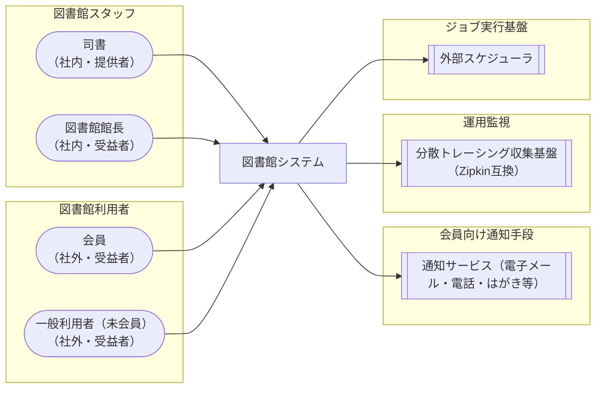

<!-- generateRdraMd.js による自動生成ファイル。手動編集しないこと。元データ: docs/rdra/latest/*.tsv -->

# システムコンテキスト

RDRA システム価値レイヤー。システムに関わるアクターと外部システムの全体像。

> 凡例: `(丸角)` アクター / `[四角]` システム / `[[二重枠]]` 外部システム

## アクター

| アクター群 | アクター | 役割 | 社内外 | 立場 | 主担当業務 |
|---|---|---|---|---|---|
| 図書館スタッフ | 司書 | カウンターで貸出可否判定・貸出登録・返却登録・貸出延長・予約受付代行（予約可否判定）・取置の準備/受け渡し/期限切れ処理・予約取消と在庫なし連絡・督促通知・利用停止登録・会員登録・蔵書の注文/登録を行い、会員へ図書館サービスを提供する | 社内 | 提供者 |  |
| 図書館スタッフ | 図書館館長 | 毎月末日に貸出期限切れを確認して遅滞者を把握し、返却期日から60日以上経過した遅滞者への督促業務を統括する | 社内 | 受益者 | 延滞管理業務 |
| 図書館利用者 | 会員 | 図書館カードを持つ利用者。資料の貸出・返却・貸出延長を受け、所蔵品目をキーワード検索して貸出予約を行い、準備完了・在庫なしの連絡を受けて取置資料を受け取る。会員種別（中学生以上/小学生以下）で貸出制限が異なる | 社外 | 受益者 |  |
| 図書館利用者 | 一般利用者（未会員） | 市内在住・在学を条件に図書館カードの作成を申し込み、会員登録（カード発行）を受ける市民 | 社外 | 受益者 |  |

## 外部システム

| 外部システム群 | 外部システム | 役割 |
|---|---|---|
| 会員向け通知手段 | 通知サービス（電子メール・電話・はがき等） | 取置準備完了時の「予約いただいた本が準備できました」（取置期限つき）連絡、予約取消時の「在庫がありませんでした」連絡、および督促通知を会員へ配信する。現行実装はログ出力のスタブであり実配信チャネルとは未連携 |
| 運用監視 | 分散トレーシング収集基盤（Zipkin互換） | アプリケーションの分散トレース（OpenTelemetryブリッジ+Zipkinエクスポーター）を収集し、稼働状態の監視を支援する。デフォルト無効で稼働環境の構成により有効化される |
| ジョブ実行基盤 | 外部スケジューラ | 貸出期限切れチェックAPI（GET /expired）を呼び出し、督促業務（遅滞者の把握と通知）の起点となる。呼び出し元の実体はリポジトリ内に存在せず、タイマー起動との切り分けは要確認 |
