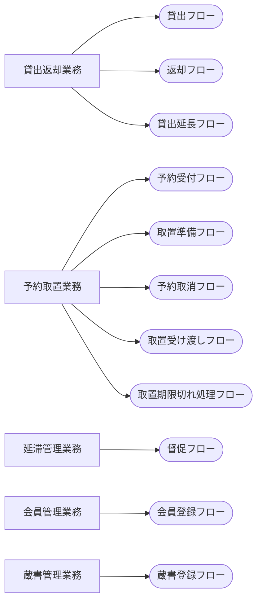

<!-- generateRdraMd.js による自動生成ファイル。手動編集しないこと。元データ: docs/rdra/latest/*.tsv -->

# 業務構成

RDRA システム外部環境レイヤー。業務とビジネスユースケース（BUC）の構成。

> 凡例: `[四角]` 業務 / `(丸角)` BUC

## BUC 一覧

| 業務 | BUC | アクティビティ数 | UC 数 |
|---|---|---|---|
| 貸出返却業務 | 貸出フロー | 5 | 3 |
| 貸出返却業務 | 返却フロー | 3 | 1 |
| 貸出返却業務 | 貸出延長フロー | 2 | 1 |
| 予約取置業務 | 予約受付フロー | 3 | 3 |
| 予約取置業務 | 取置準備フロー | 5 | 3 |
| 予約取置業務 | 予約取消フロー | 3 | 2 |
| 予約取置業務 | 取置受け渡しフロー | 3 | 2 |
| 予約取置業務 | 取置期限切れ処理フロー | 4 | 2 |
| 延滞管理業務 | 督促フロー | 4 | 3 |
| 会員管理業務 | 会員登録フロー | 2 | 1 |
| 蔵書管理業務 | 蔵書登録フロー | 3 | 2 |
