<!-- generateRdraMd.js による自動生成ファイル。手動編集しないこと。元データ: docs/rdra/latest/*.tsv -->

# 業務フロー

RDRA システム外部環境レイヤー。BUC ごとのアクティビティの流れ。
担当（アクター）ごとのレーンに分けて表示する。

## 貸出返却業務

### 貸出フロー

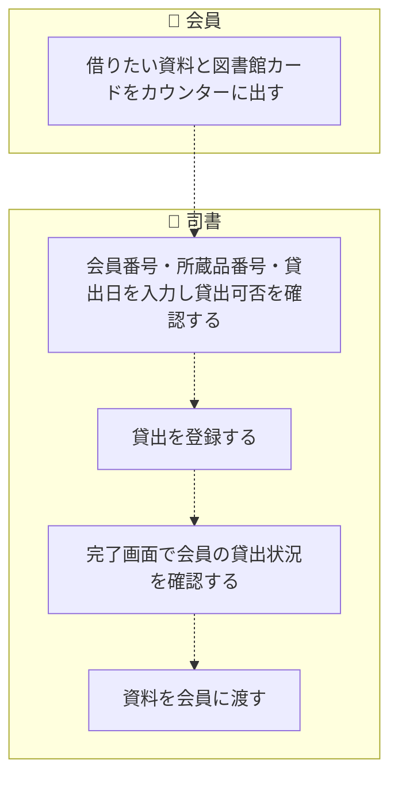

> 点線矢印は TSV の行順にもとづく推定順序（`先`/`次` 未指定のため）。

| アクティビティ | 担当 | UC | 説明 |
|---|---|---|---|
| 借りたい資料と図書館カードをカウンターに出す | 会員 |  | 人手作業。会員が借りたい資料と図書館カードをカウンターの司書に提示する（システム利用なし） |
| 会員番号・所蔵品番号・貸出日を入力し貸出可否を確認する | 司書 | 貸出可否を判定する | 会員番号の有効性、所蔵品の貸出可否（在庫中のみ貸出可能・二重貸出防止）、貸出制限（会員種別ごとの点数制限：中学生以上20点/小学生以下15点・視聴覚資料5点まで、延滞による貸出制限：遅延15日未満は貸出可能/15日以上2ヶ月未満は新規貸出不可/2ヶ月以上は貸出停止）を判定し、違反時は司書にエラーを提示する |
| 貸出を登録する | 司書 | 貸出を登録する | 判定を通過した貸出を登録し、所蔵品状態を在庫中から貸出中に遷移させる。貸出期限日は貸出日から当日を含めて15日 |
| 完了画面で会員の貸出状況を確認する | 司書 | 貸出状況を提示する | 貸出登録の完了画面で会員の現在の貸出状況（貸出点数等）を提示し、司書が確認できるようにする |
| 資料を会員に渡す | 司書 |  | 人手作業。貸出登録済みの資料をカウンターで会員に手渡す（システム利用なし） |

### 返却フロー

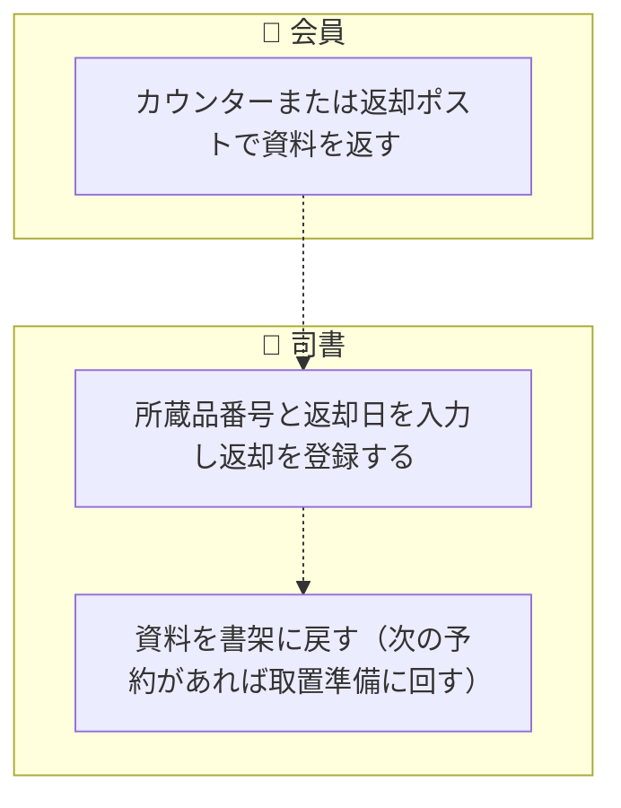

> 点線矢印は TSV の行順にもとづく推定順序（`先`/`次` 未指定のため）。

| アクティビティ | 担当 | UC | 説明 |
|---|---|---|---|
| カウンターまたは返却ポストで資料を返す | 会員 |  | 人手作業。会員がカウンター（閉館時間中は返却ポスト）で資料を返す（システム利用なし） |
| 所蔵品番号と返却日を入力し返却を登録する | 司書 | 返却を登録する | 返却を登録して所蔵品状態を貸出中から在庫中に戻し、資料を再び貸出可能にする。返却に伴い会員と貸出の紐付けを削除して貸出記録を会員から切り離す（個人情報保護） |
| 資料を書架に戻す（次の予約があれば取置準備に回す） | 司書 |  | 人手作業。返却された資料を書架に戻す。次の予約が入っている場合は取置準備フローに回す（システム利用なし） |

### 貸出延長フロー

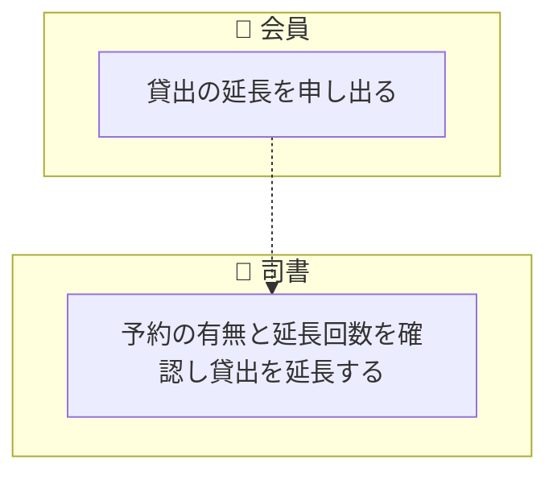

> 点線矢印は TSV の行順にもとづく推定順序（`先`/`次` 未指定のため）。

| アクティビティ | 担当 | UC | 説明 |
|---|---|---|---|
| 貸出の延長を申し出る | 会員 |  | 人手作業。会員が貸出期間の延長を司書に申し出る（システム利用なし） |
| 予約の有無と延長回数を確認し貸出を延長する | 司書 | 貸出を延長する | ほかの人の予約がないことと延長回数（1回まで）を確認し、貸出を15日間延長する。2回目の延長は認めない（as-isでは未実装のUC候補） |

## 予約取置業務

### 予約受付フロー

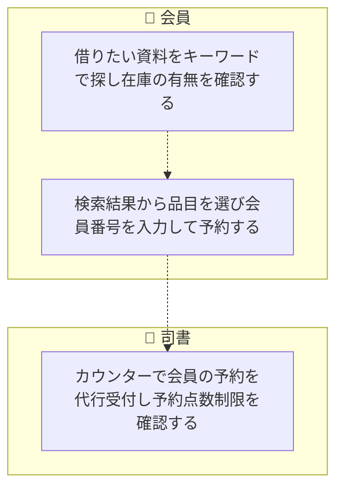

> 点線矢印は TSV の行順にもとづく推定順序（`先`/`次` 未指定のため）。

| アクティビティ | 担当 | UC | 説明 |
|---|---|---|---|
| 借りたい資料をキーワードで探し在庫の有無を確認する | 会員 | 所蔵品目を検索する | 所蔵品目をキーワードで検索し、在庫の有無を含む一覧を確認する |
| 検索結果から品目を選び会員番号を入力して予約する | 会員 | 予約を登録する | 検索結果から選んだ所蔵品目に対して、貸出中・在庫中を問わず貸出予約を登録する。会員番号の有効性を検証し未登録会員はエラーとする。登録により予約状態は未準備となり、同一品目の予約は受付順（待ち順番）で管理される |
| カウンターで会員の予約を代行受付し予約点数制限を確認する | 司書 | 予約可否を判定する | 司書が会員のカウンター代行として予約を受け付ける際、予約点数制限（ひとり15点まで、うち視聴覚資料5点まで）を判定する（as-isでは判定実装はあるが画面フローから未接続） |

### 取置準備フロー

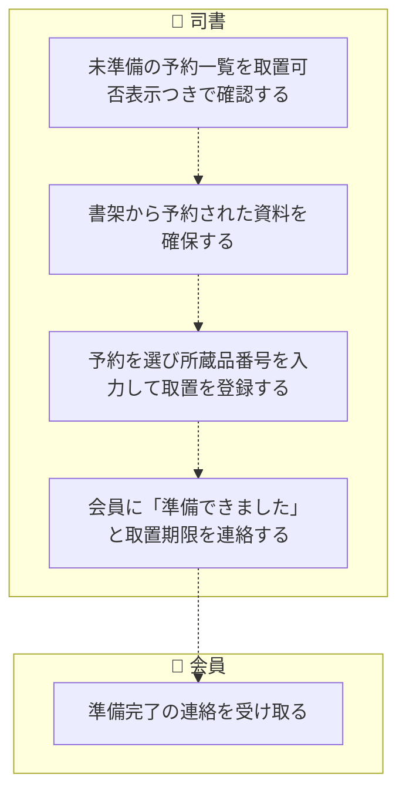

> 点線矢印は TSV の行順にもとづく推定順序（`先`/`次` 未指定のため）。

| アクティビティ | 担当 | UC | 説明 |
|---|---|---|---|
| 未準備の予約一覧を取置可否表示つきで確認する | 司書 | 未準備の予約を一覧する | 予約の管理画面で未準備の予約を、待ち順番と在庫数に基づく取置可否の表示つきで一覧する |
| 書架から予約された資料を確保する | 司書 |  | 人手作業。取置可能な予約について書架から資料の現物を確保する（システム利用なし） |
| 予約を選び所蔵品番号を入力して取置を登録する | 司書 | 取置を登録する | 確保した所蔵品の取置を登録する。所蔵品の登録有無・予約資料との品目一致・在庫状態を検証し違反はエラー提示する。登録により所蔵品状態は在庫中から取置中、予約状態は未準備から消込済、取置状態は準備完了となり、予約記録（会員と予約の紐付け）を消去する（個人情報保護） |
| 会員に「準備できました」と取置期限を連絡する | 司書 | 準備完了を通知する | 取置準備完了時に「予約いただいた本が準備できました」と取置期限を会員に連絡する（連絡手段は窓口・電話・電子メール・はがき等。as-is実装はログ出力のスタブ） |
| 準備完了の連絡を受け取る | 会員 |  | 人手作業。会員が取置準備完了と取置期限の連絡を受け取り、受け取りに行く準備をする（システム利用なし） |

### 予約取消フロー

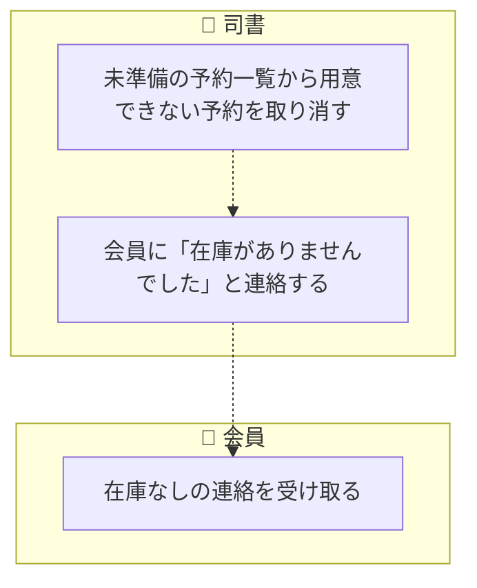

> 点線矢印は TSV の行順にもとづく推定順序（`先`/`次` 未指定のため）。

| アクティビティ | 担当 | UC | 説明 |
|---|---|---|---|
| 未準備の予約一覧から用意できない予約を取り消す | 司書 | 予約を取り消す | 予約の管理画面で用意できない予約をキャンセルし、予約状態を未準備から消込済に遷移させる（取消は予約取消として記録） |
| 会員に「在庫がありませんでした」と連絡する | 司書 | 在庫なしを通知する | 予約取消時に「在庫がありませんでした」を会員に連絡する（連絡手段は窓口・電話・電子メール・はがき等。as-is実装はログ出力のスタブ） |
| 在庫なしの連絡を受け取る | 会員 |  | 人手作業。会員が在庫なしの連絡を受け取る（システム利用なし） |

### 取置受け渡しフロー

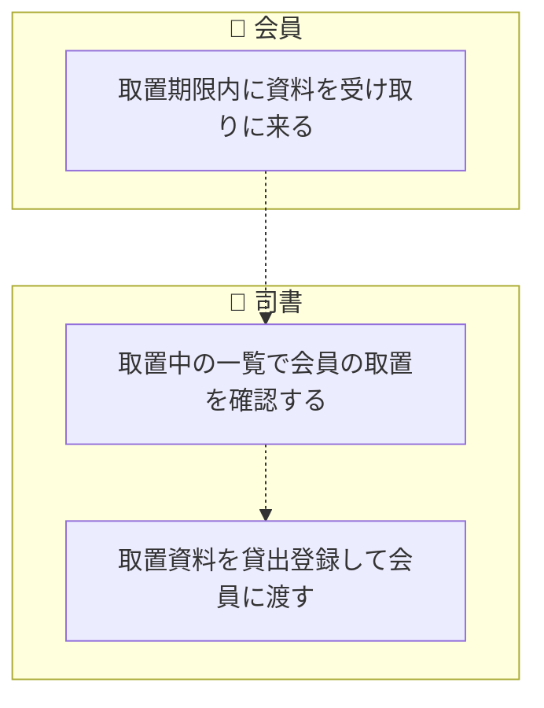

> 点線矢印は TSV の行順にもとづく推定順序（`先`/`次` 未指定のため）。

| アクティビティ | 担当 | UC | 説明 |
|---|---|---|---|
| 取置期限内に資料を受け取りに来る | 会員 |  | 人手作業。会員が取置期限内にカウンターへ資料を受け取りに来る（システム利用なし） |
| 取置中の一覧で会員の取置を確認する | 司書 | 取置中を一覧する | 取置の管理画面で取置中の資料を取置期限つきで一覧し、受け取りに来た会員の取置を確認する |
| 取置資料を貸出登録して会員に渡す | 司書 | 取置を貸し出す | 取置中の資料を会員へ貸出登録して渡す。所蔵品状態は取置中から貸出中、取置状態は準備完了から解放に遷移し、受け渡しに伴い予約記録は消し込まれる（個人情報保護） |

### 取置期限切れ処理フロー

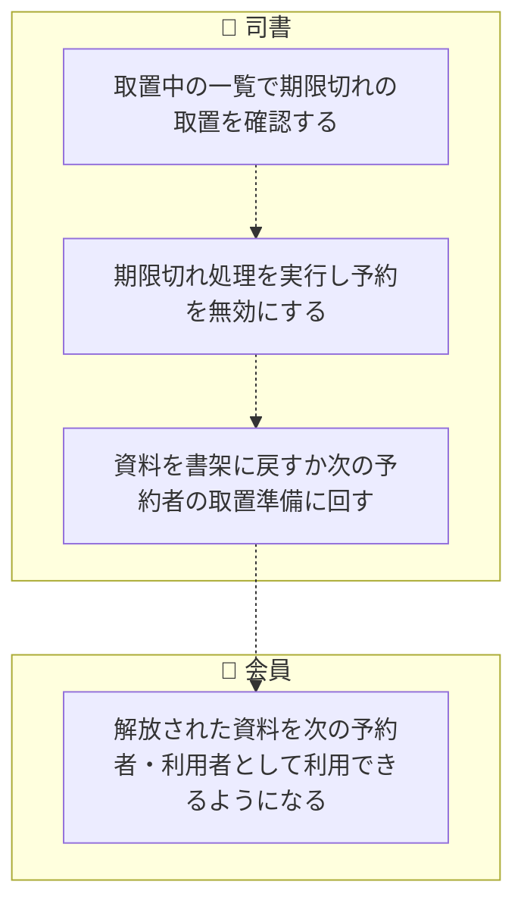

> 点線矢印は TSV の行順にもとづく推定順序（`先`/`次` 未指定のため）。

| アクティビティ | 担当 | UC | 説明 |
|---|---|---|---|
| 取置中の一覧で期限切れの取置を確認する | 司書 | 取置中を一覧する | 取置の管理画面で取置中の資料を一覧し、取置期限（取置日から7日）を過ぎた取置の強調表示を確認する |
| 期限切れ処理を実行し予約を無効にする | 司書 | 取置を期限切れにする | 取置期限を過ぎた取置の期限切れ処理を実行し、取置状態を準備完了から期限切れへ遷移させて予約を無効（解放・消込）にし、所蔵品状態を取置中から在庫中に戻す |
| 資料を書架に戻すか次の予約者の取置準備に回す | 司書 |  | 人手作業。解放された資料を書架に戻す、または次の予約者の取置準備フローに回す（システム利用なし） |
| 解放された資料を次の予約者・利用者として利用できるようになる | 会員 |  | 期限切れ処理によって在庫に戻った資料を、次の待ち順番の予約者やほかの会員が予約・貸出で利用できるようになる（システム利用なし） |

## 延滞管理業務

### 督促フロー

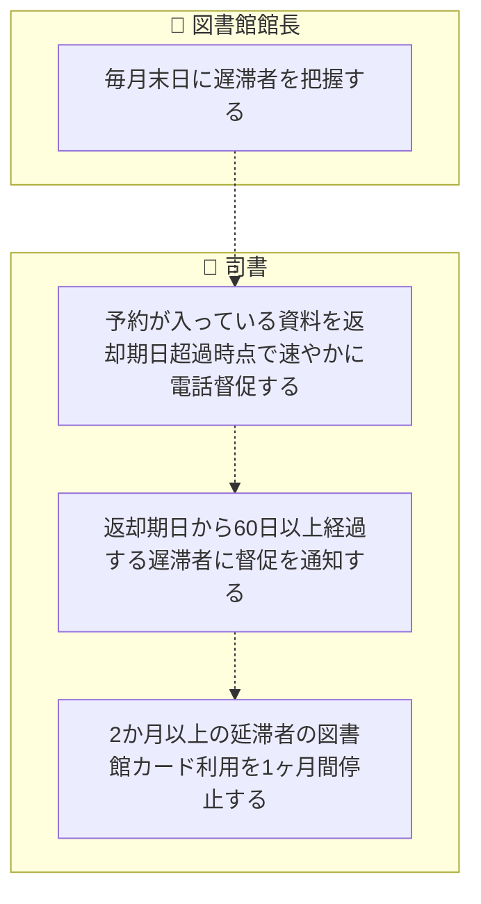

> 点線矢印は TSV の行順にもとづく推定順序（`先`/`次` 未指定のため）。

| アクティビティ | 担当 | UC | 説明 |
|---|---|---|---|
| 毎月末日に遅滞者を把握する | 図書館館長 | 貸出期限切れを確認する | 図書館館長が毎月末日に遅滞者を把握するため、貸出の期限切れを確認する（as-is実装は所蔵品単位の期限切れチェックAPIのみで遅滞者一覧機能は未実装。判定ロジックもスタブの未完成実装） |
| 予約が入っている資料を返却期日超過時点で速やかに電話督促する | 司書 |  | 人手作業。予約が入っている資料は返却期日超過時点で速やかに電話で督促する（督促対象の抽出機能はシステム未実装） |
| 返却期日から60日以上経過する遅滞者に督促を通知する | 司書 | 督促を通知する | 返却期日から60日以上経過する遅滞者へ窓口・電話・電子メール・はがきで督促する。通知内容は図書館カード番号・資料番号・返却期限日のみに限定し、書名・著者名は本人が希望しない限り通知しない（個人情報保護。as-isでは未実装のUC候補） |
| 2か月以上の延滞者の図書館カード利用を1ヶ月間停止する | 司書 | 利用停止を登録する | 2か月以上の延滞者について図書館カードの利用を1ヶ月間停止する（as-isは貸出可否判定に貸出停止区分がある部分実装で、停止期間の管理は未実装） |

## 会員管理業務

### 会員登録フロー

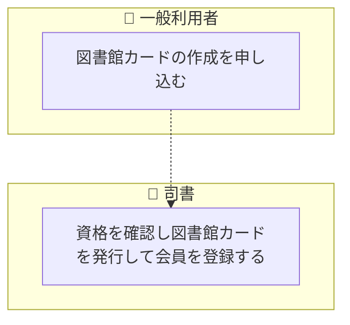

> 点線矢印は TSV の行順にもとづく推定順序（`先`/`次` 未指定のため）。

| アクティビティ | 担当 | UC | 説明 |
|---|---|---|---|
| 図書館カードの作成を申し込む | 一般利用者 |  | 人手作業。はじめて借りる市内在住・在学の一般利用者が図書館カードの作成を申し込む（システム利用なし） |
| 資格を確認し図書館カードを発行して会員を登録する | 司書 | 会員を登録する | 市内在住または市内の学校に在席する資格を確認し、図書館カード（有効期限3年）を発行して会員を登録する。会員状態を未登録から有効に遷移させる（as-isでは未実装のUC候補。会員データの参照のみ実装） |

## 蔵書管理業務

### 蔵書登録フロー

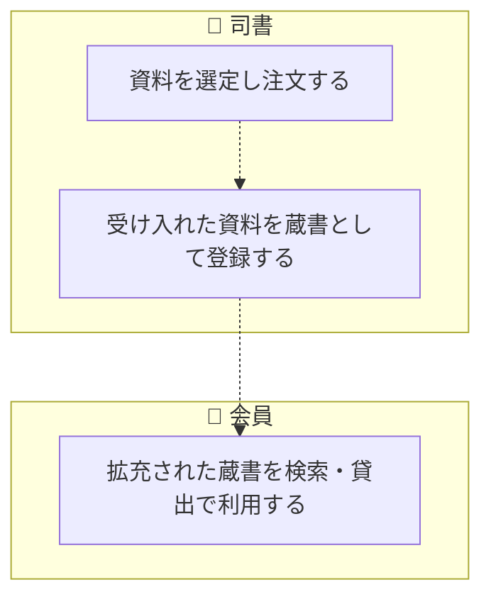

> 点線矢印は TSV の行順にもとづく推定順序（`先`/`次` 未指定のため）。

| アクティビティ | 担当 | UC | 説明 |
|---|---|---|---|
| 資料を選定し注文する | 司書 | 資料を注文する | 司書が蔵書として受け入れる資料を選定し注文する（as-isでは未実装のUC候補） |
| 受け入れた資料を蔵書として登録する | 司書 | 蔵書を登録する | 受け入れた資料を蔵書（所蔵品目・所蔵品）として登録し、所蔵品状態を未登録から在庫中に遷移させる（as-isでは未実装のUC候補。所蔵品目・所蔵品のデータ定義のみ存在） |
| 拡充された蔵書を検索・貸出で利用する | 会員 |  | 蔵書登録によって拡充された資料を、会員が検索・予約・貸出で利用できるようになる（システム利用なし） |
