<!-- generateRdraMd.js による自動生成ファイル。手動編集しないこと。元データ: docs/rdra/latest/*.tsv -->

# UC複合図

RDRA システム境界レイヤー。BUC ごとに、アクティビティ・UC・画面・イベント・
情報・条件・外部システムの関係を表す。

## 貸出返却業務

### 貸出フロー

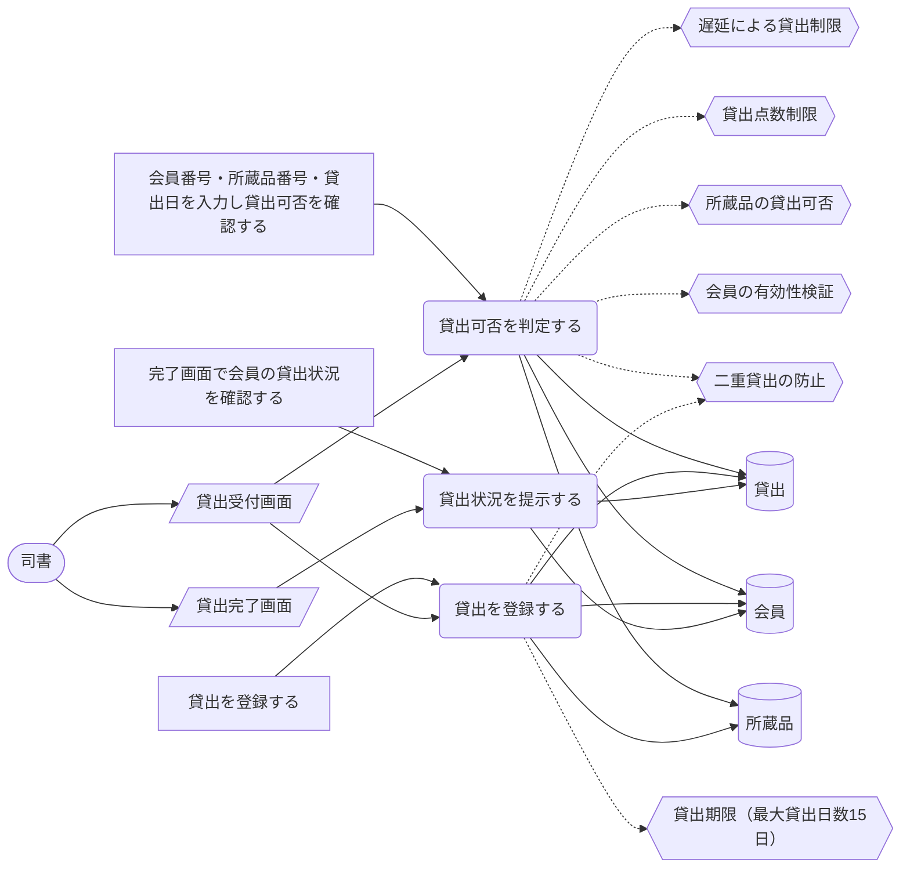

> 凡例: `(丸角)` アクター・UC / `[四角]` アクティビティ / `[/斜め/]` 画面 / `[(円柱)]` 情報 / `{{六角}}` 条件 / `>旗]` イベント / `[[二重枠]]` 外部システム。点線は条件参照。

| UC | アクティビティ | 画面 | 情報 | 条件 | イベント | 説明 |
|---|---|---|---|---|---|---|
| 貸出可否を判定する | 会員番号・所蔵品番号・貸出日を入力し貸出可否を確認する | 貸出受付画面 | 会員、所蔵品、貸出 | 会員の有効性検証、所蔵品の貸出可否、二重貸出の防止、貸出点数制限、遅延による貸出制限 |  | 会員番号の有効性、所蔵品の貸出可否（在庫中のみ貸出可能・二重貸出防止）、貸出制限（会員種別ごとの点数制限：中学生以上20点/小学生以下15点・視聴覚資料5点まで、延滞による貸出制限：遅延15日未満は貸出可能/15日以上2ヶ月未満は新規貸出不可/2ヶ月以上は貸出停止）を判定し、違反時は司書にエラーを提示する |
| 貸出を登録する | 貸出を登録する | 貸出受付画面 | 貸出、所蔵品、会員 | 貸出期限（最大貸出日数15日）、二重貸出の防止 |  | 判定を通過した貸出を登録し、所蔵品状態を在庫中から貸出中に遷移させる。貸出期限日は貸出日から当日を含めて15日 |
| 貸出状況を提示する | 完了画面で会員の貸出状況を確認する | 貸出完了画面 | 会員、貸出 |  |  | 貸出登録の完了画面で会員の現在の貸出状況（貸出点数等）を提示し、司書が確認できるようにする |

### 返却フロー

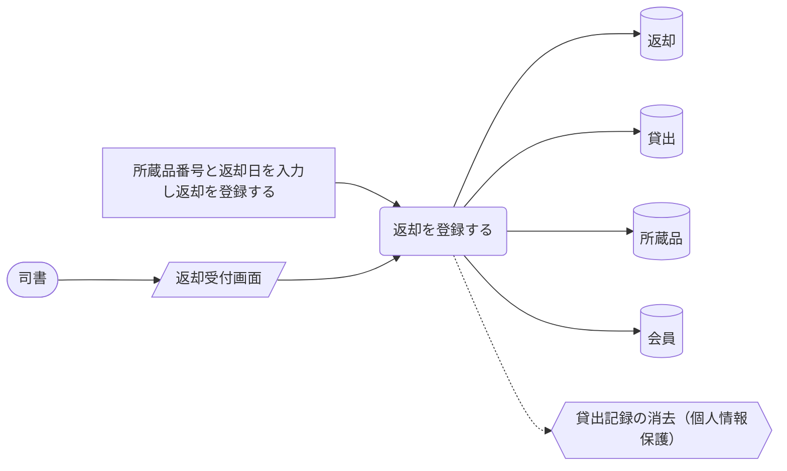

> 凡例: `(丸角)` アクター・UC / `[四角]` アクティビティ / `[/斜め/]` 画面 / `[(円柱)]` 情報 / `{{六角}}` 条件 / `>旗]` イベント / `[[二重枠]]` 外部システム。点線は条件参照。

| UC | アクティビティ | 画面 | 情報 | 条件 | イベント | 説明 |
|---|---|---|---|---|---|---|
| 返却を登録する | 所蔵品番号と返却日を入力し返却を登録する | 返却受付画面 | 返却、貸出、所蔵品、会員 | 貸出記録の消去（個人情報保護） |  | 返却を登録して所蔵品状態を貸出中から在庫中に戻し、資料を再び貸出可能にする。返却に伴い会員と貸出の紐付けを削除して貸出記録を会員から切り離す（個人情報保護） |

### 貸出延長フロー

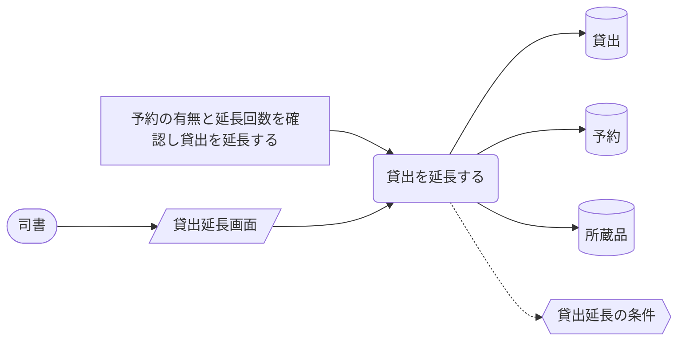

> 凡例: `(丸角)` アクター・UC / `[四角]` アクティビティ / `[/斜め/]` 画面 / `[(円柱)]` 情報 / `{{六角}}` 条件 / `>旗]` イベント / `[[二重枠]]` 外部システム。点線は条件参照。

| UC | アクティビティ | 画面 | 情報 | 条件 | イベント | 説明 |
|---|---|---|---|---|---|---|
| 貸出を延長する | 予約の有無と延長回数を確認し貸出を延長する | 貸出延長画面 | 貸出、予約、所蔵品 | 貸出延長の条件 |  | ほかの人の予約がないことと延長回数（1回まで）を確認し、貸出を15日間延長する。2回目の延長は認めない（as-isでは未実装のUC候補） |

## 予約取置業務

### 予約受付フロー

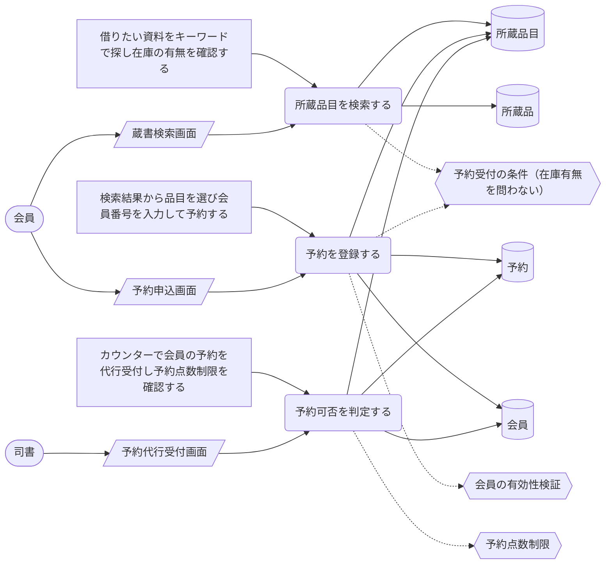

> 凡例: `(丸角)` アクター・UC / `[四角]` アクティビティ / `[/斜め/]` 画面 / `[(円柱)]` 情報 / `{{六角}}` 条件 / `>旗]` イベント / `[[二重枠]]` 外部システム。点線は条件参照。

| UC | アクティビティ | 画面 | 情報 | 条件 | イベント | 説明 |
|---|---|---|---|---|---|---|
| 所蔵品目を検索する | 借りたい資料をキーワードで探し在庫の有無を確認する | 蔵書検索画面 | 所蔵品目、所蔵品 | 予約受付の条件（在庫有無を問わない） |  | 所蔵品目をキーワードで検索し、在庫の有無を含む一覧を確認する |
| 予約を登録する | 検索結果から品目を選び会員番号を入力して予約する | 予約申込画面 | 予約、会員、所蔵品目 | 会員の有効性検証、予約受付の条件（在庫有無を問わない） |  | 検索結果から選んだ所蔵品目に対して、貸出中・在庫中を問わず貸出予約を登録する。会員番号の有効性を検証し未登録会員はエラーとする。登録により予約状態は未準備となり、同一品目の予約は受付順（待ち順番）で管理される |
| 予約可否を判定する | カウンターで会員の予約を代行受付し予約点数制限を確認する | 予約代行受付画面 | 予約、会員、所蔵品目 | 予約点数制限 |  | 司書が会員のカウンター代行として予約を受け付ける際、予約点数制限（ひとり15点まで、うち視聴覚資料5点まで）を判定する（as-isでは判定実装はあるが画面フローから未接続） |

### 取置準備フロー

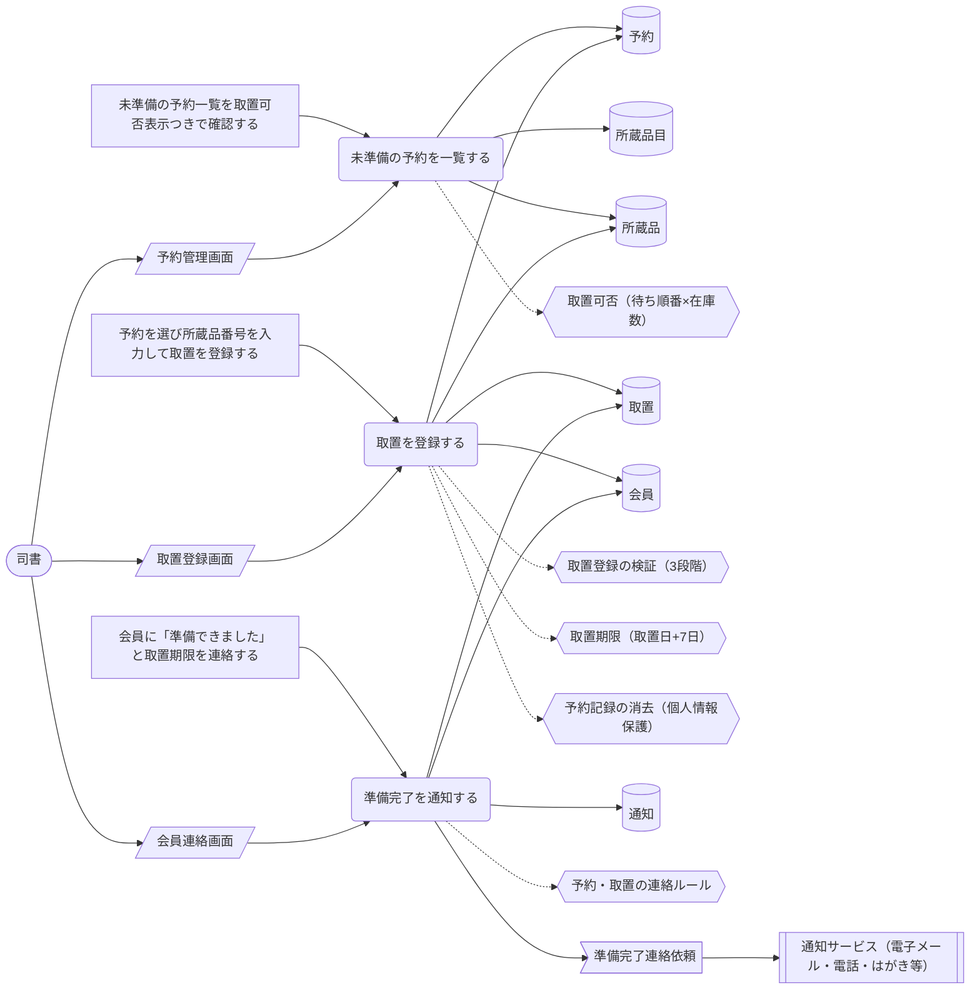

> 凡例: `(丸角)` アクター・UC / `[四角]` アクティビティ / `[/斜め/]` 画面 / `[(円柱)]` 情報 / `{{六角}}` 条件 / `>旗]` イベント / `[[二重枠]]` 外部システム。点線は条件参照。

| UC | アクティビティ | 画面 | 情報 | 条件 | イベント | 説明 |
|---|---|---|---|---|---|---|
| 未準備の予約を一覧する | 未準備の予約一覧を取置可否表示つきで確認する | 予約管理画面 | 予約、所蔵品目、所蔵品 | 取置可否（待ち順番×在庫数） |  | 予約の管理画面で未準備の予約を、待ち順番と在庫数に基づく取置可否の表示つきで一覧する |
| 取置を登録する | 予約を選び所蔵品番号を入力して取置を登録する | 取置登録画面 | 取置、予約、所蔵品、会員 | 取置登録の検証（3段階）、取置期限（取置日+7日）、予約記録の消去（個人情報保護） |  | 確保した所蔵品の取置を登録する。所蔵品の登録有無・予約資料との品目一致・在庫状態を検証し違反はエラー提示する。登録により所蔵品状態は在庫中から取置中、予約状態は未準備から消込済、取置状態は準備完了となり、予約記録（会員と予約の紐付け）を消去する（個人情報保護） |
| 準備完了を通知する | 会員に「準備できました」と取置期限を連絡する | 会員連絡画面 | 通知、会員、取置 | 予約・取置の連絡ルール | 準備完了連絡依頼 | 取置準備完了時に「予約いただいた本が準備できました」と取置期限を会員に連絡する（連絡手段は窓口・電話・電子メール・はがき等。as-is実装はログ出力のスタブ） |

### 予約取消フロー

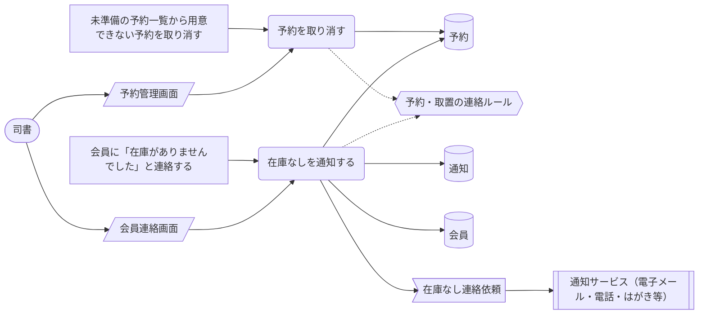

> 凡例: `(丸角)` アクター・UC / `[四角]` アクティビティ / `[/斜め/]` 画面 / `[(円柱)]` 情報 / `{{六角}}` 条件 / `>旗]` イベント / `[[二重枠]]` 外部システム。点線は条件参照。

| UC | アクティビティ | 画面 | 情報 | 条件 | イベント | 説明 |
|---|---|---|---|---|---|---|
| 予約を取り消す | 未準備の予約一覧から用意できない予約を取り消す | 予約管理画面 | 予約 | 予約・取置の連絡ルール |  | 予約の管理画面で用意できない予約をキャンセルし、予約状態を未準備から消込済に遷移させる（取消は予約取消として記録） |
| 在庫なしを通知する | 会員に「在庫がありませんでした」と連絡する | 会員連絡画面 | 通知、会員、予約 | 予約・取置の連絡ルール | 在庫なし連絡依頼 | 予約取消時に「在庫がありませんでした」を会員に連絡する（連絡手段は窓口・電話・電子メール・はがき等。as-is実装はログ出力のスタブ） |

### 取置受け渡しフロー

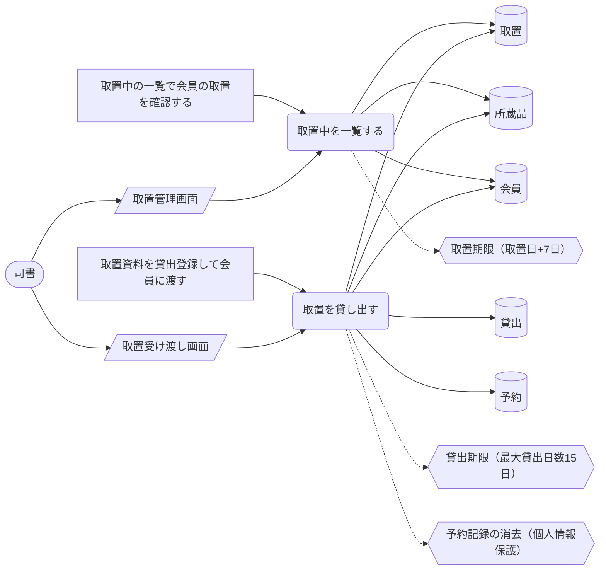

> 凡例: `(丸角)` アクター・UC / `[四角]` アクティビティ / `[/斜め/]` 画面 / `[(円柱)]` 情報 / `{{六角}}` 条件 / `>旗]` イベント / `[[二重枠]]` 外部システム。点線は条件参照。

| UC | アクティビティ | 画面 | 情報 | 条件 | イベント | 説明 |
|---|---|---|---|---|---|---|
| 取置中を一覧する | 取置中の一覧で会員の取置を確認する | 取置管理画面 | 取置、所蔵品、会員 | 取置期限（取置日+7日） |  | 取置の管理画面で取置中の資料を取置期限つきで一覧し、受け取りに来た会員の取置を確認する |
| 取置を貸し出す | 取置資料を貸出登録して会員に渡す | 取置受け渡し画面 | 取置、貸出、所蔵品、会員、予約 | 貸出期限（最大貸出日数15日）、予約記録の消去（個人情報保護） |  | 取置中の資料を会員へ貸出登録して渡す。所蔵品状態は取置中から貸出中、取置状態は準備完了から解放に遷移し、受け渡しに伴い予約記録は消し込まれる（個人情報保護） |

### 取置期限切れ処理フロー

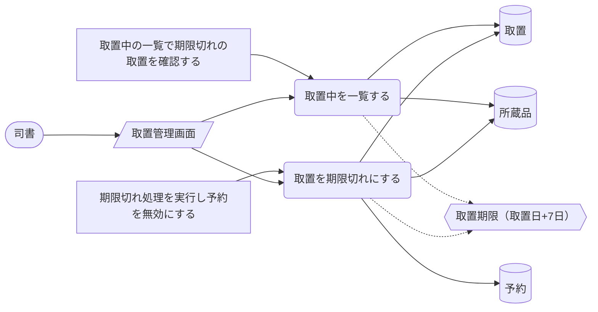

> 凡例: `(丸角)` アクター・UC / `[四角]` アクティビティ / `[/斜め/]` 画面 / `[(円柱)]` 情報 / `{{六角}}` 条件 / `>旗]` イベント / `[[二重枠]]` 外部システム。点線は条件参照。

| UC | アクティビティ | 画面 | 情報 | 条件 | イベント | 説明 |
|---|---|---|---|---|---|---|
| 取置中を一覧する | 取置中の一覧で期限切れの取置を確認する | 取置管理画面 | 取置、所蔵品 | 取置期限（取置日+7日） |  | 取置の管理画面で取置中の資料を一覧し、取置期限（取置日から7日）を過ぎた取置の強調表示を確認する |
| 取置を期限切れにする | 期限切れ処理を実行し予約を無効にする | 取置管理画面 | 取置、予約、所蔵品 | 取置期限（取置日+7日） |  | 取置期限を過ぎた取置の期限切れ処理を実行し、取置状態を準備完了から期限切れへ遷移させて予約を無効（解放・消込）にし、所蔵品状態を取置中から在庫中に戻す |

## 延滞管理業務

### 督促フロー

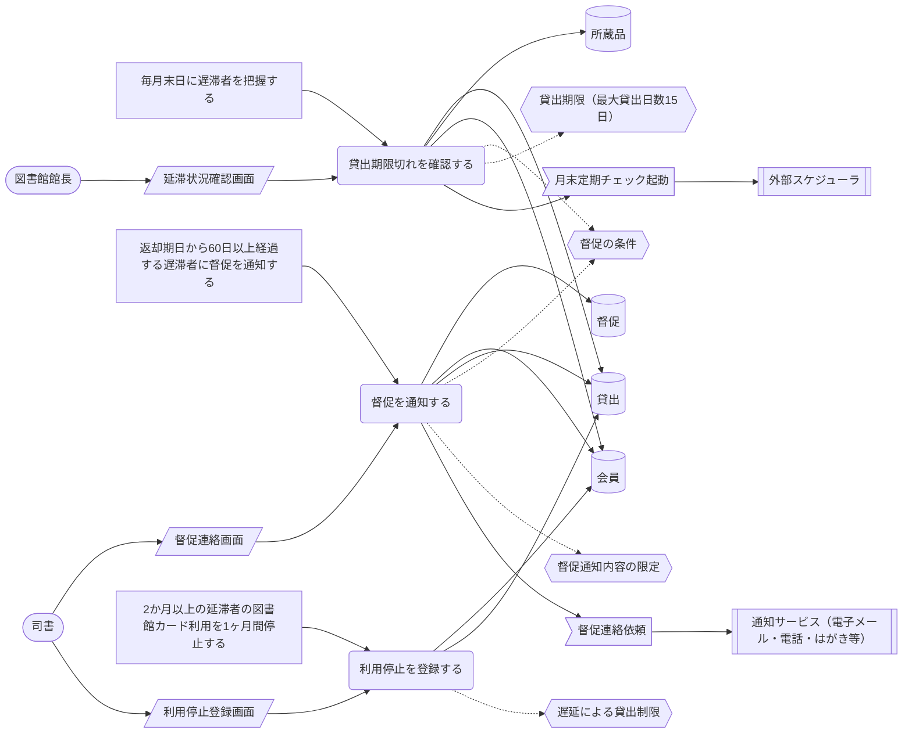

> 凡例: `(丸角)` アクター・UC / `[四角]` アクティビティ / `[/斜め/]` 画面 / `[(円柱)]` 情報 / `{{六角}}` 条件 / `>旗]` イベント / `[[二重枠]]` 外部システム。点線は条件参照。

| UC | アクティビティ | 画面 | 情報 | 条件 | イベント | 説明 |
|---|---|---|---|---|---|---|
| 貸出期限切れを確認する | 毎月末日に遅滞者を把握する | 延滞状況確認画面 | 貸出、所蔵品、会員 | 督促の条件、貸出期限（最大貸出日数15日） | 月末定期チェック起動 | 図書館館長が毎月末日に遅滞者を把握するため、貸出の期限切れを確認する（as-is実装は所蔵品単位の期限切れチェックAPIのみで遅滞者一覧機能は未実装。判定ロジックもスタブの未完成実装） |
| 督促を通知する | 返却期日から60日以上経過する遅滞者に督促を通知する | 督促連絡画面 | 督促、会員、貸出 | 督促の条件、督促通知内容の限定 | 督促連絡依頼 | 返却期日から60日以上経過する遅滞者へ窓口・電話・電子メール・はがきで督促する。通知内容は図書館カード番号・資料番号・返却期限日のみに限定し、書名・著者名は本人が希望しない限り通知しない（個人情報保護。as-isでは未実装のUC候補） |
| 利用停止を登録する | 2か月以上の延滞者の図書館カード利用を1ヶ月間停止する | 利用停止登録画面 | 会員、貸出 | 遅延による貸出制限 |  | 2か月以上の延滞者について図書館カードの利用を1ヶ月間停止する（as-isは貸出可否判定に貸出停止区分がある部分実装で、停止期間の管理は未実装） |

## 会員管理業務

### 会員登録フロー

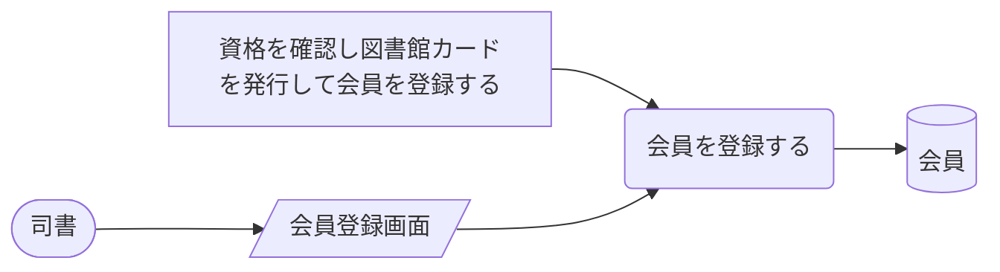

> 凡例: `(丸角)` アクター・UC / `[四角]` アクティビティ / `[/斜め/]` 画面 / `[(円柱)]` 情報 / `{{六角}}` 条件 / `>旗]` イベント / `[[二重枠]]` 外部システム。点線は条件参照。

| UC | アクティビティ | 画面 | 情報 | 条件 | イベント | 説明 |
|---|---|---|---|---|---|---|
| 会員を登録する | 資格を確認し図書館カードを発行して会員を登録する | 会員登録画面 | 会員 |  |  | 市内在住または市内の学校に在席する資格を確認し、図書館カード（有効期限3年）を発行して会員を登録する。会員状態を未登録から有効に遷移させる（as-isでは未実装のUC候補。会員データの参照のみ実装） |

## 蔵書管理業務

### 蔵書登録フロー

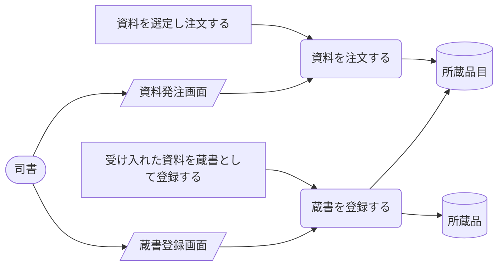

> 凡例: `(丸角)` アクター・UC / `[四角]` アクティビティ / `[/斜め/]` 画面 / `[(円柱)]` 情報 / `{{六角}}` 条件 / `>旗]` イベント / `[[二重枠]]` 外部システム。点線は条件参照。

| UC | アクティビティ | 画面 | 情報 | 条件 | イベント | 説明 |
|---|---|---|---|---|---|---|
| 資料を注文する | 資料を選定し注文する | 資料発注画面 | 所蔵品目 |  |  | 司書が蔵書として受け入れる資料を選定し注文する（as-isでは未実装のUC候補） |
| 蔵書を登録する | 受け入れた資料を蔵書として登録する | 蔵書登録画面 | 所蔵品目、所蔵品 |  |  | 受け入れた資料を蔵書（所蔵品目・所蔵品）として登録し、所蔵品状態を未登録から在庫中に遷移させる（as-isでは未実装のUC候補。所蔵品目・所蔵品のデータ定義のみ存在） |
