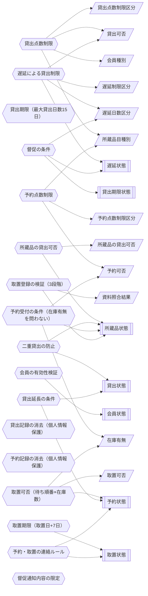

<!-- generateRdraMd.js による自動生成ファイル。手動編集しないこと。元データ: docs/rdra/latest/*.tsv -->

# 条件・バリエーション

RDRA システム内部レイヤー。判断条件（ビジネスルール）と区分・種別の一覧。

## 条件（ビジネスルール）

> 凡例: `{{六角}}` 条件 / `[[二重枠]]` 状態モデル / `[/斜め/]` バリエーション

| コンテキスト | 条件 | 条件の説明 | バリエーション | 状態モデル |
|---|---|---|---|---|
| 貸出管理 | 貸出点数制限 | 会員種別ごとに貸出上限を適用する。中学生以上は20点まで、小学生以下は15点まで、いずれも視聴覚資料は5点まで。借りたい所蔵品を加えた点数が上限を超える場合は「冊数制限により貸出不可」「視聴覚資料貸出不可」と判定する。貸出登録時の貸出可否判定で使用し、限られた蔵書を多くの利用者に行き渡らせるため、上限超過の貸出をエラーとして司書に提示し窓口で断れるようにする | 会員種別、所蔵品目種別、貸出点数制限区分、貸出可否 |  |
| 貸出管理 | 遅延による貸出制限 | 会員の未返却貸出のうち最大の遅延期間で判定する。遅延15日未満は貸出可能、15日以上2ヶ月未満は新規貸出不可、2ヶ月以上は図書館カードの利用を一定期間（1ヶ月）停止（貸出一定期間停止）とする。貸出登録時の貸出可否判定で点数制限より優先して使用し、返却遅延の抑止と公平な利用機会の確保のため、延滞の程度に応じた段階的な罰則を適用する | 遅延日数区分、遅延制限区分、貸出可否 | 遅延状態 |
| 貸出管理 | 貸出期限（最大貸出日数15日） | 貸出期限日は貸出日から当日を含めて15日（貸出日+15日−1日）とする。期限日を過ぎた未返却貸出は延滞として扱い、期限日と判定日の差を遅延日数とする。貸出登録時の期限日算定、遅延日数の導出、延滞判定の起点として使用し、資料の回転を確保し、遅延による貸出制限や督促の判断基準となる |  |  |
| 資料管理 | 所蔵品の貸出可否 | 所蔵品状態が在庫中のときのみ貸出可能とする。貸出中・予約中・その他の状態は理由つき（貸出中により貸出不可能等）で貸出不可と判定する。貸出登録前の検証で使用し、資料の状態と記録の整合性を保ち、貸出できない所蔵品への誤登録を防いで理由を司書に提示する | 所蔵品の貸出可否 | 所蔵品状態 |
| 会員管理 | 会員の有効性検証 | 貸出・予約の登録前に会員番号の有効性を検証する。会員台帳に存在しない未登録の会員番号はエラーとする。貸出登録・予約登録の受付時に使用し、図書館サービスを図書館カードを持つ会員に限定する会員制ポリシーを担保する |  | 会員状態 |
| 貸出管理 | 二重貸出の防止 | 未返却の貸出が存在する所蔵品に対する新たな貸出登録は拒否する。貸出登録の実行時に使用し、同一の所蔵品が同時に複数の会員へ貸し出されるデータ不整合を防ぐ整合性ガードとなる |  | 貸出状態、所蔵品状態 |
| 予約管理 | 予約点数制限 | 予約はひとり15点まで、うち視聴覚資料は5点までとする（会員種別に依らず一律）。上限を超える場合は「冊数制限により予約不可」「視聴覚資料予約不可」と判定する。予約登録時の予約可否判定で使用し、予約の独占を防ぎ公平な利用機会を確保する（現行実装では判定ロジックが画面フローに未接続であり、to-be では接続が必要） | 所蔵品目種別、予約点数制限区分、予約可否 |  |
| 予約管理 | 予約受付の条件（在庫有無を問わない） | 予約は所蔵品目単位で受け付け、対象資料が在庫中でも貸出中でも登録できる。検索結果には貸出可能な所蔵品の件数から導出した在庫有無（〇/×）を表示する。予約受付の検索・登録時に使用し、貸出中資料への需要に応え利用機会を広げるとともに、会員が在庫状況を確認したうえで予約できるようにする | 在庫有無、予約可否 | 所蔵品状態 |
| 予約管理 | 取置可否（待ち順番×在庫数） | 在庫数から自身より前の未準備予約の人数を差し引いた値が正（在庫数−待ち人数>0）なら取置可能とする。待ち順番は同一所蔵品目の未準備予約を予約受付順（予約番号昇順）で数えた順位とする。取置準備で未準備の予約一覧を確認する際に使用し、予約を先着順で公平に処理し、司書が取り置くべき予約を判断できるようにする | 取置可否、在庫有無 | 予約状態 |
| 取置管理 | 取置登録の検証（3段階） | 取置登録時に (1) 所蔵品が未登録でないこと、(2) 予約された資料と確保した所蔵品の品目が一致すること、(3) 所蔵品状態が在庫中であることを順に検証し、違反はエラーとして提示する。取置登録の受付時に使用し、資料の状態と記録の整合性を厳格に保ち、予約と異なる資料の取置や在庫中でない資料の取置を防ぐ | 資料照合結果 | 所蔵品状態 |
| 取置管理 | 取置期限（取置日+7日） | 取置期限日は取置日+7日（暦日）とし、期限日を過ぎた取置は期限切れとして解放対象とする。なお業務仕様書上は「連絡をした日の翌日から7開館日（休館日=毎週月曜・年末年始を除く）」であり、実装との不一致がある（as-is は暦日+7日を正とする）。取置中一覧での期限切れ強調表示と、取置期限切れ処理の対象判定に使用し、取り置いた資料の滞留を防ぎ、次の予約者や書架へ速やかに戻す |  | 取置状態 |
| 貸出管理 | 貸出記録の消去（個人情報保護） | 返却登録時に会員と貸出の紐付けを削除し、貸出記録を会員から切り離す。所蔵品番号・日付のみの匿名イベント履歴は残す。返却登録時に使用し、利用者の読書事実に関する個人情報を保護するため、貸出・予約の記録を必要最小限の期間のみ保持するポリシーを実現する |  |  |
| 予約管理 | 予約記録の消去（個人情報保護） | 取置登録時に会員と予約の紐付けを削除し、予約記録を会員から切り離す。予約の匿名イベント履歴は残す。取置登録時に使用し、貸出記録の消去と同じく、個人情報を必要最小限の期間のみ保持するポリシーを実現する |  |  |
| 貸出管理 | 貸出延長の条件 | ほかの会員の予約が入っていない資料に限り、1回（15日間）まで貸出を延長できる。2回目の延長は認めない。貸出延長の受付時に使用し、次の利用希望者を待たせないための業務ルール（現行システムでは未実装の BUC 候補） |  | 貸出状態、予約状態 |
| 通知管理 | 予約・取置の連絡ルール | 取置が準備できた際は取置期限とあわせて会員へ「予約いただいた本が準備できました」と連絡し、資料を用意できない場合は予約を取り消して「在庫がありませんでした」と連絡する。連絡手段は窓口・電話・電子メール・はがき等とする。取置登録時・予約取消時に使用し、予約資料の確実な受け渡しのため会員へ速やかに状況を連絡する（現行実装はログ出力スタブで実配信チャネル未連携） |  | 取置状態、予約状態 |
| 貸出管理 | 督促の条件 | 図書館館長は毎月末日に遅滞者を把握し、返却期日から60日以上経過する遅滞者に窓口・電話・電子メール・はがき等で督促する。予約が入っている資料は返却期日超過時点で速やかに電話で督促する。督促（遅滞者の把握と通知）業務で使用し、貸出資料の確実な回収を実現する（現行実装は所蔵品単位の期限切れチェック API のみの部分実装） | 遅延日数区分 | 遅延状態、貸出期限状態 |
| 貸出管理 | 督促通知内容の限定 | 督促通知には図書館カード番号・資料番号・返却期限日のみを記載し、書名・著者名は本人が希望しない限り通知しない。督促通知の作成・送付時に使用し、督促の場面でも利用者の読書事実に関する個人情報保護を徹底する |  |  |

## バリエーション

| コンテキスト | バリエーション | 値 | 説明 |
|---|---|---|---|
| 会員管理 | 会員種別 | 中学生以上、小学生以下 | 会員を年齢層で区分する。会員種別によって貸出点数の上限（中学生以上は20点まで、小学生以下は15点まで）が異なるため、貸出可否判定の軸として管理する |
| 資料管理 | 所蔵品目種別 | 図書、視聴覚資料 | 所蔵品目を図書と視聴覚資料（DVD/CD等）に分類する。種別によって貸出・予約できる点数の上限（視聴覚資料はうち5点まで）が異なるため、貸出・予約の制限判定の軸として管理する |
| 貸出管理 | 貸出点数制限区分 | 貸出15点・視聴覚資料5点まで、貸出20点・視聴覚資料5点まで | 会員種別ごとの貸出上限のセットを区分する。会員種別と組み合わせて貸出点数制限のルール（表条件）を表現するために管理する |
| 貸出管理 | 遅延日数区分 | 遅延日数15日未満、遅延日数15日以上2ヶ月未満、遅延日数2ヶ月以上 | 会員の未返却貸出のうち最大の遅延期間を段階に区分する。延滞の罰則（新規貸出不可・貸出停止）を段階的に適用するための遅延による貸出制限の軸として管理する |
| 貸出管理 | 遅延制限区分 | 貸出可能、新規貸出不可、貸出停止 | 遅延日数区分に応じた貸出制限の内容を区分する。延滞者への貸出サービス制限（15日未満=貸出可能、15日以上2ヶ月未満=新規貸出不可、2ヶ月以上=貸出停止）を運用するために管理する |
| 貸出管理 | 貸出可否 | 貸出可能、冊数制限により貸出不可、視聴覚資料貸出不可、新規貸出不可、貸出一定期間停止 | 貸出可否判定の最終結果を区分する。司書がカウンターで貸出の可否とその理由（エラーメッセージ）を利用者に説明するために管理する |
| 貸出管理 | 所蔵品の貸出可否 | 貸出可能、貸出中により貸出不可能、予約中により貸出不可能、その他の理由で貸出不可能 | 所蔵品（現物）の状態に基づく貸出可否を区分する。所蔵品状態が在庫中のときのみ貸出可能とし、カウンターで所蔵品ごとの貸出可否を理由つきで判断するために管理する |
| 予約管理 | 予約可否 | 予約可能、冊数制限により予約不可、視聴覚資料予約不可、予約一定期間停止 | 予約可否判定の結果を区分する。予約点数制限（ひとり15点まで・うち視聴覚資料5点まで）の適用結果を利用者に提示するために管理する |
| 予約管理 | 予約点数制限区分 | 予約点数まで貸出可、予約停止 | 予約点数制限のルールを表現するための区分。遅延による予約停止（延滞者は図書館カードが必要なサービスを受けられない）を表すために管理する |
| 予約管理 | 取置可否 | 取置可能、取置不可 | 未準備の予約に対する取置の可否を区分する。在庫数と予約の待ち順番（在庫数−自身より前の未準備予約数>0で取置可能）から司書が取置の準備対象を判断するために管理する |
| 資料管理 | 在庫有無 | 在庫あり、在庫なし | 所蔵品目の在庫を区分する。貸出可能な所蔵品の件数から導出し、検索結果や予約一覧で利用者・司書に在庫状況を提示するために管理する |
| 取置管理 | 資料照合結果 | 一致、不一致 | 予約された資料と司書が確保した所蔵品の品目の照合結果を区分する。取置登録時に誤った資料の取置を防ぐために管理する |
