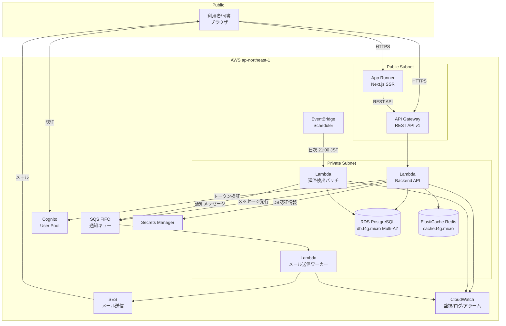
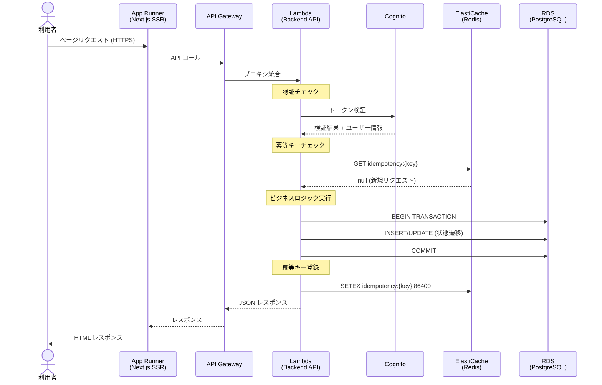
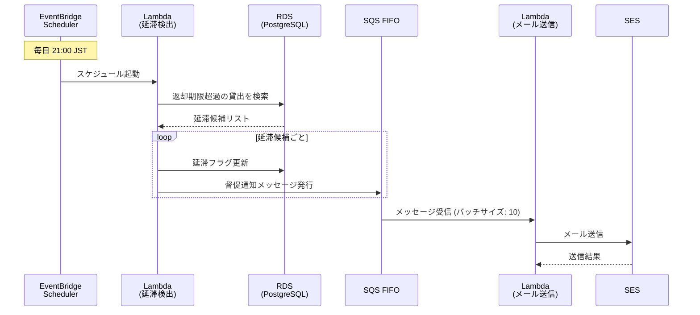
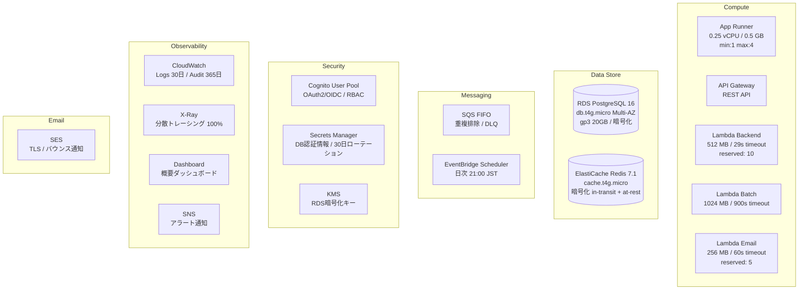

# 図書館蔵書管理システム - AWS インフラアーキテクチャ

## 概要

図書館の蔵書と利用者を一元管理する Web システム。コスト最適化優先の Serverless アーキテクチャを採用し、AWS の従量課金サービスを中心に構成する。

| 項目 | 値 |
|------|-----|
| ワークロードタイプ | Web App (SSR + REST API) |
| 可用性目標 | 99.9% SLA |
| レイテンシ目標 | p99 < 1s |
| コスト方針 | コスト最適化優先 |
| 推定月額コスト | $50-80 |
| 対象クラウド | AWS (ap-northeast-1) |

## ワークロード全体構成図

## リクエストフロー図

## バッチ処理フロー図

## AWS サービス構成図

