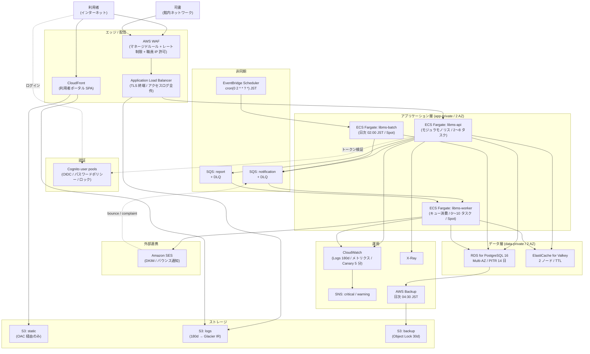
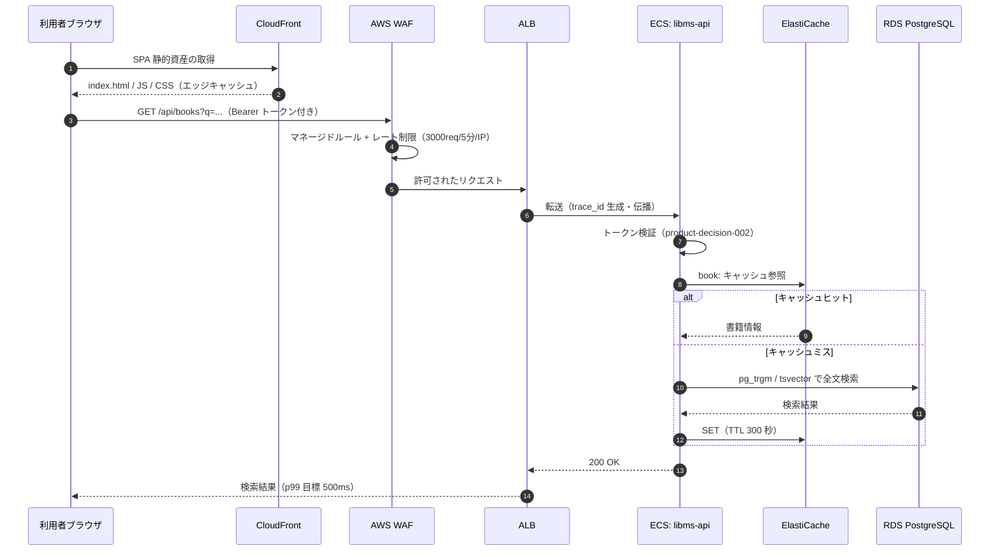
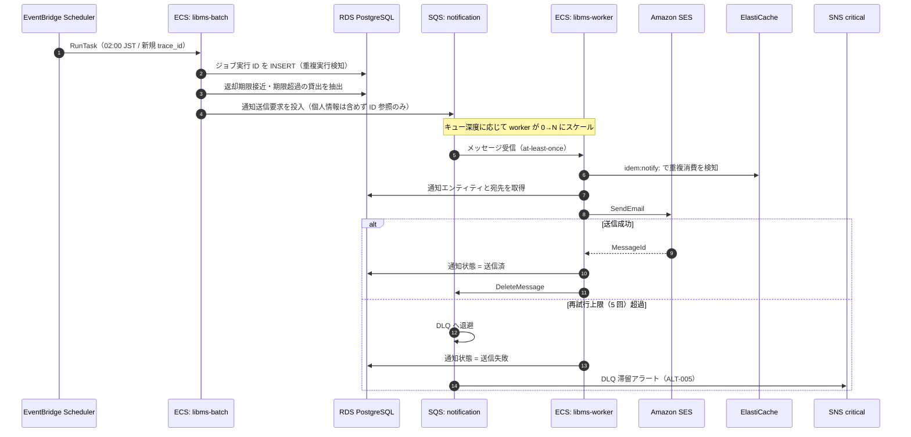
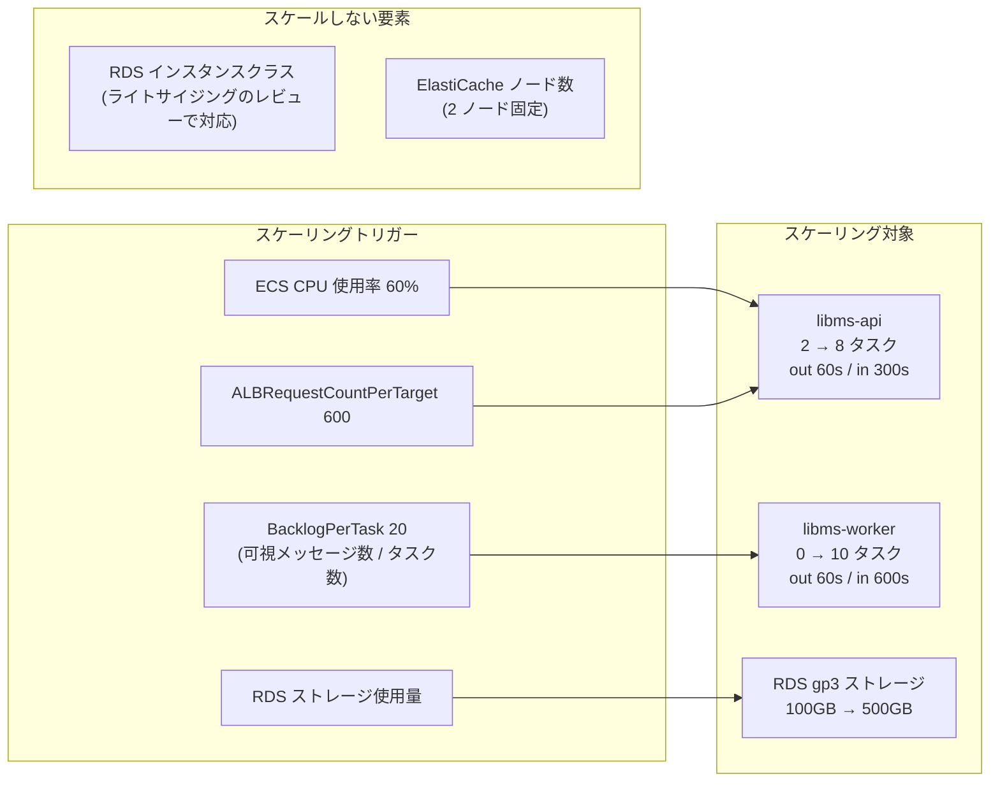
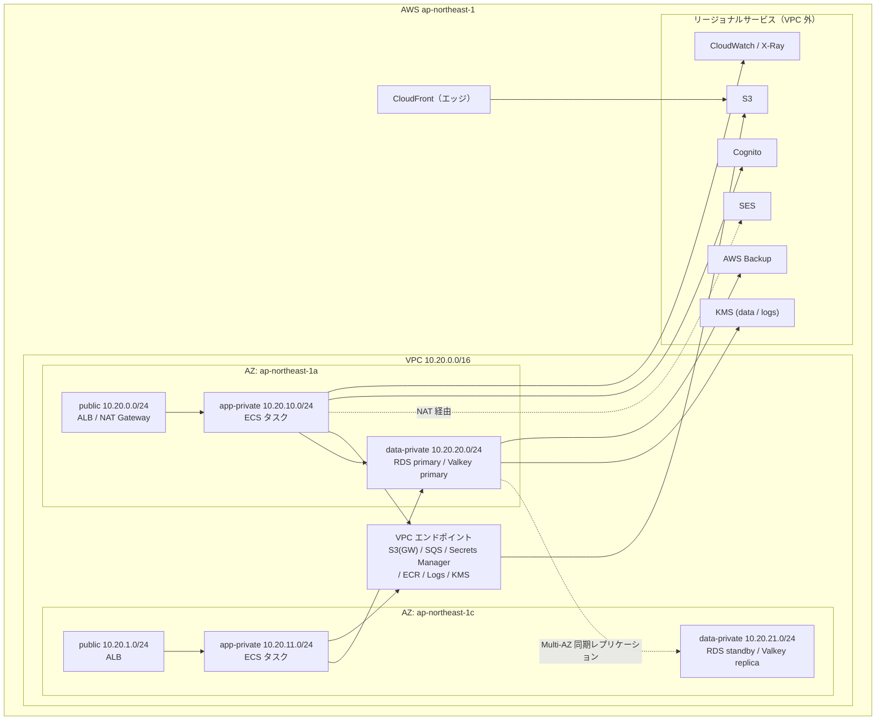

# 図書館蔵書管理システム — プロダクトインフラ ターゲットアーキテクチャ

> 派生生成物。正本は `docs/mcl/product/output/*.yaml` および `docs/cloud-context/decisions/product/*.yaml`。

| 項目 | 値 |
|---|---|
| ワークロードタイプ | web_app |
| 対象クラウド | AWS |
| リージョン | ap-northeast-1（東京）単一リージョン / 2 AZ |
| SLA | 99%（年間ダウンタイム約 3.65 日） |
| p99 応答目標 | 500ms |
| RPO / RTO | 4 時間 / 2 時間 |
| データ分類 | restricted（PII あり・国内保管） |
| コスト方針 | balanced |

---

## 1. ワークロード全体構成

---

## 2. リクエストフロー

### 2-1. 利用者による書籍検索（同期）

### 2-2. 日次バッチによる督促通知（非同期）

---

## 3. オートスケーリング構成

スパイク倍率 2 倍（ベースライン 10rps → ピーク 20rps）に対し、api は 60 秒でスケールアウトする。
worker は平常時 0 タスクで固定費をゼロにし、日次バッチ直後の滞留に応じて増える。

---

## 4. AWS デプロイメント（ネットワーク配置）

**ネットワーク方針の要点**

- `data-private` サブネットは `0.0.0.0/0` の経路を持たない。データ層は外部から直接到達できない
- NAT Gateway はコスト最適化のため 1 AZ に集約する。AZ 障害時は外向き通信（メール送信）が停止するが SLA 99% では許容する
- S3 / SQS / Secrets Manager / ECR / CloudWatch Logs / KMS は VPC エンドポイント経由とし、NAT のデータ処理料を抑える
- 職員ポータルは WAF の IP 許可リストで館内ネットワークからのみ許可する（暫定。product-decision-004）

---

## 5. 主要な設計判断

| ID | 判断 | 選択 | 主な理由 |
|---|---|---|---|
| product-decision-001 | アプリケーション実行基盤 | ECS on Fargate | 小規模運用体制で基盤運用を委譲しつつ、p99 500ms とモジュラモノリスに適合 |
| product-decision-002 | API エッジ構成 | ALB + WAF（トークン検証はアプリ層） | 常駐コンテナ構成でのコスト効率を優先。WAF レート制限で緩和 |
| product-decision-003 | リレーショナルデータストア | RDS PostgreSQL Multi-AZ | SLA 99% / 100GB 未満の規模に対して Aurora は過剰 |
| product-decision-004 | 職員面の閉域化 | 接続元 IP 制限（暫定） | 根拠 NFR が confidence: low、館内ネットワーク設備が未確定 |
| product-decision-005 | リージョン構成 | 単一リージョン 2 AZ | 災害対策の範囲が最小水準。冗長化と切替時間の要件は満たす |

---

## 6. 適合性サマリ

| 状態 | 件数 |
|---|---:|
| conformant | 60 |
| partial | 3 |
| non_conformant | 0 |
| deferred | 1 |

**partial の 3 件**

1. `REQ-IWD-001` / `REQ-NET-002` — 職員面の閉域化を IP 制限で代替（product-deviation-001、期限 2026-12-31）
2. `REQ-EDGE-001` — トークン検証がエッジではなくアプリ層（product-deviation-002、期限 2027-03-31）

**deferred の 1 件**

- `REQ-BKP-002` — RTO 2 時間の実測検証は本番構築後の復旧演習で行う

---

## 7. 未確定事項（IaC の TODO）

| # | 項目 | 影響 |
|---|---|---|
| 1 | 館内ネットワークのグローバル IP | 未設定の間は職員ポータルが全拒否になる |
| 2 | ACM 証明書 ARN と独自ドメイン | ALB / CloudFront の HTTPS リスナー |
| 3 | SES 送信ドメインと DKIM / SPF / DMARC の DNS 登録 | 通知メールの到達率 |
| 4 | SES サンドボックス解除の申請 | 本番稼働前に 24〜48 時間のリードタイム |
| 5 | コンテナイメージ URI（api / worker / batch） | ECS タスク定義 |
| 6 | アラート通知先メールアドレス | SNS サブスクリプション |
| 7 | Terraform リモートステートのバックエンド | 複数人での運用時に必須 |
