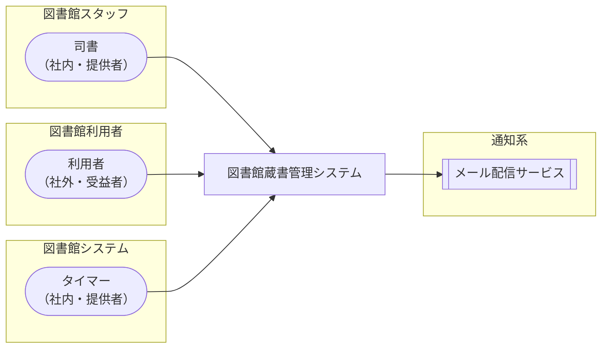

<!-- generateRdraMd.js による自動生成ファイル。手動編集しないこと。元データ: docs/rdra/latest/*.tsv -->

# システムコンテキスト

RDRA システム価値レイヤー。システムに関わるアクターと外部システムの全体像。

> 凡例: `(丸角)` アクター / `[四角]` システム / `[[二重枠]]` 外部システム

## アクター

| アクター群 | アクター | 役割 | 社内外 | 立場 | 主担当業務 |
|---|---|---|---|---|---|
| 図書館スタッフ | 司書 | 書籍情報・利用者情報の登録・編集・削除、貸出・返却の記録、予約状況・延滞状況の確認、在庫状況・人気書籍ランキング・期間別貸出統計の確認による選書・運営改善を行う | 社内 | 提供者 | 蔵書を管理するフロー、延滞者に督促するフロー、蔵書の利用状況を分析するフロー |
| 図書館利用者 | 利用者 | 書籍の検索、貸出中書籍の予約・予約取消、自分の貸出履歴と予約状況の確認を行い、窓口で利用登録・貸出・返却を受ける。返却通知・リマインド・督促メールを受け取る | 社外 | 受益者 |  |
| 図書館システム | タイマー | 日次バッチとしてリマインド対象の抽出・リマインド送信、延滞判定・督促送信を定時起動で自動実行する | 社内 | 提供者 |  |

## 外部システム

| 外部システム群 | 外部システム | 役割 |
|---|---|---|
| 通知系 | メール配信サービス | 返却通知メール、返却期限リマインドメール、督促メールを利用者に配信する |
