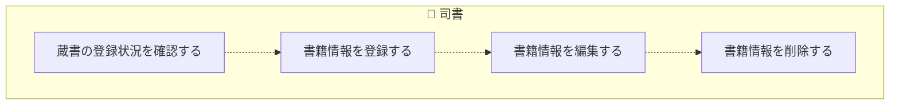
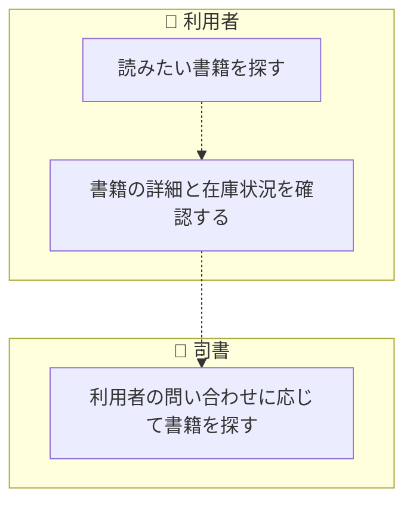
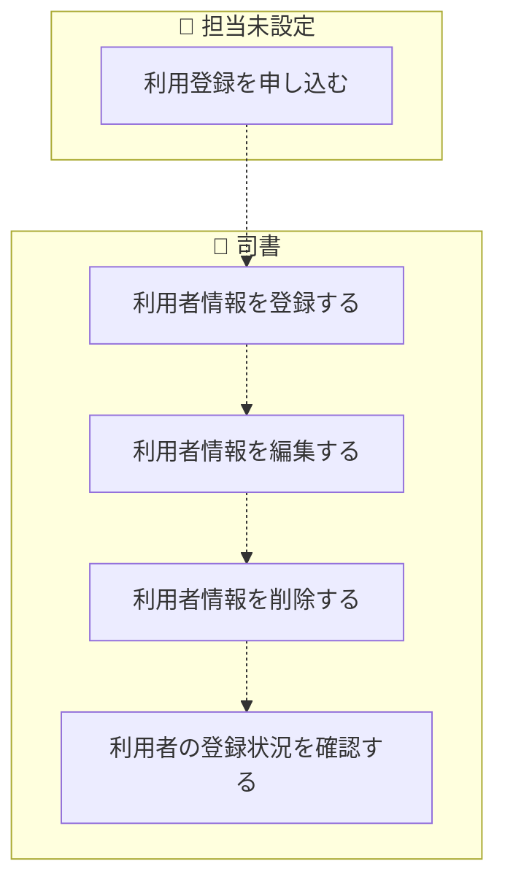
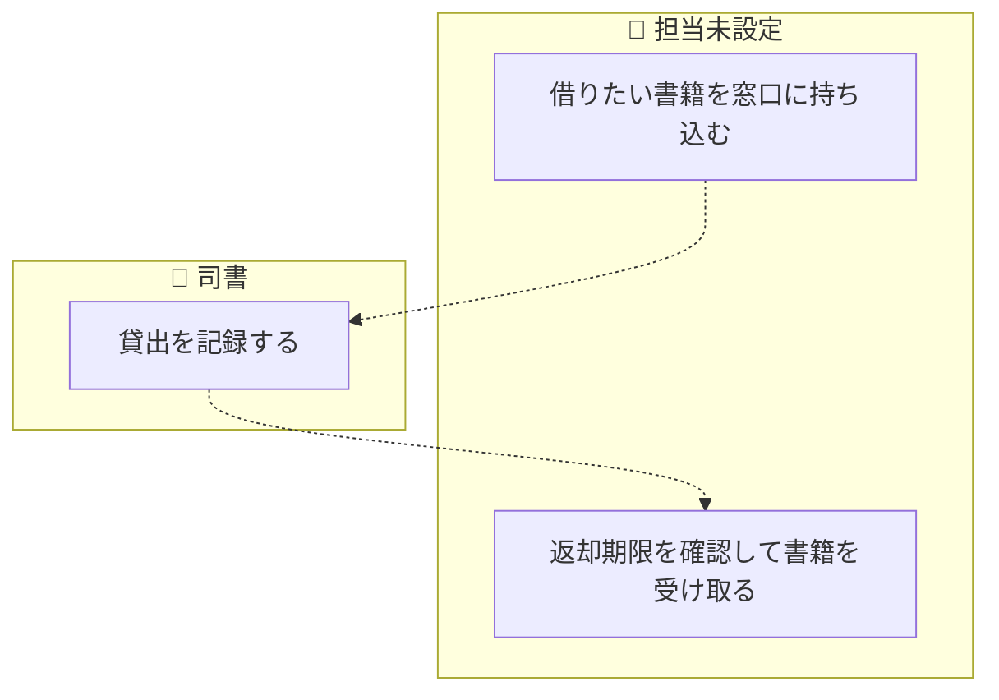
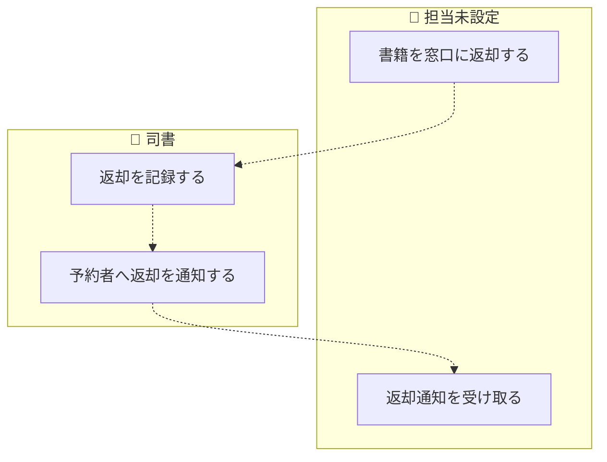
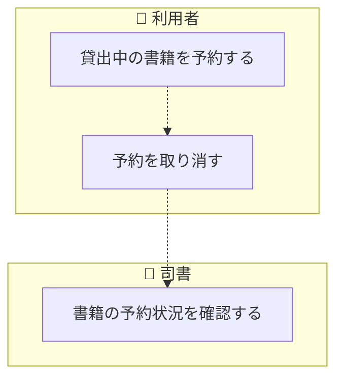
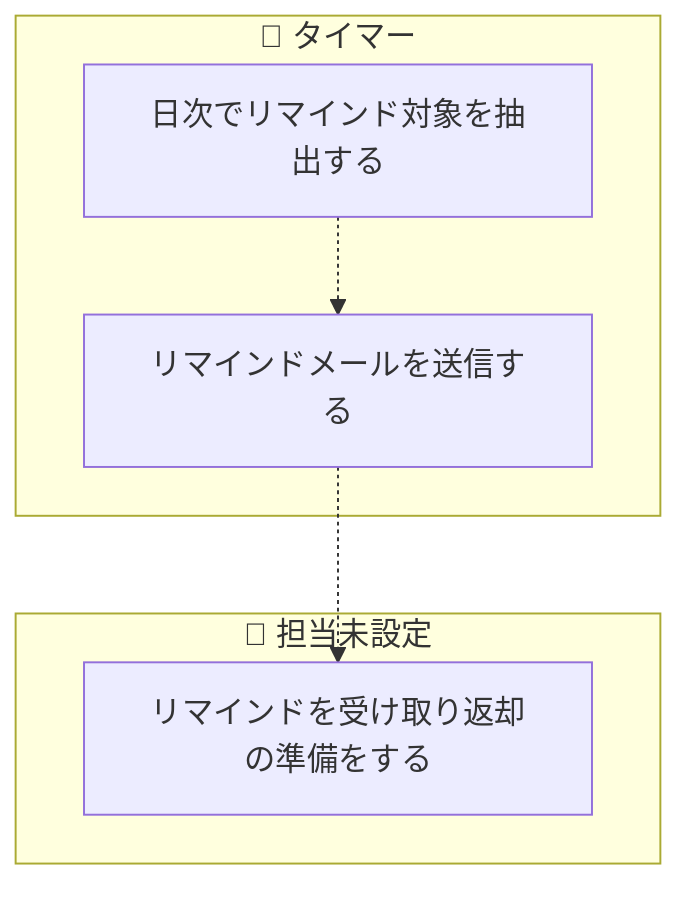
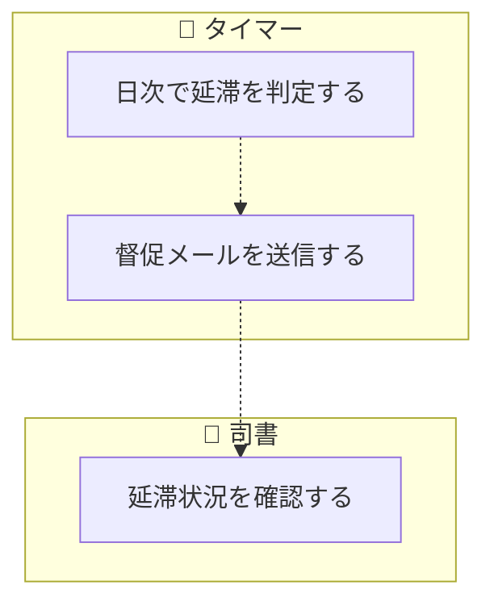
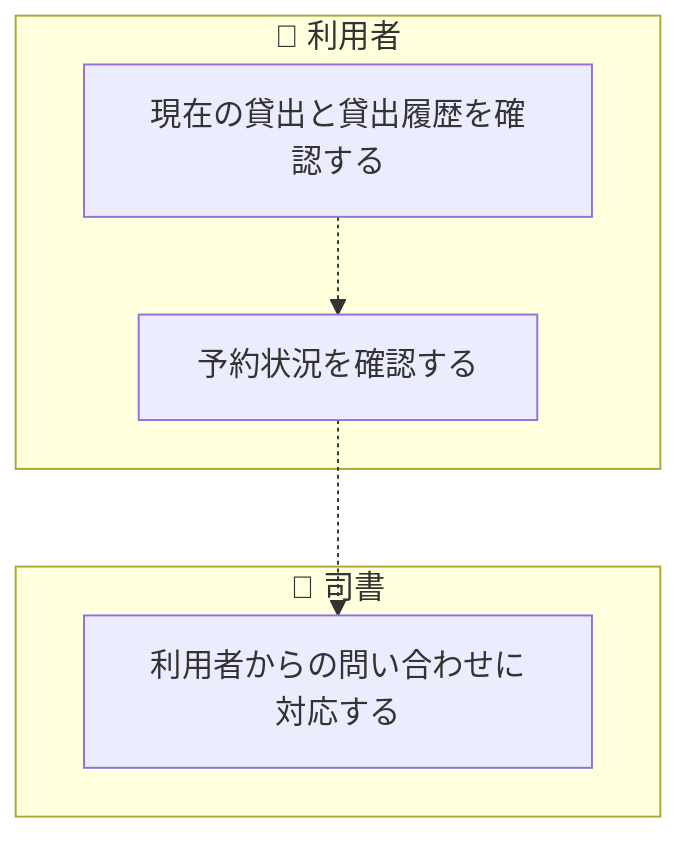
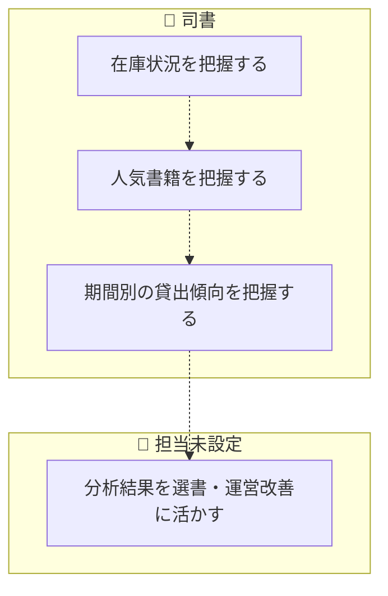

<!-- generateRdraMd.js による自動生成ファイル。手動編集しないこと。元データ: docs/rdra/latest/*.tsv -->

# 業務フロー

RDRA システム外部環境レイヤー。BUC ごとのアクティビティの流れ。
担当（アクター）ごとのレーンに分けて表示する。

## 蔵書管理業務

### 蔵書を管理するフロー

> 点線矢印は TSV の行順にもとづく推定順序（`先`/`次` 未指定のため）。

| アクティビティ | 担当 | UC | 説明 |
|---|---|---|---|
| 蔵書の登録状況を確認する | 司書 | 書籍一覧を参照する | 司書が登録済みの書籍を一覧で参照し、登録・編集・削除の対象と登録状況を確認する |
| 書籍情報を登録する | 司書 | 書籍を登録する | 司書がタイトル・著者・ISBN・出版社・ジャンル・媒体種別（紙・電子）を入力して書籍を蔵書として登録する。初期リリースでは媒体種別は紙のみ運用する |
| 書籍情報を編集する | 司書 | 書籍を編集する | 司書が登録済みの書籍情報を修正して保存し、変更内容を蔵書に反映する |
| 書籍情報を削除する | 司書 | 書籍を削除する | 司書が不要になった書籍を削除し、蔵書一覧から除外する |

### 書籍を検索するフロー

> 点線矢印は TSV の行順にもとづく推定順序（`先`/`次` 未指定のため）。

| アクティビティ | 担当 | UC | 説明 |
|---|---|---|---|
| 読みたい書籍を探す | 利用者 | 書籍を検索する | 利用者がキーワード・タイトル・著者・ISBN・ジャンルのいずれかを条件に蔵書を検索し、該当する書籍の一覧を表示する |
| 書籍の詳細と在庫状況を確認する | 利用者 | 書籍詳細を参照する | 利用者が検索結果から書籍を選び、書籍の詳細と在庫状況（在庫あり・貸出中・予約待ち）を確認する |
| 利用者の問い合わせに応じて書籍を探す | 司書 | 書籍を検索する | 司書が窓口で利用者からの問い合わせに応じ、同じ検索機能で蔵書と在庫状況を確認して案内する |

## 利用者管理業務

### 利用者を管理するフロー

> 点線矢印は TSV の行順にもとづく推定順序（`先`/`次` 未指定のため）。

| アクティビティ | 担当 | UC | 説明 |
|---|---|---|---|
| 利用登録を申し込む | 担当未設定 |  | 利用者が窓口で氏名・連絡先を提示して図書館の利用登録を申し込む（システムを使わない作業） |
| 利用者情報を登録する | 司書 | 利用者を登録する | 司書が氏名・連絡先を入力して利用者を登録し、一意の利用者番号を付与する |
| 利用者情報を編集する | 司書 | 利用者を編集する | 司書が登録済みの利用者情報（氏名・連絡先等）を修正して保存する |
| 利用者情報を削除する | 司書 | 利用者を削除する | 司書が利用を終了した利用者を削除し、利用者一覧から除外する |
| 利用者の登録状況を確認する | 司書 | 利用者一覧を参照する | 司書が登録済みの利用者を一覧で参照し、利用者番号や連絡先を確認する |

## 貸出業務

### 書籍を貸し出すフロー

> 点線矢印は TSV の行順にもとづく推定順序（`先`/`次` 未指定のため）。

| アクティビティ | 担当 | UC | 説明 |
|---|---|---|---|
| 借りたい書籍を窓口に持ち込む | 担当未設定 |  | 利用者が在庫ありの書籍を書架から取り、利用者番号とともに窓口に提示する（システムを使わない作業） |
| 貸出を記録する | 司書 | 貸出を登録する | 司書が利用者と書籍を指定して貸出記録を作成し、書籍の状態を在庫ありから貸出中に遷移させる。返却期限は貸出日に所定の貸出期間を加算して自動設定する。書籍が貸出中の場合は貸出できない旨を表示する |
| 返却期限を確認して書籍を受け取る | 担当未設定 |  | 利用者が司書から返却期限の案内を受け、書籍を受け取る（システムを使わない作業） |

### 書籍を返却するフロー

> 点線矢印は TSV の行順にもとづく推定順序（`先`/`次` 未指定のため）。

| アクティビティ | 担当 | UC | 説明 |
|---|---|---|---|
| 書籍を窓口に返却する | 担当未設定 |  | 利用者が借りていた書籍を窓口に返却する（システムを使わない作業） |
| 返却を記録する | 司書 | 返却を登録する | 司書が返却を登録し、貸出の状態を返却済みに遷移させる。書籍の状態は予約がなければ在庫あり、予約があれば予約待ちに遷移させる |
| 予約者へ返却を通知する | 司書 | 返却通知を送信する | 返却登録に伴い、予約順位1位の利用者にメール配信サービス経由で返却通知メールを送信し、予約の状態を予約中から通知済みに遷移させる |
| 返却通知を受け取る | 担当未設定 |  | 予約順位1位の利用者が返却通知メールを受け取り、来館して書籍を借りる準備をする（システムを使わない作業） |

### 書籍を予約するフロー

> 点線矢印は TSV の行順にもとづく推定順序（`先`/`次` 未指定のため）。

| アクティビティ | 担当 | UC | 説明 |
|---|---|---|---|
| 貸出中の書籍を予約する | 利用者 | 予約を登録する | 利用者が貸出中の書籍に予約を登録し、受付順の予約順位つきで予約中として管理される。在庫ありの書籍には予約できない旨を表示する |
| 予約を取り消す | 利用者 | 予約を取り消す | 利用者が自分の予約を取り消し、予約の状態を取消に遷移させる。後続の予約順位を繰り上げる |
| 書籍の予約状況を確認する | 司書 | 予約一覧を参照する | 司書が書籍ごとの予約順位と予約状態を確認し、返却時に引き渡す利用者を把握する |

## 期限管理業務

### 返却期限を通知するフロー

> 点線矢印は TSV の行順にもとづく推定順序（`先`/`次` 未指定のため）。

| アクティビティ | 担当 | UC | 説明 |
|---|---|---|---|
| 日次でリマインド対象を抽出する | タイマー | リマインド対象を抽出する | 日次バッチが返却期限まで所定日数以内で未返却の貸出を抽出し、リマインド対象を判定する |
| リマインドメールを送信する | タイマー | リマインドを送信する | 抽出した貸出の利用者にメール配信サービス経由でリマインドメールを自動送信し、通知を記録する |
| リマインドを受け取り返却の準備をする | 担当未設定 |  | 利用者がリマインドメールを受け取り、返却期限までに書籍を返却する準備をする（システムを使わない作業） |

### 延滞者に督促するフロー

> 点線矢印は TSV の行順にもとづく推定順序（`先`/`次` 未指定のため）。

| アクティビティ | 担当 | UC | 説明 |
|---|---|---|---|
| 日次で延滞を判定する | タイマー | 延滞を判定する | 日次バッチが返却期限を超過して未返却の貸出を抽出し、貸出の状態を貸出中から延滞に遷移させる |
| 督促メールを送信する | タイマー | 督促を送信する | 延滞と判定した貸出の利用者にメール配信サービス経由で督促メールを自動送信し、通知を記録する |
| 延滞状況を確認する | 司書 | 延滞一覧を参照する | 司書が延滞中の貸出と督促の送信状況を一覧で確認し、手作業の期限管理・督促なしに延滞の状況を把握する |

## 利用者サービス業務

### 自分の利用状況を確認するフロー

> 点線矢印は TSV の行順にもとづく推定順序（`先`/`次` 未指定のため）。

| アクティビティ | 担当 | UC | 説明 |
|---|---|---|---|
| 現在の貸出と貸出履歴を確認する | 利用者 | 貸出履歴を参照する | 利用者がWeb画面で自分の現在の貸出（返却期限つき）と過去の貸出履歴を一覧で確認する。自分の情報のみ閲覧できる |
| 予約状況を確認する | 利用者 | 予約状況を参照する | 利用者がWeb画面で自分の予約中の書籍と予約順位、予約の状態を一覧で確認する。自分の情報のみ閲覧できる |
| 利用者からの問い合わせに対応する | 司書 | 利用者の利用状況を参照する | 司書が窓口で利用者番号を指定して該当利用者の貸出と予約の状況を確認し、Web画面を使えない利用者に案内する |

## 運営分析業務

### 蔵書の利用状況を分析するフロー

> 点線矢印は TSV の行順にもとづく推定順序（`先`/`次` 未指定のため）。

| アクティビティ | 担当 | UC | 説明 |
|---|---|---|---|
| 在庫状況を把握する | 司書 | 在庫状況一覧を参照する | 司書が書籍ごとの状態（貸出中・在庫あり・予約待ち）を一覧で確認する |
| 人気書籍を把握する | 司書 | 人気書籍ランキングを参照する | 司書が貸出記録に基づく貸出回数の多い順の書籍ランキングを確認する |
| 期間別の貸出傾向を把握する | 司書 | 期間別貸出統計を参照する | 司書が期間（日・月・年）を指定して期間内の貸出件数の集計を確認する |
| 分析結果を選書・運営改善に活かす | 担当未設定 |  | 司書が在庫状況・ランキング・貸出統計をもとに選書や運営改善の判断を行う（システムを使わない作業） |
