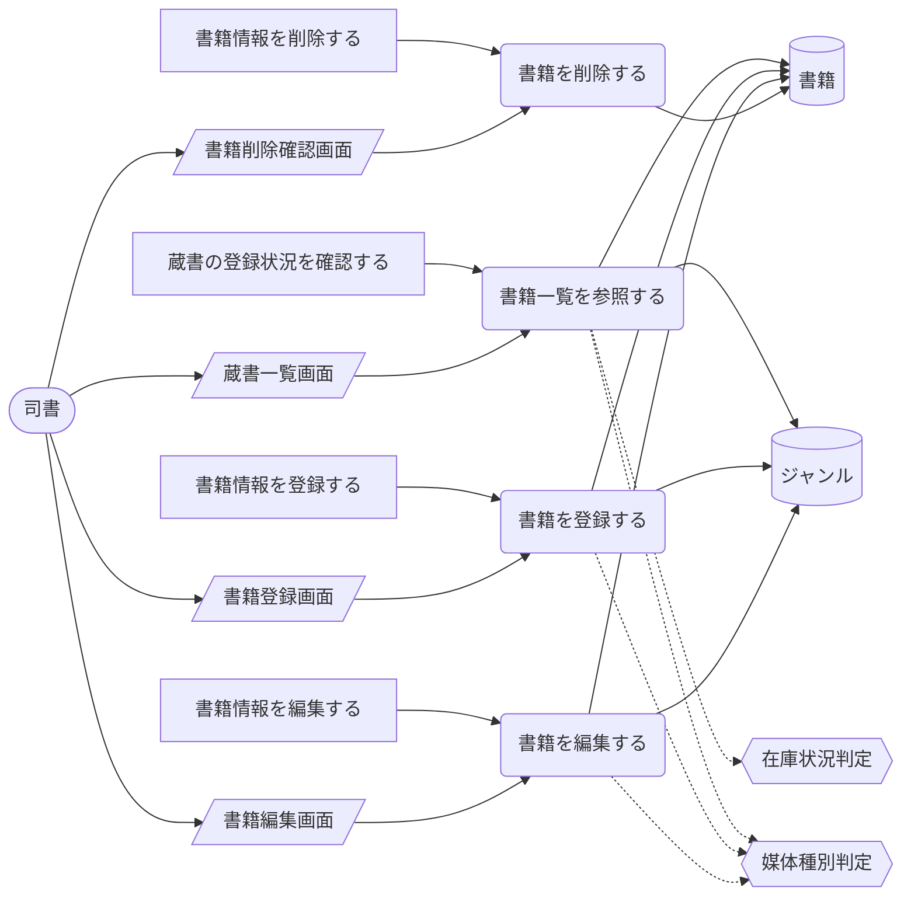
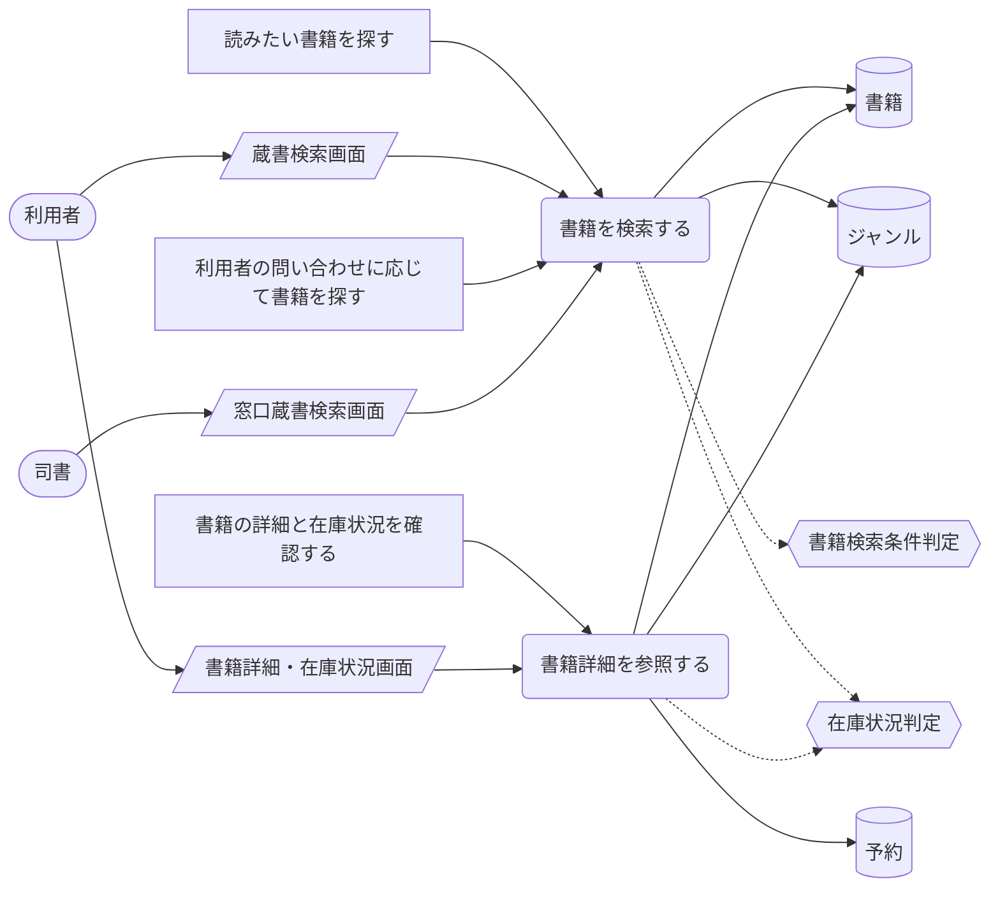
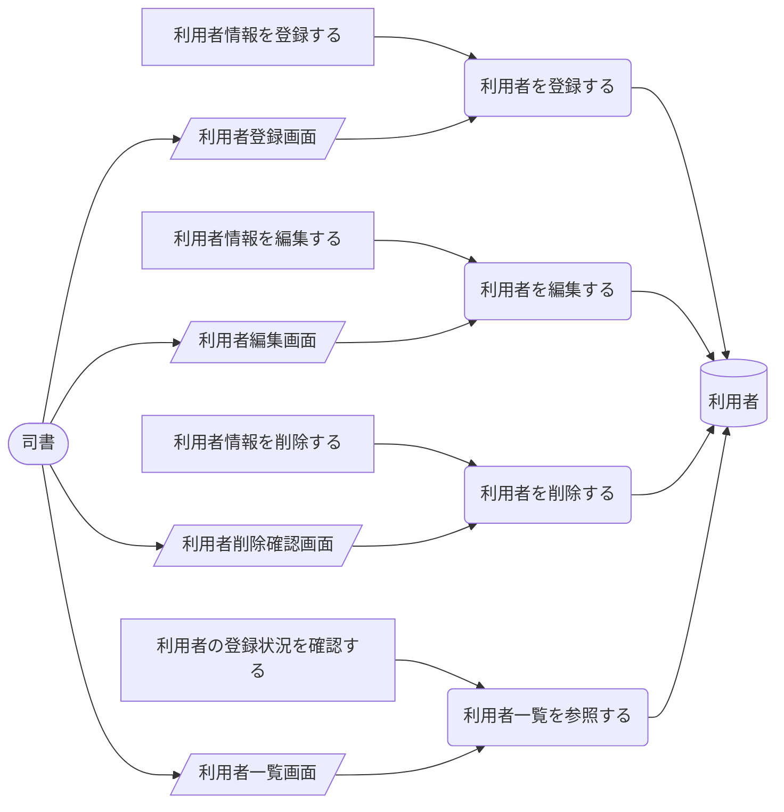
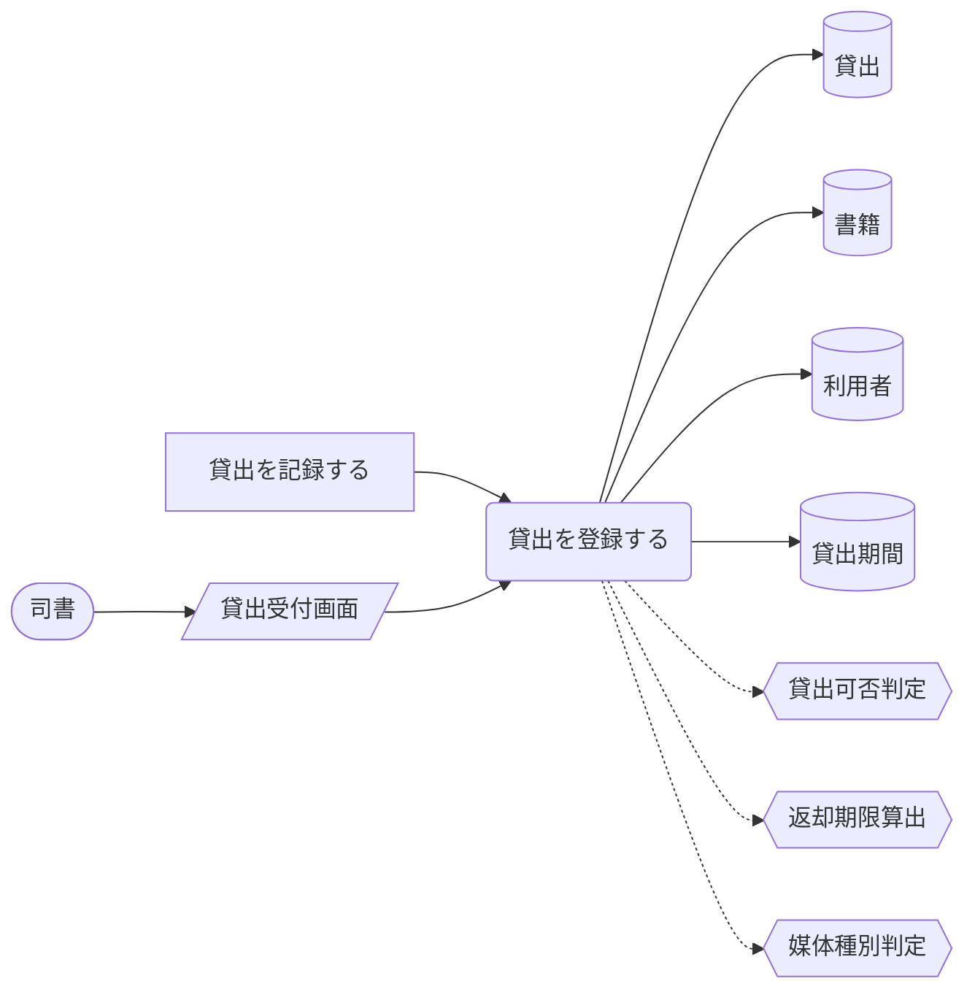
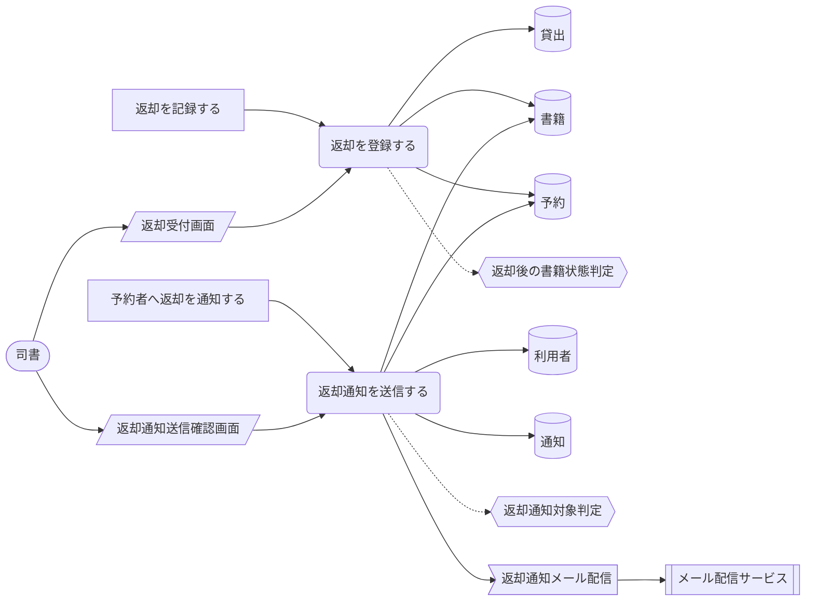
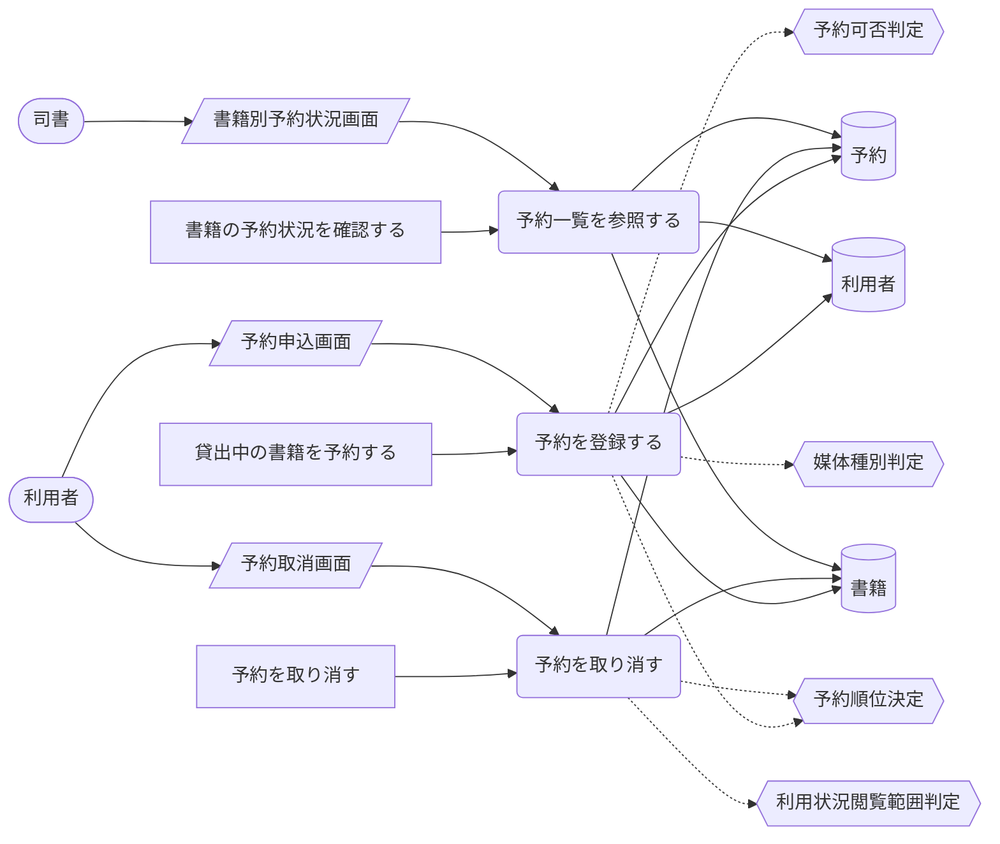
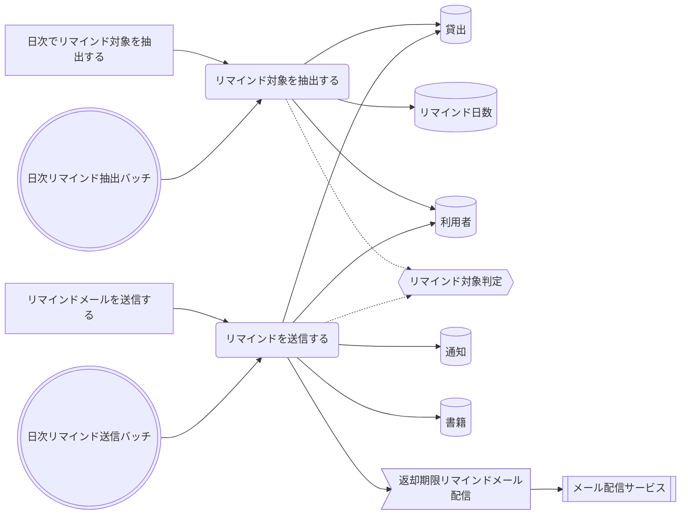
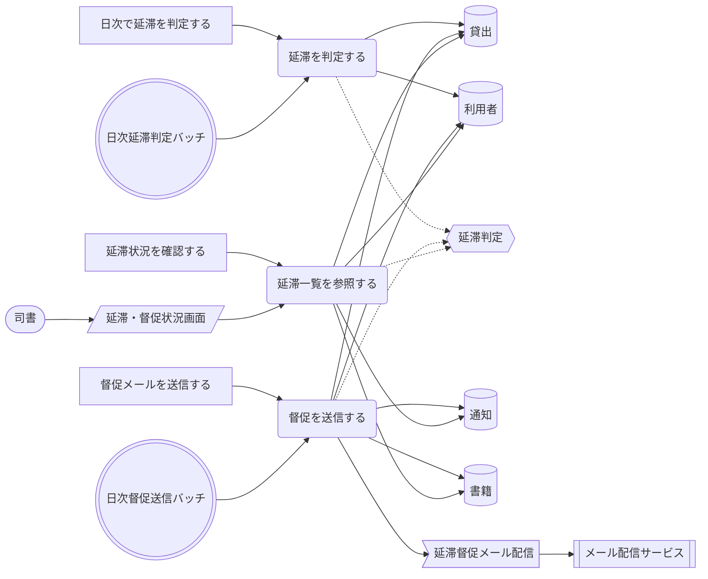
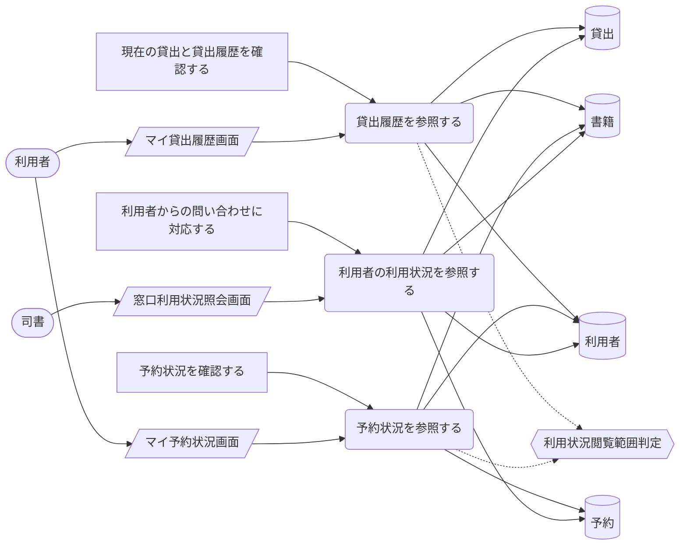
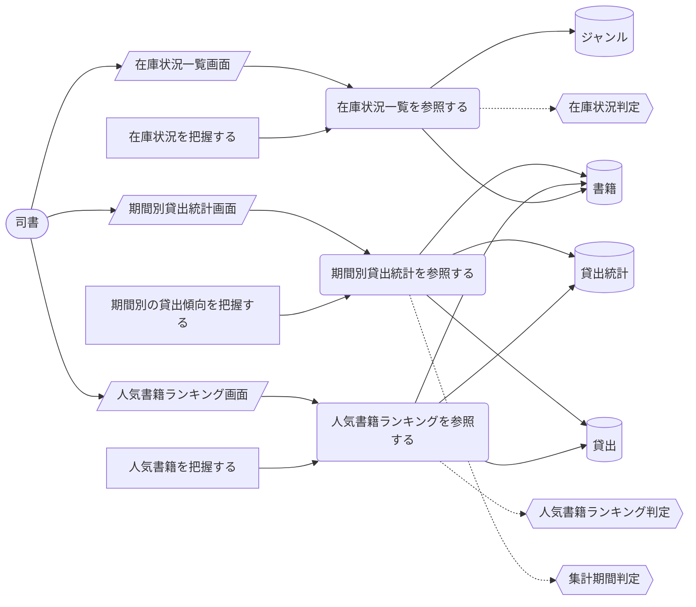

<!-- generateRdraMd.js による自動生成ファイル。手動編集しないこと。元データ: docs/rdra/latest/*.tsv -->

# UC複合図

RDRA システム境界レイヤー。BUC ごとに、アクティビティ・UC・画面・イベント・
情報・条件・外部システムの関係を表す。

## 蔵書管理業務

### 蔵書を管理するフロー

> 凡例: `(丸角)` アクター・UC / `[四角]` アクティビティ / `[/斜め/]` 画面 / `[(円柱)]` 情報 / `{{六角}}` 条件 / `>旗]` イベント / `[[二重枠]]` 外部システム。点線は条件参照。

| UC | アクティビティ | 画面 | 情報 | 条件 | イベント | 説明 |
|---|---|---|---|---|---|---|
| 書籍一覧を参照する | 蔵書の登録状況を確認する | 蔵書一覧画面 | 書籍、ジャンル | 在庫状況判定、媒体種別判定 |  | 司書が登録済みの書籍を一覧で参照し、登録・編集・削除の対象と登録状況を確認する |
| 書籍を登録する | 書籍情報を登録する | 書籍登録画面 | 書籍、ジャンル | 媒体種別判定 |  | 司書がタイトル・著者・ISBN・出版社・ジャンル・媒体種別（紙・電子）を入力して書籍を蔵書として登録する。初期リリースでは媒体種別は紙のみ運用する |
| 書籍を編集する | 書籍情報を編集する | 書籍編集画面 | 書籍、ジャンル | 媒体種別判定 |  | 司書が登録済みの書籍情報を修正して保存し、変更内容を蔵書に反映する |
| 書籍を削除する | 書籍情報を削除する | 書籍削除確認画面 | 書籍 |  |  | 司書が不要になった書籍を削除し、蔵書一覧から除外する |

### 書籍を検索するフロー

> 凡例: `(丸角)` アクター・UC / `[四角]` アクティビティ / `[/斜め/]` 画面 / `[(円柱)]` 情報 / `{{六角}}` 条件 / `>旗]` イベント / `[[二重枠]]` 外部システム。点線は条件参照。

| UC | アクティビティ | 画面 | 情報 | 条件 | イベント | 説明 |
|---|---|---|---|---|---|---|
| 書籍を検索する | 読みたい書籍を探す、利用者の問い合わせに応じて書籍を探す | 蔵書検索画面、窓口蔵書検索画面 | 書籍、ジャンル | 書籍検索条件判定、在庫状況判定 |  | 利用者がキーワード・タイトル・著者・ISBN・ジャンルのいずれかを条件に蔵書を検索し、該当する書籍の一覧を表示する |
| 書籍詳細を参照する | 書籍の詳細と在庫状況を確認する | 書籍詳細・在庫状況画面 | 書籍、ジャンル、予約 | 在庫状況判定 |  | 利用者が検索結果から書籍を選び、書籍の詳細と在庫状況（在庫あり・貸出中・予約待ち）を確認する |

## 利用者管理業務

### 利用者を管理するフロー

> 凡例: `(丸角)` アクター・UC / `[四角]` アクティビティ / `[/斜め/]` 画面 / `[(円柱)]` 情報 / `{{六角}}` 条件 / `>旗]` イベント / `[[二重枠]]` 外部システム。点線は条件参照。

| UC | アクティビティ | 画面 | 情報 | 条件 | イベント | 説明 |
|---|---|---|---|---|---|---|
| 利用者を登録する | 利用者情報を登録する | 利用者登録画面 | 利用者 |  |  | 司書が氏名・連絡先を入力して利用者を登録し、一意の利用者番号を付与する |
| 利用者を編集する | 利用者情報を編集する | 利用者編集画面 | 利用者 |  |  | 司書が登録済みの利用者情報（氏名・連絡先等）を修正して保存する |
| 利用者を削除する | 利用者情報を削除する | 利用者削除確認画面 | 利用者 |  |  | 司書が利用を終了した利用者を削除し、利用者一覧から除外する |
| 利用者一覧を参照する | 利用者の登録状況を確認する | 利用者一覧画面 | 利用者 |  |  | 司書が登録済みの利用者を一覧で参照し、利用者番号や連絡先を確認する |

## 貸出業務

### 書籍を貸し出すフロー

> 凡例: `(丸角)` アクター・UC / `[四角]` アクティビティ / `[/斜め/]` 画面 / `[(円柱)]` 情報 / `{{六角}}` 条件 / `>旗]` イベント / `[[二重枠]]` 外部システム。点線は条件参照。

| UC | アクティビティ | 画面 | 情報 | 条件 | イベント | 説明 |
|---|---|---|---|---|---|---|
| 貸出を登録する | 貸出を記録する | 貸出受付画面 | 貸出、書籍、利用者、貸出期間 | 貸出可否判定、返却期限算出、媒体種別判定 |  | 司書が利用者と書籍を指定して貸出記録を作成し、書籍の状態を在庫ありから貸出中に遷移させる。返却期限は貸出日に所定の貸出期間を加算して自動設定する。書籍が貸出中の場合は貸出できない旨を表示する |

### 書籍を返却するフロー

> 凡例: `(丸角)` アクター・UC / `[四角]` アクティビティ / `[/斜め/]` 画面 / `[(円柱)]` 情報 / `{{六角}}` 条件 / `>旗]` イベント / `[[二重枠]]` 外部システム。点線は条件参照。

| UC | アクティビティ | 画面 | 情報 | 条件 | イベント | 説明 |
|---|---|---|---|---|---|---|
| 返却を登録する | 返却を記録する | 返却受付画面 | 貸出、書籍、予約 | 返却後の書籍状態判定 |  | 司書が返却を登録し、貸出の状態を返却済みに遷移させる。書籍の状態は予約がなければ在庫あり、予約があれば予約待ちに遷移させる |
| 返却通知を送信する | 予約者へ返却を通知する | 返却通知送信確認画面 | 予約、利用者、通知、書籍 | 返却通知対象判定 | 返却通知メール配信 | 返却登録に伴い、予約順位1位の利用者にメール配信サービス経由で返却通知メールを送信し、予約の状態を予約中から通知済みに遷移させる |

### 書籍を予約するフロー

> 凡例: `(丸角)` アクター・UC / `[四角]` アクティビティ / `[/斜め/]` 画面 / `[(円柱)]` 情報 / `{{六角}}` 条件 / `>旗]` イベント / `[[二重枠]]` 外部システム。点線は条件参照。

| UC | アクティビティ | 画面 | 情報 | 条件 | イベント | 説明 |
|---|---|---|---|---|---|---|
| 予約を登録する | 貸出中の書籍を予約する | 予約申込画面 | 予約、書籍、利用者 | 予約可否判定、予約順位決定、媒体種別判定 |  | 利用者が貸出中の書籍に予約を登録し、受付順の予約順位つきで予約中として管理される。在庫ありの書籍には予約できない旨を表示する |
| 予約を取り消す | 予約を取り消す | 予約取消画面 | 予約、書籍 | 予約順位決定、利用状況閲覧範囲判定 |  | 利用者が自分の予約を取り消し、予約の状態を取消に遷移させる。後続の予約順位を繰り上げる |
| 予約一覧を参照する | 書籍の予約状況を確認する | 書籍別予約状況画面 | 予約、書籍、利用者 |  |  | 司書が書籍ごとの予約順位と予約状態を確認し、返却時に引き渡す利用者を把握する |

## 期限管理業務

### 返却期限を通知するフロー

> 凡例: `(丸角)` アクター・UC / `[四角]` アクティビティ / `[/斜め/]` 画面 / `[(円柱)]` 情報 / `{{六角}}` 条件 / `>旗]` イベント / `[[二重枠]]` 外部システム。点線は条件参照。

| UC | アクティビティ | 画面 | 情報 | 条件 | イベント | 説明 |
|---|---|---|---|---|---|---|
| リマインド対象を抽出する | 日次でリマインド対象を抽出する |  | 貸出、リマインド日数、利用者 | リマインド対象判定 |  | 日次バッチが返却期限まで所定日数以内で未返却の貸出を抽出し、リマインド対象を判定する |
| リマインドを送信する | リマインドメールを送信する |  | 貸出、利用者、通知、書籍 | リマインド対象判定 | 返却期限リマインドメール配信 | 抽出した貸出の利用者にメール配信サービス経由でリマインドメールを自動送信し、通知を記録する |

### 延滞者に督促するフロー

> 凡例: `(丸角)` アクター・UC / `[四角]` アクティビティ / `[/斜め/]` 画面 / `[(円柱)]` 情報 / `{{六角}}` 条件 / `>旗]` イベント / `[[二重枠]]` 外部システム。点線は条件参照。

| UC | アクティビティ | 画面 | 情報 | 条件 | イベント | 説明 |
|---|---|---|---|---|---|---|
| 延滞を判定する | 日次で延滞を判定する |  | 貸出、利用者 | 延滞判定 |  | 日次バッチが返却期限を超過して未返却の貸出を抽出し、貸出の状態を貸出中から延滞に遷移させる |
| 督促を送信する | 督促メールを送信する |  | 貸出、利用者、通知、書籍 | 延滞判定 | 延滞督促メール配信 | 延滞と判定した貸出の利用者にメール配信サービス経由で督促メールを自動送信し、通知を記録する |
| 延滞一覧を参照する | 延滞状況を確認する | 延滞・督促状況画面 | 貸出、利用者、書籍、通知 | 延滞判定 |  | 司書が延滞中の貸出と督促の送信状況を一覧で確認し、手作業の期限管理・督促なしに延滞の状況を把握する |

## 利用者サービス業務

### 自分の利用状況を確認するフロー

> 凡例: `(丸角)` アクター・UC / `[四角]` アクティビティ / `[/斜め/]` 画面 / `[(円柱)]` 情報 / `{{六角}}` 条件 / `>旗]` イベント / `[[二重枠]]` 外部システム。点線は条件参照。

| UC | アクティビティ | 画面 | 情報 | 条件 | イベント | 説明 |
|---|---|---|---|---|---|---|
| 貸出履歴を参照する | 現在の貸出と貸出履歴を確認する | マイ貸出履歴画面 | 貸出、書籍、利用者 | 利用状況閲覧範囲判定 |  | 利用者がWeb画面で自分の現在の貸出（返却期限つき）と過去の貸出履歴を一覧で確認する。自分の情報のみ閲覧できる |
| 予約状況を参照する | 予約状況を確認する | マイ予約状況画面 | 予約、書籍、利用者 | 利用状況閲覧範囲判定 |  | 利用者がWeb画面で自分の予約中の書籍と予約順位、予約の状態を一覧で確認する。自分の情報のみ閲覧できる |
| 利用者の利用状況を参照する | 利用者からの問い合わせに対応する | 窓口利用状況照会画面 | 利用者、貸出、予約、書籍 |  |  | 司書が窓口で利用者番号を指定して該当利用者の貸出と予約の状況を確認し、Web画面を使えない利用者に案内する |

## 運営分析業務

### 蔵書の利用状況を分析するフロー

> 凡例: `(丸角)` アクター・UC / `[四角]` アクティビティ / `[/斜め/]` 画面 / `[(円柱)]` 情報 / `{{六角}}` 条件 / `>旗]` イベント / `[[二重枠]]` 外部システム。点線は条件参照。

| UC | アクティビティ | 画面 | 情報 | 条件 | イベント | 説明 |
|---|---|---|---|---|---|---|
| 在庫状況一覧を参照する | 在庫状況を把握する | 在庫状況一覧画面 | 書籍、ジャンル | 在庫状況判定 |  | 司書が書籍ごとの状態（貸出中・在庫あり・予約待ち）を一覧で確認する |
| 人気書籍ランキングを参照する | 人気書籍を把握する | 人気書籍ランキング画面 | 貸出統計、貸出、書籍 | 人気書籍ランキング判定 |  | 司書が貸出記録に基づく貸出回数の多い順の書籍ランキングを確認する |
| 期間別貸出統計を参照する | 期間別の貸出傾向を把握する | 期間別貸出統計画面 | 貸出統計、貸出、書籍 | 集計期間判定 |  | 司書が期間（日・月・年）を指定して期間内の貸出件数の集計を確認する |
