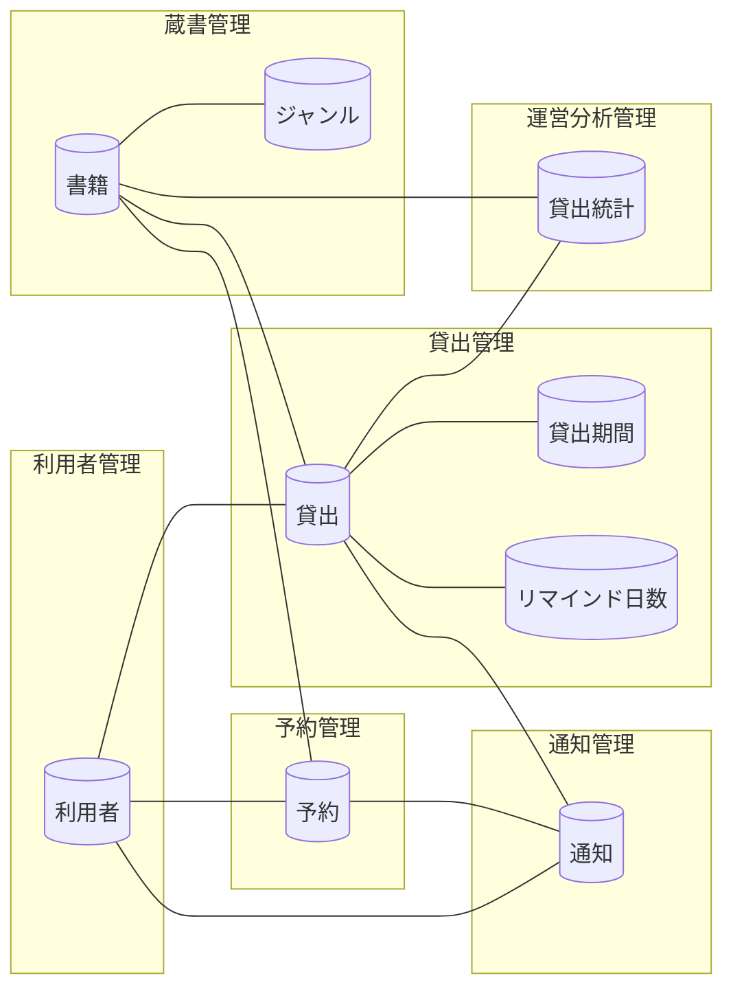

<!-- generateRdraMd.js による自動生成ファイル。手動編集しないこと。元データ: docs/rdra/latest/*.tsv -->

# 情報モデル

RDRA システム内部レイヤー。コンテキストごとの情報と情報間の関連。

> 凡例: `[(円柱)]` 情報 / `[四角]` 情報.tsv 未定義の参照。実線は関連情報。

## 情報一覧

| コンテキスト | 情報 | 属性 | 状態モデル | バリエーション | 説明 |
|---|---|---|---|---|---|
| 蔵書管理 | 書籍 | 書籍ID、タイトル、著者、ISBN、出版社、ジャンル、媒体種別（紙・電子）、書籍の状態（在庫あり・貸出中・予約待ち）、登録日、更新日 | 書籍の状態 | ジャンル、媒体種別、検索条件種別 | 蔵書として一元管理する書籍。司書が登録・編集・削除し、利用者・司書がキーワード・タイトル・著者・ISBN・ジャンルで検索する。貸出・返却・予約により書籍の状態が遷移し、在庫状況一覧の表示に用いる。貸出中・予約待ちの書籍は削除できない。媒体種別は初期リリースでは紙のみ運用し、将来の電子書籍対応の拡張起点となる |
| 蔵書管理 | ジャンル | ジャンルID、ジャンル名（文学・社会科学・自然科学・技術・芸術・歴史・児童書・その他）、説明 |  | ジャンル | 書籍を分類する区分。書籍登録時に指定し、検索条件および選書・運営改善の分析単位として用いる |
| 利用者管理 | 利用者 | 利用者番号、氏名、連絡先（メールアドレス・電話番号・住所）、利用者区分（司書・利用者）、登録日、更新日 |  | 利用者区分 | 図書館を利用する人。司書が登録・編集・削除し、一意の利用者番号で識別する。貸出・予約の主体であり、返却通知・リマインド・督促の送信先となる。利用者区分により操作範囲を切り替え、利用者は自分の貸出履歴・予約状況のみ閲覧できる |
| 貸出管理 | 貸出 | 貸出ID、書籍ID、利用者番号、貸出日、返却期限、返却日、貸出の状態（貸出中・延滞・返却済み）、記録した司書 | 貸出の状態 |  | 利用者に書籍を貸し出した記録。司書が貸出を登録すると貸出中になり、返却期限は貸出日に貸出期間を加算して自動設定する。日次バッチがリマインド日数と返却期限からリマインド対象を判定し、返却期限超過で延滞に遷移させて督促する。返却登録で返却済みになり、貸出履歴の表示と貸出統計の集計の元データとなる |
| 貸出管理 | 貸出期間 | 貸出期間（日数）、適用開始日、更新日 |  |  | 貸出時に返却期限を自動設定するための業務ルール上の期間設定。返却期限=貸出日+貸出期間として返却期限算出に用いる |
| 貸出管理 | リマインド日数 | リマインド日数（返却期限の何日前か）、適用開始日、更新日 |  |  | 返却期限の何日前からリマインドメールを送るかを定める設定値。日次バッチのリマインド対象判定に用いる |
| 予約管理 | 予約 | 予約ID、書籍ID、利用者番号、受付日時、予約順位、予約の状態（予約中・通知済み・取消）、取消日時 | 予約の状態 |  | 貸出中の書籍に対する利用者の予約記録。在庫ありの書籍には予約できない。受付順に順位を付与し、取消時は後続の順位を繰り上げる。返却時に予約順位1位の利用者を返却通知の送信先として特定し、通知済みに遷移させる。司書は予約一覧で書籍ごとの予約順位と状態を確認する |
| 通知管理 | 通知 | 通知ID、利用者番号、通知種別（返却通知・リマインド・督促）、送信先メールアドレス、件名、本文、送信日時、送信結果、対象貸出ID、対象予約ID |  | 通知種別 | 利用者に送信した返却通知・リマインド・督促のメール記録。返却登録・リマインド対象抽出・延滞判定を契機にメール配信サービス経由で送信し、送信内容・送信日時・送信結果を保持する。通知の重複や漏れを防ぎ、司書が延滞一覧で督促の送信状況を確認するために用いる |
| 運営分析管理 | 貸出統計 | 集計ID、集計期間種別（日・月・年）、集計対象期間（開始日・終了日）、書籍ID、貸出回数、貸出件数、ランキング順位、集計日時 |  | 集計期間種別 | 貸出記録を集計した情報。書籍ごとの貸出回数による人気書籍ランキングと、集計期間種別ごとの貸出件数を保持し、司書が選書や運営改善の判断材料として用いる |
