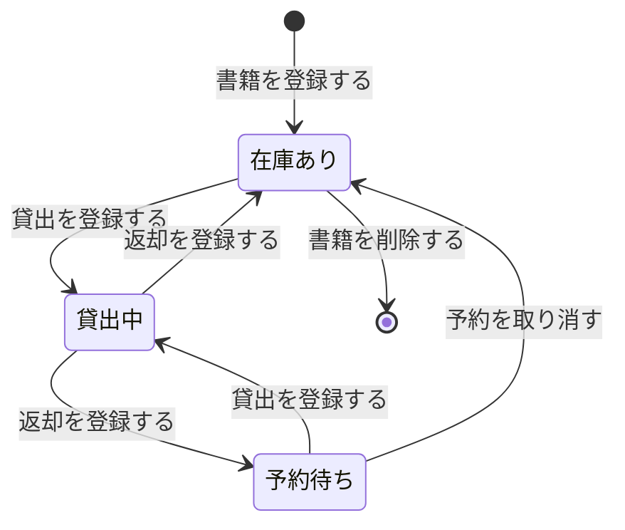
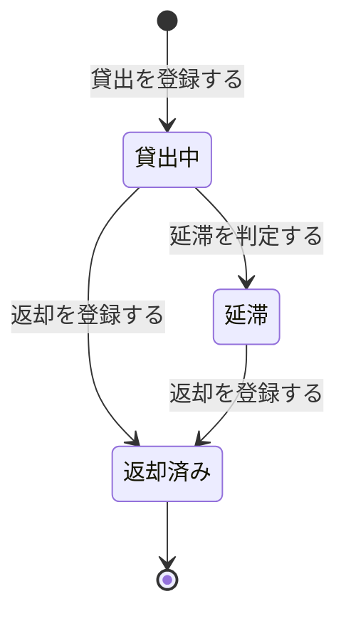
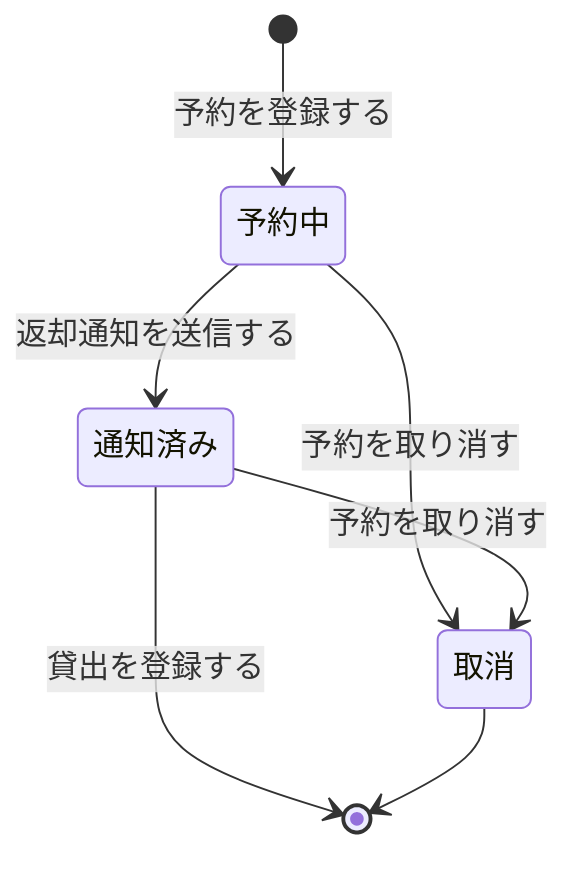

<!-- generateRdraMd.js による自動生成ファイル。手動編集しないこと。元データ: docs/rdra/latest/*.tsv -->

# 状態モデル

RDRA システム内部レイヤー。状態モデルごとの状態遷移。遷移ラベルは UC。

## 書籍の状態（蔵書管理）

| 状態 | 遷移UC | 遷移先状態 | 説明 |
|---|---|---|---|
|  | 書籍を登録する | 在庫あり | 司書が書籍情報を登録すると、書籍は貸出可能な在庫ありとして蔵書に加わる。貸出・予約の可否判断と在庫状況一覧の表示に使うため書籍ごとに状態を管理する |
| 在庫あり | 貸出を登録する | 貸出中 | 司書が利用者と書籍を指定して貸出を記録すると貸出中になる。貸出中の書籍は別の利用者に貸し出せない |
| 貸出中 | 返却を登録する | 在庫あり | 司書が返却を記録し、予約がない場合は在庫ありに戻る |
| 貸出中 | 返却を登録する | 予約待ち | 司書が返却を記録し、予約がある場合は予約待ちになり、予約順1位の利用者にメールで返却を通知する |
| 予約待ち | 貸出を登録する | 貸出中 | 予約順1位の利用者に司書が貸出を記録すると貸出中になる |
| 予約待ち | 予約を取り消す | 在庫あり | 予約がすべて取り消され、待っている利用者がいなくなると在庫ありに戻る |
| 在庫あり | 書籍を削除する |  | 司書が書籍情報を削除すると蔵書から除外される。貸出中・予約待ちの書籍は削除しない |

## 貸出の状態（貸出管理）

| 状態 | 遷移UC | 遷移先状態 | 説明 |
|---|---|---|---|
|  | 貸出を登録する | 貸出中 | 司書が貸出を記録すると貸出記録が作成され、貸出日に貸出期間を加算した返却期限が自動設定されて貸出中になる。返却期限に対する進捗を貸出ごとに管理し、リマインド・督促の対象判定と貸出履歴の表示に使う |
| 貸出中 | 延滞を判定する | 延滞 | 日次バッチで返却期限を超過した未返却の貸出を抽出し、延滞にする。延滞と判定した貸出は督促メールの送信対象になる |
| 貸出中 | 返却を登録する | 返却済み | 返却期限内に司書が返却を記録すると返却済みになる |
| 延滞 | 返却を登録する | 返却済み | 延滞中の書籍について司書が返却を記録すると返却済みになる |
| 返却済み |  |  | 返却済みの貸出記録は貸出履歴と貸出統計の元データとして保持され、状態は変化しない |

## 予約の状態（予約管理）

| 状態 | 遷移UC | 遷移先状態 | 説明 |
|---|---|---|---|
|  | 予約を登録する | 予約中 | 利用者が貸出中の書籍に予約を登録すると、受付順の予約順位つきで予約中になる。返却時の通知先の特定と予約状況の表示に使うため予約ごとに状態を管理する |
| 予約中 | 返却通知を送信する | 通知済み | 予約順1位の予約に対し、書籍の返却時にメールで返却を通知すると通知済みになる |
| 予約中 | 予約を取り消す | 取消 | 利用者が予約を取り消すと取消になり、後続の予約順位が繰り上がる |
| 通知済み | 予約を取り消す | 取消 | 返却通知を受けた利用者が予約を取り消すと取消になり、次の予約順位の利用者に通知する |
| 通知済み | 貸出を登録する |  | 通知を受けた利用者に司書が貸出を記録すると予約は完了して終了する |
| 取消 |  |  | 取り消された予約は順位の管理対象から外れて終了する |
