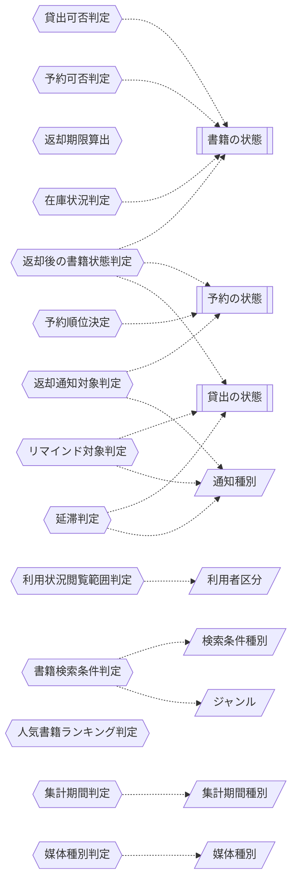

<!-- generateRdraMd.js による自動生成ファイル。手動編集しないこと。元データ: docs/rdra/latest/*.tsv -->

# 条件・バリエーション

RDRA システム内部レイヤー。判断条件（ビジネスルール）と区分・種別の一覧。

## 条件（ビジネスルール）

> 凡例: `{{六角}}` 条件 / `[[二重枠]]` 状態モデル / `[/斜め/]` バリエーション

| コンテキスト | 条件 | 条件の説明 | バリエーション | 状態モデル |
|---|---|---|---|---|
| 貸出管理 | 貸出可否判定 | 書籍の状態が「在庫あり」であり、かつ貸出先が登録済みの利用者である場合に貸出可能とする。書籍が「貸出中」または「予約待ち」の場合は貸出できない。予約待ちの書籍は予約順位1位の利用者に限り貸出可能とする |  | 書籍の状態 |
| 予約管理 | 予約可否判定 | 書籍の状態が「貸出中」または「予約待ち」の場合のみ予約を受け付ける。書籍が「在庫あり」の場合は予約できない |  | 書籍の状態 |
| 貸出管理 | 返却期限算出 | 貸出日にビジネスパラメータ「貸出期間」を加算した日付を返却期限とする |  |  |
| 貸出管理 | 返却後の書籍状態判定 | 返却された書籍に予約中の予約が1件以上ある場合は書籍の状態を「予約待ち」、予約がない場合は「在庫あり」に遷移させる。貸出の状態は「貸出中」「延滞」のいずれからも「返却済み」に遷移させる |  | 書籍の状態、予約の状態、貸出の状態 |
| 通知管理 | 返却通知対象判定 | 返却された書籍に予約中の予約がある場合、予約順位1位の利用者を通知種別「返却通知」の送信先とし、予約の状態を「予約中」から「通知済み」に遷移させる。予約がない場合は送信しない | 通知種別 | 予約の状態 |
| 予約管理 | 予約順位決定 | 予約は受付日時の早い順に順位を付与し、予約が取り消された場合は後続の予約中・通知済みの予約の順位を繰り上げる。取消・終了した予約は順位の管理対象から外す |  | 予約の状態 |
| 貸出管理 | リマインド対象判定 | 貸出の状態が「貸出中」で未返却、かつ返却期限までの残日数がビジネスパラメータ「リマインド日数」以内の貸出を通知種別「リマインド」の送信対象とする | 通知種別 | 貸出の状態 |
| 貸出管理 | 延滞判定 | 貸出の状態が「貸出中」で未返却、かつ当日の日付が返却期限を超過している貸出を延滞とし、貸出の状態を「延滞」に遷移させて通知種別「督促」の送信対象とする | 通知種別 | 貸出の状態 |
| 利用者管理 | 利用状況閲覧範囲判定 | 利用者区分が「利用者」の場合は自分の利用者番号に紐づく貸出履歴と予約状況のみ閲覧できる。他の利用者の情報は閲覧できない。利用者区分が「司書」の場合は利用者番号を指定して任意の利用者の利用状況を閲覧できる | 利用者区分 |  |
| 蔵書管理 | 書籍検索条件判定 | 検索条件種別（キーワード・タイトル・著者・ISBN・ジャンル）に応じて書籍の該当属性を照合し、一致する書籍を検索結果とする。ジャンルを条件にする場合はジャンル区分と一致する書籍を対象とする | 検索条件種別、ジャンル |  |
| 蔵書管理 | 在庫状況判定 | 書籍の状態（在庫あり・貸出中・予約待ち）をもとに各書籍の在庫状況を表示する |  | 書籍の状態 |
| 運営分析管理 | 人気書籍ランキング判定 | 貸出記録の貸出回数を書籍ごとに集計し、貸出回数の多い順に書籍を並べて順位を付与する |  |  |
| 運営分析管理 | 集計期間判定 | 集計期間種別（日・月・年）と指定された期間に基づき、貸出日が期間内に含まれる貸出記録を集計対象とする | 集計期間種別 |  |
| 蔵書管理 | 媒体種別判定 | 書籍の媒体種別（紙・電子）を判定し、初期リリースでは紙の書籍のみを貸出・予約の対象とする。電子の書籍は登録のみ可能とし貸出・予約は受け付けない | 媒体種別 |  |

## バリエーション

| コンテキスト | バリエーション | 値 | 説明 |
|---|---|---|---|
| 利用者管理 | 利用者区分 | 司書、利用者 | システムを操作する人の役割を区別し、蔵書・利用者の管理操作（司書）と検索・予約・利用状況確認（利用者）のように行える操作の範囲を切り替えるために用いる。利用者情報の属性として保持する |
| 蔵書管理 | ジャンル | 文学、社会科学、自然科学、技術、芸術、歴史、児童書、その他 | 書籍を分類する区分。書籍登録時に付与し、検索条件や選書・運営改善の分析単位として用いる |
| 蔵書管理 | 検索条件種別 | キーワード、タイトル、著者、ISBN、ジャンル | 利用者や司書が書籍を探すときにどの項目を条件に検索するかを区別し、書籍検索の検索処理の切り替えに用いる |
| 蔵書管理 | 媒体種別 | 紙、電子 | 書籍が紙の書籍か電子書籍かを区別する。初期リリースは紙のみ運用とし、将来の電子書籍対応時に貸出・返却・予約などの既存機能を拡張する起点として用いる |
| 通知管理 | 通知種別 | 返却通知、リマインド、督促 | 利用者へ送るメールの目的を区別し、送信契機（返却登録・期限接近・期限超過）と送信内容の切り替えに用いる。通知記録の属性として保持し、延滞一覧での督促送信状況の確認にも用いる |
| 運営分析管理 | 集計期間種別 | 日、月、年 | 貸出統計を集計する期間の単位を区別し、期間別貸出統計の集計粒度の切り替えに用いる |
