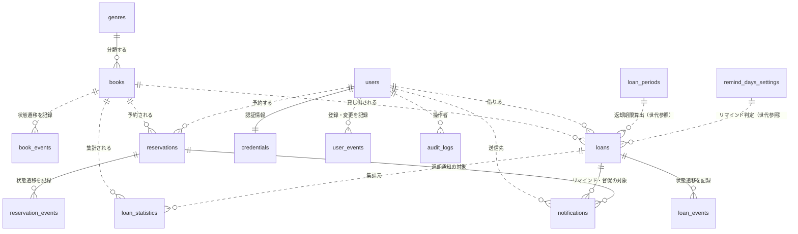
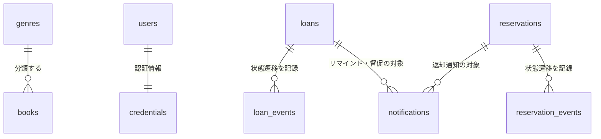
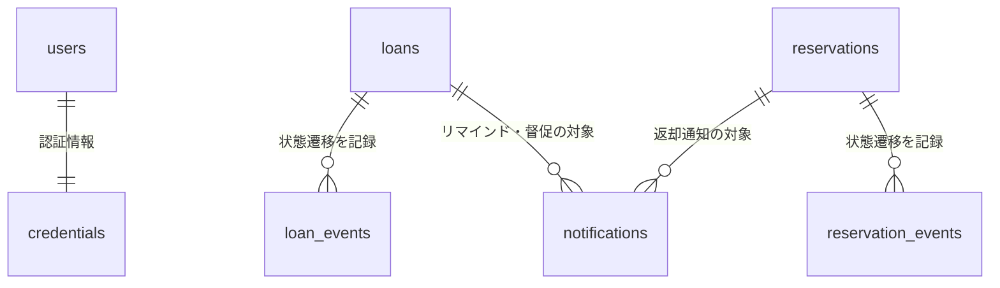
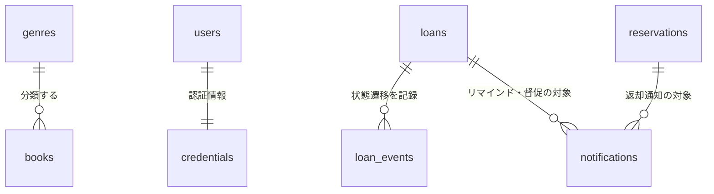
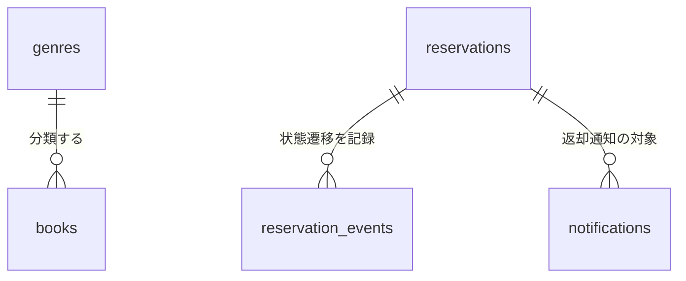
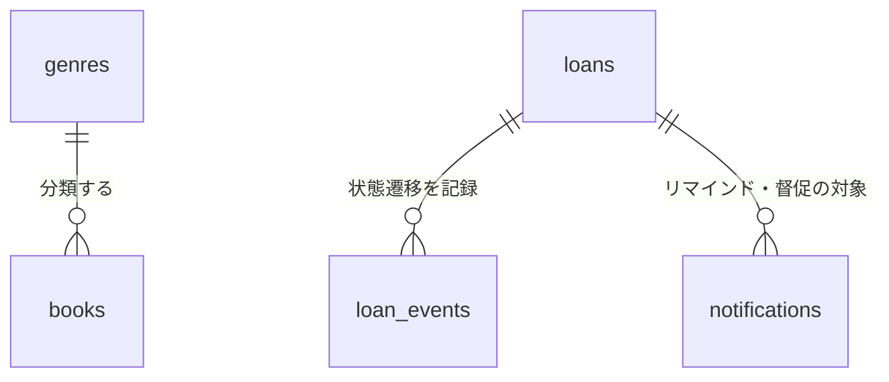

# データストアスキーマ

## サマリー

| データストア | 項目数 |
|------------|:------:|
| RDB テーブル | 15 |
| RDB インデックス | 36 |
| RDB 外部キー | 6 |
| KVS キーパターン | 15 |

## RDB

### ER 図

#### 全体

#### 利用者サービス業務

#### 利用者管理業務

#### 期限管理業務

#### 蔵書管理業務

#### 貸出業務

#### 運営分析業務

### テーブル一覧

| テーブル名 | RDRA 情報 | 説明 | カラム数 | インデックス数 | 利用 UC 数 |
|-----------|----------|------|:-------:|:----------:|:--------:|
| books | 書籍 | 蔵書として一元管理する書籍のスナップショット（E-001, event_snapshot）。登録日・更新日は book_events の occurred_at から導出する | 13 | 7 | 21 |
| book_events | 書籍 | 書籍の状態遷移・属性変更イベント（E-001 の event ログ）。登録日 / 更新日 / 削除履歴の正本。書籍削除後も保持する | 7 | 1 | 7 |
| genres | ジャンル | 書籍を分類するジャンルマスタ（E-002, resource_mutable）。検索条件および運営分析の集計単位 | 3 | 0 | 7 |
| users | 利用者 | 図書館を利用する人（司書・利用者）のスナップショット（E-003, event_snapshot）。個人情報を含む（NFR E.6.1.1 保管時暗号化、E.6.2.1 テスト環境マスキング） | 9 | 1 | 14 |
| user_events | 利用者 | 利用者の登録・属性変更・削除イベント（E-003 の event ログ）。登録日 / 更新日の正本。利用者削除後も保持する（削除イベントの payload に氏名・連絡先は含めない） | 6 | 2 | 4 |
| credentials | 利用者 | 認証情報（E-903, 派生エンティティ。NFR E.5.1.1 ID/パスワード認証、E.7.2.1 ログイン失敗検知とアカウントロック、E.6.1.1 暗号化）。users と 1:1 | 5 | 0 | 1 |
| loans | 貸出 | 利用者に書籍を貸し出した記録のスナップショット（E-004, event_snapshot）。返却日は loan_events（RETURNED）の occurred_at で管理する。貸出履歴は要配慮情報に準じる（NFR E.1.2.1 / E.6.1.1） | 9 | 5 | 12 |
| loan_events | 貸出 | 貸出の状態遷移イベント（E-004 の event ログ）。返却日（RETURNED の occurred_at）の正本。API の冪等キーも保持する | 8 | 2 | 5 |
| loan_periods | 貸出期間 | 返却期限算出に用いる貸出期間（日数）の世代管理設定（E-005, resource_scd2）。現行世代は valid_to = NULL | 5 | 2 | 1 |
| remind_days_settings | リマインド日数 | 返却期限の何日前からリマインドを送るかの世代管理設定（E-006, resource_scd2）。現行世代は valid_to = NULL | 5 | 2 | 3 |
| reservations | 予約 | 貸出中の書籍に対する利用者の予約記録のスナップショット（E-007, event_snapshot）。取消日時・通知日時は reservation_events の occurred_at で管理する | 8 | 5 | 10 |
| reservation_events | 予約 | 予約の状態遷移イベント（E-007 の event ログ）。通知日時（NOTIFIED）・取消日時（CANCELLED）の正本。API の冪等キーも保持する | 7 | 2 | 6 |
| notifications | 通知 | 利用者に送信する返却通知・リマインド・督促のメール記録（E-008, event）。送信待ち行を INSERT し、ワーカーが送信結果を反映する。重複送信防止（SR-013）の正本 | 13 | 3 | 7 |
| loan_statistics | 貸出統計 | loans を集計期間種別 × 期間 × 書籍で集計した非正規化テーブル（E-009, resource_mutable。Materialized View 相当）。集計バッチが UPSERT し、人気書籍ランキングと期間別貸出統計の参照元になる | 9 | 2 | 2 |
| audit_logs |  | 監査ログ（E-902, 派生エンティティ。NFR E.7.1.1 Lv2: ログイン / ログアウト + データアクセスログ）。個人情報の参照・更新と利用状況閲覧範囲判定の検証に用いる | 8 | 2 | 4 |

### books

**RDRA 情報**: 書籍
**説明**: 蔵書として一元管理する書籍のスナップショット（E-001, event_snapshot）。登録日・更新日は book_events の occurred_at から導出する

#### カラム

| カラム名 | 型 | NULL | 説明 |
|---------|---|:----:|------|
| **book_id** (PK) | uuid | NO | 書籍ID（主キー。ULID 等で採番）。情報.tsv: 書籍ID |
| title | string | NO | タイトル。情報.tsv: タイトル |
| author | string | NO | 著者。情報.tsv: 著者 |
| isbn | string | YES | ISBN（ハイフンなしの正規形。フロントエンドが送信前にハイフンを除去し、API はハイフンなしのみ受理する。任意。移行時に重複・欠損を名寄せする NFR D.4.1.3）。情報.tsv: ISBN |
| publisher | string | YES | 出版社（任意）。情報.tsv: 出版社 |
| genre_id | uuid | NO | ジャンルID（genres への FK）。情報.tsv: ジャンル |
| media_type | string | NO | 媒体種別。値: PAPER（紙）, ELECTRONIC（電子）。初期リリースは PAPER のみ運用。情報.tsv: 媒体種別 |
| current_status | string | NO | 書籍の状態（スナップショット）。値: AVAILABLE（在庫あり）, ON_LOAN（貸出中）, RESERVED（予約待ち）。遷移は book_events で記録する。情報.tsv: 書籍の状態 |
| title_normalized | string | NO | タイトルの NFKC 正規化 + 小文字化した検索用派生列（INSERT / UPDATE 時に再計算） |
| author_normalized | string | NO | 著者の NFKC 正規化 + 小文字化した検索用派生列 |
| publisher_normalized | string | YES | 出版社の NFKC 正規化 + 小文字化した検索用派生列（publisher が NULL のとき NULL） |
| version | integer | NO | 楽観ロック用バージョン（UPDATE ごとに +1。If-Match / ETag と対応） |
| updated_at | datetime | NO | スナップショット最終更新日時（一覧の既定ソートキー）。情報.tsv: 更新日 |

#### 外部キー

| カラム | 参照先テーブル | 参照先カラム | ON DELETE |
|-------|-------------|------------|----------|
| genre_id | genres | genre_id | RESTRICT |

#### インデックス

| 名前 | カラム | UNIQUE | 理由 | 利用 UC |
|------|-------|:------:|------|--------|
| idx_books_genre_id_updated_at | genre_id, updated_at | NO | genres への FK 参照 + ジャンル絞り込み一覧の更新日時降順ページング | 書籍を登録する, 書籍を検索する, 書籍一覧を参照する, 在庫状況一覧を参照する |
| idx_books_current_status_updated_at | current_status, updated_at | NO | 在庫状況で絞り込んだ一覧の更新日時降順ページング。状態別件数の GROUP BY にも利用 | 書籍を検索する, 書籍一覧を参照する, 在庫状況一覧を参照する |
| idx_books_current_status_genre_id_title | current_status, genre_id, title | NO | 在庫状況一覧の 状態 × ジャンル 絞り込みとタイトル順ページング | 在庫状況一覧を参照する |
| idx_books_updated_at | updated_at | NO | 絞り込みなし一覧の更新日時降順ページング | 書籍一覧を参照する |
| idx_books_title_normalized | title_normalized | NO | タイトル検索（前方一致時に利用。中間一致は LIKE 走査を許容: 1 館規模 NFR B.1.1.2） | 書籍を検索する, 書籍一覧を参照する |
| idx_books_author_normalized | author_normalized | NO | 著者検索（前方一致時に利用） | 書籍を検索する |
| idx_books_isbn | isbn | NO | ISBN 検索。ユニーク制約: 不要（同一 ISBN の複本を別書籍 ID で登録するため一意にしない） | 書籍を検索する, 書籍一覧を参照する |

#### 利用 UC

| UC | 操作 |
|---|------|
| 書籍を登録する | INSERT |
| 書籍を編集する | SELECT, UPDATE |
| 書籍を削除する | SELECT, DELETE |
| 書籍一覧を参照する | SELECT |
| 書籍を検索する | SELECT |
| 書籍詳細を参照する | SELECT |
| 貸出を登録する | SELECT, UPDATE |
| 返却を登録する | SELECT, UPDATE |
| 返却通知を送信する | SELECT |
| 予約を登録する | SELECT |
| 予約を取り消す | SELECT, UPDATE |
| 予約一覧を参照する | SELECT |
| 貸出履歴を参照する | SELECT |
| 予約状況を参照する | SELECT |
| 利用者の利用状況を参照する | SELECT |
| リマインド対象を抽出する | SELECT |
| リマインドを送信する | SELECT |
| 延滞一覧を参照する | SELECT |
| 督促を送信する | SELECT |
| 在庫状況一覧を参照する | SELECT |
| 人気書籍ランキングを参照する | SELECT |

### book_events

**RDRA 情報**: 書籍
**説明**: 書籍の状態遷移・属性変更イベント（E-001 の event ログ）。登録日 / 更新日 / 削除履歴の正本。書籍削除後も保持する

#### カラム

| カラム名 | 型 | NULL | 説明 |
|---------|---|:----:|------|
| **event_id** (PK) | uuid | NO | イベントID（主キー。UUID） |
| book_id | uuid | NO | 対象書籍ID（論理参照。削除後も保持するため FK なし） |
| event_type | string | NO | イベント種別。値: REGISTERED（登録）, UPDATED（属性変更）, DELETED（削除）, LOANED（貸出）, RETURNED（返却）, CANCELLED（予約取消で在庫ありへ遷移） |
| occurred_at | datetime | NO | 発生日時。REGISTERED の occurred_at が登録日、最新イベントの occurred_at が更新日 |
| actor_user_number | string | YES | 操作した司書の利用者番号。貸出・返却・予約取消に伴う自動遷移は NULL |
| related_id | uuid | YES | 関連レコードID（LOANED / RETURNED は loan_id、CANCELLED は reservation_id。それ以外は NULL） |
| payload | text | YES | イベントペイロード（JSON。REGISTERED: 登録属性 + 遷移後状態、UPDATED: 変更前後差分、DELETED: 削除前の全属性 + 遷移前状態） |

#### インデックス

| 名前 | カラム | UNIQUE | 理由 | 利用 UC |
|------|-------|:------:|------|--------|
| idx_book_events_book_id_occurred_at | book_id, occurred_at | NO | 書籍ごとの履歴を時系列に取得（registeredAt / updatedAt の導出、監査） | 書籍を登録する, 書籍を編集する, 書籍を削除する, 書籍詳細を参照する, 貸出を登録する, 返却を登録する, 予約を取り消す |

#### 利用 UC

| UC | 操作 |
|---|------|
| 書籍を登録する | INSERT |
| 書籍を編集する | INSERT, SELECT |
| 書籍を削除する | INSERT |
| 書籍詳細を参照する | SELECT |
| 貸出を登録する | INSERT |
| 返却を登録する | INSERT |
| 予約を取り消す | INSERT |

### genres

**RDRA 情報**: ジャンル
**説明**: 書籍を分類するジャンルマスタ（E-002, resource_mutable）。検索条件および運営分析の集計単位

#### カラム

| カラム名 | 型 | NULL | 説明 |
|---------|---|:----:|------|
| **genre_id** (PK) | uuid | NO | ジャンルID（主キー）。情報.tsv: ジャンルID |
| genre_name | string | NO | ジャンル名（文学・社会科学・自然科学・技術・芸術・歴史・児童書・その他）。情報.tsv: ジャンル名 |
| description | text | YES | ジャンルの説明。情報.tsv: 説明 |

#### 利用 UC

| UC | 操作 |
|---|------|
| 書籍を登録する | SELECT |
| 書籍を編集する | SELECT |
| 書籍一覧を参照する | SELECT |
| 書籍を検索する | SELECT |
| 書籍詳細を参照する | SELECT |
| 在庫状況一覧を参照する | SELECT |
| 人気書籍ランキングを参照する | SELECT |

### users

**RDRA 情報**: 利用者
**説明**: 図書館を利用する人（司書・利用者）のスナップショット（E-003, event_snapshot）。個人情報を含む（NFR E.6.1.1 保管時暗号化、E.6.2.1 テスト環境マスキング）

#### カラム

| カラム名 | 型 | NULL | 説明 |
|---------|---|:----:|------|
| **user_number** (PK) | string | NO | 利用者番号（主キー。司書が登録時にシーケンス採番する一意の識別子）。情報.tsv: 利用者番号 |
| name | string | NO | 氏名（個人情報）。情報.tsv: 氏名 |
| name_normalized | string | NO | 氏名の NFKC 正規化 + 小文字化した検索用派生列（利用者一覧の部分一致検索） |
| email | string | NO | メールアドレス（通知の送信先。個人情報。移行時に欠損を補完する NFR D.4.1.3）。情報.tsv: 連絡先 |
| phone | string | YES | 電話番号（任意。個人情報）。情報.tsv: 連絡先 |
| address | string | YES | 住所（任意。個人情報）。情報.tsv: 連絡先 |
| user_type | string | NO | 利用者区分。値: PATRON（利用者）, STAFF（司書）。RBAC のロール源泉（NFR E.5.2.1）。情報.tsv: 利用者区分 |
| version | integer | NO | 楽観ロック用バージョン（UPDATE ごとに +1） |
| updated_at | datetime | NO | スナップショット最終更新日時。登録日・更新日は user_events の occurred_at で管理する。情報.tsv: 更新日 |

#### インデックス

| 名前 | カラム | UNIQUE | 理由 | 利用 UC |
|------|-------|:------:|------|--------|
| idx_users_name_normalized | name_normalized | NO | 氏名部分一致検索（前方一致時に利用。中間一致は LIKE 走査を許容: 1 館規模） | 利用者一覧を参照する |

#### 利用 UC

| UC | 操作 |
|---|------|
| 利用者を登録する | INSERT |
| 利用者を編集する | SELECT, UPDATE |
| 利用者を削除する | SELECT, DELETE |
| 利用者一覧を参照する | SELECT |
| 利用者の利用状況を参照する | SELECT |
| 貸出を登録する | SELECT |
| 返却を登録する | SELECT |
| 返却通知を送信する | SELECT |
| 予約を登録する | SELECT |
| 予約を取り消す | SELECT |
| 予約一覧を参照する | SELECT |
| リマインド対象を抽出する | SELECT |
| 延滞を判定する | SELECT |
| 延滞一覧を参照する | SELECT |

### user_events

**RDRA 情報**: 利用者
**説明**: 利用者の登録・属性変更・削除イベント（E-003 の event ログ）。登録日 / 更新日の正本。利用者削除後も保持する（削除イベントの payload に氏名・連絡先は含めない）

#### カラム

| カラム名 | 型 | NULL | 説明 |
|---------|---|:----:|------|
| **event_id** (PK) | uuid | NO | イベントID（主キー。UUID） |
| user_number | string | NO | 対象利用者番号（論理参照。削除後も保持するため FK なし） |
| event_type | string | NO | イベント種別。値: REGISTERED（登録）, UPDATED（属性変更）, DELETED（削除） |
| occurred_at | datetime | NO | 発生日時。REGISTERED の occurred_at が登録日、最新イベントの occurred_at が更新日 |
| actor_user_number | string | NO | 操作した司書の利用者番号 |
| payload | text | YES | イベントペイロード（JSON。REGISTERED / UPDATED: 氏名・連絡先、DELETED: { reason: 利用終了 } のみ） |

#### インデックス

| 名前 | カラム | UNIQUE | 理由 | 利用 UC |
|------|-------|:------:|------|--------|
| idx_user_events_user_number_occurred_at | user_number, occurred_at | NO | 利用者ごとの履歴を時系列に取得（registeredAt / updatedAt の導出） | 利用者を登録する, 利用者を編集する, 利用者を削除する |
| idx_user_events_user_number_event_type | user_number, event_type | NO | 一覧表示時の登録イベント一括取得（WHERE event_type = 'REGISTERED' AND user_number IN (...)） | 利用者一覧を参照する |

#### 利用 UC

| UC | 操作 |
|---|------|
| 利用者を登録する | INSERT |
| 利用者を編集する | INSERT |
| 利用者を削除する | INSERT |
| 利用者一覧を参照する | SELECT |

### credentials

**RDRA 情報**: 利用者
**説明**: 認証情報（E-903, 派生エンティティ。NFR E.5.1.1 ID/パスワード認証、E.7.2.1 ログイン失敗検知とアカウントロック、E.6.1.1 暗号化）。users と 1:1

#### カラム

| カラム名 | 型 | NULL | 説明 |
|---------|---|:----:|------|
| **user_number** (PK) | string | NO | 利用者番号（主キー兼 users への FK。1:1） |
| password_hash | string | NO | パスワードハッシュ（平文保持禁止。ソルト付きハッシュ） |
| password_updated_at | datetime | NO | パスワード最終更新日時（有効期限ポリシーの判定基準） |
| failed_attempts | integer | NO | 連続ログイン失敗回数（成功時に 0 へリセット） |
| locked_until | datetime | YES | アカウントロック解除日時（未ロックは NULL） |

#### 外部キー

| カラム | 参照先テーブル | 参照先カラム | ON DELETE |
|-------|-------------|------------|----------|
| user_number | users | user_number | CASCADE |

#### 利用 UC

| UC | 操作 |
|---|------|
| 利用者を削除する | DELETE |

### loans

**RDRA 情報**: 貸出
**説明**: 利用者に書籍を貸し出した記録のスナップショット（E-004, event_snapshot）。返却日は loan_events（RETURNED）の occurred_at で管理する。貸出履歴は要配慮情報に準じる（NFR E.1.2.1 / E.6.1.1）

#### カラム

| カラム名 | 型 | NULL | 説明 |
|---------|---|:----:|------|
| **loan_id** (PK) | uuid | NO | 貸出ID（主キー。ULID 採番）。情報.tsv: 貸出ID |
| book_id | uuid | NO | 書籍ID（books への論理参照。書籍削除後も履歴を保持するため FK なし）。情報.tsv: 書籍ID |
| user_number | string | NO | 利用者番号（users への論理参照。利用者削除後も履歴を保持するため FK なし）。情報.tsv: 利用者番号 |
| loaned_on | date | NO | 貸出日（貸出登録時に確定）。情報.tsv: 貸出日 |
| due_date | date | NO | 返却期限（loaned_on + 貸出時点で有効な loan_periods.loan_days）。情報.tsv: 返却期限 |
| current_status | string | NO | 貸出の状態。値: ON_LOAN（貸出中）, OVERDUE（延滞）, RETURNED（返却済み）。情報.tsv: 貸出の状態 |
| recorded_by | string | NO | 記録した司書の利用者番号（users への論理参照）。情報.tsv: 記録した司書 |
| version | integer | NO | 楽観ロック用バージョン（返却・延滞判定の UPDATE ごとに +1） |
| updated_at | datetime | NO | スナップショット最終更新日時 |

#### インデックス

| 名前 | カラム | UNIQUE | 理由 | 利用 UC |
|------|-------|:------:|------|--------|
| idx_loans_book_id_current_status | book_id, current_status | NO | 書籍ごとの貸出中 / 延滞レコード検索（返却対象の特定・貸出可否判定）。ユニーク制約: 貸出中は書籍の状態（books.current_status）と FOR UPDATE で直列化するため一意インデックスは設けない | 貸出を登録する, 返却を登録する |
| idx_loans_user_number_current_status_due_date | user_number, current_status, due_date | NO | 利用者ごとの現在の貸出を返却期限順に取得。有効貸出件数（削除可否判定）・延滞一覧の利用者絞り込みにも利用 | 貸出履歴を参照する, 利用者の利用状況を参照する, 利用者を削除する, 延滞一覧を参照する, 貸出を登録する |
| idx_loans_user_number_loaned_on | user_number, loaned_on | NO | 利用者ごとの貸出履歴を貸出日降順に取得 | 貸出履歴を参照する, 利用者の利用状況を参照する |
| idx_loans_current_status_due_date | current_status, due_date | NO | 貸出中 × 返却期限範囲の日次走査（リマインド対象抽出・延滞判定。〜10 万件、8 時間枠）と延滞一覧の返却期限順ページング | リマインド対象を抽出する, 延滞を判定する, 延滞一覧を参照する |
| idx_loans_loaned_on | loaned_on | NO | 貸出日範囲の件数集計（未集計区切りのリアルタイム COUNT・集計バッチ） | 期間別貸出統計を参照する |

#### 利用 UC

| UC | 操作 |
|---|------|
| 貸出を登録する | INSERT |
| 返却を登録する | SELECT, UPDATE |
| 返却通知を送信する | SELECT |
| 貸出履歴を参照する | SELECT |
| 利用者の利用状況を参照する | SELECT |
| 利用者を削除する | SELECT |
| リマインド対象を抽出する | SELECT |
| リマインドを送信する | SELECT |
| 延滞を判定する | SELECT, UPDATE |
| 延滞一覧を参照する | SELECT |
| 督促を送信する | SELECT |
| 期間別貸出統計を参照する | SELECT |

### loan_events

**RDRA 情報**: 貸出
**説明**: 貸出の状態遷移イベント（E-004 の event ログ）。返却日（RETURNED の occurred_at）の正本。API の冪等キーも保持する

#### カラム

| カラム名 | 型 | NULL | 説明 |
|---------|---|:----:|------|
| **loan_event_id** (PK) | uuid | NO | 貸出イベントID（主キー。ULID 採番） |
| loan_id | uuid | NO | 対象貸出ID（loans への FK） |
| event_type | string | NO | イベント種別。値: REGISTERED（登録）, RETURNED（返却）, OVERDUE（延滞） |
| occurred_at | datetime | NO | 発生日時。RETURNED の occurred_at が返却日（情報.tsv: 返却日） |
| actor_user_number | string | NO | 操作者。司書の利用者番号、またはバッチの固定 ID（system:{jobRunId}） |
| from_status | string | YES | 遷移前の貸出状態（値: ON_LOAN, OVERDUE, RETURNED。REGISTERED は NULL） |
| to_status | string | YES | 遷移後の貸出状態（値: ON_LOAN, OVERDUE, RETURNED） |
| idempotency_key | string | YES | API の Idempotency-Key ヘッダ値（貸出登録・返却登録の再送検出。バッチ由来イベントは NULL） |

#### 外部キー

| カラム | 参照先テーブル | 参照先カラム | ON DELETE |
|-------|-------------|------------|----------|
| loan_id | loans | loan_id | CASCADE |

#### インデックス

| 名前 | カラム | UNIQUE | 理由 | 利用 UC |
|------|-------|:------:|------|--------|
| idx_loan_events_loan_id_occurred_at | loan_id, occurred_at | NO | 貸出ごとのイベント履歴を時系列に取得（返却日の導出・監査） | 貸出を登録する, 返却を登録する, 貸出履歴を参照する, 利用者の利用状況を参照する, 延滞を判定する |
| uq_loan_events_idempotency_key | idempotency_key | YES | ユニーク制約: 冪等キーの一意性と再送検出（NULL は対象外の部分一意インデックス） | 貸出を登録する, 返却を登録する |

#### 利用 UC

| UC | 操作 |
|---|------|
| 貸出を登録する | INSERT, SELECT |
| 返却を登録する | INSERT, SELECT |
| 延滞を判定する | INSERT |
| 貸出履歴を参照する | SELECT |
| 利用者の利用状況を参照する | SELECT |

### loan_periods

**RDRA 情報**: 貸出期間
**説明**: 返却期限算出に用いる貸出期間（日数）の世代管理設定（E-005, resource_scd2）。現行世代は valid_to = NULL

#### カラム

| カラム名 | 型 | NULL | 説明 |
|---------|---|:----:|------|
| **loan_period_id** (PK) | uuid | NO | 貸出期間設定ID（主キー。世代ごとに採番） |
| loan_days | integer | NO | 貸出期間（日数）。返却期限 = 貸出日 + loan_days。情報.tsv: 貸出期間（日数） |
| valid_from | date | NO | 適用開始日。情報.tsv: 適用開始日 |
| valid_to | date | YES | 適用終了日（現行世代は NULL） |
| updated_at | datetime | NO | 更新日時。情報.tsv: 更新日 |

#### インデックス

| 名前 | カラム | UNIQUE | 理由 | 利用 UC |
|------|-------|:------:|------|--------|
| uq_loan_periods_valid_from | valid_from | YES | ユニーク制約: 同一適用開始日の世代重複防止（valid_to が NULL の行は複合一意の判定対象外になるため valid_from 単独とする。現行世代 1 件の保証はアプリ側の直列化で行う） | 貸出を登録する |
| idx_loan_periods_valid_to_valid_from | valid_to, valid_from | NO | 現行世代（valid_to IS NULL AND valid_from <= 当日）の 1 件取得 | 貸出を登録する |

#### 利用 UC

| UC | 操作 |
|---|------|
| 貸出を登録する | SELECT |

### remind_days_settings

**RDRA 情報**: リマインド日数
**説明**: 返却期限の何日前からリマインドを送るかの世代管理設定（E-006, resource_scd2）。現行世代は valid_to = NULL

#### カラム

| カラム名 | 型 | NULL | 説明 |
|---------|---|:----:|------|
| **remind_days_id** (PK) | uuid | NO | リマインド日数設定ID（主キー。世代ごとに採番） |
| remind_days | integer | NO | リマインド日数（返却期限の何日前か）。情報.tsv: リマインド日数 |
| valid_from | date | NO | 適用開始日。情報.tsv: 適用開始日 |
| valid_to | date | YES | 適用終了日（現行世代は NULL） |
| updated_at | datetime | NO | 更新日時。情報.tsv: 更新日 |

#### インデックス

| 名前 | カラム | UNIQUE | 理由 | 利用 UC |
|------|-------|:------:|------|--------|
| uq_remind_days_settings_valid_from | valid_from | YES | ユニーク制約: 同一適用開始日の世代重複防止（valid_to が NULL の行は複合一意の判定対象外になるため valid_from 単独とする。現行世代 1 件の保証はアプリ側の直列化で行う） | リマインド対象を抽出する, 貸出履歴を参照する, 利用者の利用状況を参照する |
| idx_remind_days_settings_valid_to_valid_from | valid_to, valid_from | NO | asOf 時点の有効世代の解決（現行世代は valid_to IS NULL） | リマインド対象を抽出する, 貸出履歴を参照する, 利用者の利用状況を参照する |

#### 利用 UC

| UC | 操作 |
|---|------|
| リマインド対象を抽出する | SELECT |
| 貸出履歴を参照する | SELECT |
| 利用者の利用状況を参照する | SELECT |

### reservations

**RDRA 情報**: 予約
**説明**: 貸出中の書籍に対する利用者の予約記録のスナップショット（E-007, event_snapshot）。取消日時・通知日時は reservation_events の occurred_at で管理する

#### カラム

| カラム名 | 型 | NULL | 説明 |
|---------|---|:----:|------|
| **reservation_id** (PK) | uuid | NO | 予約ID（主キー。ULID 採番）。情報.tsv: 予約ID |
| book_id | uuid | NO | 書籍ID（books への論理参照。書籍削除後も終端状態の履歴を保持するため FK なし）。情報.tsv: 書籍ID |
| user_number | string | NO | 利用者番号（users への論理参照）。情報.tsv: 利用者番号 |
| accepted_at | datetime | NO | 受付日時（予約順位の決定基準）。情報.tsv: 受付日時 |
| queue_position | integer | NO | 予約順位（同一書籍の有効予約内で 1 始まりの受付順。取消時に後続を繰り上げる）。情報.tsv: 予約順位 |
| current_status | string | NO | 予約の状態。値: RESERVED（予約中）, NOTIFIED（通知済み）, CANCELLED（取消）, CLOSED（終了: 貸出成立）。情報.tsv: 予約の状態 |
| version | integer | NO | 楽観ロック用バージョン（状態遷移・繰り上げの UPDATE ごとに +1） |
| updated_at | datetime | NO | スナップショット最終更新日時 |

#### インデックス

| 名前 | カラム | UNIQUE | 理由 | 利用 UC |
|------|-------|:------:|------|--------|
| idx_reservations_book_id_current_status_queue_position | book_id, current_status, queue_position | NO | 書籍ごとの有効予約（RESERVED / NOTIFIED）を順位順に取得・件数集計・繰り上げ更新 | 予約を登録する, 予約を取り消す, 予約一覧を参照する, 貸出を登録する, 返却を登録する, 返却通知を送信する, 書籍詳細を参照する, 予約状況を参照する, 利用者の利用状況を参照する |
| uq_reservations_book_id_queue_position | book_id, queue_position | YES | ユニーク制約: 有効予約内の順位一意（部分一意インデックス: current_status IN ('RESERVED','NOTIFIED')） | 予約を登録する |
| idx_reservations_user_number_book_id_current_status | user_number, book_id, current_status | NO | 同一利用者の同一書籍への重複予約判定。ユニーク制約: 実装時に部分一意インデックス（有効予約に限定）へ昇格可能 | 予約を登録する |
| idx_reservations_user_number_current_status_accepted_at | user_number, current_status, accepted_at | NO | 利用者ごとの予約を状態・受付日時順に取得。有効予約件数（削除可否判定）・本人限定判定にも利用 | 予約状況を参照する, 利用者の利用状況を参照する, 利用者を削除する, 予約を取り消す |
| idx_reservations_book_id_accepted_at | book_id, accepted_at | NO | 取消・終了を含む書籍ごとの予約一覧の受付日時順取得 | 予約一覧を参照する |

#### 利用 UC

| UC | 操作 |
|---|------|
| 予約を登録する | SELECT, INSERT |
| 予約を取り消す | SELECT, UPDATE |
| 予約一覧を参照する | SELECT |
| 貸出を登録する | SELECT, UPDATE |
| 返却を登録する | SELECT |
| 返却通知を送信する | SELECT, UPDATE |
| 書籍詳細を参照する | SELECT |
| 予約状況を参照する | SELECT |
| 利用者の利用状況を参照する | SELECT |
| 利用者を削除する | SELECT |

### reservation_events

**RDRA 情報**: 予約
**説明**: 予約の状態遷移イベント（E-007 の event ログ）。通知日時（NOTIFIED）・取消日時（CANCELLED）の正本。API の冪等キーも保持する

#### カラム

| カラム名 | 型 | NULL | 説明 |
|---------|---|:----:|------|
| **reservation_event_id** (PK) | uuid | NO | 予約イベントID（主キー。ULID 採番） |
| reservation_id | uuid | NO | 対象予約ID（reservations への FK） |
| event_type | string | NO | イベント種別。値: RESERVED（予約）, NOTIFIED（通知）, CANCELLED（取消）, CLOSED（終了） |
| occurred_at | datetime | NO | 発生日時。RESERVED は accepted_at と同値、CANCELLED の occurred_at が取消日時（情報.tsv: 取消日時） |
| actor_user_number | string | NO | 操作者の利用者番号（利用者本人または司書。バッチの場合は固定 ID） |
| related_id | uuid | YES | 関連レコードID（NOTIFIED は notification_id、CLOSED は loan_id。それ以外は NULL） |
| idempotency_key | string | YES | API の Idempotency-Key ヘッダ値（予約登録・取消・返却通知の再送検出。派生イベントは NULL） |

#### 外部キー

| カラム | 参照先テーブル | 参照先カラム | ON DELETE |
|-------|-------------|------------|----------|
| reservation_id | reservations | reservation_id | CASCADE |

#### インデックス

| 名前 | カラム | UNIQUE | 理由 | 利用 UC |
|------|-------|:------:|------|--------|
| idx_reservation_events_reservation_id_occurred_at | reservation_id, occurred_at | NO | 予約ごとのイベント履歴を時系列に取得（通知日時・取消日時の導出） | 予約を登録する, 予約を取り消す, 予約一覧を参照する, 返却通知を送信する, 予約状況を参照する, 利用者の利用状況を参照する |
| uq_reservation_events_idempotency_key | idempotency_key | YES | ユニーク制約: 冪等キーの一意性と再送検出（NULL は対象外の部分一意インデックス） | 予約を登録する, 予約を取り消す, 返却通知を送信する |

#### 利用 UC

| UC | 操作 |
|---|------|
| 予約を登録する | INSERT, SELECT |
| 予約を取り消す | INSERT, SELECT |
| 返却通知を送信する | INSERT, SELECT |
| 予約一覧を参照する | SELECT |
| 予約状況を参照する | SELECT |
| 利用者の利用状況を参照する | SELECT |

### notifications

**RDRA 情報**: 通知
**説明**: 利用者に送信する返却通知・リマインド・督促のメール記録（E-008, event）。送信待ち行を INSERT し、ワーカーが送信結果を反映する。重複送信防止（SR-013）の正本

#### カラム

| カラム名 | 型 | NULL | 説明 |
|---------|---|:----:|------|
| **notification_id** (PK) | uuid | NO | 通知ID（主キー。ULID 採番。MQ の MessageId と同値）。情報.tsv: 通知ID |
| user_number | string | NO | 送信先利用者の利用者番号（users への論理参照）。情報.tsv: 利用者番号 |
| notification_type | string | NO | 通知種別。値: RETURN_NOTICE（返却通知）, REMINDER（返却期限リマインド）, OVERDUE_NOTICE（延滞督促）。情報.tsv: 通知種別 |
| recipient_email | string | NO | 送信先メールアドレス（要求時点の users.email のコピー。個人情報 NFR E.6.1.1）。情報.tsv: 送信先メールアドレス |
| subject | string | NO | 件名（テンプレート展開後）。情報.tsv: 件名 |
| body | text | NO | 本文（テンプレート展開後。書籍名・返却期限・延滞日数・来館案内）。情報.tsv: 本文 |
| requested_on | date | NO | 送信要求日（バッチの asOf / 返却登録の当日）。同一対象・同一種別・同一日の重複送信防止キー |
| send_result | string | NO | 送信結果。値: PENDING（送信待ち）, SUCCEEDED（成功）, FAILED（失敗）, SKIPPED（スキップ: 送信直前の再確認で対象外）。情報.tsv: 送信結果 |
| sent_at | datetime | YES | 送信日時（SUCCEEDED 時のみ設定。PENDING / FAILED / SKIPPED は NULL）。情報.tsv: 送信日時 |
| failure_reason | string | YES | 失敗理由コード（FAILED 時のみ。メール配信サービスの応答を ACL で翻訳した値） |
| external_message_id | string | YES | メール配信サービス側のメッセージID（SUCCEEDED 時のみ） |
| target_loan_id | uuid | YES | 対象貸出ID（REMINDER / OVERDUE_NOTICE のとき。loans への FK。RETURN_NOTICE は NULL）。情報.tsv: 対象貸出ID |
| target_reservation_id | uuid | YES | 対象予約ID（RETURN_NOTICE のとき。reservations への FK。REMINDER / OVERDUE_NOTICE は NULL）。情報.tsv: 対象予約ID |

#### 外部キー

| カラム | 参照先テーブル | 参照先カラム | ON DELETE |
|-------|-------------|------------|----------|
| target_loan_id | loans | loan_id | RESTRICT |
| target_reservation_id | reservations | reservation_id | RESTRICT |

#### インデックス

| 名前 | カラム | UNIQUE | 理由 | 利用 UC |
|------|-------|:------:|------|--------|
| uq_notifications_target_loan_id_notification_type_requested_on | target_loan_id, notification_type, requested_on | YES | ユニーク制約: 貸出対象通知の重複送信防止（SR-013。target_loan_id IS NOT NULL の部分一意インデックス）。貸出別の最新督促・通知記録の取得にも利用 | リマインド対象を抽出する, 延滞を判定する, 延滞一覧を参照する |
| uq_notifications_target_reservation_id_notification_type_requested_on | target_reservation_id, notification_type, requested_on | YES | ユニーク制約: 予約対象通知の重複送信防止（SR-013。target_reservation_id IS NOT NULL の部分一意インデックス）。予約ごとの通知記録取得・同日重複判定にも利用 | 返却通知を送信する, 予約を取り消す |
| idx_notifications_send_result_notification_type_requested_on | send_result, notification_type, requested_on | NO | 送信待ち（PENDING）通知の再発行スイープ（種別別・全種別） | リマインドを送信する, 督促を送信する, 返却通知を送信する |

#### 利用 UC

| UC | 操作 |
|---|------|
| 返却通知を送信する | INSERT, SELECT, UPDATE |
| 予約を取り消す | INSERT |
| リマインド対象を抽出する | INSERT |
| リマインドを送信する | SELECT, UPDATE |
| 延滞を判定する | INSERT |
| 延滞一覧を参照する | SELECT |
| 督促を送信する | SELECT, UPDATE |

### loan_statistics

**RDRA 情報**: 貸出統計
**説明**: loans を集計期間種別 × 期間 × 書籍で集計した非正規化テーブル（E-009, resource_mutable。Materialized View 相当）。集計バッチが UPSERT し、人気書籍ランキングと期間別貸出統計の参照元になる

#### カラム

| カラム名 | 型 | NULL | 説明 |
|---------|---|:----:|------|
| **stat_id** (PK) | uuid | NO | 集計ID（主キー）。情報.tsv: 集計ID |
| period_type | string | NO | 集計期間種別。値: DAY（日）, MONTH（月）, YEAR（年）。情報.tsv: 集計期間種別 |
| period_start | date | NO | 集計対象期間 開始日。情報.tsv: 集計対象期間（開始日） |
| period_end | date | NO | 集計対象期間 終了日。情報.tsv: 集計対象期間（終了日） |
| book_id | uuid | NO | 書籍ID（books への論理参照。削除済み書籍の統計も保持し、表示時に名称を置換する）。情報.tsv: 書籍ID |
| loan_count | integer | NO | 貸出回数（期間内の当該書籍の貸出件数。人気書籍ランキングの基準）。情報.tsv: 貸出回数 |
| loan_total | integer | NO | 貸出件数（当該行 = 期間 × 書籍の貸出レコード数。loan_count は利用者ののべ借用回数、loan_total は貸出レコード数として区別する。期間別貸出統計 UC は GROUP BY period_start, period_end の SUM(loan_total) で期間合計を得る）。情報.tsv: 貸出件数 |
| ranking | integer | NO | 期間内の書籍ランキング順位（loan_count 降順。集計バッチが付与）。情報.tsv: ランキング順位 |
| aggregated_at | datetime | NO | 集計日時（再集計のたびに更新）。情報.tsv: 集計日時 |

#### インデックス

| 名前 | カラム | UNIQUE | 理由 | 利用 UC |
|------|-------|:------:|------|--------|
| uq_loan_statistics_period_type_period_start_book_id | period_type, period_start, book_id | YES | ユニーク制約: 期間種別 × 期間 × 書籍で 1 行（集計バッチの UPSERT キー）。期間範囲 × 書籍の貸出回数合算（ランキング）にも利用 | 期間別貸出統計を参照する, 人気書籍ランキングを参照する |
| idx_loan_statistics_period_type_period_start | period_type, period_start | NO | 集計期間種別 × 期間範囲の集約参照（期間別貸出統計・前期比） | 期間別貸出統計を参照する |

#### 利用 UC

| UC | 操作 |
|---|------|
| 期間別貸出統計を参照する | SELECT |
| 人気書籍ランキングを参照する | SELECT |

### audit_logs

**RDRA 情報**: 
**説明**: 監査ログ（E-902, 派生エンティティ。NFR E.7.1.1 Lv2: ログイン / ログアウト + データアクセスログ）。個人情報の参照・更新と利用状況閲覧範囲判定の検証に用いる

#### カラム

| カラム名 | 型 | NULL | 説明 |
|---------|---|:----:|------|
| **audit_id** (PK) | uuid | NO | 監査ログID（主キー。UUID / ULID 採番） |
| occurred_at | datetime | NO | 発生日時 |
| actor_user_number | string | NO | 操作者の利用者番号（バッチはタイマーの固定 ID。users への論理参照） |
| action_type | string | NO | 操作種別。値: LOGIN（ログイン）, LOGOUT（ログアウト）, LOGIN_FAILED（ログイン失敗）, DATA_READ（データ参照）, DATA_WRITE（データ更新） |
| target_entity | string | NO | 対象エンティティID（E-001 / E-003 / E-004 / E-007 等） |
| target_id | string | NO | 対象レコードID（書籍ID・利用者番号等。一覧参照は応答に含めた ID の一覧） |
| result | string | NO | 結果。値: SUCCEEDED（成功）, DENIED（拒否）, FAILED（失敗） |
| detail | text | YES | 付記（JSON。連絡先開示 reveal=true の記録等） |

#### インデックス

| 名前 | カラム | UNIQUE | 理由 | 利用 UC |
|------|-------|:------:|------|--------|
| idx_audit_logs_target_entity_target_id_occurred_at | target_entity, target_id, occurred_at | NO | 対象エンティティ・レコード単位の監査ログ検索（利用者ごとのアクセス履歴追跡 NFR E.7.1.1） | 書籍を削除する, 利用者を削除する, 利用者の利用状況を参照する |
| idx_audit_logs_actor_user_number_occurred_at | actor_user_number, occurred_at | NO | 操作者単位の監査ログ検索 | 利用者一覧を参照する |

#### 利用 UC

| UC | 操作 |
|---|------|
| 書籍を削除する | INSERT |
| 利用者一覧を参照する | INSERT |
| 利用者を削除する | INSERT |
| 利用者の利用状況を参照する | INSERT |

## KVS

| キーパターン | 用途 | 値の型 | TTL | 利用 UC |
|------------|------|-------|-----|--------|
| `session:{sessionId}` | session | セッション（E-901: user_number, role, issued_at, expires_at）JSON | 8h（IdP の絶対有効期限に同期。IdP 側設定を正とし、ここは既定値） | 利用者を削除する |
| `idempotency:{idempotencyKey}` | idempotency | 最初の応答（status, body）JSON | 24h | 書籍を登録する, 書籍を編集する, 書籍を削除する, 利用者を削除する |
| `cache:books:list:{queryHash}` | cache | BookPageResponse JSON | 60s | 書籍一覧を参照する, 書籍を検索する, 書籍を登録する, 書籍を編集する, 書籍を削除する |
| `cache:books:detail:{bookId}` | cache | BookDetailResponse JSON（書籍詳細 + 在庫状況 + 予約待ち人数） | 60s | 書籍詳細を参照する, 書籍を登録する, 書籍を編集する, 書籍を削除する, 貸出を登録する, 返却を登録する, 予約を登録する, 予約を取り消す |
| `cache:reservations:book:{bookId}:{includeClosed}:{page}:{pageSize}` | cache | BookReservationPageResponse JSON | 5m | 予約一覧を参照する |
| `cache:loans:me:{userNumber}:{scope}:{page}:{pageSize}` | cache | MyLoanPageResponse JSON | 5m | 貸出履歴を参照する |
| `cache:reservations:me:{userNumber}:{includeClosed}:{page}:{pageSize}` | cache | MyReservationPageResponse JSON | 5m | 予約状況を参照する |
| `cache:users:usage:{userNumber}:{loanScope}` | cache | UserUsageResponse JSON（連絡先マスク済みのみ） | 2m | 利用者の利用状況を参照する |
| `cache:report:inventory-summary` | cache | InventorySummary JSON（状態別件数） | 60s | 在庫状況一覧を参照する |
| `cache:report:loan-statistics:{periodType}:{from}:{to}` | cache | LoanStatisticsResponse JSON | 10m | 期間別貸出統計を参照する |
| `cache:report:popular-books:{periodType}:{from}:{to}:{limit}` | cache | PopularBooksResponse JSON | 10m | 人気書籍ランキングを参照する |
| `lock:job:reminder-extraction:{asOf}` | lock | ジョブ完了フラグ + 処理件数サマリ JSON | 72h | リマインド対象を抽出する |
| `lock:job:overdue-detection:{asOf}` | lock | ジョブ完了フラグ + 処理件数サマリ JSON | 72h | 延滞を判定する |
| `lock:notification:{notificationId}` | lock | 処理済みフラグ + 処理結果（SENT / FAILED / SKIPPED） | 72h | リマインドを送信する, 督促を送信する |
| `lock:consumer:return-notice:{notificationId}` | lock | 処理中フラグ | 5m | 返却通知を送信する |

### `session:{sessionId}`

- **用途**: session
- **値の型**: セッション（E-901: user_number, role, issued_at, expires_at）JSON
- **TTL**: 8h（IdP の絶対有効期限に同期。IdP 側設定を正とし、ここは既定値）
- **説明**: ログインセッション。RBAC のロール（PATRON / STAFF）を保持する。利用者削除時に当該利用者のセッションを DEL して即時失効させる
- **利用 UC**: 利用者を削除する

### `idempotency:{idempotencyKey}`

- **用途**: idempotency
- **値の型**: 最初の応答（status, body）JSON
- **TTL**: 24h
- **説明**: Idempotency-Key ヘッダ付き更新 API の再送に対して最初の応答を返す。GET でヒットすれば処理せず応答を再送、SET は処理完了時
- **利用 UC**: 書籍を登録する, 書籍を編集する, 書籍を削除する, 利用者を削除する

### `cache:books:list:{queryHash}`

- **用途**: cache
- **値の型**: BookPageResponse JSON
- **TTL**: 60s
- **説明**: 書籍一覧・検索結果のページキャッシュ（検索条件 + ページングのハッシュをキーにする）。書籍の登録・編集・削除と貸出・返却・予約の状態遷移で cache:books:* を無効化する
- **利用 UC**: 書籍一覧を参照する, 書籍を検索する, 書籍を登録する, 書籍を編集する, 書籍を削除する

### `cache:books:detail:{bookId}`

- **用途**: cache
- **値の型**: BookDetailResponse JSON（書籍詳細 + 在庫状況 + 予約待ち人数）
- **TTL**: 60s
- **説明**: 書籍詳細のキャッシュ。書籍の編集・削除および貸出・返却・予約登録・予約取消で DEL する（UC 側の cache:book:{bookId} を統合）
- **利用 UC**: 書籍詳細を参照する, 書籍を登録する, 書籍を編集する, 書籍を削除する, 貸出を登録する, 返却を登録する, 予約を登録する, 予約を取り消す

### `cache:reservations:book:{bookId}:{includeClosed}:{page}:{pageSize}`

- **用途**: cache
- **値の型**: BookReservationPageResponse JSON
- **TTL**: 5m
- **説明**: 書籍ごとの予約一覧ページキャッシュ。予約の状態遷移（登録・通知・取消・終了）で当該 bookId のキーを無効化する
- **利用 UC**: 予約一覧を参照する

### `cache:loans:me:{userNumber}:{scope}:{page}:{pageSize}`

- **用途**: cache
- **値の型**: MyLoanPageResponse JSON
- **TTL**: 5m
- **説明**: 利用者本人の貸出履歴ページキャッシュ（scope: current / history）。貸出の状態遷移（登録・返却・延滞）で当該 userNumber のキーを無効化する
- **利用 UC**: 貸出履歴を参照する

### `cache:reservations:me:{userNumber}:{includeClosed}:{page}:{pageSize}`

- **用途**: cache
- **値の型**: MyReservationPageResponse JSON
- **TTL**: 5m
- **説明**: 利用者本人の予約状況ページキャッシュ。予約の状態遷移で当該 userNumber のキーを無効化する
- **利用 UC**: 予約状況を参照する

### `cache:users:usage:{userNumber}:{loanScope}`

- **用途**: cache
- **値の型**: UserUsageResponse JSON（連絡先マスク済みのみ）
- **TTL**: 2m
- **説明**: 司書が参照する利用者の利用状況キャッシュ。reveal=true（連絡先開示）の応答はキャッシュしない。貸出・予約の状態遷移で無効化する
- **利用 UC**: 利用者の利用状況を参照する

### `cache:report:inventory-summary`

- **用途**: cache
- **値の型**: InventorySummary JSON（状態別件数）
- **TTL**: 60s
- **説明**: 在庫状況の状態別件数サマリ。書籍の状態遷移で DEL するか TTL で失効させる
- **利用 UC**: 在庫状況一覧を参照する

### `cache:report:loan-statistics:{periodType}:{from}:{to}`

- **用途**: cache
- **値の型**: LoanStatisticsResponse JSON
- **TTL**: 10m
- **説明**: 期間別貸出統計の応答キャッシュ（periodType: DAY / MONTH / YEAR）。集計バッチ完了時に cache:report:* を無効化する
- **利用 UC**: 期間別貸出統計を参照する

### `cache:report:popular-books:{periodType}:{from}:{to}:{limit}`

- **用途**: cache
- **値の型**: PopularBooksResponse JSON
- **TTL**: 10m
- **説明**: 人気書籍ランキングの応答キャッシュ。集計バッチ完了時に cache:report:* を無効化する
- **利用 UC**: 人気書籍ランキングを参照する

### `lock:job:reminder-extraction:{asOf}`

- **用途**: lock
- **値の型**: ジョブ完了フラグ + 処理件数サマリ JSON
- **TTL**: 72h
- **説明**: 日次リマインド対象抽出バッチの実行記録。同一 asOf の再実行で既処理を判定する
- **利用 UC**: リマインド対象を抽出する

### `lock:job:overdue-detection:{asOf}`

- **用途**: lock
- **値の型**: ジョブ完了フラグ + 処理件数サマリ JSON
- **TTL**: 72h
- **説明**: 日次延滞判定バッチの実行記録。同一 asOf の再実行で既処理を判定する
- **利用 UC**: 延滞を判定する

### `lock:notification:{notificationId}`

- **用途**: lock
- **値の型**: 処理済みフラグ + 処理結果（SENT / FAILED / SKIPPED）
- **TTL**: 72h
- **説明**: 送信ワーカーの重複処理防止。MQ の at-least-once 配信で同一通知を 2 回処理しないよう、処理結果を保持する
- **利用 UC**: リマインドを送信する, 督促を送信する

### `lock:consumer:return-notice:{notificationId}`

- **用途**: lock
- **値の型**: 処理中フラグ
- **TTL**: 5m
- **説明**: 返却通知ワーカー（Competing Consumers）の同時処理防止ロック。処理完了時に DEL する
- **利用 UC**: 返却通知を送信する
