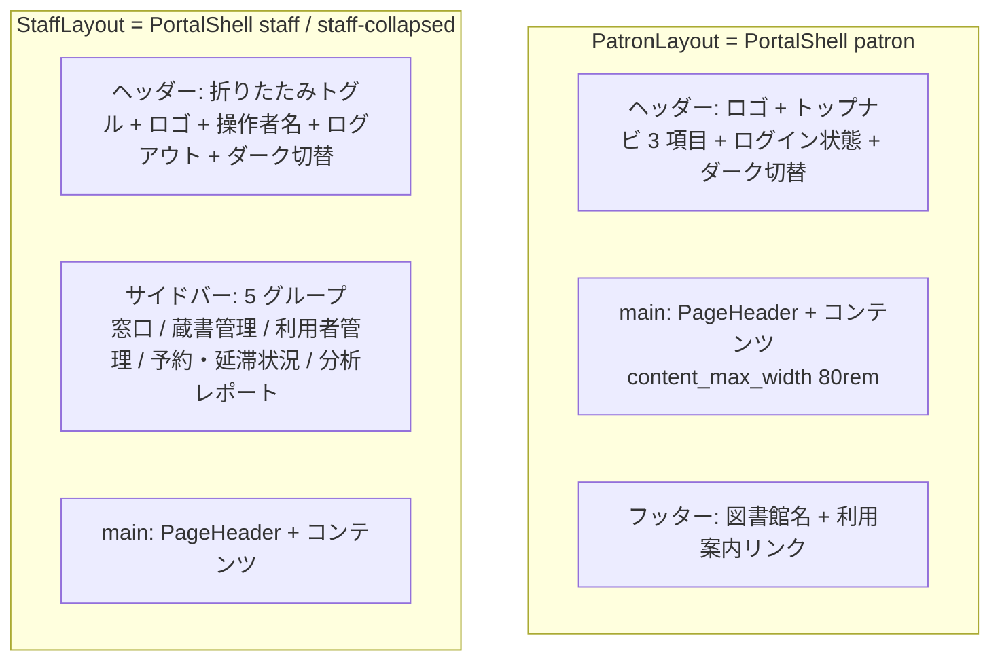
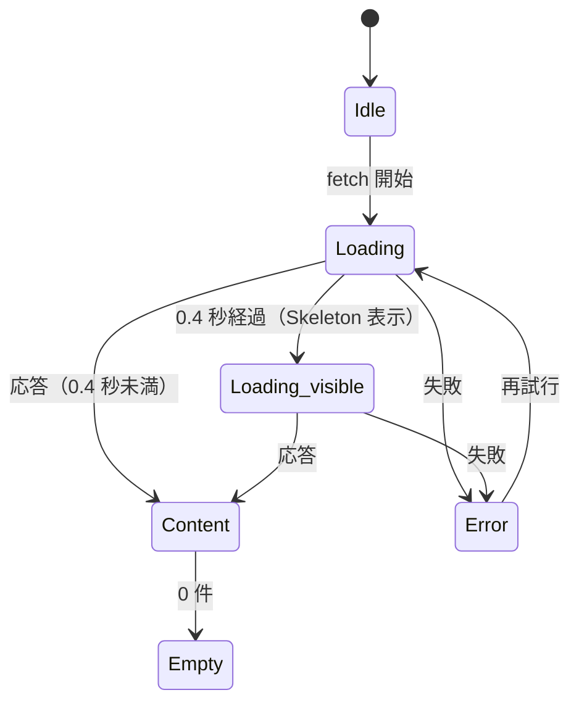
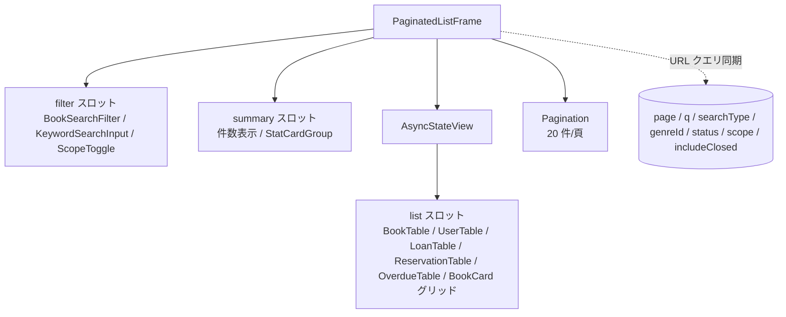
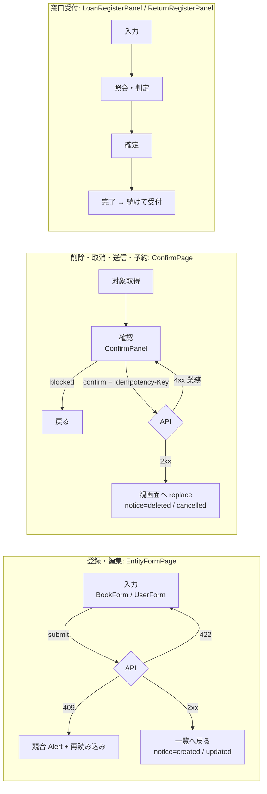

# 共通コンポーネント設計仕様

対象: 図書館蔵書管理システム（brand: Libro）
入力: 全 UC の tier-frontend-user.md（6 UC）/ tier-frontend-staff.md（18 UC）, design digest（components / portals / screens）, ux-design.md, ui-design.md
event_id: 20260903_044456_spec_generation

## 設計方針

- 共通コンポーネントは **design-event.yaml のコンポーネント（UI / Domain）を組み合わせた合成コンポーネント** とし、見た目のプリミティブは新設しない
- 配置は `@/components/common/{Name}`。design-event.yaml の UI コンポーネントは `@/components/ui/{Name}`、Domain コンポーネントは `@/components/domain/{Name}` から import する（Storybook 取り込み先）
- 各 UC の `{Name}Page` は「レイアウトシェル + 共通パターン + Domain コンポーネント」の組み立てだけを持ち、URL クエリ同期・ローディング遅延・エラー正規化・二重送信防止などの横断ロジックは共通側に寄せる
- 状態管理は画面内状態のみ（arch CLP-012: 状態管理層なし）。共通コンポーネントは制御コンポーネント（value / onChange）または hooks で提供し、グローバルストアを持たない
- ux-design.md「ページ間の遷移ルール」と ui-design.md「共通レイアウト要素」「コンポーネント選定ルール」に従う。本書はその実装単位への落とし込みである

## 抽出結果サマリー

24 tier-frontend ファイル（23 UC。「書籍を検索する」は patron / staff の 2 tier）を俯瞰し、2 UC 以上で反復するパターンを 16 個の共通コンポーネントと 6 個の共通 hooks に整理した。

| 分類 | 共通コンポーネント | 利用 UC（tier）数 |
|------|------------------|-----------------|
| レイアウトシェル | PatronLayout | 6 |
| レイアウトシェル | StaffLayout | 18 |
| レイアウトシェル | PageHeader | 24 |
| 状態表示 | AsyncStateView | 22 |
| 状態表示 | ErrorAlert | 24 |
| 状態表示 | NoticeAlert | 3（表示）+ 8（発行） |
| 一覧 | PaginatedListFrame | 9 |
| 一覧 | KeywordSearchInput | 3 |
| 一覧 | ScopeToggle | 6 |
| 一覧 | StatCardGroup | 5 |
| 一覧 | CollapsibleSection | 2 |
| フォーム | EntityFormPage | 4 |
| フォーム | ConfirmPage | 5 |
| フォーム | SubmitButton | 11 |
| ナビゲーション | BackLink | 10 |
| ナビゲーション | CounterHandoffActions | 4 |
| 分析 | PeriodReportFrame | 2 |

UC（tier）の一覧と略称（以降の「利用 UC」列で使用）:

| 略称 | UC | tier | ポータル |
|------|----|------|---------|
| P-検索 | 書籍を検索する | frontend-user | patron |
| P-詳細 | 書籍詳細を参照する | frontend-user | patron |
| P-予約登録 | 予約を登録する | frontend-user | patron |
| P-予約取消 | 予約を取り消す | frontend-user | patron |
| P-貸出履歴 | 貸出履歴を参照する | frontend-user | patron |
| P-予約状況 | 予約状況を参照する | frontend-user | patron |
| S-検索 | 書籍を検索する | frontend-staff | staff |
| S-書籍一覧 | 書籍一覧を参照する | frontend-staff | staff |
| S-書籍登録 | 書籍を登録する | frontend-staff | staff |
| S-書籍編集 | 書籍を編集する | frontend-staff | staff |
| S-書籍削除 | 書籍を削除する | frontend-staff | staff |
| S-貸出登録 | 貸出を登録する | frontend-staff | staff |
| S-返却登録 | 返却を登録する | frontend-staff | staff |
| S-返却通知 | 返却通知を送信する | frontend-staff | staff |
| S-予約一覧 | 予約一覧を参照する | frontend-staff | staff |
| S-延滞一覧 | 延滞一覧を参照する | frontend-staff | staff |
| S-利用状況 | 利用者の利用状況を参照する | frontend-staff | staff |
| S-利用者一覧 | 利用者一覧を参照する | frontend-staff | staff |
| S-利用者登録 | 利用者を登録する | frontend-staff | staff |
| S-利用者編集 | 利用者を編集する | frontend-staff | staff |
| S-利用者削除 | 利用者を削除する | frontend-staff | staff |
| S-在庫状況 | 在庫状況一覧を参照する | frontend-staff | staff |
| S-ランキング | 人気書籍ランキングを参照する | frontend-staff | staff |
| S-貸出統計 | 期間別貸出統計を参照する | frontend-staff | staff |

## design-event コンポーネントとの関係

### UI コンポーネント（design components.ui）

| design コンポーネント | 関係 | 共通コンポーネント側の扱い |
|---------------------|------|------------------------|
| PortalShell（patron / staff / staff-collapsed） | 組み合わせ | PatronLayout / StaffLayout が包む。ナビのアクティブ判定・折りたたみ状態・認証ガードを付与 |
| Button | 再利用 | SubmitButton（submitting 連動）、BackLink（ghost）、PageHeader の主要操作、CounterHandoffActions が variant を固定して利用 |
| Alert | 再利用 | ErrorAlert（destructive / warning + 再試行）、NoticeAlert（success）が文言と role を固定して利用 |
| Skeleton / Spinner | 再利用 | AsyncStateView が 0.4 秒遅延つきで表示。Spinner は SubmitButton 内のみ |
| EmptyState | 再利用 | AsyncStateView の empty スロット |
| Pagination | 再利用 | PaginatedListFrame が 20 件/頁・aria-current を固定して利用 |
| Input（with-icon） | 再利用 | KeywordSearchInput が Enter 送信・補助検証を付与 |
| ToggleGroup（single） | 再利用 | ScopeToggle が URL クエリ同期を付与 |
| Table | 再利用 | Domain の各 Table が内包。共通側は直接触らない |
| Card | 再利用 | S-利用状況 の利用者要約でそのまま利用（共通化しない） |
| Select | 再利用 | BookSearchFilter / BookForm / S-在庫状況 でそのまま利用（共通化しない） |
| Badge | 再利用 | S-利用者編集 の利用者区分でそのまま利用（共通化しない） |
| Modal（confirm / destructive-confirm） | 未使用 | 全 UC が確認を画面（ConfirmPanel）で行うため、本 event の UC では利用箇所なし（要確認 3） |
| Icon | 再利用 | 各共通コンポーネントの装飾（ナビ・開示アイコン・空状態） |

### Domain コンポーネント（design components.domain）

Domain コンポーネントはそのまま各 UC から利用する。共通コンポーネントは Domain を「置く場所」と「周辺の横断ロジック」を提供し、Domain 自体を再定義しない。

| design Domain コンポーネント | 利用 UC | 共通コンポーネントとの組み合わせ |
|---------------------------|--------|------------------------------|
| BookSearchFilter（patron / staff） | P-検索, S-検索, S-書籍一覧 | PaginatedListFrame の filter スロット |
| BookCard（compact / detail） | P-検索, P-詳細, P-予約登録, S-予約一覧 | AsyncStateView の content スロット |
| BookTable（manage / inventory / select） | S-書籍一覧, S-検索, S-在庫状況 | PaginatedListFrame の list スロット |
| UserTable | S-利用者一覧 | PaginatedListFrame の list スロット |
| LoanTable（current / history） | P-貸出履歴, S-利用状況 | ScopeToggle + PaginatedListFrame |
| ReservationTable | P-予約状況, S-予約一覧, S-利用状況, S-返却通知 | ScopeToggle + PaginatedListFrame / ConfirmPage の補助情報スロット |
| OverdueTable | S-延滞一覧 | PaginatedListFrame + CollapsibleSection（NotificationLogTable 行展開） |
| NotificationLogTable | S-延滞一覧, S-返却通知 | CollapsibleSection |
| BookForm / UserForm（create / edit） | S-書籍登録, S-書籍編集, S-利用者登録, S-利用者編集 | EntityFormPage の form スロット |
| ConfirmPanel（destructive / primary / blocked） | S-書籍削除, S-利用者削除, S-返却通知, P-予約取消, P-予約登録 | ConfirmPage の本体 |
| LoanRegisterPanel / ReturnRegisterPanel | S-貸出登録, S-返却登録 | StaffLayout + ErrorAlert + useIdempotencyKey。パネル自体が受付フローを内包するため共通シェルは持たない |
| BookStatusBadge / LoanStatusBadge / ReservationStatusBadge / DueDateIndicator / ReservationQueueTracker | 状態表示のある全 UC | PageHeader の status スロット、各 Table セル内 |
| PiiMaskedText（email / phone / address） | S-利用者一覧, S-利用者編集, S-利用者削除, S-利用状況, S-延滞一覧, S-返却通知 | usePiiReveal hook で開示状態と再取得を統一 |
| StatCard | S-延滞一覧, S-利用状況, S-在庫状況, S-ランキング, S-貸出統計 | StatCardGroup |
| PeriodSelector / PeriodStatChart / RankingList | S-貸出統計, S-ランキング | PeriodReportFrame |

## 共通レイアウトシェル

### レイアウト構造

### PatronLayout

- **インポート**: `@/components/common/PatronLayout`
- **役割**: 利用者ポータル全画面の外枠。PortalShell（patron）にトップナビのアクティブ判定・認証ガード・ダークモード切替を付与する
- **ベース**: PortalShell（variant: patron）+ Icon
- **Props**:
  | Prop | 型 | 必須 | 説明 |
  |------|---|------|------|
  | activeNav | 'search' \| 'myLoans' \| 'myReservations' | Yes | トップナビのアクティブ項目（蔵書検索 / マイ貸出履歴 / マイ予約状況） |
  | requireAuth | boolean | No | true のとき未認証なら IdP ログインへ遷移し、ログイン後に元 URL へ戻す（`/me/*` と予約系画面で true。既定 false） |
  | children | ReactNode | Yes | main 領域の内容 |
- **振る舞い**:
  - ランドマーク（header / nav / main / footer）を明示する（ux-design アクセシビリティ方針）
  - 司書向け導線を一切出さない（design nfr_decisions E.5.3.1）
  - sm 未満ではトップナビをハンバーガーに畳む（ui-design レスポンシブ戦略）
  - ダークモード切替はヘッダー右端。選択はセッション限り（ui-design ダークモード対応方針）
- **利用 UC（6）**: P-検索, P-詳細, P-予約登録, P-予約取消, P-貸出履歴, P-予約状況

### StaffLayout

- **インポート**: `@/components/common/StaffLayout`
- **役割**: 司書ポータル全画面の外枠。PortalShell（staff / staff-collapsed）にサイドバーのアクティブ判定・折りたたみ状態・認証 + 司書区分ガードを付与する
- **ベース**: PortalShell（variant: staff / staff-collapsed）+ Icon
- **Props**:
  | Prop | 型 | 必須 | 説明 |
  |------|---|------|------|
  | activeGroup | 'counter' \| 'books' \| 'users' \| 'reservations' \| 'reports' | Yes | サイドバーのアクティブグループ（窓口 / 蔵書管理 / 利用者管理 / 予約・延滞状況 / 分析レポート） |
  | activeItem | string | Yes | グループ内のアクティブ項目キー（例: 'loanRegister', 'bookList', 'overdues', 'inventory'） |
  | children | ReactNode | Yes | main 領域の内容 |
- **振る舞い**:
  - 全画面で認証 + 利用者区分「司書」を要求する。未認証は IdP へ、司書以外は 403 相当の ErrorAlert を main に表示する
  - 折りたたみ状態は画面内状態（セッション限り）。lg 以上は展開（16rem）、md は `staff-collapsed`（4rem）を既定、sm 未満はオーバーレイ（既定閉）
  - サイドバー項目は ux-design「ナビゲーション構造」の 5 グループ / 各項目と 1:1
- **利用 UC（18）**: S-検索, S-書籍一覧, S-書籍登録, S-書籍編集, S-書籍削除, S-貸出登録, S-返却登録, S-返却通知, S-予約一覧, S-延滞一覧, S-利用状況, S-利用者一覧, S-利用者登録, S-利用者編集, S-利用者削除, S-在庫状況, S-ランキング, S-貸出統計

### PageHeader

- **インポート**: `@/components/common/PageHeader`
- **役割**: ページ見出し + 状態バッジ + 主要操作 + 通知領域を固定レイアウトで並べる。全 UC の「ページ見出し」「見出し直下の Alert」「見出し横のバッジ」パターンを共通化する
- **ベース**: Button（default）+ Alert 領域（ErrorAlert / NoticeAlert を子として受ける）
- **Props**:
  | Prop | 型 | 必須 | 説明 |
  |------|---|------|------|
  | title | string | Yes | ページ見出し（h1） |
  | subtitle | string | No | 見出し横の補助テキスト（例: 書籍 ID、利用者番号） |
  | status | ReactNode | No | 見出し横の状態バッジ（BookStatusBadge 等） |
  | primaryAction | { label: string; onClick: () => void; icon?: string } | No | 右端の主要操作（例: 「書籍を登録」「利用者を登録」） |
  | back | { label: string; onClick: () => void } | No | 見出し上の BackLink |
  | notices | ReactNode | No | 見出し直下の Alert 領域（NoticeAlert / ErrorAlert / 業務 Alert） |
- **振る舞い**: title は 1 画面 1 つ。status → primaryAction の順で視覚階層をつける（ux-design: 視覚的階層）
- **利用 UC（24）**: 全 UC（tier）

## 共通状態表示パターン

### 状態遷移

### AsyncStateView

- **インポート**: `@/components/common/AsyncStateView`
- **役割**: ローディング（0.4 秒遅延 Skeleton）/ エラー（ErrorAlert + 再試行）/ 空状態（EmptyState）/ コンテンツの出し分けを 1 か所で行う。各 UC の「読み込み中 / 該当なし / 取得失敗」3 行を置き換える
- **ベース**: Skeleton（line / table / card）+ EmptyState（default / with-action）+ ErrorAlert
- **Props**:
  | Prop | 型 | 必須 | 説明 |
  |------|---|------|------|
  | loading | boolean | Yes | 取得中 |
  | error | NormalizedApiError \| null | Yes | 正規化済みエラー（`@/lib/api/errors` の統一エラー型） |
  | empty | boolean | Yes | 取得完了かつ 0 件 |
  | skeleton | { variant: 'line' \| 'table' \| 'card'; count?: number } | Yes | 表示する Skeleton（例: card × 6、line × 6、table） |
  | emptyState | { title: string; description?: string; action?: { label: string; onClick: () => void } } | Yes | EmptyState の内容。action があれば with-action |
  | onRetry | () => void | No | ErrorAlert の再試行 |
  | delayMs | number | No | Skeleton 表示までの遅延（既定 400。Doherty Threshold） |
  | loadingLabel | string | No | Skeleton に添える文言（分析画面の「集計中…」。NFR B.2.1.3） |
  | children | ReactNode | Yes | コンテンツ |
- **振る舞い**:
  - Skeleton 表示中はレイアウトシフトを起こさない（Skeleton の variant はコンテンツ形状に合わせる）
  - prefers-reduced-motion のときシマーを止める
  - 404（対象不在）は `emptyState` に寄せ、5xx / ネットワーク断は ErrorAlert に寄せる。振り分けは `error.kind` で行う
- **利用 UC（22）**: P-検索, P-詳細, P-予約登録, P-予約取消, P-貸出履歴, P-予約状況, S-検索, S-書籍一覧, S-書籍編集, S-書籍削除, S-返却登録, S-返却通知, S-予約一覧, S-延滞一覧, S-利用状況, S-利用者一覧, S-利用者編集, S-利用者削除, S-在庫状況, S-ランキング, S-貸出統計（S-書籍登録, S-利用者登録, S-貸出登録 は取得系がないため ErrorAlert のみ）

### ErrorAlert

- **インポート**: `@/components/common/ErrorAlert`
- **役割**: api client が正規化した統一エラー型を Alert に変換する。HTTP ステータス → 文言・トーン・後続操作の対応を全 UC で統一する
- **ベース**: Alert（destructive / warning）+ Button（secondary）
- **Props**:
  | Prop | 型 | 必須 | 説明 |
  |------|---|------|------|
  | error | NormalizedApiError | Yes | `{ kind: 'unauthorized' \| 'forbidden' \| 'notFound' \| 'validation' \| 'conflict' \| 'business' \| 'server' \| 'network'; message: string; reasonCode?: string; fieldErrors?: Record<string, string> }` |
  | onRetry | () => void | No | 再試行ボタン（server / network のとき表示） |
  | onReload | () => void | No | 再読み込みボタン（conflict のとき表示） |
  | audience | 'patron' \| 'staff' | No | 文言の丁寧さと理由コード表示の切替（staff は reasonCode を併記。既定は Layout から継承） |
- **振る舞い**:
  | error.kind | トーン | role | 文言 / 操作 |
  |-----------|-------|------|-----------|
  | unauthorized | （表示しない） | - | IdP 再認証に遷移し、ログイン後に元 URL へ戻す |
  | forbidden | destructive | alert | 「この画面を表示する権限がありません」 |
  | validation | destructive | alert | 「入力内容を確認してください」+ fieldErrors はフォーム側へ引き渡す |
  | conflict | warning | alert | 「他の司書が更新しました。再読み込みしてください」+ 再読み込み |
  | business | destructive | alert | `message`（「貸出できません: {根拠}」形式は呼び出し側が組む） |
  | server / network | destructive | alert | 「{操作}できませんでした。しばらくしてからもう一度お試しください」+ 再試行 |
  - コンソールログに個人情報・トークン・リクエスト本文を出さない（arch CLR-009）
- **利用 UC（24）**: 全 UC（tier）

### NoticeAlert

- **インポート**: `@/components/common/NoticeAlert`
- **役割**: 前画面の完了結果を URL クエリ `?notice=` で受け取り、Alert（success）を 1 回だけ表示してクエリを除去する。ux-design「確定後は元の一覧に戻り、Alert（success）で結果を伝える」の実装
- **ベース**: Alert（success, role=status）
- **Props**:
  | Prop | 型 | 必須 | 説明 |
  |------|---|------|------|
  | notice | 'created' \| 'updated' \| 'deleted' \| 'cancelled' \| null | Yes | クエリから取得した通知種別 |
  | messages | Partial<Record<NoticeKind, string>> | Yes | 種別ごとの文言（例: created → 「書籍を登録しました」） |
  | onDismiss | () => void | Yes | 表示後にクエリを除去する（履歴は replace） |
- **振る舞い**: 表示は 1 回限り。ブラウザ戻るで再表示しない（replace）。発行側は `useNoticeNavigation` hook で「戻り先 URL + notice + returnQuery」を組み立てる
- **利用 UC**: 表示（3）: S-書籍一覧, S-利用者一覧, P-予約状況。発行（8）: S-書籍登録, S-書籍編集, S-書籍削除, S-利用者登録, S-利用者編集, S-利用者削除, P-予約取消, P-予約登録（マイ予約状況へ遷移する導線）

## 共通一覧パターン

### 構造

### PaginatedListFrame

- **インポート**: `@/components/common/PaginatedListFrame`
- **役割**: フィルター + 一覧 + Pagination の縦配置と、URL クエリとの双方向同期（検索条件・ページ番号の復元）を提供する。ux-design「戻り先の検索条件・ページ番号は URL クエリで保持する」の実装
- **ベース**: Pagination（default / single-page）+ AsyncStateView + useUrlQueryState
- **Props**:
  | Prop | 型 | 必須 | 説明 |
  |------|---|------|------|
  | filter | ReactNode | No | 上部のフィルター（BookSearchFilter / KeywordSearchInput / ScopeToggle） |
  | summary | ReactNode | No | 件数表示や StatCardGroup |
  | page | number | Yes | 現在ページ（1 始まり） |
  | totalCount | number | Yes | 総件数 |
  | pageSize | number | No | 既定 20（NFR 性能: 一覧 5 秒以内） |
  | onPageChange | (page: number) => void | Yes | ページ変更（呼び出し側は URL クエリを更新して再取得） |
  | loading / error / empty / emptyState / onRetry / skeleton | AsyncStateView と同じ | Yes | 一覧の状態 |
  | children | ReactNode | Yes | 一覧本体（Table または BookCard グリッド） |
- **振る舞い**:
  - フィルター変更時は page を 1 に戻す（呼び出し側の規約。frame は `resetPageOnFilterChange` を default true で提供）
  - Pagination は 1 ページのとき `single-page`。現在ページを aria-current で示す
  - sm 未満では Table を横スクロール（先頭列 sticky）。BookCard グリッドは lg 3 / md 2 / sm 1 列
- **利用 UC（9）**: P-検索, S-検索, S-書籍一覧, S-予約一覧, S-延滞一覧, P-貸出履歴, P-予約状況, S-利用者一覧, S-在庫状況

### KeywordSearchInput

- **インポート**: `@/components/common/KeywordSearchInput`
- **役割**: 単一条件（利用者番号 / 氏名）の検索入力。Enter で送信、補助検証、送信中 disabled を統一する。ui-design「利用者検索は Input（with-icon）」の実装
- **ベース**: Input（with-icon / error / disabled）+ Button（default）
- **Props**:
  | Prop | 型 | 必須 | 説明 |
  |------|---|------|------|
  | value | string | Yes | 入力値 |
  | onChange | (value: string) => void | Yes | 入力変更 |
  | onSubmit | () => void | Yes | Enter / 検索ボタン |
  | placeholder | string | Yes | 例: 「利用者番号または氏名で検索」 |
  | maxLength | number | No | 既定 100 |
  | error | string | No | 補助検証エラー（最終判定は API。arch LP-029） |
  | disabled | boolean | No | 取得中 |
  | autoFocus | boolean | No | 窓口画面では true（最少操作。SP-006） |
- **利用 UC（3）**: S-利用者一覧, S-利用状況, S-延滞一覧

### ScopeToggle

- **インポート**: `@/components/common/ScopeToggle`
- **役割**: 3〜5 択の表示範囲切替（現在の貸出 / 履歴、有効な予約のみ / 取消・終了も表示、状態別、表示件数）を ToggleGroup（single）で統一し、URL クエリと同期する
- **ベース**: ToggleGroup（single, sm / md）
- **Props**:
  | Prop | 型 | 必須 | 説明 |
  |------|---|------|------|
  | options | { value: string; label: string }[] | Yes | 選択肢（3〜5 件。8 値以上は Select を使う。ui-design 選定ルール） |
  | value | string | Yes | 現在値 |
  | onChange | (value: string) => void | Yes | 変更時。呼び出し側は URL クエリを更新し page を 1 に戻す |
  | size | 'sm' \| 'md' | No | 既定 md。sm 未満では md 固定（タップ領域 44px） |
  | ariaLabel | string | Yes | 「表示範囲」など |
- **利用 UC（6）**: P-貸出履歴, P-予約状況, S-利用状況（貸出 / 予約の 2 か所）, S-予約一覧, S-在庫状況, S-ランキング

### StatCardGroup

- **インポート**: `@/components/common/StatCardGroup`
- **役割**: StatCard を 2〜4 枚横並びにし、集計中 Skeleton（card × n）と選択連動（在庫状況の状態絞り込み）を提供する。ux-design「StatCard は 1 画面 3〜4 枚まで」を制約として持つ
- **ベース**: StatCard + Skeleton（card）
- **Props**:
  | Prop | 型 | 必須 | 説明 |
  |------|---|------|------|
  | items | { key: string; label: string; value: number \| null; unit?: string; delta?: number; icon?: string; tone?: 'default' \| 'destructive' }[] | Yes | 2〜4 件 |
  | loading | boolean | Yes | true のとき card Skeleton × items.length |
  | loadingLabel | string | No | 「集計中…」 |
  | activeKey | string | No | 強調するカード（ToggleGroup と連動） |
  | onSelect | (key: string) => void | No | カード選択（在庫状況: ToggleGroup の値を切り替える） |
- **振る舞い**: tone = destructive は value ≥ 1 のときのみ強調（延滞一覧の「督促失敗」）。md 未満で 2 列、sm 未満で 1 列
- **利用 UC（5）**: S-延滞一覧, S-利用状況, S-在庫状況（InventorySummaryCards を本コンポーネントで実装）, S-ランキング, S-貸出統計

### CollapsibleSection

- **インポート**: `@/components/common/CollapsibleSection`
- **役割**: 補助情報（NotificationLogTable）を折りたたみで段階的に開示する（ux-design: 段階的開示）
- **ベース**: Button（ghost, sm）+ Icon + 領域
- **Props**:
  | Prop | 型 | 必須 | 説明 |
  |------|---|------|------|
  | title | string | Yes | 「通知記録」など |
  | open | boolean | Yes | 開閉状態 |
  | onToggle | (open: boolean) => void | Yes | 切替。開いたときに遅延取得する場合は呼び出し側が fetch する |
  | count | number | No | 見出しに件数を併記 |
  | children | ReactNode | Yes | 折りたたむ内容 |
- **振る舞い**: aria-expanded / aria-controls を付与。OverdueTable の行展開はこのコンポーネントを行内に埋め込む
- **利用 UC（2）**: S-延滞一覧, S-返却通知

## 共通フォームパターン

### フロー

登録・編集は「入力 → 送信 → 完了（遷移先で通知）」、削除・取消・送信・予約申込は「取得 → 確認 → 完了」、窓口受付は「入力 → 判定 → 確定 → 完了」の 3 系統に分かれる。窓口受付は design の LoanRegisterPanel / ReturnRegisterPanel が内包するため共通シェルを設けず、hooks（useIdempotencyKey / useCounterFlow）だけを共有する。

### EntityFormPage

- **インポート**: `@/components/common/EntityFormPage`
- **役割**: BookForm / UserForm を置く登録・編集画面の共通シェル。読み込み（編集時）、422 フィールドエラーの引き渡し、409 競合、送信中の遷移ブロック、完了後の一覧復帰（returnQuery + notice）を統一する
- **ベース**: PageHeader + AsyncStateView（skeleton: line × 6）+ ErrorAlert + SubmitButton + BackLink
- **Props**:
  | Prop | 型 | 必須 | 説明 |
  |------|---|------|------|
  | mode | 'create' \| 'edit' | Yes | 見出し文言と送信ボタン文言（「登録」/「保存」）に反映 |
  | title | string | Yes | 「書籍を登録」「利用者を編集」 |
  | status | ReactNode | No | 見出し横の状態バッジ（S-書籍編集の BookStatusBadge） |
  | loading | boolean | No | 編集時の初期取得 |
  | loadError | NormalizedApiError \| null | No | 初期取得エラー（404 は EmptyState with-action「一覧へ戻る」） |
  | submitError | NormalizedApiError \| null | No | 送信エラー（422 は fieldErrors をフォームへ、409 は競合 Alert + 再読み込み） |
  | submitting | boolean | Yes | 送信中は全入力とボタンを disabled、画面遷移をブロック |
  | onReload | () => void | No | 競合時の再取得 |
  | onCancel | () => void | Yes | 論理上の親（一覧）へ returnQuery を引き継いで戻る |
  | children | (ctx: { fieldErrors: Record<string, string> }) => ReactNode | Yes | BookForm / UserForm を描画する render prop |
- **振る舞い**:
  - フォーム本体（中央寄せ 8col、sm では 1 カラム）のレイアウトを持つ
  - 成功時の遷移は呼び出し側が `useNoticeNavigation` で行う（S-利用者登録のみ同一画面で Registered を表示するため、`children` 外の `notices` に Alert（success）を出せる）
- **利用 UC（4）**: S-書籍登録, S-書籍編集, S-利用者登録, S-利用者編集

### ConfirmPage

- **インポート**: `@/components/common/ConfirmPage`
- **役割**: ConfirmPanel を中心とした確認画面の共通シェル。対象の取得、blocked 判定、Idempotency-Key 付き確定、確定後の履歴 replace、直接 URL アクセス時の要約表示を統一する（ux-design 遷移ルール、arch SR-005）
- **ベース**: PageHeader + AsyncStateView（skeleton: card）+ ConfirmPanel + ErrorAlert + BackLink + useIdempotencyKey
- **Props**:
  | Prop | 型 | 必須 | 説明 |
  |------|---|------|------|
  | title | string | Yes | ConfirmPanel.title（「書籍を削除しますか」「予約を申し込みます」） |
  | tone | 'destructive' \| 'primary' | Yes | 削除・取消は destructive、送信・予約申込は primary |
  | blocked | boolean | Yes | 実行不可（貸出中のため削除不可 等）。true のとき確定ボタン非表示、impact に根拠 |
  | summary | ReactNode | Yes | 対象の要約（Badge / PiiMaskedText / ReservationQueueTracker を含めてよい） |
  | impact | string | Yes | 影響文言（複数理由は改行併記） |
  | supplement | ReactNode | No | 補助情報（S-返却通知の ReservationTable / CollapsibleSection(NotificationLogTable)） |
  | loading / loadError / emptyState | AsyncStateView と同じ | Yes | 対象取得の状態（404 / 403 は EmptyState with-action「一覧へ戻る」） |
  | submitting | boolean | Yes | 確定送信中 |
  | submitError | NormalizedApiError \| null | No | 確定失敗（business は panel 上部の Alert、server / network は再試行） |
  | confirmLabel | string | Yes | 「削除する」「予約を取り消す」「送信を確定」「予約を確定」 |
  | onConfirm | () => void | Yes | 確定。呼び出し側は useIdempotencyKey のキーを付けて API を呼ぶ |
  | onCancel | () => void | Yes | 論理上の親画面へ戻る |
  | doneActions | { label: string; onClick: () => void; variant?: 'default' \| 'secondary' }[] | No | 同一画面で完了を表示する UC（P-予約登録 / S-返却通知）の完了後導線 |
- **振る舞い**:
  - 確定後は履歴を replace し、ブラウザ戻るで確認画面に戻れないようにする
  - フォーカストラップと Esc（戻る）を持つ（ux-design アクセシビリティ方針）
  - ConfirmPanel の variant は `tone` と `blocked` から導出する（blocked=true → variant 'blocked'）
- **利用 UC（5）**: S-書籍削除, S-利用者削除, S-返却通知, P-予約取消, P-予約登録

### SubmitButton

- **インポート**: `@/components/common/SubmitButton`
- **役割**: 送信ボタンの submitting 連動（disabled + Spinner(sm) + aria-busy）を統一し、二重送信を防ぐ（arch SR-005）
- **ベース**: Button（default / destructive / secondary）+ Spinner（sm）
- **Props**:
  | Prop | 型 | 必須 | 説明 |
  |------|---|------|------|
  | label | string | Yes | 「登録」「保存」「削除する」「貸出を確定」 |
  | submitting | boolean | Yes | true のとき disabled + Spinner |
  | variant | 'default' \| 'destructive' \| 'secondary' | No | 既定 default |
  | size | 'md' \| 'lg' | No | 既定 md。sm 未満は md 固定 |
  | type | 'submit' \| 'button' | No | 既定 submit |
  | onClick | () => void | No | type=button のとき |
- **利用 UC（11）**: S-書籍登録, S-書籍編集, S-書籍削除, S-利用者登録, S-利用者編集, S-利用者削除, S-貸出登録, S-返却登録, S-返却通知, P-予約登録, P-予約取消

## 共通ナビゲーションパターン

### BackLink

- **インポート**: `@/components/common/BackLink`
- **役割**: 論理上の親画面へ戻るリンク。履歴の 1 つ前ではなく親画面 URL に returnQuery（検索条件・ページ）を引き継いで遷移する（ux-design 遷移ルール）
- **ベース**: Button（ghost）+ Icon
- **Props**:
  | Prop | 型 | 必須 | 説明 |
  |------|---|------|------|
  | label | string | Yes | 「検索結果へ戻る」「蔵書一覧へ戻る」 |
  | to | string | Yes | 親画面のパス |
  | returnQuery | Record<string, string \| number \| undefined> | No | 引き継ぐクエリ（useUrlQueryState の値をそのまま渡す） |
  | replace | boolean | No | 確定後の戻りでは true |
- **利用 UC（10）**: P-詳細, P-予約登録, P-予約取消, S-書籍登録, S-書籍編集, S-書籍削除, S-利用者登録, S-利用者編集, S-利用者削除, S-返却通知

### CounterHandoffActions

- **インポート**: `@/components/common/CounterHandoffActions`
- **役割**: 照会・一覧画面から窓口受付画面（貸出受付 / 返却受付）へ、利用者番号・書籍 ID をクエリで引き継いで遷移するボタン群（ux-design: 「照会画面から利用者番号を引き継いで受付画面に遷移する」）
- **ベース**: Button（secondary）
- **Props**:
  | Prop | 型 | 必須 | 説明 |
  |------|---|------|------|
  | userNumber | string | No | あれば「貸出受付へ」に `?userNumber=` を付与 |
  | bookId | string | No | あれば「返却受付へ」「貸出受付へ」に `?bookId=` を付与 |
  | actions | ('loan' \| 'return')[] | Yes | 表示するボタン |
  | disabled | boolean | No | 貸出不可（電子書籍 / 貸出中）のとき「貸出受付へ」を非表示または disabled |
- **利用 UC（4）**: S-予約一覧, S-利用状況, S-延滞一覧, S-検索（BookTable select の操作列）

## 分析パターン

### PeriodReportFrame

- **インポート**: `@/components/common/PeriodReportFrame`
- **役割**: PeriodSelector を上部に置き、granularity / from / to を URL クエリと同期して分析 3 画面間で期間を引き継ぐ。集計中は StatCardGroup とチャート領域を Skeleton にし「集計中…」を出す
- **ベース**: PeriodSelector + StatCardGroup + AsyncStateView（loadingLabel: 「集計中…」）
- **Props**:
  | Prop | 型 | 必須 | 説明 |
  |------|---|------|------|
  | period | { granularity: 'DAY' \| 'MONTH' \| 'YEAR'; from: string; to: string } | Yes | 現在の期間（既定: 月・直近 12 か月。デフォルト効果） |
  | onPeriodChange | (period) => void | Yes | 変更時。URL クエリを更新して再取得 |
  | maxRangeError | string | No | 上限超過時の文言 |
  | stats | StatCardGroup の items | Yes | 期間内貸出件数など |
  | extraControls | ReactNode | No | 表示件数の ScopeToggle（S-ランキング） |
  | loading / error / empty / emptyState / onRetry | AsyncStateView と同じ | Yes | 集計状態 |
  | children | ReactNode | Yes | PeriodStatChart / RankingList |
- **利用 UC（2）**: S-貸出統計, S-ランキング（S-在庫状況は期間を持たないため PaginatedListFrame + StatCardGroup を使う）

## 共通 hooks

コンポーネントではないが 2 UC 以上で反復する横断ロジック。配置は `@/components/common/hooks/{name}`。

| hook | 役割 | 利用 UC（tier）数 |
|------|------|-----------------|
| useUrlQueryState | URL クエリ ⇄ 画面内状態の双方向同期（page / q / searchType / genreId / status / scope / includeClosed / period）。編集・削除から戻ったときの復元 | 12（一覧 9 + 分析 2 + P-詳細の returnQuery） |
| useNoticeNavigation | 完了後の遷移先 URL を「親パス + returnQuery + notice」で組み立て、replace で遷移 | 8 |
| useIdempotencyKey | 確定操作ごとに Idempotency-Key を 1 回だけ生成し、再試行で同じキーを再送、完了・リセットで破棄（arch SR-005） | 7（S-貸出登録, S-返却登録, S-返却通知, P-予約登録, P-予約取消, S-書籍削除, S-利用者削除） |
| useDelayedLoading | loading が 0.4 秒継続したときだけ true を返す（AsyncStateView 内部で使用。単独利用は SubmitButton 周辺） | 22 |
| usePiiReveal | PiiMaskedText の開示状態（kind 別 / 行別）と `reveal=true` 再取得を管理。開示は画面内のみでセッション永続化しない（NFR E.1.2.1 / E.6.1.1） | 6 |
| useCounterFlow | 窓口受付の phase（input → lookup → confirm → done）と「続けて受付」リセットを管理。LoanRegisterPanel / ReturnRegisterPanel の親が使う | 2 |

## UC 別 利用マトリクス

| UC（tier） | Layout | PageHeader | AsyncStateView | ErrorAlert | NoticeAlert | PaginatedListFrame | KeywordSearchInput | ScopeToggle | StatCardGroup | CollapsibleSection | EntityFormPage | ConfirmPage | SubmitButton | BackLink | CounterHandoffActions | PeriodReportFrame |
|-----------|--------|-----------|---------------|-----------|------------|-------------------|-------------------|------------|--------------|-------------------|---------------|------------|-------------|---------|----------------------|------------------|
| P-検索 | Patron | o | o | o | | o | | | | | | | | | | |
| P-詳細 | Patron | o | o | o | | | | | | | | | | o | | |
| P-予約登録 | Patron | o | o | o | 発行 | | | | | | | o | o | o | | |
| P-予約取消 | Patron | o | o | o | 発行 | | | | | | | o | o | o | | |
| P-貸出履歴 | Patron | o | o | o | | o | | o | | | | | | | | |
| P-予約状況 | Patron | o | o | o | 表示 | o | | o | | | | | | | | |
| S-検索 | Staff | o | o | o | | o | | | | | | | | | o | |
| S-書籍一覧 | Staff | o | o | o | 表示 | o | | | | | | | | | | |
| S-書籍登録 | Staff | o | | o | 発行 | | | | | | o | | o | o | | |
| S-書籍編集 | Staff | o | o | o | 発行 | | | | | | o | | o | o | | |
| S-書籍削除 | Staff | o | o | o | 発行 | | | | | | | o | o | o | | |
| S-貸出登録 | Staff | o | | o | | | | | | | | | o | | | |
| S-返却登録 | Staff | o | o | o | | | | | | | | | o | | | |
| S-返却通知 | Staff | o | o | o | | | | | | o | | o | o | o | | |
| S-予約一覧 | Staff | o | o | o | | o | | o | | | | | | | o | |
| S-延滞一覧 | Staff | o | o | o | | o | o | | o | o | | | | | o | |
| S-利用状況 | Staff | o | o | o | | | o | o | o | | | | | | o | |
| S-利用者一覧 | Staff | o | o | o | 表示 | o | o | | | | | | | | | |
| S-利用者登録 | Staff | o | | o | 発行 | | | | | | o | | o | o | | |
| S-利用者編集 | Staff | o | o | o | 発行 | | | | | | o | | o | o | | |
| S-利用者削除 | Staff | o | o | o | 発行 | | | | | | | o | o | o | | |
| S-在庫状況 | Staff | o | o | o | | o | | o | o | | | | | | | |
| S-ランキング | Staff | o | o | o | | | | o | o | | | | | | | o |
| S-貸出統計 | Staff | o | o | o | | | | | o | | | | | | | o |

## 既存 UX / UI 設計との整合

| 参照 | 本書での対応 |
|------|------------|
| ui-design「共通レイアウト要素」 | PortalShell → PatronLayout / StaffLayout、ページ見出し + 主要操作 → PageHeader、処理結果・警告 → ErrorAlert / NoticeAlert、ページ送り → PaginatedListFrame、データなし / 読み込み中 → AsyncStateView、確認ステップ → ConfirmPage、集計値 / 期間指定 → StatCardGroup / PeriodReportFrame |
| ui-design「コンポーネント選定ルール」 | 複数値の切替（3〜5 択）→ ScopeToggle、利用者検索 → KeywordSearchInput、空・読み込み → AsyncStateView（Spinner の単独表示を禁止） |
| ui-design「レスポンシブ戦略」 | Layout（ナビの畳み方）、PaginatedListFrame（Table 横スクロール / カード列数）、StatCardGroup（列数）、EntityFormPage（1 カラム化）に分担 |
| ui-design「ダークモード対応方針」 | 切替は Layout ヘッダー。共通コンポーネントは semantic / component トークンのみ参照し色をハードコードしない |
| ux-design「ページ間の遷移ルール」 | URL クエリ保持 → useUrlQueryState / BackLink、確認画面の親復帰 + Alert(success) → ConfirmPage + useNoticeNavigation + NoticeAlert、履歴 replace → ConfirmPage、送信中の遷移ブロック → EntityFormPage / ConfirmPage / SubmitButton、利用者番号引き継ぎ → CounterHandoffActions、期間引き継ぎ → PeriodReportFrame |
| ux-design「UX 心理学」 | Doherty Threshold → AsyncStateView（400ms）、段階的開示 → CollapsibleSection / usePiiReveal、意図的な壁 → ConfirmPage、認知負荷 → StatCardGroup（最大 4 枚） |
| ux-design「アクセシビリティ方針」 | ランドマーク → Layout、role=status / alert の使い分け → NoticeAlert / ErrorAlert、aria-current → PaginatedListFrame、フォーカストラップ / Esc → ConfirmPage、reduced-motion → AsyncStateView |

## 要確認事項

1. **ConfirmPanel の `tone` と `blocked` の重複**: design は variants を destructive / primary / blocked の 3 値で持つ。UC 側は S-書籍削除 / S-利用者削除 が `tone: 'destructive' | 'blocked'`、S-返却通知 / P-予約登録 / P-予約取消 が `tone` + `blocked: boolean` と揺れている。本書の ConfirmPage は `tone ∈ {destructive, primary}` + `blocked: boolean` に正規化し、variant を導出する前提で書いた
2. **ReservationQueueTracker の `state` 値の揺れ**: design は `state` + variants（waiting / notified / completed / cancelled）。P-詳細 は `state: 'preview'`（申込前プレビュー）、P-予約登録 は `state: 'RESERVED'` + `variant: 'waiting'` を渡している。申込前プレビュー用の表現（variant 'preview' を追加するか、waiting + position 見込みで表すか）を design 側で確定する必要がある
3. **Modal（confirm / destructive-confirm）の未使用**: 本 event の 24 tier で Modal を使う UC がない（確認は全て ConfirmPanel の画面）。design の Modal を残すか、ui-design の「確認ステップ」行から Modal を外すかを確認したい
4. **design components.domain の screens に未記載の利用**: StatCard@窓口利用状況照会画面、PiiMaskedText@利用者削除確認画面・返却通知送信確認画面、BookCard@書籍別予約状況画面 を design-event.yaml へフィードバックする
