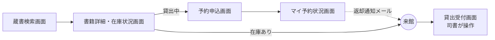
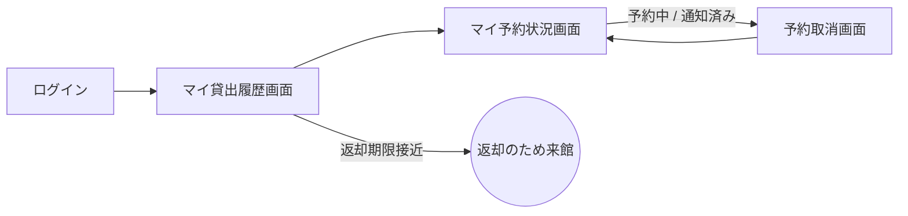
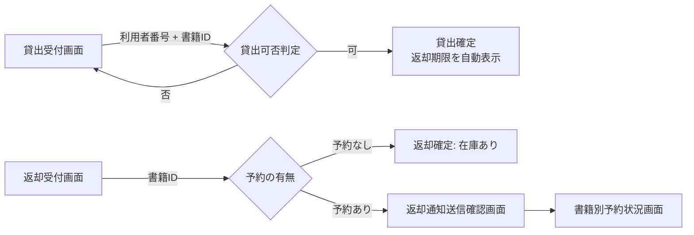
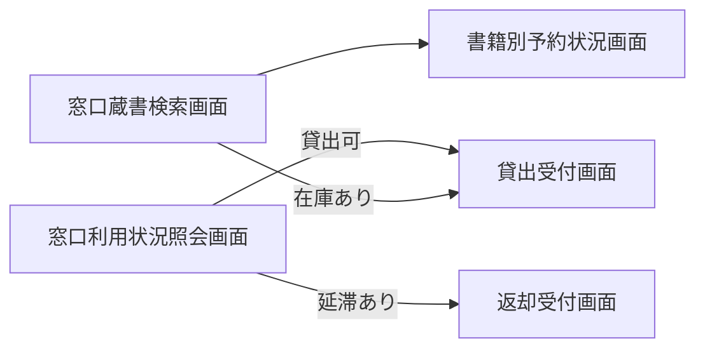
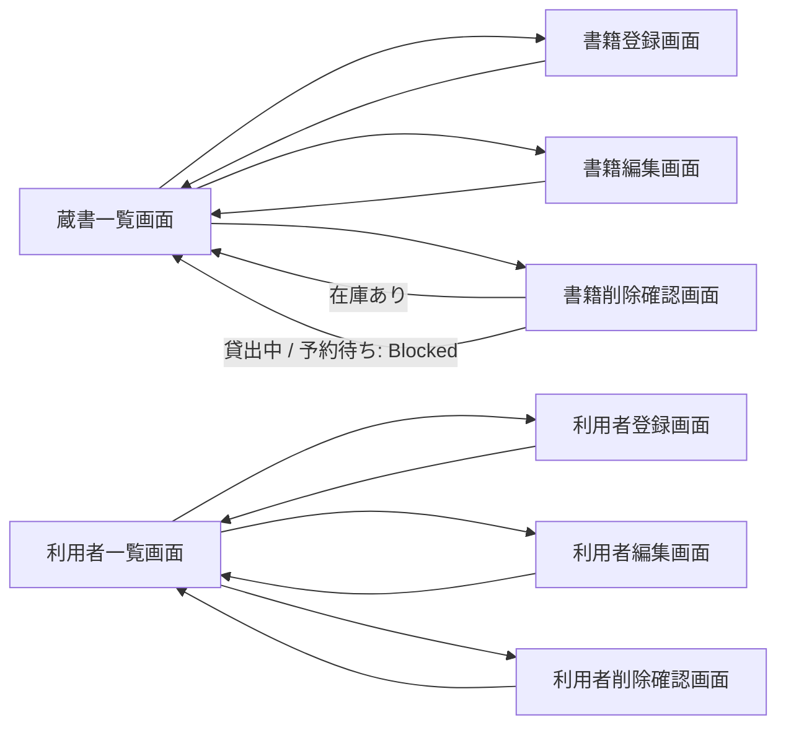
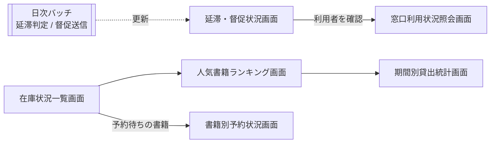
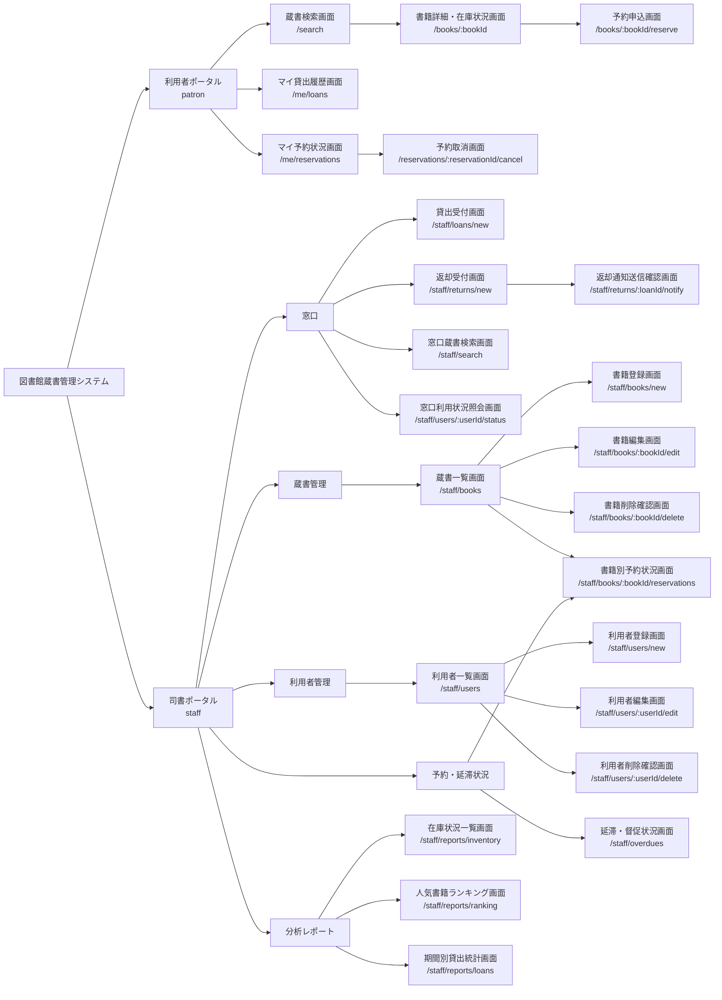

# UX デザイン仕様

対象: 図書館蔵書管理システム（brand: Libro）
入力: RDRA（6 業務 / 10 BUC / 27 UC / 24 画面）, design digest（portals / screens / components / states）, NFR category-F

## ユーザーフロー

業務フローを横断して、アクターがゴールに到達するまでの画面遷移を描く。画面名は RDRA 画面 = design screens（1:1）をそのまま使う。

### 利用者: 書籍を探して予約し、返却通知を受けて来館する

**アクター**: 利用者
**ゴール**: 貸出中の書籍を予約し、返却通知を受け取って窓口で借りる
**横断 BUC**: 書籍を検索するフロー → 書籍を予約するフロー → 書籍を返却するフロー（通知受信）→ 書籍を貸し出すフロー

**タッチポイント**:
| ステップ | 画面 | UC | 感情 | 改善機会 |
|---------|------|---|------|---------|
| 検索条件を入力する | 蔵書検索画面 | 書籍を検索する | ニュートラル | 検索条件種別の初期値をキーワードにし、1 入力で結果に到達させる |
| 在庫状況を確認する | 書籍詳細・在庫状況画面 | 書籍詳細を参照する | 貸出中ならネガティブ | BookStatusBadge の隣に「予約できます」を並記し、状態と次の行動をセットで示す |
| 予約を申し込む | 予約申込画面 | 予約を登録する | ニュートラル | ReservationQueueTracker で予約順位（何人待ち）を申込前に示す |
| 予約状況を確認する | マイ予約状況画面 | 予約状況を参照する | ポジティブ | 順位の繰り上がりをトラッカーで可視化する |
| 返却通知を受け取る | （メール） | 返却通知を送信する | ポジティブ | メール本文に来館期限と書籍名を明記する（システム外） |
| 窓口で借りる | 貸出受付画面 | 貸出を登録する | ポジティブ | 予約順位 1 位であることを LoanRegisterPanel の判定根拠に表示する |

### 利用者: 自分の利用状況を確認し、不要な予約を取り消す

**アクター**: 利用者
**ゴール**: 現在の貸出と予約を把握し、不要になった予約を取り消す
**横断 BUC**: 自分の利用状況を確認するフロー → 書籍を予約するフロー

**タッチポイント**:
| ステップ | 画面 | UC | 感情 | 改善機会 |
|---------|------|---|------|---------|
| 貸出中の書籍と期限を確認する | マイ貸出履歴画面 | 貸出履歴を参照する | 期限接近ならネガティブ | DueDateIndicator（soon / overdue）で残日数を先頭に示す |
| 予約状況を確認する | マイ予約状況画面 | 予約状況を参照する | ニュートラル | ReservationStatusBadge と順位を同一行に表示する |
| 予約を取り消す | 予約取消画面 | 予約を取り消す | ネガティブ（取り消し不安） | ConfirmPanel に対象書籍の要約と「後続の順位が繰り上がる」影響を明示する |
| 取消結果を確認する | マイ予約状況画面 | 予約状況を参照する | ニュートラル | 取消後は一覧に戻り、Alert（success）で完了を伝える |

### 司書（窓口）: 貸出と返却を受け付け、予約者へ返却通知を送る

**アクター**: 司書
**ゴール**: 窓口での貸出・返却を最少操作で記録し、予約者に返却を通知する
**横断 BUC**: 書籍を貸し出すフロー → 書籍を返却するフロー → 書籍を予約するフロー（予約状況確認）

**タッチポイント**:
| ステップ | 画面 | UC | 感情 | 改善機会 |
|---------|------|---|------|---------|
| 利用者番号と書籍 ID を入力する | 貸出受付画面 | 貸出を登録する | ニュートラル | LoanRegisterPanel の 2 入力に絞り、Enter で判定を実行する |
| 貸出可否と返却期限を確認する | 貸出受付画面 | 貸出を登録する | 否ならネガティブ | Denied 時は「貸出できません: この書籍は貸出中です」の形で根拠を並記する |
| 返却する書籍 ID を入力する | 返却受付画面 | 返却を登録する | ニュートラル | 返却後の書籍状態（在庫あり / 予約待ち）を確定前に提示する |
| 予約者への通知を確定する | 返却通知送信確認画面 | 返却通知を送信する | ニュートラル | 送信先は PiiMaskedText で伏せ、送信結果を NotificationLogTable に残す |
| 予約状況を確認する | 書籍別予約状況画面 | 予約一覧を参照する | ポジティブ | 通知済みの予約者を先頭に表示し、引き渡し先を即断できるようにする |

### 司書（窓口）: 利用者の問い合わせに応じて書籍と利用状況を調べる

**アクター**: 司書
**ゴール**: 来館者の問い合わせに対し、書籍の所在と利用者の貸出・予約状況を即答する
**横断 BUC**: 書籍を検索するフロー → 自分の利用状況を確認するフロー（司書側）

**タッチポイント**:
| ステップ | 画面 | UC | 感情 | 改善機会 |
|---------|------|---|------|---------|
| 書籍を検索する | 窓口蔵書検索画面 | 書籍を検索する | ニュートラル | BookTable（select）で状態列を常時表示し、詳細画面に遷移せず在庫状況を答えられるようにする |
| 予約状況を確認する | 書籍別予約状況画面 | 予約一覧を参照する | ニュートラル | 予約順位と受付日時で待ち人数を即答する |
| 利用者番号で照会する | 窓口利用状況照会画面 | 利用者の利用状況を参照する | ニュートラル | LoanTable / ReservationTable を 1 画面に並べ、連絡先は既定でマスクする |
| 次の操作に移る | 貸出受付画面 / 返却受付画面 | 貸出を登録する / 返却を登録する | ポジティブ | 照会画面から利用者番号を引き継いで受付画面に遷移する |

### 司書（管理）: 蔵書と利用者を登録・編集・削除する

**アクター**: 司書
**ゴール**: 蔵書情報と利用者情報を正確に維持する
**横断 BUC**: 蔵書を管理するフロー / 利用者を管理するフロー

**タッチポイント**:
| ステップ | 画面 | UC | 感情 | 改善機会 |
|---------|------|---|------|---------|
| 登録状況を確認する | 蔵書一覧画面 / 利用者一覧画面 | 書籍一覧を参照する / 利用者一覧を参照する | ニュートラル | BookSearchFilter / Input で絞り込み、20 件/頁の Pagination で 5 秒以内を守る |
| 新規登録する | 書籍登録画面 / 利用者登録画面 | 書籍を登録する / 利用者を登録する | ニュートラル | BookForm / UserForm はインライン検証（ValidationError）で再入力を最小化する |
| 編集する | 書籍編集画面 / 利用者編集画面 | 書籍を編集する / 利用者を編集する | ニュートラル | 編集画面に BookStatusBadge を出し、状態を確認しながら修正できるようにする |
| 削除する | 書籍削除確認画面 / 利用者削除確認画面 | 書籍を削除する / 利用者を削除する | ネガティブ（不可逆） | ConfirmPanel（destructive / blocked）で削除不可の根拠（貸出中・予約待ち）を示す |

### 司書（監視・分析）: 延滞と予約を監視し、蔵書の利用状況を分析する

**アクター**: 司書
**ゴール**: 延滞・督促の状況を把握し、在庫・人気・貸出傾向から選書と運営改善の判断材料を得る
**横断 BUC**: 延滞者に督促するフロー → 蔵書の利用状況を分析するフロー

**タッチポイント**:
| ステップ | 画面 | UC | 感情 | 改善機会 |
|---------|------|---|------|---------|
| 延滞件数と督促状況を確認する | 延滞・督促状況画面 | 延滞一覧を参照する | ネガティブ（対応が必要） | StatCard で延滞件数を先頭に置き、OverdueTable で最終督促日時と送信結果を並記する |
| 延滞者の利用状況を確認する | 窓口利用状況照会画面 | 利用者の利用状況を参照する | ニュートラル | 延滞行から利用者番号を引き継いで遷移する |
| 在庫状況を把握する | 在庫状況一覧画面 | 在庫状況一覧を参照する | ニュートラル | StatCard 3 枚（在庫あり / 貸出中 / 予約待ち）+ ToggleGroup で状態別に絞り込む |
| 人気書籍を把握する | 人気書籍ランキング画面 | 人気書籍ランキングを参照する | ポジティブ | PeriodSelector を統計画面と共通化し、期間を引き継ぐ |
| 貸出傾向を把握する | 期間別貸出統計画面 | 期間別貸出統計を参照する | ニュートラル | 集計中は Skeleton + 「集計中」文言で 10 秒以内の待ちを可視化する |

## 情報アーキテクチャ（IA）

### サイトマップ

### ナビゲーション構造

| ポータル | プライマリナビ | セカンダリナビ |
|---------|-------------|-------------|
| 利用者ポータル（patron） | 蔵書検索 / マイ貸出履歴 / マイ予約状況 | 書籍詳細・在庫状況 → 予約申込（詳細画面内の CTA）、マイ予約状況 → 予約取消（行内操作） |
| 司書ポータル（staff） | 窓口 / 蔵書管理 / 利用者管理 / 予約・延滞状況 / 分析レポート | 窓口: 貸出受付 / 返却受付 / 窓口蔵書検索 / 窓口利用状況照会。蔵書管理: 蔵書一覧（登録・編集・削除・予約状況は行内操作）。利用者管理: 利用者一覧（登録・編集・削除は行内操作）。予約・延滞状況: 延滞・督促状況 / 書籍別予約状況。分析レポート: 在庫状況一覧 / 人気書籍ランキング / 期間別貸出統計 |

ナビゲーションの実体は PortalShell（variants: patron / staff / staff-collapsed）。design nfr_decisions（E.5.3.1）に従い、利用者ポータルには司書向け導線を一切出さない。

プライマリナビの並び順は系列位置効果に基づく:
- 利用者ポータル: 先頭に最頻の「蔵書検索」、末尾に「マイ予約状況」（返却通知後に開く画面）
- 司書ポータル: 先頭に最頻の「窓口」、末尾に「分析レポート」（定期的に開く画面）

### ページ間の遷移ルール

- 一覧 → 詳細 / 編集 / 削除は行内操作（BookTable / UserTable の操作列）から遷移し、完了後は元の一覧に戻る。戻り先の検索条件・ページ番号は URL クエリで保持する
- 確認画面（書籍削除確認 / 利用者削除確認 / 返却通知送信確認 / 予約取消）は必ず前画面から遷移し、直接 URL アクセス時も対象の要約を表示する。確定後は元の一覧（または返却受付画面）に戻り、Alert（success）で結果を伝える
- 確認画面の「戻る」は履歴の 1 つ前ではなく、論理上の親画面（一覧 / 詳細）に戻す
- 書籍詳細・在庫状況画面の CTA は書籍の状態で切り替える: 在庫あり → 「窓口でお借りいただけます」（遷移なし）、貸出中 → 予約申込画面へ、予約待ち → 予約申込画面へ（予約順位を表示）
- 返却受付画面で予約ありの場合のみ返却通知送信確認画面へ遷移する。予約なしの場合は同一画面で完了（Done）する
- 窓口利用状況照会画面 → 貸出受付画面 / 返却受付画面へは利用者番号をクエリで引き継ぐ。延滞・督促状況画面 → 窓口利用状況照会画面も同様
- 分析レポート 3 画面間は PeriodSelector の期間（granularity / from / to）をクエリで引き継ぐ
- 利用者ポータルの `/me/*` と予約系画面は認証必須。未認証時は IdP ログインに遷移し、ログイン後に元 URL へ戻す。司書ポータルは全画面が認証 + 司書区分必須
- ブラウザの戻る操作で二重送信が起きないよう、確定後は履歴を置換（replace）して確認画面に戻れないようにする（arch SR-005）
- 送信中（Submitting）は画面遷移をブロックし、ボタンを disabled + Spinner にする

## UX 心理学に基づくインタラクション設計原則

システムの性質: 公共サービスの業務系 Web（BtoC 利用者 + BtoB 司書）。行動喚起や販促系の原則（希少性・おとり効果・変動型報酬）は採用しない。

### 適用する原則

| 原則 | 適用場面 | 具体的な設計 |
|------|---------|-----------|
| 認知負荷 (Cognitive Load) | 貸出受付画面 / 返却受付画面 / 分析レポート 3 画面 | LoanRegisterPanel は利用者番号 + 書籍 ID の 2 入力に限定する。StatCard は 1 画面 3〜4 枚まで。一覧は 20 件/頁 |
| 視覚的階層 (Visual Hierarchy) | 書籍詳細・在庫状況画面 / 延滞・督促状況画面 | 状態（BookStatusBadge / StatCard 延滞件数）を見出し直下に置き、次の行動（予約する / 督促状況）をその直後に配置する |
| 段階的開示 (Progressive Disclosure) | 利用者一覧画面 / 窓口利用状況照会画面 / 延滞・督促状況画面 | 連絡先は PiiMaskedText で既定マスクし、目のアイコンで明示操作時のみ開示する。NotificationLogTable は折りたたみで表示する |
| 意図的な壁 (Intentional Friction) | 書籍削除確認画面 / 利用者削除確認画面 / 予約取消画面 / 返却通知送信確認画面 | ConfirmPanel を必ず経由し、対象の要約と影響を確認させる。削除は destructive、送信は primary のトーンで区別する |
| デフォルト効果 (Default Bias) | 蔵書検索画面 / 書籍登録画面 / 期間別貸出統計画面 | 検索条件種別の初期値はキーワード。媒体種別の初期値は紙（初期リリース固定）。集計期間種別の初期値は月 |
| 目標勾配効果 (Goal Gradient Effect) | マイ予約状況画面 / 書籍詳細・在庫状況画面 | ReservationQueueTracker で予約中 → 通知済み → 貸出完了のステップと予約順位（あと N 人）を示し、待つ動機を維持する |
| ドハティの閾値 (Doherty Threshold) | 一覧画面全般 / 分析レポート 3 画面 | 0.4 秒を超える取得は Skeleton（line / table / card）を即時表示する。集計は「集計中」文言を添える（NFR B.2.1.3） |
| ピーク・エンドの法則 (Peak-End Rule) | 貸出受付画面（Done）/ 予約申込画面（完了）/ 貸出受付画面（Denied） | 完了時は返却期限・予約順位を大きく表示して締める。判定否は「貸出できません: {根拠}」と次の操作（返却受付へ）を添えて丁寧に回復する |
| フレーミング効果 (Framing) | 書籍詳細・在庫状況画面 / マイ貸出履歴画面 | 「貸出中」を単独で出さず「貸出中 → 予約できます」と行動可能性で提示する。返却期限は「あと 3 日」の残日数で示す |
| 選択的注意 (Selective Attention) | 延滞・督促状況画面 / マイ貸出履歴画面 | DueDateIndicator の overdue（destructive）を行内で最も強いコントラストにし、他の列は neutral に抑える |

## アクセシビリティ方針

- **WCAG 準拠レベル**: JIS X 8341-3:2016 レベル AA（WCAG 2.0 AA 相当）を目標とする。NFR F.3.1.2 は confidence low のため、利用者ポータル 6 画面を必須、司書ポータル 18 画面を努力目標とする
- **キーボード操作**: 全操作をキーボードのみで完了できる。フォーカス順は視覚順と一致させ、focus-visible リング（ring トークン）を必ず表示する。ConfirmPanel は確認画面として表示し、フォーカスを見出しへ移す（Modal は本 event の UC では未使用。使用時はフォーカストラップし、Esc で閉じる）。貸出受付・返却受付は Enter で判定・確定を実行する
- **スクリーンリーダー**: PortalShell のランドマーク（header / nav / main）を明示する。BookStatusBadge / LoanStatusBadge / ReservationStatusBadge は状態文言をテキストで持つ（色ドットは装飾扱い）。ReservationQueueTracker は「3 人中 2 番目、通知済み」のように順位と状態を読み上げる。Table はヘッダーセルと行の関連付けを持ち、Pagination は現在ページを aria-current で示す。Alert は role=status（success / info）と role=alert（warning / destructive）を使い分ける。PiiMaskedText の開示ボタンは「メールアドレスを表示」のラベルを持つ
- **色覚多様性**: 色だけで意味を伝えない（brand voice 原則）。状態は文言 + 色、DueDateIndicator は残日数の文言 + 色、PeriodStatChart はバー 1 系列 + 数値ラベルで色に依存しない。コントラスト比はテキスト 4.5:1 以上、UI 部品 3:1 以上を primary / success / warning / destructive の各トークンで満たす
- **動き**: prefers-reduced-motion を尊重し、Skeleton のシマーと遷移アニメーション（duration トークン）を無効化する
- **文字サイズ**: 200% 拡大でレイアウトが崩れない。font_size は rem 指定のみ
- **デバイス**: PC + タブレット（NFR F.1.1.3 Lv2）を前提に lg / md をフル設計、sm は簡易対応。タッチターゲットは 44px 以上（Button md 以上、Table 行高 3rem）
