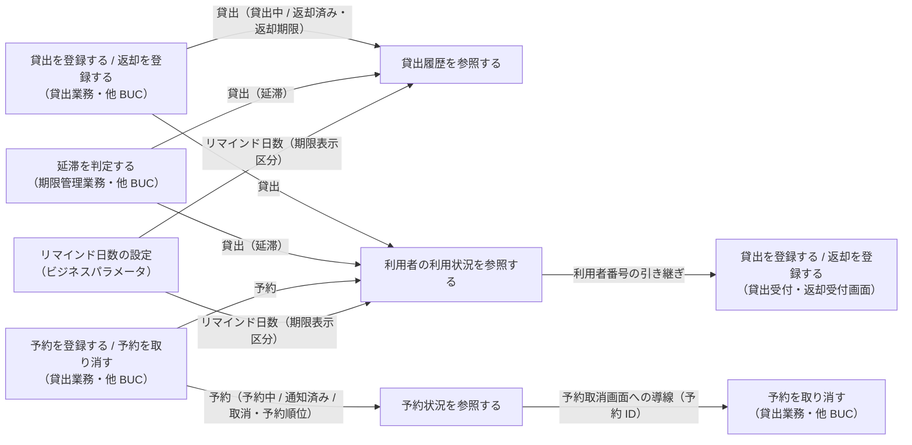
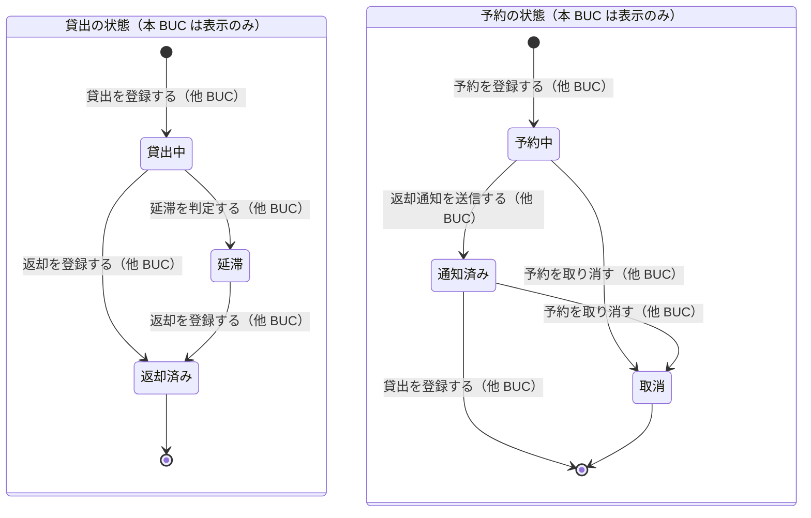

# 自分の利用状況を確認するフロー

## 概要

利用者が利用者ポータルで自分の貸出（現在・履歴）と予約状況を確認する。Web 画面を使えない利用者には、司書が窓口で利用者番号を指定して同じ情報を照会し案内する。閲覧範囲は利用者区分で切り替え、利用者は本人分のみ、司書は任意の利用者を参照できる。

## 所属 UC 一覧

| UC名 | アクター | 主な操作 | 関連情報 |
|------|---------|---------|---------|
| [貸出履歴を参照する](貸出履歴を参照する/spec.md) | 利用者 | 自分の現在の貸出（返却期限・残日数つき）と過去の貸出履歴を一覧で確認する。期限接近・延滞を強調表示する | 貸出、書籍、利用者、リマインド日数 |
| [予約状況を参照する](予約状況を参照する/spec.md) | 利用者 | 自分の予約中の書籍と予約順位・予約の状態を一覧で確認し、予約取消画面へ遷移する | 予約、書籍、利用者 |
| [利用者の利用状況を参照する](利用者の利用状況を参照する/spec.md) | 司書 | 利用者番号を指定して該当利用者の貸出（現在・履歴）と予約の状況を 1 画面で確認し、窓口で案内する。連絡先はマスク表示 | 利用者、貸出、予約、書籍 |

## UC 横断データフロー

BUC 内の UC 間で情報がどう流れるかを示す。本 BUC の 3 UC はすべて参照系で、情報の作成・更新は行わない。情報の作成元（他 BUC）と、本 BUC からの導線を示す。

### データフロー図

### 情報 CRUD マトリクス

| 情報名 | 貸出履歴を参照する | 予約状況を参照する | 利用者の利用状況を参照する |
|--------|:-----------------:|:-----------------:|:------------------------:|
| 貸出 | R（本人分。貸出日・返却期限・返却日・貸出の状態） | - | R（指定利用者分） |
| 予約 | - | R（本人分。予約順位・予約の状態・受付日時・取消日時） | R（指定利用者分） |
| 書籍 | R（書籍要約） | R（書籍要約） | R（書籍要約） |
| 利用者 | R（本人特定） | R（本人特定） | R（利用者番号・氏名・連絡先はマスク表示） |
| リマインド日数 | R（期限表示区分の判定） | - | R（期限表示区分の判定） |

## 状態遷移全体図

BUC 内で関連する状態モデルの全遷移パスと、各遷移を担当する UC を示す。本 BUC の UC は状態を遷移させず、表示のみを行う。遷移はすべて他 BUC の UC が担当する。

### 状態遷移 UC マッピング

| 状態モデル | 遷移元 | 遷移先 | 担当 UC |
|-----------|--------|--------|--------|
| 貸出の状態 | 貸出中 / 延滞 / 返却済み | （遷移なし・表示のみ。scope で現在 / 履歴を切替） | [貸出履歴を参照する](貸出履歴を参照する/spec.md) |
| 貸出の状態 | 貸出中 / 延滞 / 返却済み | （遷移なし・表示のみ。loanScope で切替） | [利用者の利用状況を参照する](利用者の利用状況を参照する/spec.md) |
| 予約の状態 | 予約中 / 通知済み / 取消 | （遷移なし・表示のみ。includeClosed で切替。予約中・通知済みは取消導線を表示） | [予約状況を参照する](予約状況を参照する/spec.md) |
| 予約の状態 | 予約中 / 通知済み / 取消 | （遷移なし・表示のみ） | [利用者の利用状況を参照する](利用者の利用状況を参照する/spec.md) |
| 貸出の状態 | （なし） | 貸出中 | 貸出を登録する（他 BUC: 貸出業務） |
| 貸出の状態 | 貸出中 | 延滞 | 延滞を判定する（他 BUC: 期限管理業務） |
| 貸出の状態 | 貸出中 / 延滞 | 返却済み | 返却を登録する（他 BUC: 貸出業務） |
| 予約の状態 | （なし） | 予約中 | 予約を登録する（他 BUC: 貸出業務） |
| 予約の状態 | 予約中 | 通知済み | 返却通知を送信する（他 BUC: 貸出業務） |
| 予約の状態 | 予約中 / 通知済み | 取消 | 予約を取り消す（他 BUC: 貸出業務） |

## BUC 内共有条件一覧

BUC 内の複数 UC で共有される条件の一覧。各条件がどの UC で適用されるかを明記する。

| 条件名 | 条件の説明 | 適用 UC |
|--------|----------|--------|
| 利用状況閲覧範囲判定 | 利用者区分が「利用者」の場合はトークンの利用者番号に紐づく貸出履歴・予約状況のみ閲覧できる（クエリの利用者番号は無視し、他人の情報は返さない）。「司書」の場合は利用者番号を指定して任意の利用者の利用状況を閲覧できる。区分外のアクセスは 403 + 監査ログ | 貸出履歴を参照する, 予約状況を参照する, 利用者の利用状況を参照する |
| 期限表示区分 | 返却済み → returned、本日 > 返却期限 → overdue、返却期限 − 本日 <= リマインド日数 → soon、それ以外 → ok。DueDatePolicy / DueDateIndicator で共通に判定・表示する | 貸出履歴を参照する, 利用者の利用状況を参照する |
| 貸出の表示範囲の切替 | `current`（既定）: 貸出中・延滞、`history`: 返却済み、`all`: すべて（貸出履歴では `scope`、窓口照会では `loanScope`） | 貸出履歴を参照する, 利用者の利用状況を参照する |
| 残日数の算出 | remainingDays = 返却期限 − 本日（負なら超過日数） | 貸出履歴を参照する, 利用者の利用状況を参照する |
| 待ち人数の算出 | totalWaiting = COUNT(有効予約（予約中・通知済み） WHERE 同一書籍) | 予約状況を参照する, 利用者の利用状況を参照する |

UC 固有の条件（参考）: 表示対象の切替（includeClosed）・取消可否（予約状況を参照する）、連絡先の開示（利用者の利用状況を参照する）。

## BUC 内共有バリエーション一覧

BUC 内の複数 UC で共有されるバリエーションの一覧。

| バリエーション名 | 値 | 適用 UC |
|----------------|---|--------|
| 利用者区分 | 利用者（`/api/v1/me/*` を本人として利用。司書トークンは 403） | 貸出履歴を参照する, 予約状況を参照する |
| 利用者区分 | 司書（`/api/v1/users/{userNumber}/usage` を利用。利用者トークンは 403） | 利用者の利用状況を参照する |
