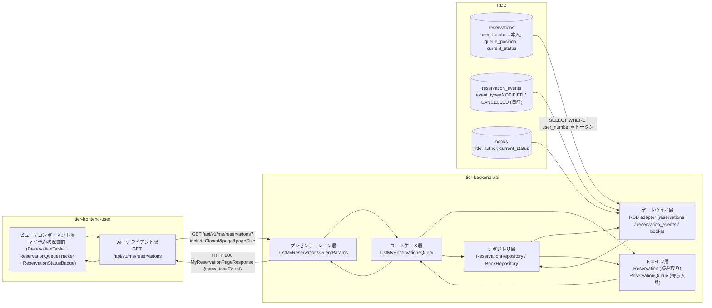
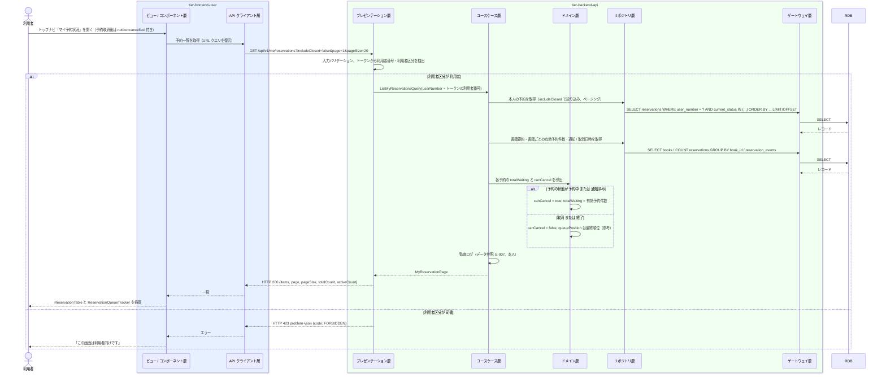

# 予約状況を参照する

## 概要

利用者が利用者ポータルで自分の予約中の書籍と予約順位、予約の状態（予約中 / 通知済み / 取消）を一覧で確認する。対象はトークンの利用者番号に紐づく予約のみ（利用状況閲覧範囲判定）。予約中・通知済みの予約からは予約取消画面へ遷移でき、通知済みの予約には来館案内を添える。

## データフロー



| レイヤー | データモデル | 変換内容 |
|---------|------------|---------|
| FE View | 予約一覧（ReservationTable: 書籍 / 受付日時 / 順位（ReservationQueueTracker）/ 状態（ReservationStatusBadge）/ 取消操作）、取消・終了の表示切替、ページ送り | URL クエリ（includeClosed, page）と同期し一覧を描画。通知済みには「来館してください」を添える |
| FE API Client | `GET /api/v1/me/reservations` | 一覧を View 用モデルに正規化、HTTP エラーを統一エラー型に変換 |
| BE presentation | ListMyReservationsQueryParams(includeClosed, page, pageSize) | 型・範囲の検証、トークンから利用者番号と利用者区分を抽出（利用者番号のクエリ指定は受け付けない） |
| BE usecase | ListMyReservationsQuery | 本人限定（トークンの利用者番号で絞る）、書籍ごとの待ち人数の結合、監査ログ（データ参照） |
| BE domain | Reservation / ReservationQueue | 読み取りのみ。待ち人数 = 書籍ごとの有効予約件数、取消可否（予約中 / 通知済み） |
| BE repository / gateway | reservations SELECT（本人・状態・ページング）、reservations SELECT（書籍ごとの有効予約件数）、reservation_events SELECT（通知日時・取消日時）、books SELECT | レコード読み取り・結合 |
| Response | MyReservationPageResponse(items[MyReservationItem], page, pageSize, totalCount, activeCount) | 一覧表示と順位の可視化 |

## 処理フロー



## バリエーション一覧

| バリエーション名 | 値 | 処理内容 | 適用 tier | 適用箇所 |
|----------------|---|---------|----------|---------|
| 利用者区分 | 利用者 | 自分の利用者番号に紐づく予約のみ参照できる（`/api/v1/me/reservations`） | tier-frontend-user / tier-backend-api | 利用者ポータル認可 / ListMyReservationsQuery |
| 利用者区分 | 司書 | 本 UC の対象外（司書は UC「利用者の利用状況を参照する」「予約一覧を参照する」で参照）。`/api/v1/me/reservations` は 403 | tier-backend-api | API 認可 |

## 分岐条件一覧

| 条件名 | 判定ルール | 適用 tier | 適用箇所 | BDD Scenario |
|--------|----------|----------|---------|-------------|
| 利用状況閲覧範囲判定 | 利用者区分が「利用者」の場合、トークンの利用者番号に紐づく予約のみ返す。他人の予約は返さない | tier-backend-api | ListMyReservationsQuery（usecase: 検索条件を本人番号に固定） | 予約中の書籍と順位を確認する / 他人の予約は表示されない |
| 表示対象の切替 | `includeClosed = false`（既定）: 予約の状態が「予約中」「通知済み」。`true`: 「取消」「終了」も含める | tier-backend-api / tier-frontend-user | ListMyReservationsQuery / ReservationTable の切替 | 取消した予約も表示する |
| 取消可否 | 予約の状態が「予約中」「通知済み」なら取消操作（予約取消画面への導線）を表示する | tier-frontend-user | ReservationTable の onCancel | 予約中の書籍と順位を確認する |

## 計算ルール一覧

| 計算名 | 入力情報 | 計算式/ロジック | 出力情報 | 適用 tier |
|--------|---------|---------------|---------|----------|
| 待ち人数 | 予約.書籍ID、予約.予約の状態 | `totalWaiting = COUNT(reservations WHERE book_id = ? AND current_status IN ('RESERVED','NOTIFIED'))` | MyReservationItem.totalWaiting | tier-backend-api |
| 前の待ち人数 | 予約.予約順位 | `aheadCount = queuePosition - 1`（画面表示「あと N 人」） | ReservationQueueTracker の表示 | tier-frontend-user |
| 通知日時 / 取消日時 | 予約イベント（通知 / 取消）の発生日時 | `notifiedAt = reservation_events(通知).occurred_at`、`cancelledAt = reservation_events(取消).occurred_at` | MyReservationItem.notifiedAt / cancelledAt | tier-backend-api |

## 状態遷移一覧

| 状態モデル | 遷移元 | 遷移先 | トリガー | 事前条件 | 事後処理 | 適用 tier |
|-----------|--------|--------|---------|---------|---------|----------|
| 予約の状態 | — | — | 予約状況を参照する | — | 状態遷移なし（予約中 / 通知済み / 取消 / 終了 を表示するのみ） | tier-backend-api |

## 関連 RDRA モデル

| モデル種別 | 要素名 | 関連 |
|-----------|--------|------|
| 業務 | 利用者サービス業務 | このUCが属する業務 |
| BUC | 自分の利用状況を確認するフロー | このUCを含むBUC |
| アクター | 利用者 | 操作するアクター |
| 情報 | 予約 | 参照する情報（予約順位・予約の状態・受付日時・取消日時） |
| 情報 | 書籍 | 参照する情報（書籍要約） |
| 情報 | 利用者 | 本人特定に参照する情報 |
| 状態 | 予約の状態 | 表示する状態（予約中 / 通知済み / 取消） |
| 条件 | 利用状況閲覧範囲判定 | 本人の予約のみ参照可 |
| バリエーション | 利用者区分 | 利用者のみ |
| 画面 | マイ予約状況画面 | 利用者が操作する画面 |

## E2E 完了条件（BDD）

### 正常系

```gherkin
Feature: 予約状況を参照する

  Scenario: 予約中の書籍と順位を確認する
    Given 利用者「田中太郎」（利用者番号「U-000123」）が利用者ポータルにログイン済み
    And 利用者番号「U-000123」の予約「R-0003」（書籍「こころ」）が予約順位 3、状態「予約中」、受付日時「2026-09-03 10:00」
    And 書籍「こころ」の有効な予約が 3 件
    And 利用者番号「U-000300」の予約「R-0002」が存在する
    When 利用者がマイ予約状況画面を開く
    Then ReservationTable に「こころ / 2026/09/03 10:00 / 予約中」の行が表示され ReservationQueueTracker に「3 人中 3 番目（あと 2 人）」と表示される
    And 行に「取り消す」ボタンが表示される
    And 利用者番号「U-000300」の予約は表示されない

  Scenario: 通知済みの予約に来館案内を表示する
    Given 利用者「田中太郎」（利用者番号「U-000123」）が利用者ポータルにログイン済み
    And 利用者番号「U-000123」の予約「R-0001」（書籍「吾輩は猫である」）が予約順位 1、状態「通知済み」、通知日時「2026-09-10 09:00」
    When 利用者がマイ予約状況画面を開く
    Then 「吾輩は猫である」の行に ReservationStatusBadge「通知済み」と「来館してください（2026/09/10 に通知）」が表示される

  Scenario: 取消した予約も表示する
    Given 利用者「田中太郎」が利用者ポータルにログイン済み
    And 本人の予約「R-0004」の状態が「取消」、取消日時「2026-09-05 12:00」
    When 利用者がマイ予約状況画面で「取消・終了も表示」を ON にする
    Then ReservationTable に「R-0004」が ReservationStatusBadge「取消」、取消日時「2026/09/05 12:00」で表示され「取り消す」ボタンは無い
```

### 異常系

```gherkin
  Scenario: 予約がない場合は空状態を表示する
    Given 利用者「田中太郎」が利用者ポータルにログイン済み
    And 本人の有効な予約が 1 件も無い
    When 利用者がマイ予約状況画面を開く
    Then EmptyState に「予約中の書籍はありません」と蔵書検索へのボタンが表示される

  Scenario: 未ログインではマイ予約状況を開けない
    Given 利用者がログインしていない
    When 利用者が /me/reservations を開く
    Then IdP のログイン画面に遷移し、ログイン後にマイ予約状況画面へ戻る

  Scenario: 司書トークンでは本人向け API を利用できない
    Given 利用者区分「司書」のトークンを持つ
    When GET /api/v1/me/reservations を送る
    Then HTTP 403 が返る
```

## ティア別仕様

- [利用者向けフロントエンド](tier-frontend-user.md)
- [Backend API](tier-backend-api.md)

### 統合 API Spec

- [OpenAPI Spec](../../../_cross-cutting/api/openapi.yaml)（全 UC 統合、Contract First 開発用）
