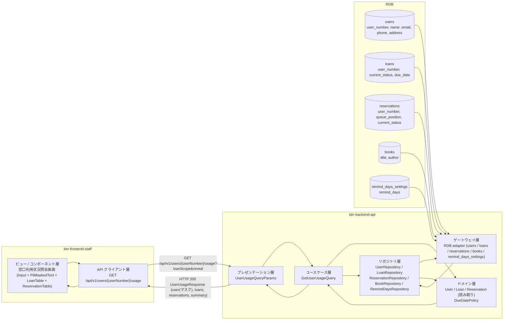
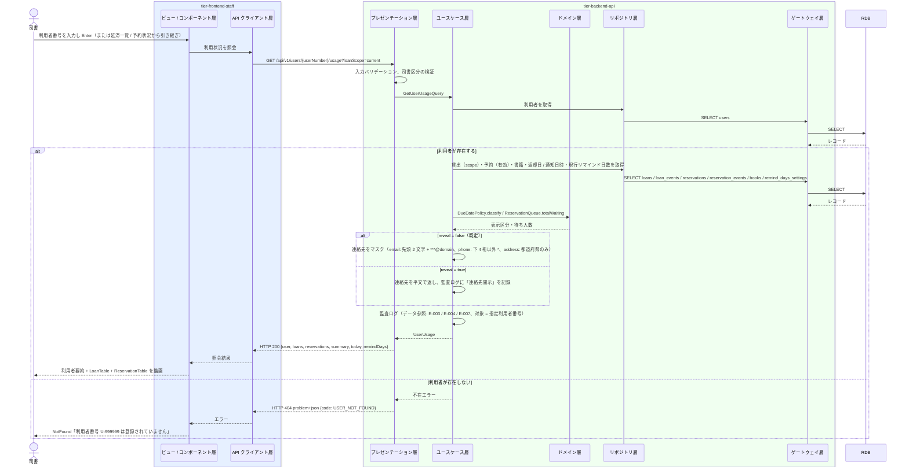

# 利用者の利用状況を参照する

## 概要

司書が窓口で利用者番号を指定し、該当利用者の貸出（現在・履歴）と予約の状況を 1 画面で確認して、Web 画面を使えない利用者に案内する。利用者区分「司書」は任意の利用者番号を指定できる（利用状況閲覧範囲判定）。連絡先は既定でマスク表示し、明示操作でのみ開示する。照会画面から貸出受付 / 返却受付へ利用者番号を引き継いで遷移できる。

## データフロー



| レイヤー | データモデル | 変換内容 |
|---------|------------|---------|
| FE View | 利用者番号入力（Input）、利用者要約（氏名 + PiiMaskedText の連絡先）、貸出一覧（LoanTable showUser=false）、予約一覧（ReservationTable）、集計（貸出中 / 延滞 / 予約中の件数）、窓口操作への導線 | 利用者番号入力 → 照会 → 2 テーブルを 1 画面に描画。連絡先は既定マスク |
| FE API Client | `GET /api/v1/users/{userNumber}/usage` | 応答を View 用モデルに正規化、HTTP エラーを統一エラー型に変換 |
| BE presentation | UserUsageQueryParams(userNumber, loanScope, reveal) | 型・形式の検証、司書区分の検証、`reveal` の受付 |
| BE usecase | GetUserUsageQuery | 利用者の存在確認、貸出・予約・書籍・リマインド日数の取得、連絡先のマスク / 開示、監査ログ（データ参照。開示は明示記録） |
| BE domain | User / Loan / Reservation / DueDatePolicy | 読み取りのみ。残日数・表示区分、予約の待ち人数・取消可否 |
| BE repository / gateway | users SELECT、loans SELECT、loan_events SELECT（返却日）、reservations SELECT、reservation_events SELECT、books SELECT、remind_days_settings SELECT | レコード読み取り・結合 |
| Response | UserUsageResponse(user, loans[MyLoanItem], reservations[MyReservationItem], summary, today, remindDays) | 1 画面の照会結果 |

## 処理フロー



## バリエーション一覧

| バリエーション名 | 値 | 処理内容 | 適用 tier | 適用箇所 |
|----------------|---|---------|----------|---------|
| 利用者区分 | 司書 | 利用者番号を指定して任意の利用者の利用状況を参照できる | tier-frontend-staff / tier-backend-api | 司書ポータル認可 / GetUserUsageQuery |
| 利用者区分 | 利用者 | 本 UC の対象外（利用者は `/api/v1/me/loans` `/api/v1/me/reservations` で本人分のみ参照）。`/api/v1/users/{userNumber}/usage` は 403 | tier-backend-api | API 認可 |

## 分岐条件一覧

| 条件名 | 判定ルール | 適用 tier | 適用箇所 | BDD Scenario |
|--------|----------|----------|---------|-------------|
| 利用状況閲覧範囲判定 | 利用者区分が「司書」の場合は利用者番号を指定して任意の利用者の利用状況を閲覧できる。「利用者」は不可（403） | tier-backend-api | GetUserUsageQuery（presentation: 司書区分検証、usecase: 監査ログ） | 利用者番号で貸出と予約の状況を照会する / 利用者は照会できない |
| 連絡先の開示 | `reveal = false`（既定）はマスク表示。`reveal = true` は平文を返し監査ログに開示を記録する | tier-backend-api / tier-frontend-staff | GetUserUsageQuery / PiiMaskedText の開示操作 | 連絡先を明示操作で開示する |
| 貸出の表示範囲 | `loanScope = current`（既定）: 貸出中・延滞。`history`: 返却済み。`all`: すべて | tier-backend-api / tier-frontend-staff | GetUserUsageQuery / LoanTable の切替 | 利用者番号で貸出と予約の状況を照会する |
| 期限表示区分 | 返却済み → returned。本日 > 返却期限 → overdue。返却期限 - 本日 <= リマインド日数 → soon。それ以外 → ok | tier-backend-api / tier-frontend-staff | DueDatePolicy / DueDateIndicator | 延滞のある利用者を照会する |

## 計算ルール一覧

| 計算名 | 入力情報 | 計算式/ロジック | 出力情報 | 適用 tier |
|--------|---------|---------------|---------|----------|
| 残日数 | 貸出.返却期限、本日 | `remainingDays = due_date - today` | loans[].remainingDays | tier-backend-api |
| 待ち人数 | 予約.書籍ID、予約.予約の状態 | `totalWaiting = COUNT(有効予約 WHERE book_id = ?)` | reservations[].totalWaiting | tier-backend-api |
| 集計 | 貸出.貸出の状態、予約.予約の状態 | `summary = {onLoanCount, overdueCount, activeReservationCount}` | summary | tier-backend-api |
| マスク | 利用者.連絡先 | email: 先頭 2 文字 + `***@` + ドメイン、phone: 下 4 桁以外を `*`、address: 都道府県のみ | user.emailMasked / phoneMasked / addressMasked | tier-backend-api |

## 状態遷移一覧

| 状態モデル | 遷移元 | 遷移先 | トリガー | 事前条件 | 事後処理 | 適用 tier |
|-----------|--------|--------|---------|---------|---------|----------|
| 貸出の状態 | — | — | 利用者の利用状況を参照する | — | 状態遷移なし（貸出中 / 延滞 / 返却済み を表示） | tier-backend-api |
| 予約の状態 | — | — | 利用者の利用状況を参照する | — | 状態遷移なし（予約中 / 通知済み / 取消 を表示） | tier-backend-api |

## 関連 RDRA モデル

| モデル種別 | 要素名 | 関連 |
|-----------|--------|------|
| 業務 | 利用者サービス業務 | このUCが属する業務 |
| BUC | 自分の利用状況を確認するフロー | このUCを含むBUC |
| アクター | 司書 | 操作するアクター |
| アクター | 利用者 | 照会対象（窓口で案内を受ける） |
| 情報 | 利用者 | 参照する情報（利用者番号・氏名・連絡先） |
| 情報 | 貸出 | 参照する情報（貸出日・返却期限・貸出の状態） |
| 情報 | 予約 | 参照する情報（予約順位・予約の状態） |
| 情報 | 書籍 | 参照する情報（書籍要約） |
| 状態 | 貸出の状態 | 表示する状態 |
| 状態 | 予約の状態 | 表示する状態 |
| 条件 | 利用状況閲覧範囲判定 | 司書は任意の利用者を参照可 |
| バリエーション | 利用者区分 | 司書のみ |
| 画面 | 窓口利用状況照会画面 | 司書が操作する画面 |

## E2E 完了条件（BDD）

### 正常系

```gherkin
Feature: 利用者の利用状況を参照する

  Scenario: 利用者番号で貸出と予約の状況を照会する
    Given 司書「佐藤花子」が司書ポータルにログイン済み
    And 利用者番号「U-000123」の利用者「田中太郎」（メールアドレス「tanaka@example.com」）が登録済み
    And 利用者番号「U-000123」の貸出「L-0001」（書籍「吾輩は猫である」）が状態「貸出中」、返却期限「2026-09-17」
    And 利用者番号「U-000123」の予約「R-0003」（書籍「こころ」）が予約順位 3、状態「予約中」
    And 現行のリマインド日数が 3 日で本日が 2026-09-10
    When 司書が窓口利用状況照会画面で利用者番号「U-000123」を入力して Enter を押す
    Then 画面に利用者「田中太郎」と連絡先「ta***@example.com」（マスク）が表示される
    And LoanTable に「吾輩は猫である / 2026/09/17（あと 7 日）/ 貸出中」が表示される
    And ReservationTable に「こころ / 3 位 / 予約中」が表示される

  Scenario: 延滞のある利用者を照会する
    Given 司書「佐藤花子」が司書ポータルにログイン済み
    And 利用者番号「U-000300」の貸出「L-0003」が状態「延滞」、返却期限「2026-08-31」
    And 本日が 2026-09-10
    When 司書が延滞・督促状況画面の行から利用者番号「U-000300」を引き継いで窓口利用状況照会画面を開く
    Then 集計に「延滞 1 件」と表示され「L-0003」の DueDateIndicator が overdue「10 日超過」で表示される
    And 「返却受付へ」ボタンが表示される

  Scenario: 連絡先を明示操作で開示する
    Given 司書「佐藤花子」が利用者番号「U-000123」の照会結果を表示している
    When 司書が連絡先の「メールアドレスを表示」を押す
    Then 「tanaka@example.com」が表示される
    And 監査ログに連絡先開示（対象 U-000123）が記録される
```

### 異常系

```gherkin
  Scenario: 未登録の利用者番号は照会できない
    Given 司書「佐藤花子」が司書ポータルにログイン済み
    And 利用者番号「U-999999」は登録されていない
    When 司書が利用者番号「U-999999」を入力して照会する
    Then 画面に「利用者番号 U-999999 は登録されていません」と表示される

  Scenario: 利用者は照会できない
    Given 利用者区分「利用者」のトークンを持つ
    When GET /api/v1/users/U-000300/usage を送る
    Then HTTP 403 が返る

  Scenario: 貸出も予約もない利用者は空状態を表示する
    Given 司書「佐藤花子」が司書ポータルにログイン済み
    And 利用者番号「U-000500」の利用者に貸出も予約も無い
    When 司書が利用者番号「U-000500」を照会する
    Then 利用者要約は表示され、LoanTable と ReservationTable はそれぞれ EmptyState「貸出はありません」「予約はありません」になる
```

## ティア別仕様

- [司書向けフロントエンド](tier-frontend-staff.md)
- [Backend API](tier-backend-api.md)

### 統合 API Spec

- [OpenAPI Spec](../../../_cross-cutting/api/openapi.yaml)（全 UC 統合、Contract First 開発用）
