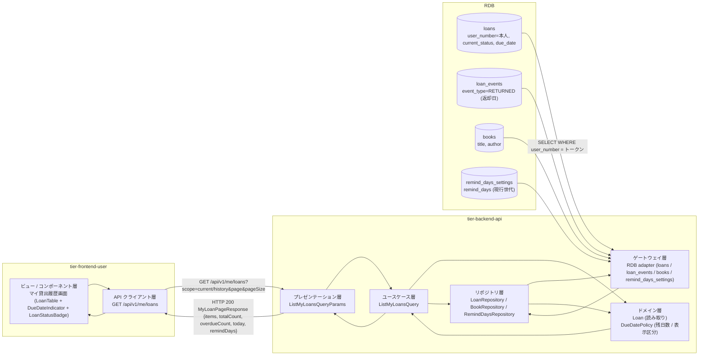
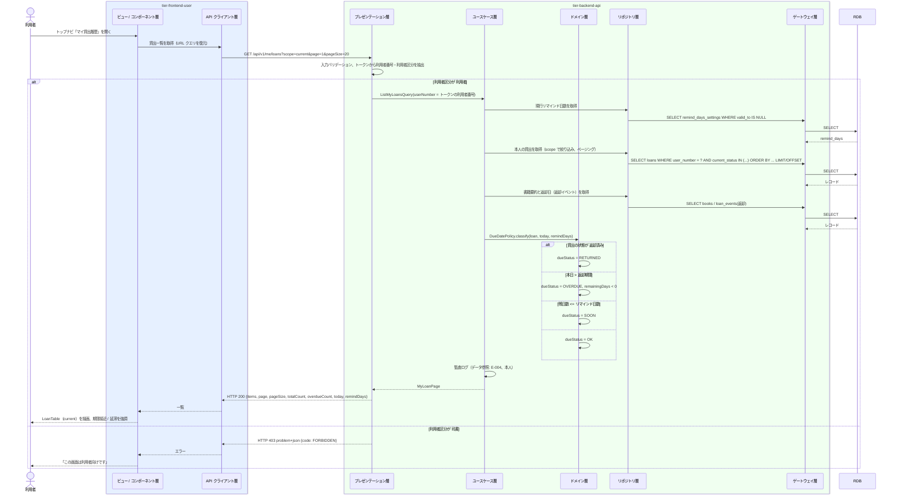

# 貸出履歴を参照する

## 概要

利用者が利用者ポータルで自分の現在の貸出（返却期限・残日数つき）と過去の貸出履歴を一覧で確認する。対象はトークンの利用者番号に紐づく貸出のみ（利用状況閲覧範囲判定）で、他の利用者の情報は参照できない。返却期限はリマインド日数以内を「まもなく」、超過を「延滞」として強調する。

## データフロー



| レイヤー | データモデル | 変換内容 |
|---------|------------|---------|
| FE View | 貸出一覧（LoanTable: 書籍 / 貸出日 / 返却期限（DueDateIndicator）/ 状態（LoanStatusBadge）/ 返却日）、現在 / 履歴の切替、ページ送り | URL クエリ（scope, page）と同期し一覧を描画。残日数を先頭に示す |
| FE API Client | `GET /api/v1/me/loans` | 一覧を View 用モデルに正規化、HTTP エラーを統一エラー型に変換 |
| BE presentation | ListMyLoansQueryParams(scope, page, pageSize) | 型・範囲の検証、トークンから利用者番号と利用者区分を抽出（本文・クエリの userNumber は受け付けない） |
| BE usecase | ListMyLoansQuery | 本人限定（トークンの利用者番号で絞る）、現行リマインド日数の取得、監査ログ（データ参照） |
| BE domain | Loan / DueDatePolicy | 残日数 = 返却期限 - 本日、表示区分（ok / soon / overdue / returned）の導出 |
| BE repository / gateway | loans SELECT（本人・状態・ページング）、loan_events SELECT（返却日）、books SELECT、remind_days_settings SELECT | レコード読み取り・結合 |
| Response | MyLoanPageResponse(items[MyLoanItem], page, pageSize, totalCount, overdueCount, today, remindDays) | 一覧表示と期限強調（overdueCount >= 1 で延滞 Alert） |

## 処理フロー



## バリエーション一覧

| バリエーション名 | 値 | 処理内容 | 適用 tier | 適用箇所 |
|----------------|---|---------|----------|---------|
| 利用者区分 | 利用者 | 自分の利用者番号に紐づく貸出のみ参照できる（`/api/v1/me/loans`） | tier-frontend-user / tier-backend-api | 利用者ポータル認可 / ListMyLoansQuery |
| 利用者区分 | 司書 | 本 UC の対象外（司書は UC「利用者の利用状況を参照する」で利用者番号を指定して参照）。`/api/v1/me/loans` は 403 | tier-backend-api | API 認可 |

## 分岐条件一覧

| 条件名 | 判定ルール | 適用 tier | 適用箇所 | BDD Scenario |
|--------|----------|----------|---------|-------------|
| 利用状況閲覧範囲判定 | 利用者区分が「利用者」の場合、トークンの利用者番号に紐づく貸出のみ返す。利用者番号をクエリで指定しても無視し、他人の貸出は返さない | tier-backend-api | ListMyLoansQuery（usecase: 検索条件を本人番号に固定） | 現在の貸出を確認する / 他人の貸出は表示されない |
| 表示範囲の切替 | `scope = current`（既定）: 貸出の状態が「貸出中」「延滞」。`scope = history`: 「返却済み」。`scope = all`: すべて | tier-backend-api / tier-frontend-user | ListMyLoansQuery / LoanTable の切替 | 現在の貸出を確認する / 過去の貸出履歴を確認する |
| 期限表示区分 | 返却済み → returned。本日 > 返却期限 → overdue。返却期限 - 本日 <= リマインド日数 → soon。それ以外 → ok | tier-backend-api / tier-frontend-user | DueDatePolicy / DueDateIndicator | 返却期限が近い貸出を強調する |

## 計算ルール一覧

| 計算名 | 入力情報 | 計算式/ロジック | 出力情報 | 適用 tier |
|--------|---------|---------------|---------|----------|
| 残日数 | 貸出.返却期限、本日 | `remainingDays = due_date - today`（日数。負なら超過日数） | MyLoanItem.remainingDays | tier-backend-api |
| 返却日 | 貸出イベント（返却）の発生日時 | `returnedOn = date(loan_events.occurred_at WHERE event_type = 'RETURNED')` | MyLoanItem.returnedOn | tier-backend-api |
| ページ数 | totalCount, pageSize | `ceil(totalCount / pageSize)`（既定 20、上限 100） | Pagination の総ページ数 | tier-frontend-user |

## 状態遷移一覧

| 状態モデル | 遷移元 | 遷移先 | トリガー | 事前条件 | 事後処理 | 適用 tier |
|-----------|--------|--------|---------|---------|---------|----------|
| 貸出の状態 | — | — | 貸出履歴を参照する | — | 状態遷移なし（貸出中 / 延滞 / 返却済み を表示するのみ） | tier-backend-api |

## 関連 RDRA モデル

| モデル種別 | 要素名 | 関連 |
|-----------|--------|------|
| 業務 | 利用者サービス業務 | このUCが属する業務 |
| BUC | 自分の利用状況を確認するフロー | このUCを含むBUC |
| アクター | 利用者 | 操作するアクター |
| 情報 | 貸出 | 参照する情報（貸出日・返却期限・返却日・貸出の状態） |
| 情報 | 書籍 | 参照する情報（書籍要約） |
| 情報 | 利用者 | 本人特定に参照する情報 |
| 情報 | リマインド日数 | 期限接近の判定に参照する情報 |
| 状態 | 貸出の状態 | 表示する状態（貸出中 / 延滞 / 返却済み） |
| 条件 | 利用状況閲覧範囲判定 | 本人の貸出のみ参照可 |
| バリエーション | 利用者区分 | 利用者のみ |
| 画面 | マイ貸出履歴画面 | 利用者が操作する画面 |

## E2E 完了条件（BDD）

### 正常系

```gherkin
Feature: 貸出履歴を参照する

  Scenario: 現在の貸出を確認する
    Given 利用者「田中太郎」（利用者番号「U-000123」）が利用者ポータルにログイン済み
    And 利用者番号「U-000123」の貸出「L-0001」（書籍「吾輩は猫である」）が状態「貸出中」、返却期限「2026-09-17」
    And 利用者番号「U-000123」の貸出「L-0003」（書籍「坊っちゃん」）が状態「延滞」、返却期限「2026-08-31」
    And 利用者番号「U-000300」の貸出「L-0002」が状態「貸出中」
    And 現行のリマインド日数が 3 日で本日が 2026-09-10
    When 利用者がマイ貸出履歴画面を開く
    Then LoanTable に「吾輩は猫である / 返却期限 2026/09/17（あと 7 日）/ 貸出中」と「坊っちゃん / 返却期限 2026/08/31（10 日超過）/ 延滞」の 2 行が表示される
    And 利用者番号「U-000300」の貸出は表示されない

  Scenario: 過去の貸出履歴を確認する
    Given 利用者「田中太郎」（利用者番号「U-000123」）が利用者ポータルにログイン済み
    And 利用者番号「U-000123」の貸出「L-0000」が状態「返却済み」、貸出日「2026-08-01」、返却日「2026-08-10」
    When 利用者がマイ貸出履歴画面で「履歴」に切り替える
    Then LoanTable に「L-0000」が「返却済み / 返却日 2026/08/10」で表示される

  Scenario: 返却期限が近い貸出を強調する
    Given 利用者「田中太郎」が利用者ポータルにログイン済み
    And 本人の貸出「L-0004」の返却期限が「2026-09-12」で本日が 2026-09-10、リマインド日数が 3 日
    When 利用者がマイ貸出履歴画面を開く
    Then 「L-0004」の DueDateIndicator が soon（warning）で「あと 2 日」と表示される
```

### 異常系

```gherkin
  Scenario: 貸出がない場合は空状態を表示する
    Given 利用者「田中太郎」が利用者ポータルにログイン済み
    And 本人の貸出が 1 件も無い
    When 利用者がマイ貸出履歴画面を開く
    Then EmptyState に「現在借りている書籍はありません」と蔵書検索へのボタンが表示される

  Scenario: 未ログインではマイ貸出履歴を開けない
    Given 利用者がログインしていない
    When 利用者が /me/loans を開く
    Then IdP のログイン画面に遷移し、ログイン後にマイ貸出履歴画面へ戻る

  Scenario: 司書トークンでは本人向け API を利用できない
    Given 利用者区分「司書」のトークンを持つ
    When GET /api/v1/me/loans を送る
    Then HTTP 403 が返る
```

## ティア別仕様

- [利用者向けフロントエンド](tier-frontend-user.md)
- [Backend API](tier-backend-api.md)

### 統合 API Spec

- [OpenAPI Spec](../../../_cross-cutting/api/openapi.yaml)（全 UC 統合、Contract First 開発用）
