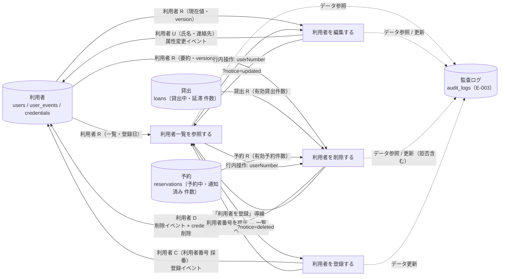
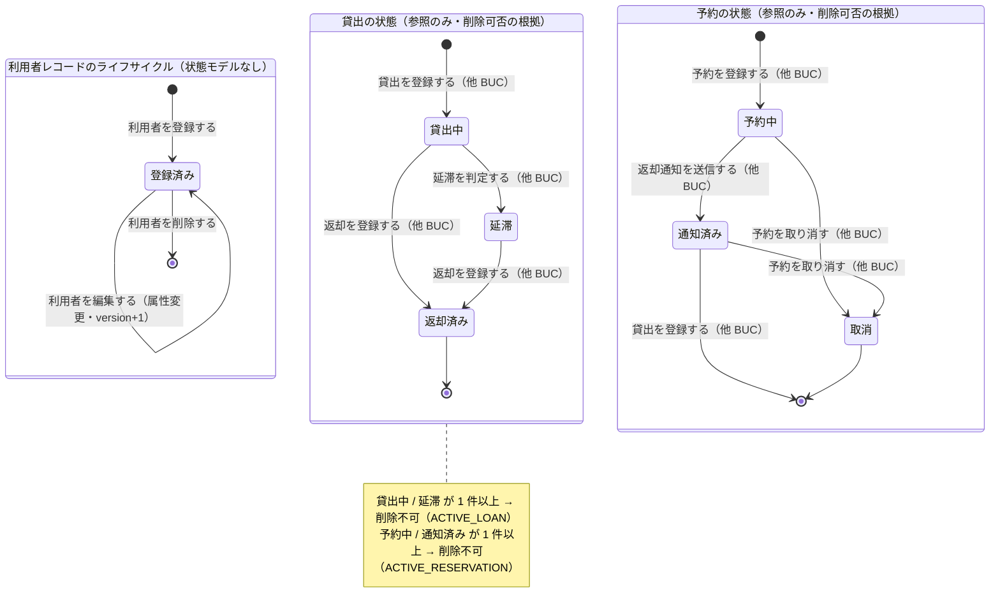

# 利用者を管理するフロー

## 概要

司書が窓口で利用登録を申し込んだ人を利用者として登録し（一意の利用者番号を採番）、登録済み利用者を一覧で確認しながら氏名・連絡先を編集し、利用を終了した利用者を削除する BUC。利用者は状態モデルを持たないが、削除時は貸出の状態・予約の状態を参照して有効な貸出・予約がある利用者の削除を拒否する。連絡先は個人情報として一覧・編集・削除画面でマスク表示し、参照・更新を監査ログに記録する。

## 所属 UC 一覧

| UC名 | アクター | 主な操作 | 関連情報 |
|------|---------|---------|---------|
| [利用者一覧を参照する](利用者一覧を参照する/spec.md) | 司書（価値提供） | 利用者一覧画面で登録済み利用者を利用者番号・氏名で絞り込み、ページ送りで参照する。登録・編集・削除の起点 | 利用者 |
| [利用者を登録する](利用者を登録する/spec.md) | 司書（価値提供） | 利用者登録画面で氏名・連絡先を入力して登録し、採番された利用者番号を提示する | 利用者 |
| [利用者を編集する](利用者を編集する/spec.md) | 司書（価値提供） | 利用者編集画面で氏名・連絡先を修正して保存する（楽観ロック）。利用者番号・区分は変更しない | 利用者 |
| [利用者を削除する](利用者を削除する/spec.md) | 司書（価値提供） | 利用者削除確認画面で有効な貸出・予約がないことを確認して削除する。認証情報も無効化する | 利用者、貸出、予約 |

システムを使わないアクティビティ（UC なし）:

- 利用登録を申し込む（利用者）

## UC 横断データフロー

BUC 内の UC 間で情報がどう流れるかを示す。情報がどの UC で作成（C）・参照（R）・更新（U）・削除（D）されるかを明記する。

### データフロー図

### 情報 CRUD マトリクス

| 情報名 | 利用者一覧を参照する | 利用者を登録する | 利用者を編集する | 利用者を削除する |
|--------|:-------:|:-------:|:-------:|:-------:|
| 利用者 | R | C | R / U | R / D |
| 貸出 | | | | R |
| 予約 | | | | R |

補足:

- 利用者の C / U / D は `user_events` へのイベント記録と `users` スナップショットの更新を 1 トランザクションで行う（Event/Snapshot 併用）。
- 利用者を削除する は貸出 BC / 予約 BC の公開 IF で件数のみ取得し、貸出・予約自体は更新しない。返却済みの貸出履歴は削除後も `user_number` のまま保持する。

## 状態遷移全体図

BUC 内で関連する状態モデルの全遷移パスと、各遷移を担当する UC を示す。利用者は RDRA の状態モデルを持たない（情報.tsv「利用者」状態モデル空）ため、本 BUC が扱うのは利用者レコードのライフサイクル（登録 → 登録済み → 削除）と、削除可否の根拠として参照する貸出の状態・予約の状態である。

### 状態遷移 UC マッピング

| 状態モデル | 遷移元 | 遷移先 | 担当 UC |
|-----------|--------|--------|--------|
| （利用者レコード・状態モデルなし） | （初期） | 登録済み | [利用者を登録する](利用者を登録する/spec.md) |
| （利用者レコード・状態モデルなし） | 登録済み | 登録済み（属性変更） | [利用者を編集する](利用者を編集する/spec.md) |
| （利用者レコード・状態モデルなし） | 登録済み | （削除・終了） | [利用者を削除する](利用者を削除する/spec.md) |
| （利用者レコード・状態モデルなし） | （参照のみ） | （遷移なし） | [利用者一覧を参照する](利用者一覧を参照する/spec.md)（監査ログ「データ参照」のみ） |
| 貸出の状態 | （参照のみ） | （遷移なし） | [利用者を削除する](利用者を削除する/spec.md)（貸出中・延滞の件数を削除可否判定に使用） |
| 予約の状態 | （参照のみ） | （遷移なし） | [利用者を削除する](利用者を削除する/spec.md)（予約中・通知済みの件数を削除可否判定に使用） |

## BUC 内共有条件一覧

BUC 内の複数 UC で共有される条件の一覧。各条件がどの UC で適用されるかを明記する。

| 条件名 | 条件の説明 | 適用 UC |
|--------|----------|--------|
| 入力検証（LP-001） | 氏名・メールアドレスは必須。メールアドレスは RFC 5322 形式。電話番号・住所は任意。画面のインライン検証と API のスキーマ検証（422 VALIDATION_ERROR）の二段で適用する | 利用者を登録する, 利用者を編集する |
| 利用者存在判定 | 指定した利用者番号の利用者が users に存在しない場合は 404（USER_NOT_FOUND）。画面は EmptyState と一覧へ戻る導線を表示する | 利用者を編集する, 利用者を削除する |
| 楽観ロック判定（LP-013） | リクエストの version（If-Match）が users.version と一致する場合のみ UPDATE / DELETE を実行する。件数 0 は 409（OPTIMISTIC_LOCK_CONFLICT） | 利用者を編集する, 利用者を削除する |
| 利用状況閲覧範囲判定 | 利用者区分が「司書」の場合のみ本 BUC の画面・API を利用できる。「利用者」区分のトークンは 403（FORBIDDEN）。API Gateway の粗粒度 RBAC と presentation で適用する | 利用者一覧を参照する（条件として明示）, 利用者を登録する（BDD 異常系「利用者区分が利用者のアカウントは登録 API を呼べない」で適用） |

BUC 内で 1 つの UC でしか使われない条件（UC Spec 側のみ）:

- 利用者検索判定（利用者一覧を参照する）
- 利用者番号の一意性（利用者を登録する。AG-002 不変条件）
- 利用者削除可否判定（利用者を削除する。_inference 7 仮採用・todo 登録済み）
- 自己削除禁止判定（利用者を削除する）

## BUC 内共有バリエーション一覧

BUC 内の複数 UC で共有されるバリエーションの一覧。

| バリエーション名 | 値 | 適用 UC |
|----------------|---|--------|
| 利用者区分 | 司書、利用者 | 利用者一覧を参照する（区分列に表示）, 利用者を登録する（既定「利用者」で付与。司書区分は本画面で扱わない）, 利用者を編集する（表示のみ・変更不可）, 利用者を削除する（要約に表示。司書区分も同条件で削除可、自分自身は不可） |
