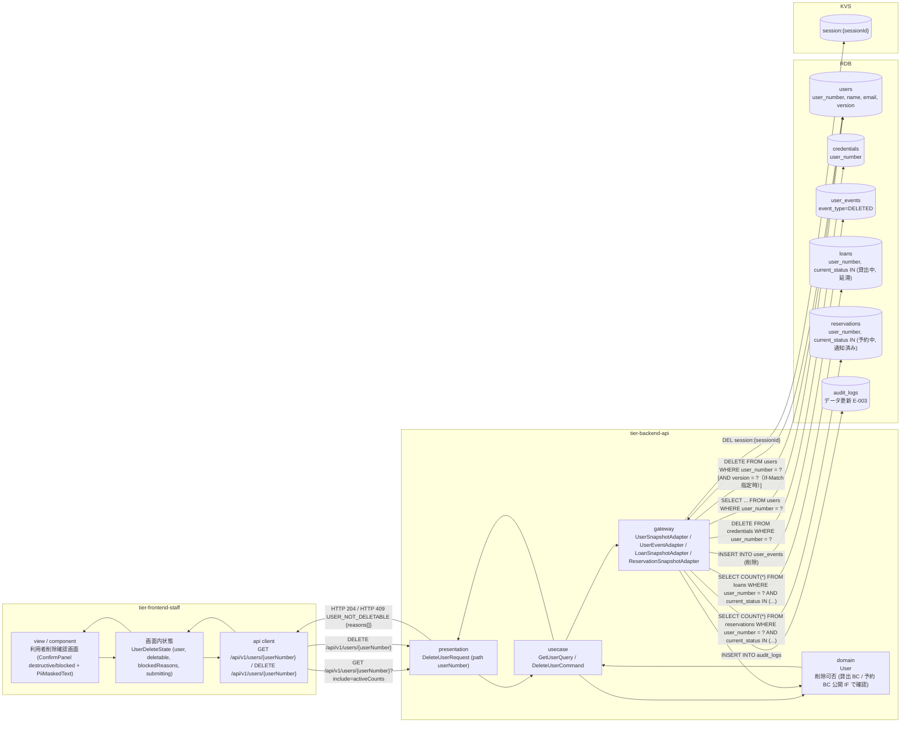
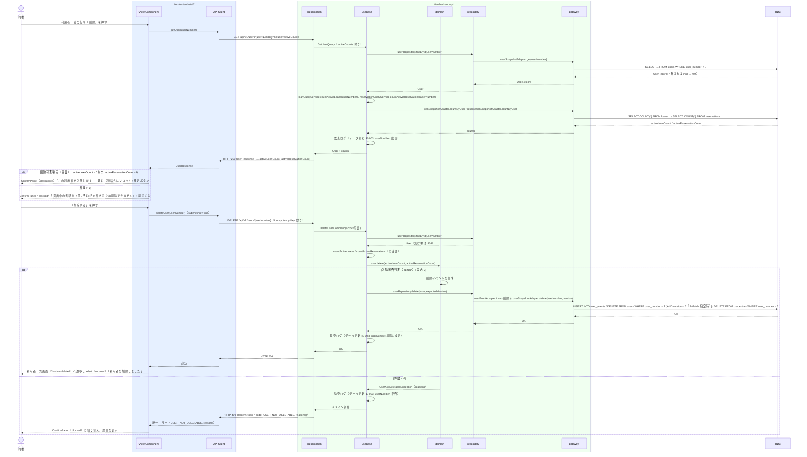

# 利用者を削除する

## 概要

司書が利用を終了した利用者を利用者削除確認画面で確認のうえ削除し、利用者一覧から除外する。
貸出中 / 延滞の貸出、または予約中 / 通知済みの予約がある利用者は削除できない（_inference 7 の仮採用。RDRA 条件に無いため todo 登録済み）。削除は削除イベントを記録したうえでスナップショットを除去し、個人情報の更新として監査ログに記録する。

## データフロー



| レイヤー | データモデル | 変換内容 |
|---------|------------|---------|
| FE view | 対象利用者の要約（userNumber, name, email/phone/address は PiiMaskedText）と削除可否 | GET の応答（`activeLoanCount`, `activeReservationCount`）から deletable を導出し ConfirmPanel の variant（destructive / blocked）と impact 文言を切替 |
| FE api client | DELETE /api/v1/users/{userNumber} | trace_id と Idempotency-Key を付与。409 の理由コードと `reasons[]` を保持して正規化（LR-027） |
| BE presentation | DeleteUserRequest(userNumber) | path 形式検証。認可コンテキスト（司書）を付与して DeleteUserCommand に変換 |
| BE usecase | DeleteUserCommand | 利用者取得（無ければ 404）、貸出 BC / 予約 BC の公開 IF で有効な貸出・予約件数を取得、User.delete(activeLoans, activeReservations) で不変条件検証、repository.delete（削除イベント INSERT + スナップショット DELETE）を 1 トランザクションで実行。監査ログ出力（LP-006） |
| BE domain | User（削除可否判定） | 貸出中 / 延滞の貸出、予約中 / 通知済みの予約が 1 件以上あれば UserNotDeletableException |
| BE gateway | user_events INSERT（event_type=DELETED、payload は利用者番号のみ）+ users DELETE + loans / reservations COUNT | 削除件数 0 なら競合例外。個人情報の値はログに出力しない |
| Response | 204 No Content / 409 problem+json { code: USER_NOT_DELETABLE, reasons: ["ACTIVE_LOAN", "ACTIVE_RESERVATION"] } | 利用者一覧画面へ戻る際の Alert（success）/ ConfirmPanel（blocked）の根拠表示 |

## 処理フロー



## バリエーション一覧

| バリエーション名 | 値 | 処理内容 | 適用 tier | 適用箇所 |
|----------------|---|---------|----------|---------|
| 利用者区分 | 司書、利用者 | 要約に利用者区分を表示する。司書区分の利用者（アカウント）も同じ条件で削除可能。自分自身は削除不可 | tier-frontend-staff, tier-backend-api | 利用者削除確認画面 / DeleteUserCommand |

## 分岐条件一覧

| 条件名 | 判定ルール | 適用 tier | 適用箇所 | BDD Scenario |
|--------|----------|----------|---------|-------------|
| 利用者削除可否判定（_inference 7 仮採用） | 貸出の状態が「貸出中」「延滞」の貸出、または予約の状態が「予約中」「通知済み」の予約が 1 件以上ある利用者は削除しない（409 USER_NOT_DELETABLE, reasons に ACTIVE_LOAN / ACTIVE_RESERVATION）。画面側は GET の件数で ConfirmPanel を切り替える（補助判定。最終判定は API） | tier-backend-api, tier-frontend-staff | User.delete() / 利用者削除確認画面 | 貸出も予約もない利用者を削除できる / 貸出中の利用者は削除できない / 予約中の利用者は削除できない |
| 自己削除禁止判定 | 認可コンテキストの user_id と対象 userNumber が一致する場合は 409（code: SELF_DELETE_NOT_ALLOWED） | tier-backend-api | DeleteUserCommand | 自分自身は削除できない |
| 楽観ロック判定 | DELETE の WHERE に version を含め、削除件数 0 は 409（code: OPTIMISTIC_LOCK_CONFLICT） | tier-backend-api | userRepository.delete() | （API ティア完了条件で検証） |

## 計算ルール一覧

| 計算名 | 入力情報 | 計算式/ロジック | 出力情報 | 適用 tier |
|--------|---------|---------------|---------|----------|
| 有効貸出件数 | 貸出（利用者番号, 貸出の状態） | COUNT(貸出 WHERE 利用者番号 = 対象 AND 状態 IN (貸出中, 延滞)) | activeLoanCount | tier-backend-api |
| 有効予約件数 | 予約（利用者番号, 予約の状態） | COUNT(予約 WHERE 利用者番号 = 対象 AND 状態 IN (予約中, 通知済み)) | activeReservationCount | tier-backend-api |
| 削除可否（画面補助） | activeLoanCount, activeReservationCount | `deletable = activeLoanCount === 0 && activeReservationCount === 0` | ConfirmPanel.blocked | tier-frontend-staff |

## 状態遷移一覧

| 状態モデル | 遷移元 | 遷移先 | トリガー | 事前条件 | 事後処理 | 適用 tier |
|-----------|--------|--------|---------|---------|---------|----------|
| （利用者は状態モデルを持たない） | 登録済み | （削除・終了） | 利用者を削除する | 有効な貸出・予約がない。自分自身でない | user_events に「削除」イベント記録、users スナップショット除去、認証情報（E-903）の無効化、監査ログ | tier-backend-api |
| 貸出の状態 | （参照のみ） | （遷移なし） | 利用者を削除する | なし | 貸出中・延滞の件数を削除可否判定に使用 | tier-backend-api |
| 予約の状態 | （参照のみ） | （遷移なし） | 利用者を削除する | なし | 予約中・通知済みの件数を削除可否判定に使用 | tier-backend-api |

## 関連 RDRA モデル

| モデル種別 | 要素名 | 関連 |
|-----------|--------|------|
| 業務 | 利用者管理業務 | このUCが属する業務 |
| BUC | 利用者を管理するフロー | このUCを含むBUC |
| アクター | 司書 | 操作するアクター（価値提供） |
| 画面 | 利用者削除確認画面 | 確認画面 |
| 情報 | 利用者 | 削除する情報 |
| 情報 | 貸出 | 削除可否判定で参照（貸出中・延滞） |
| 情報 | 予約 | 削除可否判定で参照（予約中・通知済み） |
| 状態 | 貸出の状態 | 削除可否の根拠 |
| 状態 | 予約の状態 | 削除可否の根拠 |
| バリエーション | 利用者区分 | 要約表示 |

## E2E 完了条件（BDD）

### 正常系

```gherkin
Feature: 利用者を削除する

  Scenario: 貸出も予約もない利用者を削除できる
    Given 司書「佐藤花子」が司書ポータルにログイン済み
    And 利用者「U0001234 田中太郎」が登録済みで、貸出中・延滞の貸出と予約中・通知済みの予約がない
    When 利用者一覧画面の行内「削除」で利用者削除確認画面（/staff/users/U0001234/delete）を開き、ConfirmPanel（destructive）で「削除する」を押す
    Then HTTP 204 が返る
    And 利用者一覧画面に Alert（success）「利用者を削除しました」が表示され、UserTable に「田中太郎」は表示されない

  Scenario: 返却済みの貸出履歴があっても削除できる
    Given 司書「佐藤花子」が司書ポータルにログイン済み
    And 利用者「U0002345 山田花子」に返却済みの貸出が 3 件あり、貸出中・延滞・予約中・通知済みは 0 件である
    When 利用者削除確認画面（/staff/users/U0002345/delete）で「削除する」を押す
    Then HTTP 204 が返り、loans の 3 件は user_number「U0002345」のまま保持される

  Scenario: 確認画面で「戻る」を押すと削除されずに一覧へ戻る
    Given 司書「佐藤花子」が利用者「U0001234」の削除確認画面を「?page=2」から開いている
    When 「戻る」を押す
    Then DELETE /api/v1/users/U0001234 は呼び出されない
    And 利用者一覧画面が「?page=2」で表示され「田中太郎」が残っている
```

### 異常系

```gherkin
  Scenario: 貸出中の利用者は削除できない
    Given 司書「佐藤花子」が司書ポータルにログイン済み
    And 利用者「U0003456 鈴木一郎」に貸出中の貸出が 2 冊ある
    When 利用者削除確認画面（/staff/users/U0003456/delete）を開く
    Then ConfirmPanel（blocked）「貸出中の書籍が 2 冊あるため削除できません」が表示される
    And 「削除する」ボタンは表示されず「戻る」のみ表示される

  Scenario: 予約中の利用者は API で削除できない
    Given 司書「佐藤花子」のアクセストークンを保持している
    And 利用者「U0004567」に予約中の予約が 1 件ある
    When DELETE /api/v1/users/U0004567 を送信する
    Then HTTP 409 と problem+json（code: USER_NOT_DELETABLE, reasons: ["ACTIVE_RESERVATION"]）が返る
    And users に「U0004567」が残っている

  Scenario: 確認画面表示後に貸出が登録された利用者は API で拒否される
    Given 司書「佐藤花子」が利用者「U0001234」（貸出なし）の削除確認画面を開いている
    And 別の司書が「U0001234」に貸出を登録した
    When 「削除する」を押す
    Then HTTP 409 と problem+json（code: USER_NOT_DELETABLE, reasons: ["ACTIVE_LOAN"]）が返る
    And ConfirmPanel が blocked に切り替わり「貸出中の書籍が 1 冊あるため削除できません」が表示される

  Scenario: 自分自身は削除できない
    Given 司書「佐藤花子」（利用者番号 S0000001）のアクセストークンを保持している
    When DELETE /api/v1/users/S0000001 を送信する
    Then HTTP 409 と problem+json（code: SELF_DELETE_NOT_ALLOWED）が返る

  Scenario: 存在しない利用者の削除は 404 になる
    Given 司書「佐藤花子」が司書ポータルにログイン済み
    When 利用者削除確認画面（/staff/users/U9999999/delete）を開く
    Then GET /api/v1/users/U9999999 が HTTP 404（code: USER_NOT_FOUND）を返す
    And EmptyState「利用者が見つかりません」と「利用者一覧へ戻る」ボタンが表示される
```

## ティア別仕様

- [司書向けフロントエンド](tier-frontend-staff.md)
- [Backend API](tier-backend-api.md)

### 統合 API Spec

- [OpenAPI Spec](../../../_cross-cutting/api/openapi.yaml)（全 UC 統合、Contract First 開発用）
