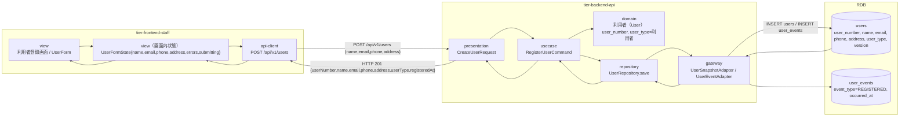
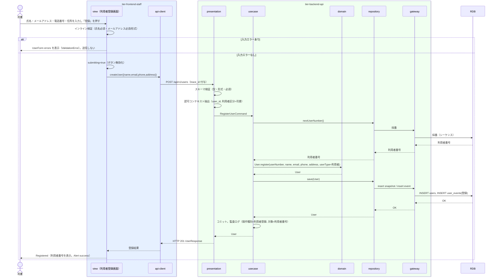

# 利用者を登録する

## 概要

司書が利用者登録画面で氏名・連絡先（メールアドレス・電話番号・住所）を入力して利用者を登録する。
システムは一意の利用者番号を採番し、登録完了画面で司書に提示する。登録した利用者は貸出・予約の主体となり、通知の送信先となる。

## データフロー



| レイヤー | データモデル | 変換内容 |
|---------|------------|---------|
| FE view | UserForm 入力値（氏名・メールアドレス・電話番号・住所） | 入力 → UserFormState。インライン検証（必須・メール形式）→ CreateUserRequest 相当の JSON |
| FE api-client | POST /api/v1/users リクエスト | trace_id と Idempotency-Key を付与。HTTP エラーを統一エラー型（422 検証 / 401 再認証 / 403 権限）に正規化 |
| BE presentation | CreateUserRequest(name, email, phone?, address?) | スキーマ検証（型・形式・必須）+ 認可コンテキスト（司書）抽出 → RegisterUserCommand |
| BE usecase | RegisterUserCommand | トランザクション開始。利用者番号採番 → User 生成 → UserRepository.save → コミット |
| BE domain | User（user_number, name, email, phone, address, user_type=利用者） | 不変条件「利用者番号は一意」を集約 root で保証 |
| BE gateway | INSERT users（snapshot）/ INSERT user_events（登録イベント） | Event/Snapshot 併用パターン（LR-008） |
| Response | UserResponse(userNumber, name, email, phone, address, userType, registeredAt) | 登録完了メッセージと利用者番号の表示（Registered variant） |

## 処理フロー



## バリエーション一覧

| バリエーション名 | 値 | 処理内容 | 適用 tier | 適用箇所 |
|----------------|---|---------|----------|---------|
| 利用者区分 | 司書、利用者 | 司書が登録する利用者の区分は既定で「利用者」。司書区分の付与は本 UC の登録画面では扱わない（userType 省略時は「利用者」） | tier-backend-api | RegisterUserCommand |

## 分岐条件一覧

| 条件名 | 判定ルール | 適用 tier | 適用箇所 | BDD Scenario |
|--------|----------|----------|---------|-------------|
| 入力検証（LP-001） | 氏名・メールアドレスは必須。メールアドレスは RFC 5322 形式。電話番号・住所は任意 | tier-frontend-staff / tier-backend-api | UserForm / POST /api/v1/users | 必須項目が未入力のため登録できない |
| 利用者番号の一意性（AG-002 不変条件） | 採番した利用者番号が既存と重複しない。重複時は採番をやり直す | tier-backend-api | UserRepository.nextUserNumber | 利用者を登録して利用者番号が採番される |

## 計算ルール一覧

| 計算名 | 入力情報 | 計算式/ロジック | 出力情報 | 適用 tier |
|--------|---------|---------------|---------|----------|
| 利用者番号採番 | 既存の利用者番号 | RDB シーケンスによる連番採番（形式は実装で確定。例: `U0001234`） | 利用者.利用者番号 | tier-backend-api |

## 状態遷移一覧

| 状態モデル | 遷移元 | 遷移先 | トリガー | 事前条件 | 事後処理 | 適用 tier |
|-----------|--------|--------|---------|---------|---------|----------|
| （なし） | - | - | 利用者は状態モデルを持たない（情報.tsv「利用者」状態モデル空） | - | - | - |

## 関連 RDRA モデル

| モデル種別 | 要素名 | 関連 |
|-----------|--------|------|
| 業務 | 利用者管理業務 | このUCが属する業務 |
| BUC | 利用者を管理するフロー | このUCを含むBUC |
| アクター | 司書 | 操作するアクター |
| 情報 | 利用者 | 登録する情報（利用者番号・氏名・連絡先・利用者区分・登録日） |
| 画面 | 利用者登録画面 | 操作する画面 |
| バリエーション | 利用者区分 | 登録時に付与する区分 |

## E2E 完了条件（BDD）

### 正常系

```gherkin
Feature: 利用者を登録する

  Scenario: 利用者を登録して利用者番号が採番される
    Given 司書「佐藤花子」が司書ポータルにログイン済み
    And 利用者登録画面（/staff/users/new）を表示している
    When 氏名「田中太郎」、メールアドレス「tanaka@example.com」、電話番号「090-1234-5678」、住所「東京都千代田区1-1」を入力して「登録」を押す
    Then HTTP 201 が返り、利用者番号（例「U0001234」）が画面に表示される
    And 利用者一覧画面で「田中太郎」が利用者番号つきで表示される

  Scenario: 電話番号と住所を省略して登録する
    Given 司書「佐藤花子」が利用者登録画面を表示している
    When 氏名「鈴木一郎」、メールアドレス「suzuki@example.com」のみ入力して「登録」を押す
    Then HTTP 201 が返り、利用者番号が表示される
```

### 異常系

```gherkin
  Scenario: 必須項目が未入力のため登録できない
    Given 司書「佐藤花子」が利用者登録画面を表示している
    When 氏名を空のまま、メールアドレス「tanaka@example.com」を入力して「登録」を押す
    Then 氏名欄に「氏名は必須です」が表示され、API は呼び出されない

  Scenario: メールアドレス形式が不正なため API が 422 を返す
    Given 司書「佐藤花子」が利用者登録画面を表示している
    When 氏名「田中太郎」、メールアドレス「tanaka@@example」を入力して「登録」を押す
    Then HTTP 422 application/problem+json（code=VALIDATION_ERROR, errors[0].field=email）が返り、メールアドレス欄にエラーが表示される

  Scenario: 利用者区分が利用者のアカウントは登録 API を呼べない
    Given 利用者「田中太郎」のアクセストークンを持つクライアントがある
    When POST /api/v1/users を氏名「山田」メールアドレス「yamada@example.com」で呼び出す
    Then HTTP 403 application/problem+json（code=FORBIDDEN）が返る
```

## ティア別仕様

- [司書向けフロントエンド](tier-frontend-staff.md)
- [Backend API](tier-backend-api.md)

### 統合 API Spec

- [OpenAPI Spec](../../../_cross-cutting/api/openapi.yaml)（全 UC 統合、Contract First 開発用）
