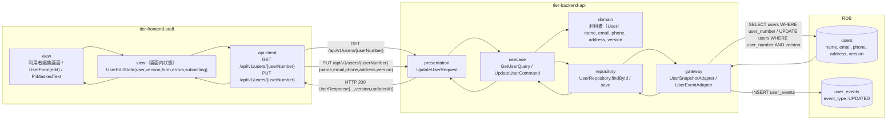
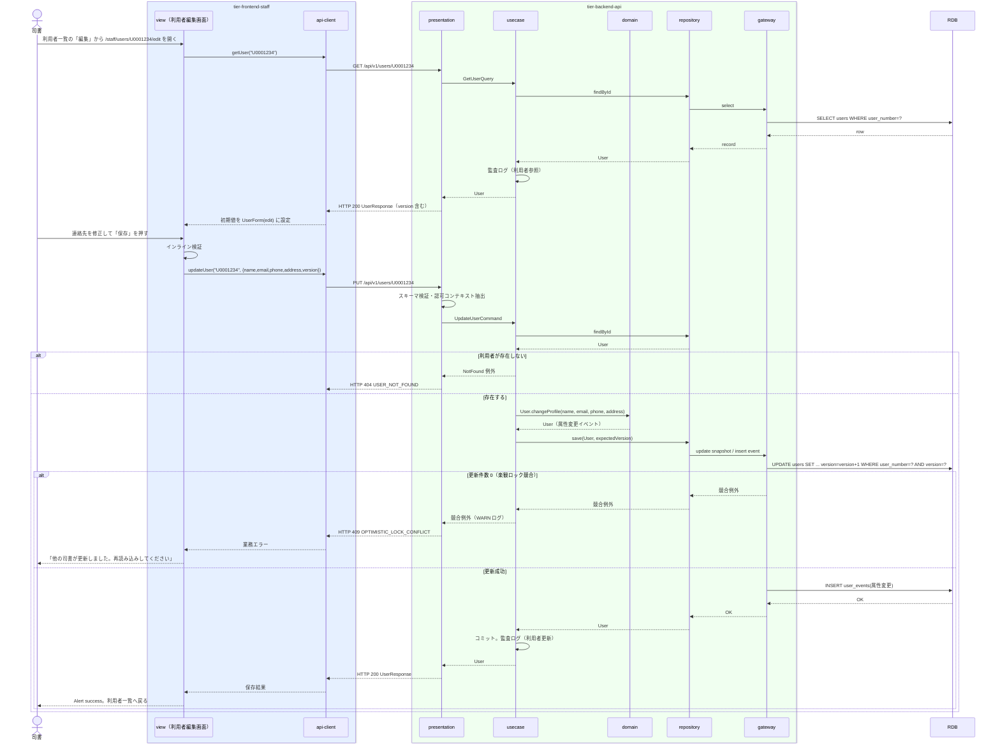

# 利用者を編集する

## 概要

司書が利用者編集画面で登録済みの利用者情報（氏名・メールアドレス・電話番号・住所）を修正して保存する。
利用者番号は変更できない。保存は楽観ロック（version）で同時更新を検知し、変更は属性変更イベントとして履歴に残す。

## データフロー



| レイヤー | データモデル | 変換内容 |
|---------|------------|---------|
| FE view | UserForm（edit）初期値 = GET 応答。連絡先は PiiMaskedText で既定マスク表示、編集時に開示 | 入力 → UserEditState.form。インライン検証 → UpdateUserRequest（version 同梱） |
| FE api-client | GET / PUT /api/v1/users/{userNumber} | trace_id 付与（PUT は Idempotency-Key も付与）。404 / 409 / 422 を統一エラー型に正規化 |
| BE presentation | UpdateUserRequest(name, email, phone?, address?, version) | スキーマ検証 + 認可コンテキスト抽出 → UpdateUserCommand |
| BE usecase | GetUserQuery / UpdateUserCommand | findById → User.changeProfile → save（楽観ロック）→ コミット。監査ログ |
| BE domain | User | 属性変更メソッドで値を検証し、属性変更イベントを生成 |
| BE gateway | SELECT users / UPDATE users（version+1）/ INSERT user_events | 競合時（更新件数 0）は競合例外 |
| Response | UserResponse(userNumber, name, email, phone, address, userType, version, updatedAt) | 保存完了 Alert と一覧への復帰 |

## 処理フロー



## バリエーション一覧

| バリエーション名 | 値 | 処理内容 | 適用 tier | 適用箇所 |
|----------------|---|---------|----------|---------|
| 利用者区分 | 司書、利用者 | 編集画面では利用者区分を表示のみとし変更しない（UserForm に区分入力は無い） | tier-frontend-staff | 利用者編集画面 |

## 分岐条件一覧

| 条件名 | 判定ルール | 適用 tier | 適用箇所 | BDD Scenario |
|--------|----------|----------|---------|-------------|
| 利用者存在判定 | 指定した利用者番号の利用者が users に存在する。無ければ 404 | tier-backend-api | GET/PUT /api/v1/users/{userNumber} | 存在しない利用者番号を指定すると 404 になる |
| 楽観ロック競合判定（LP-013） | リクエストの version が現在の version と一致する場合のみ更新。不一致は 409 | tier-backend-api | UserRepository.save | 他の司書が先に更新したため保存が競合する |
| 入力検証（LP-001） | 氏名・メールアドレス必須、メール形式、文字数上限 | tier-frontend-staff / tier-backend-api | UserForm / PUT /api/v1/users/{userNumber} | メールアドレスを空にして保存できない |

## 計算ルール一覧

| 計算名 | 入力情報 | 計算式/ロジック | 出力情報 | 適用 tier |
|--------|---------|---------------|---------|----------|
| version 加算 | 利用者.version | 更新成功時に version = version + 1 | 利用者.version | tier-backend-api |

## 状態遷移一覧

| 状態モデル | 遷移元 | 遷移先 | トリガー | 事前条件 | 事後処理 | 適用 tier |
|-----------|--------|--------|---------|---------|---------|----------|
| （なし） | - | - | 利用者は状態モデルを持たない | - | - | - |

## 関連 RDRA モデル

| モデル種別 | 要素名 | 関連 |
|-----------|--------|------|
| 業務 | 利用者管理業務 | このUCが属する業務 |
| BUC | 利用者を管理するフロー | このUCを含むBUC |
| アクター | 司書 | 操作するアクター |
| 情報 | 利用者 | 参照・更新する情報（氏名・連絡先・更新日） |
| 画面 | 利用者編集画面 | 操作する画面 |
| バリエーション | 利用者区分 | 表示のみ |

## E2E 完了条件（BDD）

### 正常系

```gherkin
Feature: 利用者を編集する

  Scenario: 利用者の連絡先を修正して保存する
    Given 司書「佐藤花子」が司書ポータルにログイン済み
    And 利用者「U0001234 田中太郎」（メールアドレス tanaka@example.com, version 1）が登録されている
    When 利用者編集画面（/staff/users/U0001234/edit）でメールアドレスを「tanaka.taro@example.com」に変更して「保存」を押す
    Then HTTP 200 が返り、Alert（success）「保存しました」が表示され利用者一覧画面に戻る
    And 利用者「U0001234」のメールアドレスが「tanaka.taro@example.com」、version が 2 になっている

  Scenario: 編集画面に現在の登録内容が初期表示される
    Given 司書「佐藤花子」がログイン済みで、利用者「U0001234 田中太郎」が登録されている
    When 利用者編集画面（/staff/users/U0001234/edit）を開く
    Then 氏名欄に「田中太郎」が表示され、利用者番号「U0001234」は編集不可で表示される
    And メールアドレス・電話番号・住所は PiiMaskedText で既定マスク表示される
```

### 異常系

```gherkin
  Scenario: 他の司書が先に更新したため保存が競合する
    Given 司書「佐藤花子」が利用者「U0001234」（version 1）の編集画面を開いている
    And 別の司書が同じ利用者を更新して version が 2 になっている
    When 佐藤花子が氏名を「田中太朗」に変更して「保存」を押す
    Then HTTP 409 application/problem+json（code=OPTIMISTIC_LOCK_CONFLICT）が返り、「他の司書が更新しました。再読み込みしてください」が表示される

  Scenario: 存在しない利用者番号を指定すると 404 になる
    Given 司書「佐藤花子」がログイン済み
    When 利用者編集画面（/staff/users/U9999999/edit）を開く
    Then HTTP 404 application/problem+json（code=USER_NOT_FOUND）が返り、「利用者が見つかりません」と一覧へ戻る導線が表示される

  Scenario: メールアドレスを空にして保存できない
    Given 司書「佐藤花子」が利用者「U0001234」の編集画面を開いている
    When メールアドレス欄を空にして「保存」を押す
    Then メールアドレス欄に「メールアドレスは必須です」が表示され、API は呼び出されない
```

## ティア別仕様

- [司書向けフロントエンド](tier-frontend-staff.md)
- [Backend API](tier-backend-api.md)

### 統合 API Spec

- [OpenAPI Spec](../../../_cross-cutting/api/openapi.yaml)（全 UC 統合、Contract First 開発用）
