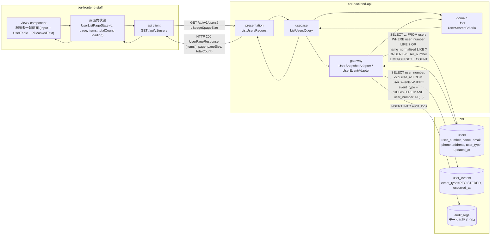
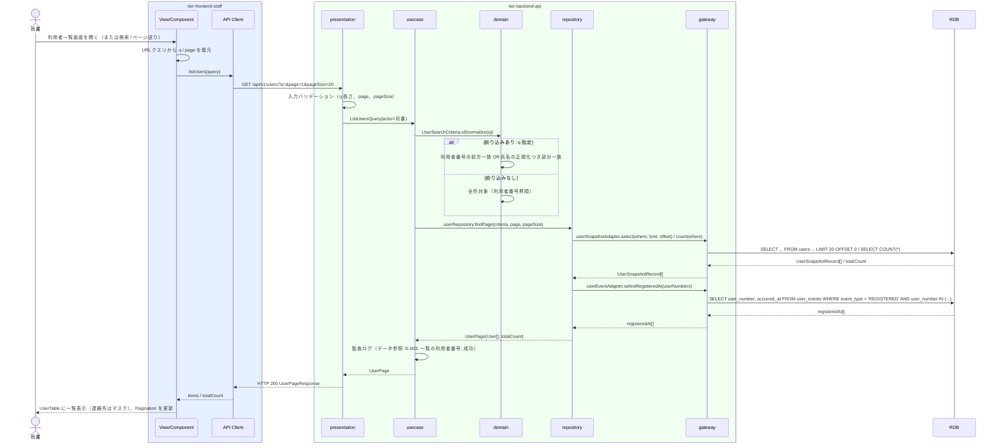

# 利用者一覧を参照する

## 概要

司書が登録済みの利用者を利用者一覧画面で一覧参照し、利用者番号や連絡先を確認する。登録・編集・削除の起点となる画面で、行内操作から各画面へ遷移する。
一覧は 20 件/頁の offset ページネーションで表示し、利用者番号・氏名の単一条件（Input）で絞り込める。連絡先は PiiMaskedText で既定マスクし、個人情報の参照として監査ログに記録する。

## データフロー



| レイヤー | データモデル | 変換内容 |
|---------|------------|---------|
| FE view | Input（with-icon）の検索文字列 q、ページ番号 | 入力と Pagination 操作を URL クエリ（`?q=&page=`）に反映し GET のクエリへ変換。結果は UserTable に表示（連絡先は PiiMaskedText） |
| FE api client | GET /api/v1/users のクエリ | trace_id 付与、HTTP エラーの正規化（LR-027） |
| BE presentation | ListUsersRequest(q?, page, pageSize) | 型・範囲の検証（q 100 文字以内、page >= 1、pageSize 1〜100）。ListUsersQuery に変換 |
| BE usecase | ListUsersQuery → UserPage | q を正規化して UserSearchCriteria に変換し repository へ委譲。監査ログ（データ参照: 一覧に含まれる利用者番号）を出力（LP-006） |
| BE domain | User（user_number, name, email, phone, address, user_type） | 利用者番号は前方一致、氏名は正規化つき部分一致 |
| BE gateway | users SELECT（LIMIT/OFFSET）+ COUNT + user_events（登録日時） | UserSnapshotRecord → User 復元 |
| Response | UserPageResponse { items: UserSummary[], page, pageSize, totalCount } | UserTable の行データ + Pagination |

## 処理フロー



## バリエーション一覧

| バリエーション名 | 値 | 処理内容 | 適用 tier | 適用箇所 |
|----------------|---|---------|----------|---------|
| 利用者区分 | 司書、利用者 | UserTable の区分列に表示。絞り込み条件には含めない | tier-frontend-staff, tier-backend-api | 利用者一覧画面 / UserSummary.userType |

## 分岐条件一覧

| 条件名 | 判定ルール | 適用 tier | 適用箇所 | BDD Scenario |
|--------|----------|----------|---------|-------------|
| 利用者検索判定 | q 指定時、利用者番号（前方一致）または氏名（NFKC 正規化 + 小文字化した部分一致）に一致する利用者を返す。q 未指定は全件 | tier-backend-api | ListUsersQuery | 氏名で絞り込むと該当利用者のみ表示される / 利用者番号で絞り込む |
| 利用状況閲覧範囲判定 | 利用者区分が「司書」の場合のみ一覧を参照できる。「利用者」は 403 | tier-backend-api | API Gateway（粗粒度 RBAC）/ presentation | 利用者区分「利用者」のトークンでは一覧 API を呼び出せない |

## 計算ルール一覧

| 計算名 | 入力情報 | 計算式/ロジック | 出力情報 | 適用 tier |
|--------|---------|---------------|---------|----------|
| 総ページ数 | totalCount, pageSize | ceil(totalCount / pageSize)。0 件のとき 1 | Pagination の総ページ数 | tier-frontend-staff |
| OFFSET | page, pageSize | (page - 1) * pageSize | SQL OFFSET | tier-backend-api |
| 登録日 | 利用者.登録日（user_events の登録イベント occurred_at） | 登録イベントの occurred_at を YYYY/MM/DD で表示 | UserTable の登録日列 | tier-backend-api, tier-frontend-staff |
| マスク表示 | 連絡先（email / phone / address） | email: 先頭 1 文字 + `***@` + ドメイン、phone: 中間 4 桁を `****`、address: 都道府県 + `…` | PiiMaskedText の表示 | tier-frontend-staff |

## 状態遷移一覧

| 状態モデル | 遷移元 | 遷移先 | トリガー | 事前条件 | 事後処理 | 適用 tier |
|-----------|--------|--------|---------|---------|---------|----------|
| （利用者は状態モデルを持たない） | - | - | 利用者一覧を参照する | なし | 監査ログ（データ参照）のみ | tier-backend-api |

## 関連 RDRA モデル

| モデル種別 | 要素名 | 関連 |
|-----------|--------|------|
| 業務 | 利用者管理業務 | このUCが属する業務 |
| BUC | 利用者を管理するフロー | このUCを含むBUC |
| アクター | 司書 | 操作するアクター（価値提供） |
| 画面 | 利用者一覧画面 | 一覧を表示する画面 |
| 情報 | 利用者 | 参照する情報（一覧表示） |
| 条件 | 利用状況閲覧範囲判定 | 司書のみ参照可 |
| バリエーション | 利用者区分 | 区分列の表示 |

## E2E 完了条件（BDD）

### 正常系

```gherkin
Feature: 利用者一覧を参照する

  Scenario: 登録済み利用者の一覧が連絡先マスクつきで表示される
    Given 司書「佐藤花子」が司書ポータルにログイン済み
    And 利用者「U0001234 田中太郎」（tanaka@example.com）と「U0002345 山田花子」（yamada@example.com）が登録済み
    When 利用者一覧画面（/staff/users）を開く
    Then UserTable に 2 件の利用者が利用者番号昇順で表示される
    And 「田中太郎」の連絡先列に PiiMaskedText「t***@example.com」が表示される
    And 登録日列に「2026/09/01」形式の日付が表示される

  Scenario: 21 件以上の利用者が 20 件ずつページ送りで表示される
    Given 司書「佐藤花子」が司書ポータルにログイン済み
    And 利用者が 45 件登録済み
    When 利用者一覧画面（/staff/users）を開く
    Then 1 ページ目に 20 件が表示され、Pagination に総ページ数「3」が表示される
    When Pagination で「3」ページ目を選択する
    Then 3 ページ目に 5 件が表示され、URL クエリが「?page=3」になる

  Scenario: 氏名で絞り込むと該当利用者のみ表示される
    Given 司書「佐藤花子」が司書ポータルにログイン済み
    And 利用者「田中太郎」「田中花子」「山田一郎」が登録済み
    When Input に「田中」と入力して検索する
    Then UserTable に「田中太郎」「田中花子」の 2 件だけが表示される

  Scenario: 利用者番号で絞り込む
    Given 司書「佐藤花子」が司書ポータルにログイン済み
    And 利用者「U0001234」「U0001299」「U0002345」が登録済み
    When Input に「U00012」と入力して検索する
    Then UserTable に「U0001234」「U0001299」の 2 件だけが表示される

  Scenario: 行内操作から編集・削除画面へ遷移できる
    Given 司書「佐藤花子」が利用者一覧画面を「?page=2」で表示している
    When 「田中太郎」の行内「編集」を押す
    Then 利用者編集画面（/staff/users/U0001234/edit?page=2）へ遷移する
```

### 異常系

```gherkin
  Scenario: 利用者が 1 件も登録されていない場合は EmptyState が表示される
    Given 司書「佐藤花子」が司書ポータルにログイン済み
    And 利用者が 0 件
    When 利用者一覧画面（/staff/users）を開く
    Then EmptyState（with-action）「利用者が登録されていません」と「利用者を登録」ボタンが表示される

  Scenario: 利用者区分「利用者」のトークンでは一覧 API を呼び出せない
    Given 利用者「田中太郎」（利用者区分: 利用者）のアクセストークンを保持している
    When GET /api/v1/users を館内経路に送信する
    Then HTTP 403 と problem+json（code: FORBIDDEN）が返る

  Scenario: API がエラーを返した場合は Alert に再試行導線が表示される
    Given 司書「佐藤花子」が司書ポータルにログイン済み
    And GET /api/v1/users が HTTP 500 を返す
    When 利用者一覧画面（/staff/users）を開く
    Then Alert（destructive）「一覧を取得できませんでした」と「再試行」ボタンが表示される
```

## ティア別仕様

- [司書向けフロントエンド](tier-frontend-staff.md)
- [Backend API](tier-backend-api.md)

### 統合 API Spec

- [OpenAPI Spec](../../../_cross-cutting/api/openapi.yaml)（全 UC 統合、Contract First 開発用）
