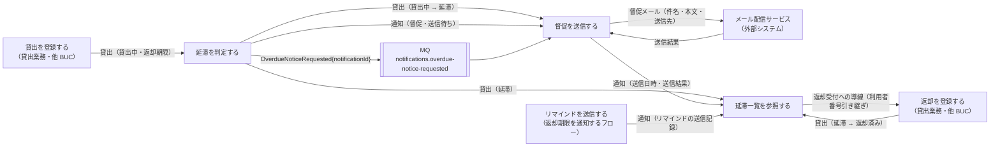
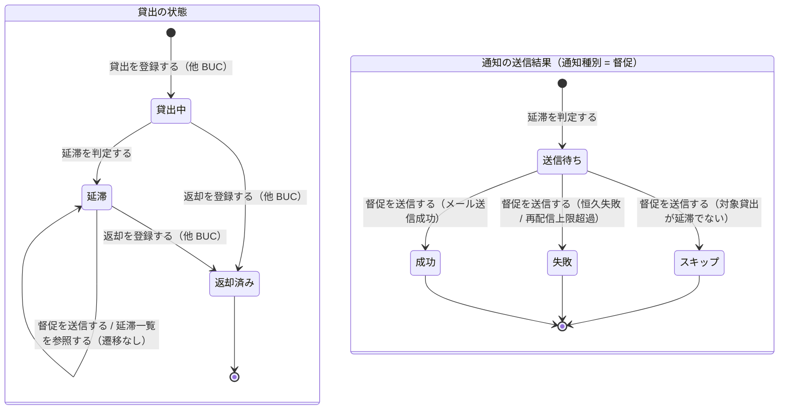

# 延滞者に督促するフロー

## 概要

日次バッチが返却期限を超過した貸出中の貸出を「延滞」に遷移させ、通知（督促・送信待ち）を作成する。別の日次バッチ（MQ コンシューマ）が督促メールをメール配信サービス経由で送信し、送信結果を通知に反映する。司書は延滞中の貸出と督促の送信状況を一覧で確認し、手作業の期限管理・督促を不要にする。

## 所属 UC 一覧

| UC名 | アクター | 主な操作 | 関連情報 |
|------|---------|---------|---------|
| [延滞を判定する](延滞を判定する/spec.md) | タイマー（日次延滞判定バッチ） | 貸出中で返却期限を超過した貸出を抽出して「延滞」に遷移させ、通知（督促・送信待ち）を作成して `OverdueNoticeRequested` を MQ に発行する | 貸出、利用者、通知 |
| [督促を送信する](督促を送信する/spec.md) | タイマー（日次督促送信バッチ・MQ コンシューマ） | `OverdueNoticeRequested` を受信し、対象貸出が延滞であることを再確認してメール配信サービス経由で督促メールを送信し、通知の送信日時・送信結果を更新する | 通知、貸出、利用者、書籍 |
| [延滞一覧を参照する](延滞一覧を参照する/spec.md) | 司書 | 延滞中の貸出と督促の送信状況（未送信 / 送信待ち / 送信済み / 失敗）を延滞・督促状況画面で一覧確認する | 貸出、利用者、書籍、通知 |

## UC 横断データフロー

BUC 内の UC 間で情報がどう流れるかを示す。情報がどの UC で作成（C）・参照（R）・更新（U）されるかを明記する。

### データフロー図

### 情報 CRUD マトリクス

| 情報名 | 延滞を判定する | 督促を送信する | 延滞一覧を参照する |
|--------|:-------------:|:-------------:|:-----------------:|
| 貸出 | U（貸出中 → 延滞） | R（送信時の再確認） | R（延滞のみ） |
| 利用者 | R（利用者番号・メールアドレス） | R（送信先） | R（氏名・連絡先はマスク表示） |
| 通知 | C（督促・送信待ち） | U（送信日時・送信結果） | R（督促・リマインドの送信記録） |
| 書籍 | - | R（本文のタイトル） | R（延滞書籍のタイトル） |

## 状態遷移全体図

BUC 内で関連する状態モデルの全遷移パスと、各遷移を担当する UC を示す。通知の送信結果は情報「通知」の属性の遷移として併記する。

### 状態遷移 UC マッピング

| 状態モデル | 遷移元 | 遷移先 | 担当 UC |
|-----------|--------|--------|--------|
| 貸出の状態 | 貸出中 | 延滞 | [延滞を判定する](延滞を判定する/spec.md) |
| 貸出の状態 | 延滞 | 延滞（遷移なし・送信時の再確認） | [督促を送信する](督促を送信する/spec.md) |
| 貸出の状態 | 延滞 | 延滞（遷移なし・表示のみ） | [延滞一覧を参照する](延滞一覧を参照する/spec.md) |
| 貸出の状態 | 延滞 | 返却済み | 返却を登録する（他 BUC: 貸出業務） |
| 貸出の状態 | （なし） | 貸出中 | 貸出を登録する（他 BUC: 貸出業務） |
| 貸出の状態 | 貸出中 | 返却済み | 返却を登録する（他 BUC: 貸出業務） |
| 通知の送信結果（情報: 通知） | （なし） | 送信待ち | [延滞を判定する](延滞を判定する/spec.md) |
| 通知の送信結果（情報: 通知） | 送信待ち | 成功 | [督促を送信する](督促を送信する/spec.md) |
| 通知の送信結果（情報: 通知） | 送信待ち | 失敗 | [督促を送信する](督促を送信する/spec.md) |
| 通知の送信結果（情報: 通知） | 送信待ち | スキップ | [督促を送信する](督促を送信する/spec.md) |

## BUC 内共有条件一覧

BUC 内の複数 UC で共有される条件の一覧。各条件がどの UC で適用されるかを明記する。

| 条件名 | 条件の説明 | 適用 UC |
|--------|----------|--------|
| 延滞判定 | 貸出の状態が「貸出中」で未返却、かつ当日の日付が返却期限を超過している貸出を延滞とする（返却期限当日は延滞ではない）。判定 UC が「延滞」へ遷移させ、送信 UC は送信直前に「まだ延滞か」を再確認し、一覧 UC は状態 = 延滞 の貸出を対象に延滞日数（今日 − 返却期限）を算出する | 延滞を判定する, 督促を送信する, 延滞一覧を参照する |
| 既処理判定（重複送信防止） | 判定時: `target_loan_id × 通知種別「督促」× requested_on` の一意制約で同日の通知レコード重複作成を防ぎ、すでに延滞なら遷移も行わない。送信時: 送信結果が「送信待ち」以外なら送信せず ACK し、MessageId = 通知 ID を KVS で照合する | 延滞を判定する, 督促を送信する |
| 延滞日数の算出 | overdueDays = 基準日 − 返却期限（1 以上）。督促本文の「N 日超過」と一覧の延滞日数列に共通で用いる | 延滞を判定する, 督促を送信する, 延滞一覧を参照する |

UC 固有の条件（参考）: 遷移の許可・楽観ロック競合（延滞を判定する）、送信結果分類（督促を送信する）、督促送信状況・利用者絞り込み・認可（延滞一覧を参照する）。

## BUC 内共有バリエーション一覧

BUC 内の複数 UC で共有されるバリエーションの一覧。

| バリエーション名 | 値 | 適用 UC |
|----------------|---|--------|
| 通知種別 | 督促（判定時は notification_type を固定、送信時はテンプレート切替、一覧では最新の督促レコードから送信状況を表示） | 延滞を判定する, 督促を送信する, 延滞一覧を参照する |

UC 固有のバリエーション（参考）: 通知種別 = リマインド / 督促（行展開の通知記録）、利用者区分 = 司書（延滞一覧を参照する）。
