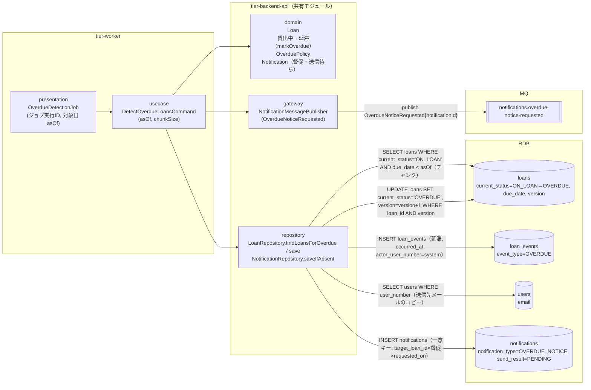
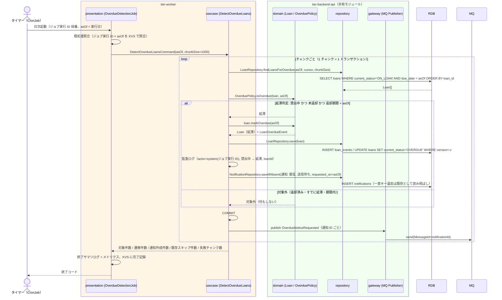

# 延滞を判定する

## 概要

日次延滞判定バッチ（タイマー）が、貸出の状態が「貸出中」で当日の日付が返却期限を超過した貸出を抽出し、貸出の状態を「貸出中」から「延滞」に遷移させる。あわせて通知種別「督促」の通知レコード（送信待ち）を作成し、非同期イベント `OverdueNoticeRequested` を MQ に発行する。督促メールの送信は UC「督促を送信する」が担う（抽出と送信の分離。arch LP-022 / SR-014）。

## データフロー



| レイヤー | データモデル | 変換内容 |
|---------|------------|---------|
| WK presentation | OverdueDetectionJob（ジョブ実行 ID、対象日 asOf = 実行日） | CronJob 起動 → Command 変換、ジョブ実行 ID を trace_id として採用 |
| WK usecase | DetectOverdueLoansCommand(asOf, chunkSize) | チャンク抽出 → 延滞判定 → 状態遷移 + 監査ログ → 通知レコード作成 → コミット後に MQ 発行 |
| BE domain | Loan（貸出 ID、書籍 ID、利用者番号、返却期限、貸出の状態）/ OverduePolicy / Notification | 条件「延滞判定」（貸出中 かつ 返却期限 < asOf）→ `Loan.markOverdue(asOf)` で 貸出中 → 延滞 |
| BE repository | loans SELECT（チャンク）/ UPDATE（楽観ロック）、loan_events INSERT、users SELECT、notifications INSERT | 遷移の永続化（history + snapshot。LR-008）と通知レコード（督促・送信待ち）の作成。既存キーはスキップ |
| BE gateway | OverdueNoticeRequested{notificationId, targetLoanId, userNumber, requestedOn, traceId} | 通知 ID を MessageId とする MQ 発行（冪等。LP-014） |

## 処理フロー



## バリエーション一覧

| バリエーション名 | 値 | 処理内容 | 適用 tier | 適用箇所 |
|----------------|---|---------|----------|---------|
| 通知種別 | 督促 | 作成する通知レコードの notification_type を「督促」に固定し、送信契機（期限超過）を区別する | tier-backend-api | NotificationRepository.saveIfAbsent / OverdueNoticeRequested |

## 分岐条件一覧

| 条件名 | 判定ルール | 適用 tier | 適用箇所 | BDD Scenario |
|--------|----------|----------|---------|-------------|
| 延滞判定 | 貸出の状態 = 貸出中 かつ 未返却 かつ asOf > 返却期限（返却期限当日は延滞ではない） | tier-backend-api | domain OverduePolicy.isOverdue / Loan.markOverdue | 返却期限を超過した貸出を延滞に遷移させる / 返却期限当日の貸出は延滞にしない |
| 遷移の許可 | 貸出中 → 延滞 のみ許可。すでに延滞・返却済みはドメイン例外（LP-010）。抽出条件で除外されるため通常は発生しない | tier-backend-api | domain Loan.markOverdue | 返却期限を超過した貸出を延滞に遷移させる |
| 既処理判定（重複送信防止） | notifications に target_loan_id × 通知種別「督促」× requested_on = asOf が存在すれば作成しない。貸出がすでに延滞なら遷移も行わない | tier-backend-api | NotificationRepository.saveIfAbsent（一意制約）/ 抽出条件 | 同日に再実行しても重複しない |
| 楽観ロック競合 | 遷移中に返却登録が先に反映された（version 不一致）場合は当該貸出をスキップし WARN（LP-018） | tier-backend-api | LoanRepository.save | 返却登録と競合した貸出はスキップする |

## 計算ルール一覧

| 計算名 | 入力情報 | 計算式/ロジック | 出力情報 | 適用 tier |
|--------|---------|---------------|---------|----------|
| 延滞日数 | 貸出.返却期限、対象日 asOf | overdueDays = asOf − 返却期限（1 以上のとき延滞。督促本文の「N 日超過」に使用） | 延滞日数 | tier-backend-api |

## 状態遷移一覧

| 状態モデル | 遷移元 | 遷移先 | トリガー | 事前条件 | 事後処理 | 適用 tier |
|-----------|--------|--------|---------|---------|---------|----------|
| 貸出の状態 | 貸出中 | 延滞 | 延滞を判定する（日次延滞判定バッチ） | 未返却 かつ asOf > 返却期限 | loan_events に延滞イベントを記録、監査ログ、通知（督促・送信待ち）作成、OverdueNoticeRequested 発行 | tier-backend-api |
| 書籍の状態 | 貸出中 | 貸出中（遷移なし） | 延滞を判定する | 書籍の状態は変えない | なし | tier-backend-api |

## 関連 RDRA モデル

| モデル種別 | 要素名 | 関連 |
|-----------|--------|------|
| 業務 | 期限管理業務 | このUCが属する業務 |
| BUC | 延滞者に督促するフロー | このUCを含むBUC |
| アクター | タイマー | 日次延滞判定バッチとして起動する |
| 情報 | 貸出 | 抽出対象。貸出の状態を延滞に更新 |
| 情報 | 利用者 | 通知先の利用者番号・メールアドレス |
| 情報 | 通知 | 通知レコード（督促・送信待ち）を作成 |
| 状態 | 貸出の状態 | 貸出中 → 延滞 |
| 条件 | 延滞判定 | 適用される条件 |
| バリエーション | 通知種別 | 督促 |
| タイマー | 日次延滞判定バッチ | 起動契機 |

## E2E 完了条件（BDD）

### 正常系

```gherkin
Feature: 延滞を判定する

  Scenario: 返却期限を超過した貸出を延滞に遷移させる
    Given 利用者「U-0001」の貸出「L-2001」が貸出中で返却期限が 2026-09-02 である
    And 通知テーブルに貸出「L-2001」の督促が存在しない
    When 日次延滞判定バッチが対象日 2026-09-03 で実行される
    Then 貸出「L-2001」の貸出の状態が「延滞」になる
    And 貸出「L-2001」に対して通知種別「督促」・送信結果「送信待ち」の通知レコードが 1 件作成される
    And MQ チャネル "notifications.overdue-notice-requested" に OverdueNoticeRequested が 1 件発行される
    And 監査ログに actor=system, 対象 L-2001, 貸出中 → 延滞 が記録される

  Scenario: 返却期限当日の貸出は延滞にしない
    Given 貸出「L-2002」が貸出中で返却期限が 2026-09-03 である
    When 日次延滞判定バッチが対象日 2026-09-03 で実行される
    Then 貸出「L-2002」の貸出の状態は「貸出中」のままである
    And 通知レコードは作成されない

  Scenario: 同日に再実行しても重複しない
    Given 貸出「L-2001」がすでに延滞で、対象日 2026-09-03 の督促通知レコードが存在する
    When 日次延滞判定バッチが対象日 2026-09-03 で再実行される
    Then 貸出「L-2001」は抽出されず通知レコードは 1 件のままである
    And バッチ終了サマリログに遷移件数 0 が出力される
```

### 異常系

```gherkin
  Scenario: 返却登録と競合した貸出はスキップする
    Given 貸出「L-2003」が貸出中で返却期限が 2026-09-01 である
    And バッチが貸出「L-2003」を抽出した直後に司書が返却登録を完了し version が進んだ
    When バッチが貸出「L-2003」の状態遷移を保存する
    Then 楽観ロック競合として貸出「L-2003」はスキップされ WARN ログが出力される
    And 貸出「L-2003」の状態は「返却済み」のままで通知レコードは作成されない

  Scenario: チャンク処理の失敗でジョブ全体を停止しない
    Given 期限超過の貸出中の貸出が 2,500 件あり、チャンクサイズが 1,000 件である
    And 2 チャンク目の保存中に RDB 接続エラーが発生する
    When 日次延滞判定バッチが実行される
    Then 1 チャンク目と 3 チャンク目の貸出は延滞に遷移し通知レコードが作成される
    And バッチ終了サマリログに失敗チャンク数 1 が出力され終了コードは異常終了となる
    And 再実行時は 2 チャンク目の未処理分のみ処理される
```

## ティア別仕様

- [ワーカー](tier-worker.md)
- [Backend API](tier-backend-api.md)

### 統合 API Spec

- [OpenAPI Spec](../../../_cross-cutting/api/openapi.yaml)（全 UC 統合、Contract First 開発用）
- [AsyncAPI Spec](../../../_cross-cutting/api/asyncapi.yaml)（全 UC 統合、非同期イベントがある場合のみ）
