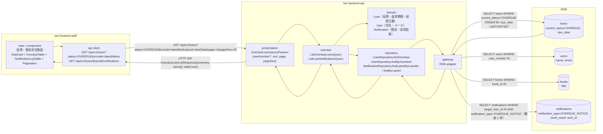
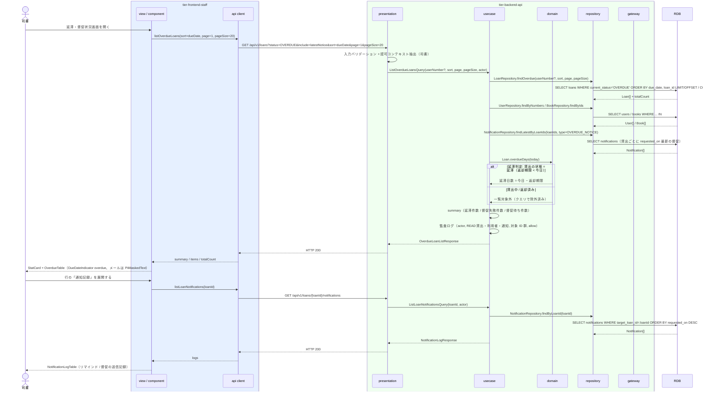

# 延滞一覧を参照する

## 概要

司書が延滞中の貸出（貸出の状態 = 延滞）と督促の送信状況を延滞・督促状況画面で一覧確認し、手作業の期限管理・督促なしに延滞の状況を把握する。日次延滞判定バッチが遷移させた延滞と、督促送信ワーカーが反映した通知（督促）の送信結果を合わせて表示する。

## データフロー



| レイヤー | データモデル | 変換内容 |
|---------|------------|---------|
| FE view / component | StatCard（延滞件数 / 督促失敗件数 / 督促待ち件数）、OverdueTable（rows / today）、NotificationLogTable（logs）、PiiMaskedText（メール）、Pagination | 並び替え・ページ操作 → クエリパラメータ変換。行展開で通知記録を追加取得 |
| BE presentation | OverdueLoansQueryParams(userNumber?, sort=dueDate, page=1, pageSize=20) / loanId（パス） | 型・形式・範囲のバリデーション（LP-001）→ Query 変換。認可コンテキスト（司書）を抽出（LP-003） |
| BE usecase | ListOverdueLoansQuery / ListLoanNotificationsQuery | 延滞貸出のページ取得 → 利用者・書籍・最新督促の付与 → 監査ログ（貸出・利用者・通知の参照。LP-006） |
| BE domain | Loan（貸出 ID、書籍 ID、利用者番号、貸出日、返却期限、貸出の状態）/ User / Notification | 延滞日数 = 今日 − 返却期限。督促の送信状況 = 最新の督促通知の送信結果 |
| BE repository / gateway | loans SELECT（延滞・ページ）、users / books SELECT、notifications SELECT（最新督促 / 貸出別一覧） | 一覧行の組み立て |
| Response | OverdueLoanListResponse{summary{overdueCount, noticeFailedCount, noticePendingCount}, items[{loanId, book{bookId, title}, user{userNumber, name, email}, loanedOn, dueDate, overdueDays, latestNotice{notificationId, sentAt, sendResult, failureReason}, noticeCount}], page, pageSize, totalCount} / NotificationLogResponse{items[{notificationId, notificationType, recipientEmail, sentAt, sendResult, failureReason}]} | OverdueTable・NotificationLogTable の表示用 |

## 処理フロー



## バリエーション一覧

| バリエーション名 | 値 | 処理内容 | 適用 tier | 適用箇所 |
|----------------|---|---------|----------|---------|
| 通知種別 | 督促 | 一覧の「最終督促日時 / 送信結果」は通知種別 = 督促 の最新レコードから取る | tier-backend-api | NotificationRepository.findLatestByLoanIds |
| 通知種別 | リマインド / 督促 | 行展開の通知記録には対象貸出のリマインドと督促の両方を表示する | tier-frontend-staff | NotificationLogTable |
| 利用者区分 | 司書 | 司書のみ画面と API を利用できる | tier-backend-api / tier-frontend-staff | presentation LP-003 / PortalShell(staff) |

## 分岐条件一覧

| 条件名 | 判定ルール | 適用 tier | 適用箇所 | BDD Scenario |
|--------|----------|----------|---------|-------------|
| 延滞判定 | 貸出の状態 = 延滞 の貸出のみ一覧対象（状態遷移は UC「延滞を判定する」が行う。本 UC は状態を参照し、延滞日数 = 今日 − 返却期限 を算出） | tier-backend-api | LoanRepository.findOverdue / domain Loan.overdueDays | 延滞中の貸出と督促状況を一覧表示する |
| 督促送信状況 | 最新の督促通知が無い → 「未送信」、send_result = PENDING → 「送信待ち」、成功 → 「送信済み（日時）」、失敗 → 「失敗（理由コード）」 | tier-backend-api / tier-frontend-staff | usecase / OverdueTable | 督促の送信失敗を確認する |
| 利用者絞り込み | userNumber 指定時は該当利用者の延滞のみ | tier-backend-api | LoanRepository.findOverdue | 利用者番号で絞り込む |
| 認可 | 利用者区分 = 司書 のみ。利用者は 403 + 監査ログ | tier-backend-api | presentation / usecase LP-007 | 利用者区分「利用者」は参照できない |

## 計算ルール一覧

| 計算名 | 入力情報 | 計算式/ロジック | 出力情報 | 適用 tier |
|--------|---------|---------------|---------|----------|
| 延滞日数 | 貸出.返却期限、今日 | overdueDays = 今日 − 返却期限（日、1 以上） | items[].overdueDays | tier-backend-api |
| 延滞件数 | 貸出の状態 | overdueCount = COUNT(current_status = OVERDUE)（絞り込みに依らず全体） | summary.overdueCount | tier-backend-api |
| 督促失敗件数 / 督促待ち件数 | 最新督促通知.送信結果 | noticeFailedCount = 最新督促が失敗の延滞件数、noticePendingCount = 最新督促が無いか送信待ちの延滞件数 | summary | tier-backend-api |
| 督促回数 | 通知（督促） | noticeCount = COUNT(notifications WHERE target_loan_id AND 通知種別 = 督促) | items[].noticeCount | tier-backend-api |

## 状態遷移一覧

| 状態モデル | 遷移元 | 遷移先 | トリガー | 事前条件 | 事後処理 | 適用 tier |
|-----------|--------|--------|---------|---------|---------|----------|
| 貸出の状態 | 延滞 | （遷移なし） | 延滞一覧を参照する | 参照のみ。返却登録（返却受付画面）で返却済みへ遷移する | なし | tier-backend-api |

## 関連 RDRA モデル

| モデル種別 | 要素名 | 関連 |
|-----------|--------|------|
| 業務 | 期限管理業務 | このUCが属する業務 |
| BUC | 延滞者に督促するフロー | このUCを含むBUC |
| アクター | 司書 | 延滞状況を確認する |
| 情報 | 貸出 | 延滞中の貸出（返却期限・貸出の状態） |
| 情報 | 利用者 | 延滞者の氏名・連絡先（マスク表示） |
| 情報 | 書籍 | 延滞書籍のタイトル |
| 情報 | 通知 | 督促・リマインドの送信記録（送信日時・送信結果） |
| 状態 | 貸出の状態 | 延滞のみ対象 |
| 条件 | 延滞判定 | 適用される条件 |
| バリエーション | 通知種別 | 督促 / リマインド |
| バリエーション | 利用者区分 | 司書のみ |
| 画面 | 延滞・督促状況画面 | 表示画面 |

## E2E 完了条件（BDD）

### 正常系

```gherkin
Feature: 延滞一覧を参照する

  Scenario: 延滞中の貸出と督促状況を一覧表示する
    Given 司書「S-0001」が司書ポータルにログイン済みで、今日が 2026-09-03 である
    And 貸出「L-2001」（利用者「U-0001」田中太郎、書籍「吾輩は猫である」、返却期限 2026-08-30）が延滞である
    And 貸出「L-2001」に通知種別「督促」・送信結果「成功」・送信日時 2026-09-01 09:10 の通知が存在する
    When 延滞・督促状況画面を開く
    Then StatCard「延滞件数」に 1 が表示される
    And OverdueTable に利用者「田中太郎」・書籍「吾輩は猫である」・返却期限 2026/08/30・延滞日数 4 日・最終督促 2026/09/01 09:10・送信結果「送信済み」が表示される
    And メールアドレスは PiiMaskedText でマスク表示される

  Scenario: 督促の送信失敗を確認する
    Given 司書「S-0001」がログイン済みである
    And 貸出「L-2002」が延滞で、最新の督促通知の送信結果が「失敗」（failureReason: INVALID_RECIPIENT）である
    When 延滞・督促状況画面を開く
    Then 貸出「L-2002」の行の送信結果が「失敗（宛先不正）」で destructive 色で表示される
    And StatCard「督促失敗」に 1 が表示される

  Scenario: 行を展開して通知記録を確認する
    Given 司書「S-0001」が延滞・督促状況画面を表示している
    And 貸出「L-2001」にリマインド 1 件と督促 2 件の通知が存在する
    When 貸出「L-2001」の行の「通知記録」を展開する
    Then NotificationLogTable に 3 件が送信予定日の新しい順に表示され、各行に通知種別・送信日時・送信結果が表示される

  Scenario: 延滞者の利用状況照会へ遷移する
    Given 司書「S-0001」が延滞・督促状況画面を表示している
    When 貸出「L-2001」の利用者「U-0001」を選ぶ
    Then 窓口利用状況照会画面（/staff/users/U-0001/status）へ遷移する
```

### 異常系

```gherkin
  Scenario: 延滞がない場合は空状態を表示する
    Given 司書「S-0001」がログイン済みで延滞の貸出が存在しない
    When 延滞・督促状況画面を開く
    Then StatCard「延滞件数」に 0 が表示され EmptyState「延滞中の貸出はありません」が表示される

  Scenario: 利用者区分「利用者」は参照できない
    Given 利用者「U-0001」（利用者区分: 利用者）のアクセストークンを持つ
    When GET /api/v1/loans?status=OVERDUE&include=latestNotice&sort=dueDate&page=1&pageSize=20 を呼ぶ
    Then HTTP 403 と problem+json {code: "FORBIDDEN"} が返る
    And 監査ログに actor=U-0001, action=READ_LOANS, result=deny が記録される
```

## ティア別仕様

- [司書向けフロントエンド](tier-frontend-staff.md)
- [Backend API](tier-backend-api.md)

### 統合 API Spec

- [OpenAPI Spec](../../../_cross-cutting/api/openapi.yaml)（全 UC 統合、Contract First 開発用）
- [AsyncAPI Spec](../../../_cross-cutting/api/asyncapi.yaml)（全 UC 統合、非同期イベントがある場合のみ）
