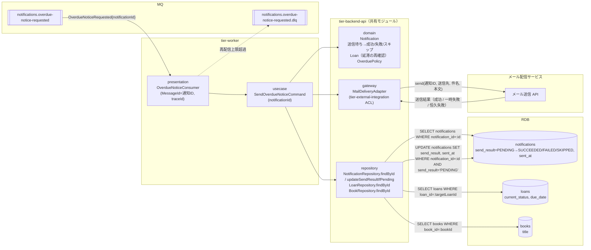
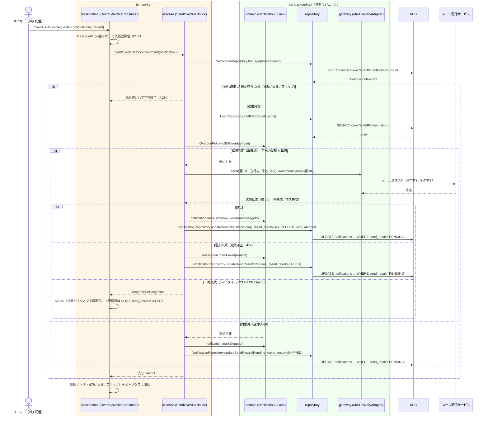

# 督促を送信する

## 概要

日次督促送信バッチ（タイマー起動の MQ コンシューマ）が、UC「延滞を判定する」が発行した `OverdueNoticeRequested` を `notifications.overdue-notice-requested` から受信し、通知レコード（通知種別「督促」・送信待ち）を読み出してメール配信サービス経由で督促メールを送信し、送信日時と送信結果を通知レコードに反映する。抽出と送信の分離（arch LP-022 / SR-014）の送信側を担う。構造は UC「リマインドを送信する」と同一で、通知種別と送信直前の再確認条件（延滞判定）だけが異なる。

## データフロー



| レイヤー | データモデル | 変換内容 |
|---------|------------|---------|
| WK presentation | OverdueNoticeConsumer（MessageId = 通知 ID、traceId = ジョブ実行 ID） | MQ メッセージのデシリアライズ → Command 変換。MessageId で既処理照合（LR-014） |
| WK usecase | SendOverdueNoticeCommand(notificationId) | 通知レコード取得 → 送信可否判定 → ACL 送信 → 送信結果の反映（LP-024） |
| BE domain | Notification（通知 ID、通知種別、送信先、件名、本文、送信結果）/ Loan（貸出の状態、返却期限）/ OverduePolicy | 送信待ち → 成功 / 失敗 / スキップ の遷移。貸出が延滞でなくなっていれば（返却済み）送信不要と判定 |
| BE repository | notifications SELECT / UPDATE、loans SELECT、books SELECT | 送信結果と送信日時の反映（条件付き UPDATE で二重反映を防止） |
| BE gateway | MailDeliveryAdapter（tier-external-integration の ACL アダプタ） | 通知語彙 → メール配信サービスの API モデルに翻訳。冪等キー = 通知 ID（LR-019） |

## 処理フロー



## バリエーション一覧

| バリエーション名 | 値 | 処理内容 | 適用 tier | 適用箇所 |
|----------------|---|---------|----------|---------|
| 通知種別 | 督促 | 件名・本文のテンプレートを督促用（書籍名・返却期限・延滞日数）に切り替え、送信契機（期限超過）を区別する。ストラテジー（LP-012） | tier-backend-api | OverdueNoticeTemplate / MailDeliveryAdapter |

## 分岐条件一覧

| 条件名 | 判定ルール | 適用 tier | 適用箇所 | BDD Scenario |
|--------|----------|----------|---------|-------------|
| 延滞判定（送信時再確認） | 通知レコードの対象貸出が貸出の状態 = 延滞 のときのみ送信する。返却済みに遷移していれば送信せず「スキップ」とする | tier-backend-api | domain OverduePolicy.isStillOverdue | 送信待ちの督促通知をメール送信する / 判定後に返却された貸出には送信しない |
| 既処理判定（重複送信防止） | 通知レコードの送信結果が「送信待ち」以外なら送信せず ACK する。MessageId = 通知 ID を KVS で照合する | tier-worker | OverdueNoticeConsumer / NotificationRepository.updateSendResultIfPending | 同じメッセージを再受信しても二重送信しない |
| 送信結果分類 | ACL の結果型: 成功 → 成功、恒久失敗（4xx・宛先不正）→ 失敗、一時失敗（5xx・タイムアウト・サーキットブレーカー Open）→ 再配信 | tier-worker | OverdueNoticeConsumer（LR-015） | 一時障害時は再配信し上限超過で DLQ に退避する |

## 計算ルール一覧

| 計算名 | 入力情報 | 計算式/ロジック | 出力情報 | 適用 tier |
|--------|---------|---------------|---------|----------|
| 再配信間隔 | 再配信回数 n（1〜5） | 待機秒 = min(30 × 2^(n-1), 600) + Jitter（0〜10 秒） | 次回配信時刻 | tier-worker |
| 延滞日数（本文用） | 貸出.返却期限、送信日 | overdueDays = 送信日 − 返却期限 | 本文の「N 日超過」 | tier-backend-api |

## 状態遷移一覧

| 状態モデル | 遷移元 | 遷移先 | トリガー | 事前条件 | 事後処理 | 適用 tier |
|-----------|--------|--------|---------|---------|---------|----------|
| 通知の送信結果（情報: 通知） | 送信待ち | 成功 | メール送信成功 | 通知種別 = 督促、対象貸出が延滞 | sent_at・external_message_id を設定 | tier-backend-api |
| 通知の送信結果（情報: 通知） | 送信待ち | 失敗 | 恒久失敗 / 再配信上限超過 | 同上 | failure_reason を設定。DLQ 退避（上限超過時）と WARN ログ | tier-worker / tier-backend-api |
| 通知の送信結果（情報: 通知） | 送信待ち | スキップ | 対象貸出が延滞でない | 判定後に返却済みへ遷移 | 送信しない | tier-backend-api |
| 貸出の状態 | 延滞 | 延滞（遷移なし） | 督促を送信する | 参照のみ | なし | tier-backend-api |

## 関連 RDRA モデル

| モデル種別 | 要素名 | 関連 |
|-----------|--------|------|
| 業務 | 期限管理業務 | このUCが属する業務 |
| BUC | 延滞者に督促するフロー | このUCを含むBUC |
| アクター | タイマー | 日次督促送信バッチ（MQ コンシューマ）として起動する |
| 情報 | 貸出 | 対象貸出（返却期限・貸出の状態の再確認） |
| 情報 | 利用者 | 送信先（通知レコードの送信先メールアドレスの元） |
| 情報 | 通知 | 送信対象レコード。送信日時・送信結果を更新 |
| 情報 | 書籍 | 本文に載せる書籍タイトル |
| 状態 | 貸出の状態 | 延滞のみ送信 |
| 条件 | 延滞判定 | 送信時の再確認に適用 |
| バリエーション | 通知種別 | 督促 |
| タイマー | 日次督促送信バッチ | 起動契機 |
| イベント | 延滞督促メール配信 | メール配信サービスへの送信 |
| 外部システム | メール配信サービス | メールを配信する |

## E2E 完了条件（BDD）

### 正常系

```gherkin
Feature: 督促を送信する

  Scenario: 送信待ちの督促通知をメール送信する
    Given 通知 ID「01J7O1」の通知レコードが通知種別「督促」・送信結果「送信待ち」で存在する
    And 対象貸出「L-2001」（利用者「U-0001」、書籍「吾輩は猫である」、返却期限 2026-09-02）が延滞である
    And 今日が 2026-09-03 である
    When MQ チャネル "notifications.overdue-notice-requested" から OverdueNoticeRequested{notificationId: "01J7O1"} を受信する
    Then メール配信サービスに送信先「U-0001 のメールアドレス」・件名「【図書館】返却期限超過のお知らせ（1 日超過）」でメール送信要求が 1 回行われる
    And 通知レコード「01J7O1」の送信結果が「成功」・送信日時が設定される
    And メッセージは ACK される

  Scenario: 同じメッセージを再受信しても二重送信しない
    Given 通知 ID「01J7O1」の通知レコードの送信結果が「成功」である
    When 同じ MessageId「01J7O1」の OverdueNoticeRequested を再受信する
    Then メール配信サービスへの送信要求は行われない
    And メッセージは ACK される

  Scenario: 判定後に返却された貸出には送信しない
    Given 通知 ID「01J7O2」の通知レコードが送信結果「送信待ち」で存在する
    And 対象貸出「L-2002」の貸出の状態が「返却済み」である
    When OverdueNoticeRequested{notificationId: "01J7O2"} を受信する
    Then メール配信サービスへの送信要求は行われない
    And 通知レコード「01J7O2」の送信結果が「スキップ」になる
```

### 異常系

```gherkin
  Scenario: 一時障害時は再配信し上限超過で DLQ に退避する
    Given 通知 ID「01J7O3」の通知レコードが送信結果「送信待ち」で存在する
    And メール配信サービスが HTTP 503 を返し続ける
    When OverdueNoticeRequested{notificationId: "01J7O3"} を受信する
    Then メッセージは指数バックオフで最大 5 回再配信される
    And 5 回目の失敗後にメッセージは "notifications.overdue-notice-requested.dlq" へ退避される
    And 通知レコード「01J7O3」の送信結果が「失敗」（failureReason: EXHAUSTED）になり WARN ログ「MAIL_DELIVERY_EXHAUSTED」が出力される

  Scenario: 宛先不正は再試行せず失敗として記録し司書が確認できる
    Given 通知 ID「01J7O4」の通知レコードの送信先メールアドレスが不正な形式である
    And 通知 ID「01J7O4」の対象貸出が「L-2004」である
    When OverdueNoticeRequested{notificationId: "01J7O4"} を受信する
    Then メール配信サービスは HTTP 400 を返し再試行は行われない
    And 通知レコード「01J7O4」の送信結果が「失敗」（failureReason: INVALID_RECIPIENT）になりメッセージは ACK される
    And 延滞・督促状況画面で貸出「L-2004」の送信結果に「失敗（宛先不正）」が表示される
```

## ティア別仕様

- [ワーカー](tier-worker.md)
- [Backend API](tier-backend-api.md)

### 統合 API Spec

- [OpenAPI Spec](../../../_cross-cutting/api/openapi.yaml)（全 UC 統合、Contract First 開発用）
- [AsyncAPI Spec](../../../_cross-cutting/api/asyncapi.yaml)（全 UC 統合、非同期イベントがある場合のみ）
