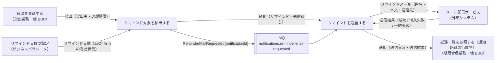
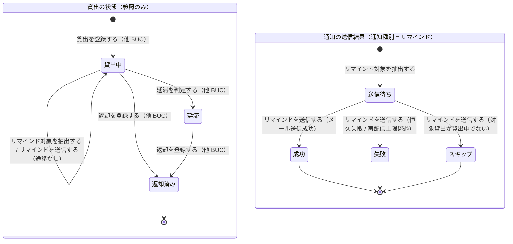

# 返却期限を通知するフロー

## 概要

日次バッチが返却期限までの残日数がリマインド日数以内の貸出中の貸出を抽出し、通知（リマインド・送信待ち）を作成する。別の日次バッチ（MQ コンシューマ）がその通知をメール配信サービス経由で送信し、送信日時と送信結果を通知に反映する。抽出と送信を分離し、重複送信と漏れを防ぐ。

## 所属 UC 一覧

| UC名 | アクター | 主な操作 | 関連情報 |
|------|---------|---------|---------|
| [リマインド対象を抽出する](リマインド対象を抽出する/spec.md) | タイマー（日次リマインド抽出バッチ） | 貸出中で残日数がリマインド日数以内の貸出を抽出し、通知（リマインド・送信待ち）を作成して `ReminderMailRequested` を MQ に発行する | 貸出、リマインド日数、利用者、通知 |
| [リマインドを送信する](リマインドを送信する/spec.md) | タイマー（日次リマインド送信バッチ・MQ コンシューマ） | `ReminderMailRequested` を受信し、対象貸出が貸出中であることを再確認してメール配信サービス経由でリマインドメールを送信し、通知の送信日時・送信結果を更新する | 通知、貸出、利用者、書籍 |

## UC 横断データフロー

BUC 内の UC 間で情報がどう流れるかを示す。情報がどの UC で作成（C）・参照（R）・更新（U）されるかを明記する。

### データフロー図

### 情報 CRUD マトリクス

| 情報名 | リマインド対象を抽出する | リマインドを送信する |
|--------|:----------------------:|:-------------------:|
| 貸出 | R（貸出中・返却期限） | R（送信時の再確認） |
| リマインド日数 | R | - |
| 利用者 | R（利用者番号・メールアドレス） | R（送信先） |
| 通知 | C（リマインド・送信待ち） | U（送信日時・送信結果） |
| 書籍 | - | R（本文のタイトル） |

## 状態遷移全体図

BUC 内で関連する状態モデルの全遷移パスと、各遷移を担当する UC を示す。本 BUC の 2 UC は貸出の状態を遷移させない（参照のみ）。通知の送信結果は情報「通知」の属性の遷移として併記する。

### 状態遷移 UC マッピング

| 状態モデル | 遷移元 | 遷移先 | 担当 UC |
|-----------|--------|--------|--------|
| 貸出の状態 | 貸出中 | 貸出中（遷移なし・抽出対象） | [リマインド対象を抽出する](リマインド対象を抽出する/spec.md) |
| 貸出の状態 | 貸出中 | 貸出中（遷移なし・送信時の再確認） | [リマインドを送信する](リマインドを送信する/spec.md) |
| 貸出の状態 | 貸出中 | 延滞 | 延滞を判定する（他 BUC: 延滞者に督促するフロー） |
| 貸出の状態 | 貸出中 | 返却済み | 返却を登録する（他 BUC: 貸出業務） |
| 貸出の状態 | 延滞 | 返却済み | 返却を登録する（他 BUC: 貸出業務） |
| 通知の送信結果（情報: 通知） | （なし） | 送信待ち | [リマインド対象を抽出する](リマインド対象を抽出する/spec.md) |
| 通知の送信結果（情報: 通知） | 送信待ち | 成功 | [リマインドを送信する](リマインドを送信する/spec.md) |
| 通知の送信結果（情報: 通知） | 送信待ち | 失敗 | [リマインドを送信する](リマインドを送信する/spec.md) |
| 通知の送信結果（情報: 通知） | 送信待ち | スキップ | [リマインドを送信する](リマインドを送信する/spec.md) |

## BUC 内共有条件一覧

BUC 内の複数 UC で共有される条件の一覧。各条件がどの UC で適用されるかを明記する。

| 条件名 | 条件の説明 | 適用 UC |
|--------|----------|--------|
| リマインド対象判定 | 貸出の状態が「貸出中」で未返却、かつ返却期限までの残日数がリマインド日数以内の貸出をリマインドの送信対象とする。抽出時に判定し、送信時に「対象貸出がまだ貸出中か」を再確認する（返却済み・延滞に遷移していればスキップ） | リマインド対象を抽出する, リマインドを送信する |
| 既処理判定（重複送信防止） | 抽出時: `target_loan_id × 通知種別「リマインド」× requested_on` の一意制約で同日の通知レコード重複作成を防ぐ。送信時: 送信結果が「送信待ち」以外なら送信せず ACK し、MessageId = 通知 ID を KVS で照合する | リマインド対象を抽出する, リマインドを送信する |

UC 固有の条件（参考）: 送信結果分類（成功 / 恒久失敗 / 一時失敗 → 再配信・DLQ。リマインドを送信する）。

## BUC 内共有バリエーション一覧

BUC 内の複数 UC で共有されるバリエーションの一覧。

| バリエーション名 | 値 | 適用 UC |
|----------------|---|--------|
| 通知種別 | リマインド（抽出時は notification_type を固定、送信時は件名・本文テンプレートを切替） | リマインド対象を抽出する, リマインドを送信する |
