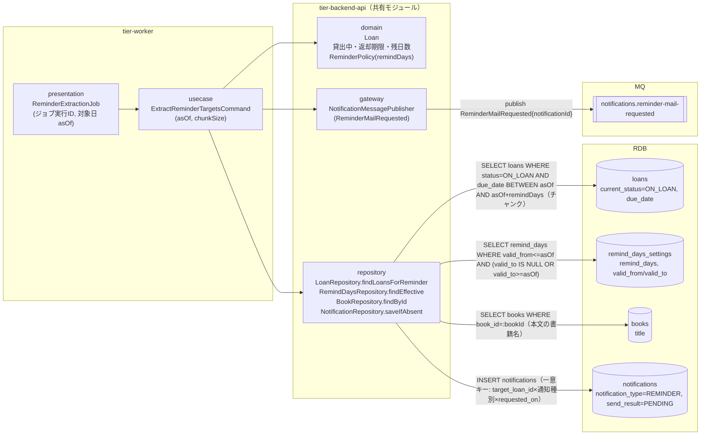
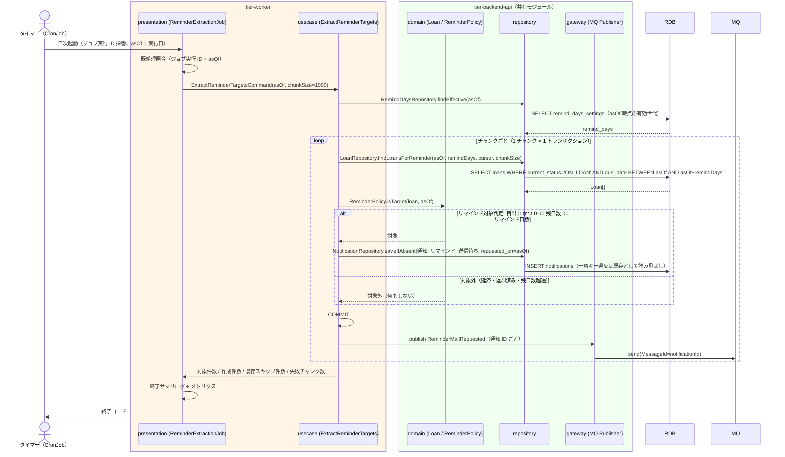

# リマインド対象を抽出する

## 概要

日次リマインド抽出バッチ（タイマー）が、貸出の状態が「貸出中」で返却期限までの残日数がリマインド日数以内の貸出を抽出し、通知種別「リマインド」の通知レコード（送信待ち）を作成して非同期イベント `ReminderMailRequested` を MQ に発行する。送信自体は UC「リマインドを送信する」が担う（抽出と送信の分離。arch LP-022 / SR-014）。

## データフロー



| レイヤー | データモデル | 変換内容 |
|---------|------------|---------|
| WK presentation | ReminderExtractionJob（ジョブ実行 ID、対象日 asOf = 実行日） | CronJob 起動 → Command 変換、ジョブ実行 ID を trace_id として採用 |
| WK usecase | ExtractReminderTargetsCommand(asOf, chunkSize) | 有効なリマインド日数の取得 → チャンク抽出 → 対象判定 → 通知レコード作成 → コミット後に MQ 発行 |
| BE domain | Loan（貸出 ID、利用者番号、書籍 ID、返却期限、貸出の状態）/ ReminderPolicy（リマインド日数） | 条件「リマインド対象判定」（残日数 = 返却期限 − asOf が 0 以上かつ リマインド日数以下） |
| BE repository | loans SELECT（チャンク）/ remind_days_settings SELECT / books SELECT（本文の書籍名）/ notifications INSERT（saveIfAbsent） | 通知レコード（送信待ち）を作成。既存（同一 target_loan_id × リマインド × requested_on）はスキップ |
| BE gateway | ReminderMailRequested{notificationId, targetLoanId, userNumber, traceId} | 通知 ID を MessageId とする MQ 発行（冪等） |

## 処理フロー



## バリエーション一覧

| バリエーション名 | 値 | 処理内容 | 適用 tier | 適用箇所 |
|----------------|---|---------|----------|---------|
| 通知種別 | リマインド | 作成する通知レコードの notification_type を「リマインド」に固定し、送信契機（期限接近）を区別する | tier-backend-api | NotificationRepository.saveIfAbsent / ReminderMailRequested |

## 分岐条件一覧

| 条件名 | 判定ルール | 適用 tier | 適用箇所 | BDD Scenario |
|--------|----------|----------|---------|-------------|
| リマインド対象判定 | 貸出の状態 = 貸出中 かつ 未返却 かつ 0 <= (返却期限 − asOf) <= リマインド日数（asOf 時点の有効世代） | tier-backend-api | domain ReminderPolicy.isTarget | 残日数がリマインド日数以内の貸出を抽出する / 残日数がリマインド日数を超える貸出は抽出しない |
| 既処理判定（重複送信防止） | notifications に target_loan_id × 通知種別「リマインド」× requested_on = asOf が存在すれば作成しない | tier-backend-api | NotificationRepository.saveIfAbsent（一意制約） | 同日に再実行しても通知レコードを重複作成しない |

## 計算ルール一覧

| 計算名 | 入力情報 | 計算式/ロジック | 出力情報 | 適用 tier |
|--------|---------|---------------|---------|----------|
| 残日数算出 | 貸出.返却期限、対象日 asOf | 残日数 = 返却期限 − asOf（日単位、負数は延滞） | 残日数 | tier-backend-api |
| 有効リマインド日数の解決 | リマインド日数.適用開始日 / 適用終了日、asOf | valid_from <= asOf AND (valid_to IS NULL OR valid_to >= asOf) の世代を採用 | リマインド日数 | tier-backend-api |

## 状態遷移一覧

| 状態モデル | 遷移元 | 遷移先 | トリガー | 事前条件 | 事後処理 | 適用 tier |
|-----------|--------|--------|---------|---------|---------|----------|
| 貸出の状態 | 貸出中 | 貸出中（遷移なし） | リマインド対象を抽出する | 状態は変えない（参照のみ） | 通知レコード（送信待ち）を作成し ReminderMailRequested を発行 | tier-backend-api |

## 関連 RDRA モデル

| モデル種別 | 要素名 | 関連 |
|-----------|--------|------|
| 業務 | 期限管理業務 | このUCが属する業務 |
| BUC | 返却期限を通知するフロー | このUCを含むBUC |
| アクター | タイマー | 日次リマインド抽出バッチとして起動する |
| 情報 | 貸出 | 抽出対象（貸出の状態・返却期限） |
| 情報 | リマインド日数 | 対象判定のビジネスパラメータ |
| 情報 | 利用者 | 通知先の利用者番号 |
| 情報 | 通知 | 通知レコード（リマインド・送信待ち）を作成 |
| 状態 | 貸出の状態 | 貸出中のみ対象 |
| 条件 | リマインド対象判定 | 適用される条件 |
| バリエーション | 通知種別 | リマインド |
| タイマー | 日次リマインド抽出バッチ | 起動契機 |

## E2E 完了条件（BDD）

### 正常系

```gherkin
Feature: リマインド対象を抽出する

  Scenario: 残日数がリマインド日数以内の貸出を抽出する
    Given リマインド日数の有効値が 3 日である
    And 利用者「U-0001」の貸出「L-1001」が貸出中で返却期限が 2026-09-05 である
    And 通知テーブルに貸出「L-1001」のリマインドが存在しない
    When 日次リマインド抽出バッチが対象日 2026-09-03 で実行される
    Then 貸出「L-1001」に対して通知種別「リマインド」・送信結果「送信待ち」の通知レコードが 1 件作成される
    And MQ チャネル "notifications.reminder-mail-requested" に ReminderMailRequested が 1 件発行される
    And バッチ終了サマリログに対象件数 1 / 作成件数 1 が出力される

  Scenario: 残日数がリマインド日数を超える貸出は抽出しない
    Given リマインド日数の有効値が 3 日である
    And 貸出「L-1002」が貸出中で返却期限が 2026-09-10 である
    When 日次リマインド抽出バッチが対象日 2026-09-03 で実行される
    Then 貸出「L-1002」の通知レコードは作成されない
    And MQ に ReminderMailRequested は発行されない

  Scenario: 同日に再実行しても通知レコードを重複作成しない
    Given 貸出「L-1001」に対象日 2026-09-03 のリマインド通知レコードが既に存在する
    When 日次リマインド抽出バッチが対象日 2026-09-03 で再実行される
    Then 貸出「L-1001」のリマインド通知レコードは 1 件のままである
    And バッチ終了サマリログに既存スキップ件数 1 が出力される
```

### 異常系

```gherkin
  Scenario: チャンク処理の失敗でジョブ全体を停止しない
    Given 貸出中の貸出が 2,500 件あり、チャンクサイズが 1,000 件である
    And 2 チャンク目の通知レコード作成中に RDB 接続エラーが発生する
    When 日次リマインド抽出バッチが実行される
    Then 1 チャンク目と 3 チャンク目の通知レコードは作成される
    And バッチ終了サマリログに失敗チャンク数 1 が出力され終了コードは異常終了となる
    And 再実行時は 2 チャンク目の未処理分のみ通知レコードが作成される

  Scenario: 有効なリマインド日数が存在しない
    Given 対象日 2026-09-03 に有効なリマインド日数の世代が存在しない
    When 日次リマインド抽出バッチが実行される
    Then 通知レコードは作成されない
    And ERROR ログ「REMIND_DAYS_NOT_FOUND」が 1 回出力され終了コードは異常終了となる
```

## ティア別仕様

- [ワーカー](tier-worker.md)
- [Backend API](tier-backend-api.md)

### 統合 API Spec

- [OpenAPI Spec](../../../_cross-cutting/api/openapi.yaml)（全 UC 統合、Contract First 開発用）
- [AsyncAPI Spec](../../../_cross-cutting/api/asyncapi.yaml)（全 UC 統合、非同期イベントがある場合のみ）
