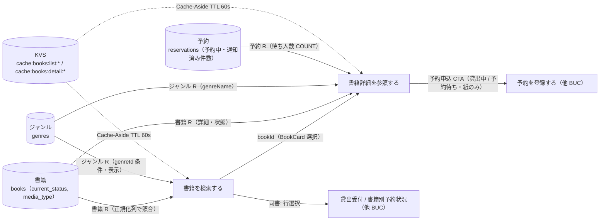
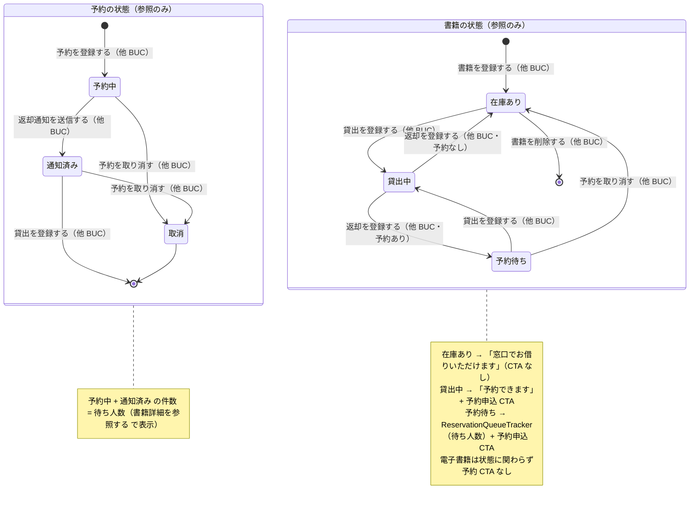

# 書籍を検索するフロー

## 概要

利用者がキーワード・タイトル・著者・ISBN・ジャンルで蔵書を検索し、検索結果から書籍の詳細と在庫状況（在庫あり・貸出中・予約待ち）を確認して次の行動（窓口で借りる / 予約を申し込む）を決める BUC。司書も窓口で同じ検索機能（窓口蔵書検索画面）を使って利用者の問い合わせに案内する。本 BUC は情報を参照するだけで、状態を遷移させない。

## 所属 UC 一覧

| UC名 | アクター | 主な操作 | 関連情報 |
|------|---------|---------|---------|
| [書籍を検索する](書籍を検索する/spec.md) | 利用者（価値受益）、司書（価値提供） | 検索条件種別と検索文字列（またはジャンル）を指定して蔵書を検索し、在庫状況つきの一覧を表示する。`GET /api/v1/books` を公開経路 / 館内経路で共有 | 書籍、ジャンル |
| [書籍詳細を参照する](書籍詳細を参照する/spec.md) | 利用者（価値受益） | 検索結果から書籍を選び、詳細と在庫状況・予約待ち人数を確認する。在庫状況に応じて予約申込 CTA を切り替える | 書籍、ジャンル、予約 |

## UC 横断データフロー

BUC 内の UC 間で情報がどう流れるかを示す。情報がどの UC で作成（C）・参照（R）・更新（U）されるかを明記する。

### データフロー図

### 情報 CRUD マトリクス

| 情報名 | 書籍を検索する | 書籍詳細を参照する |
|--------|:-------:|:-------:|
| 書籍 | R | R |
| ジャンル | R | R |
| 予約 | | R |

補足:

- 本 BUC の 2 UC はいずれも読み取り専用で、書籍・ジャンル・予約を作成・更新しない。
- 書籍詳細を参照する の予約参照は、予約 BC の公開 IF（countActiveReservations）経由で予約中・通知済みの件数のみ取得する。

## 状態遷移全体図

BUC 内で関連する状態モデルの全遷移パスと、各遷移を担当する UC を示す。本 BUC は書籍の状態・予約の状態を参照するのみで、遷移はすべて他 BUC が担当する。参照する状態が表示と導線（CTA）を決める。

### 状態遷移 UC マッピング

| 状態モデル | 遷移元 | 遷移先 | 担当 UC |
|-----------|--------|--------|--------|
| 書籍の状態 | （参照のみ） | （遷移なし） | [書籍を検索する](書籍を検索する/spec.md)（在庫状況判定で BookStatusBadge を表示） |
| 書籍の状態 | （参照のみ） | （遷移なし） | [書籍詳細を参照する](書籍詳細を参照する/spec.md)（在庫状況判定で表示と CTA を切替） |
| 予約の状態 | （参照のみ） | （遷移なし） | [書籍詳細を参照する](書籍詳細を参照する/spec.md)（予約中・通知済みの件数を待ち人数として表示） |
| 書籍の状態 | （初期） | 在庫あり | 書籍を登録する（蔵書管理業務 / 蔵書を管理するフロー） |
| 書籍の状態 | 在庫あり / 予約待ち | 貸出中 | 貸出を登録する（貸出業務 / 書籍を貸し出すフロー） |
| 書籍の状態 | 貸出中 | 在庫あり / 予約待ち | 返却を登録する（貸出業務 / 書籍を返却するフロー） |
| 書籍の状態 | 予約待ち | 在庫あり | 予約を取り消す（貸出業務 / 書籍を予約するフロー） |
| 書籍の状態 | 在庫あり | （削除・終了） | 書籍を削除する（蔵書管理業務 / 蔵書を管理するフロー） |

## BUC 内共有条件一覧

BUC 内の複数 UC で共有される条件の一覧。各条件がどの UC で適用されるかを明記する。

| 条件名 | 条件の説明 | 適用 UC |
|--------|----------|--------|
| 在庫状況判定 | books.current_status（在庫あり / 貸出中 / 予約待ち）をもとに BookStatusBadge を表示する。利用者画面では貸出中・予約待ちに「予約できます」を並記し、詳細画面ではさらに予約申込 CTA と待ち人数（予約待ち時）を表示する | 書籍を検索する, 書籍詳細を参照する |
| 媒体種別判定 | 媒体種別が電子の書籍には予約導線を出さない（初期リリースは紙のみ貸出・予約対象）。検索結果では BookCard / BookTable の媒体表示で「予約できます」導線を抑止し、詳細画面では「電子書籍は貸出・予約の対象外です」を表示する | 書籍を検索する（バリエーション処理として適用）, 書籍詳細を参照する |

BUC 内で 1 つの UC でしか使われない条件（UC Spec 側のみ）:

- 書籍検索条件判定（書籍を検索する）
- 検索文字列必須判定（書籍を検索する）

## BUC 内共有バリエーション一覧

BUC 内の複数 UC で共有されるバリエーションの一覧。

| バリエーション名 | 値 | 適用 UC |
|----------------|---|--------|
| ジャンル | 文学、社会科学、自然科学、技術、芸術、歴史、児童書、その他 | 書籍を検索する（searchType=genre の選択肢・表示）, 書籍詳細を参照する（genreName 表示） |
| 媒体種別 | 紙、電子 | 書籍を検索する（媒体表示・予約導線抑止）, 書籍詳細を参照する（予約 CTA の有無） |

BUC 内で 1 つの UC でしか使われないバリエーション（UC Spec 側のみ）:

- 検索条件種別（書籍を検索する）
