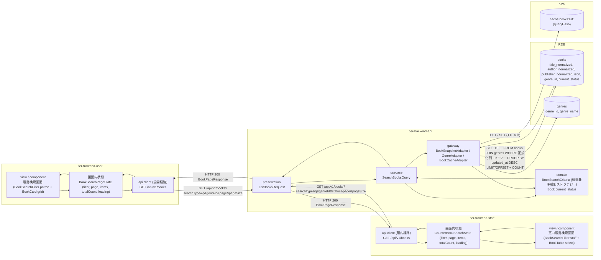
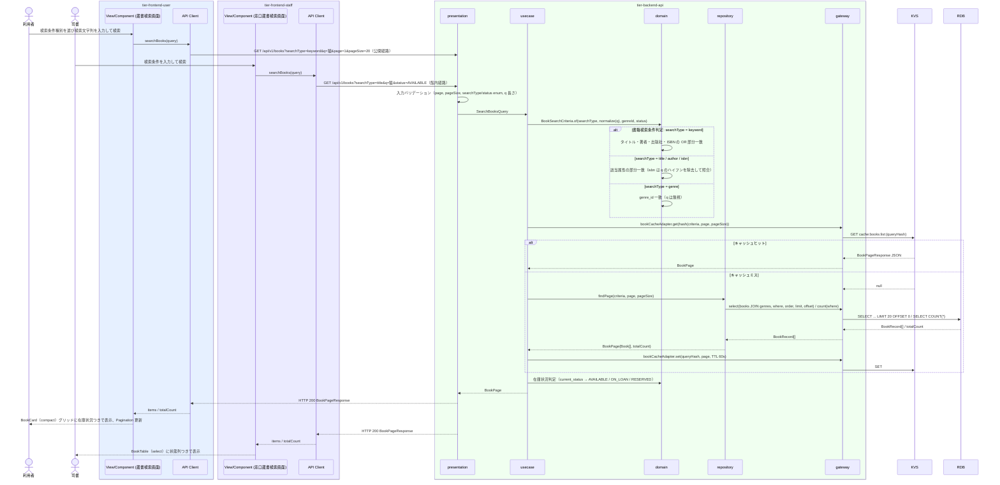

# 書籍を検索する

## 概要

利用者がキーワード・タイトル・著者・ISBN・ジャンルのいずれかを条件に蔵書を検索し、該当する書籍の一覧を在庫状況つきで表示する（蔵書検索画面）。
司書も窓口で利用者からの問い合わせに応じ、同じ検索機能（窓口蔵書検索画面）で蔵書と在庫状況を確認して案内する。
検索 API は `GET /api/v1/books` を利用者経路（公開）と司書経路（館内）で共有し、照合は大文字小文字・全角半角を正規化した部分一致とする。

## データフロー



| レイヤー | データモデル | 変換内容 |
|---------|------------|---------|
| FE(user) view | BookSearchFilter（patron）の入力値（searchType 既定 keyword, q, genreId）、ページ番号 | 入力を URL クエリ（`/search?searchType=&q=&genreId=&page=`）に反映し GET のクエリへ変換。結果は BookCard（compact）グリッドに表示 |
| FE(staff) view | BookSearchFilter（staff）の入力値（searchType, q, genreId, status）、ページ番号 | 同上（`/staff/search?...`）。結果は BookTable（select）に表示し、行選択で書籍別予約状況 / 貸出受付へ遷移 |
| FE api client | GET /api/v1/books のクエリ | trace_id 付与、HTTP エラーの正規化（LR-023 / LR-027）。利用者経路は公開 API Gateway、司書経路は館内 API Gateway |
| BE presentation | ListBooksRequest(page, pageSize, searchType, q, genreId, status) | 型・範囲・enum 検証（LP-001）。SearchBooksQuery に変換 |
| BE usecase | SearchBooksQuery → BookPage | q を正規化し BookSearchCriteria（検索条件種別ストラテジー）に変換。Cache-Aside で KVS を参照し、ミス時に repository へ委譲（LP-017） |
| BE domain | BookSearchCriteria / Book | 書籍検索条件判定（searchType に応じた照合属性）、在庫状況判定（current_status → 表示状態） |
| BE gateway | books JOIN genres の SELECT（LIMIT/OFFSET）+ COUNT / KVS GET・SET | BookRecord → Book 復元、結果を JSON でキャッシュ |
| Response | BookPageResponse { items: BookSummary[], page, pageSize, totalCount } | BookCard / BookTable の行データ + Pagination |

## 処理フロー



## バリエーション一覧

| バリエーション名 | 値 | 処理内容 | 適用 tier | 適用箇所 |
|----------------|---|---------|----------|---------|
| 検索条件種別 | キーワード、タイトル、著者、ISBN、ジャンル | BookSearchFilter の ToggleGroup で切替。API では `searchType` として照合属性のストラテジーを切り替える（LP-012） | tier-frontend-user, tier-frontend-staff, tier-backend-api | 蔵書検索画面 / 窓口蔵書検索画面 / SearchBooksQuery |
| ジャンル | 文学、社会科学、自然科学、技術、芸術、歴史、児童書、その他 | searchType=genre のときの Select 選択肢（genreId）。選択肢にはジャンル.説明（GenreListResponse.description）を補助テキストとして表示する。BookCard / BookTable のジャンル表示 | tier-frontend-user, tier-frontend-staff, tier-backend-api | BookSearchFilter / GET /api/v1/genres / GET /api/v1/books |
| 媒体種別 | 紙、電子 | 検索結果に媒体種別を表示する。電子書籍は「予約できます」導線を出さない | tier-frontend-user, tier-frontend-staff | BookCard / BookTable の媒体表示 |

## 分岐条件一覧

| 条件名 | 判定ルール | 適用 tier | 適用箇所 | BDD Scenario |
|--------|----------|----------|---------|-------------|
| 書籍検索条件判定 | searchType に応じて照合属性を切り替える。keyword = タイトル・著者・出版社・ISBN の OR 部分一致 / title・author = 該当正規化列の部分一致 / isbn = q のハイフンを除去した部分一致（isbn 列はハイフンなしの正規形） / genre = genreId 一致。照合は NFKC 正規化 + 小文字化した部分一致 | tier-backend-api | SearchBooksQuery / BookSearchCriteria | キーワードで検索すると該当書籍が一覧表示される / ジャンルで検索する |
| 在庫状況判定 | books.current_status（在庫あり / 貸出中 / 予約待ち）をそのまま BookStatusBadge の state として表示。利用者画面では貸出中・予約待ちに「予約できます」を並記 | tier-backend-api, tier-frontend-user, tier-frontend-staff | BookCard / BookTable の状態表示 | 検索結果に在庫状況が表示される |
| 検索文字列必須判定 | searchType が genre 以外のとき q は必須（1〜100 文字）。genre のとき genreId 必須。画面側は補助検証し、API は 400 を返す | tier-frontend-user, tier-frontend-staff, tier-backend-api | BookSearchFilter / ListBooksRequest | 検索文字列が空のときは検索されない |

## 計算ルール一覧

| 計算名 | 入力情報 | 計算式/ロジック | 出力情報 | 適用 tier |
|--------|---------|---------------|---------|----------|
| 検索文字列正規化 | q | NFKC 正規化 → 小文字化 → 前後空白除去。isbn はさらにハイフン除去 | 照合用文字列 | tier-backend-api |
| 総ページ数 | totalCount, pageSize | ceil(totalCount / pageSize)。0 件のとき 1 | Pagination の総ページ数 | tier-frontend-user, tier-frontend-staff |
| OFFSET | page, pageSize | (page - 1) * pageSize | SQL OFFSET | tier-backend-api |
| キャッシュキー | criteria, page, pageSize | `cache:books:list:` + sha256(正規化済みクエリの正準 JSON) | KVS キー | tier-backend-api |

## 状態遷移一覧

| 状態モデル | 遷移元 | 遷移先 | トリガー | 事前条件 | 事後処理 | 適用 tier |
|-----------|--------|--------|---------|---------|---------|----------|
| 書籍の状態 | （参照のみ） | （遷移なし） | 書籍を検索する | なし | なし（在庫状況判定の表示に使用） | tier-backend-api |

## 関連 RDRA モデル

| モデル種別 | 要素名 | 関連 |
|-----------|--------|------|
| 業務 | 蔵書管理業務 | このUCが属する業務 |
| BUC | 書籍を検索するフロー | このUCを含むBUC |
| アクター | 利用者 | 操作するアクター（価値受益。蔵書検索画面） |
| アクター | 司書 | 操作するアクター（価値提供。窓口蔵書検索画面） |
| 画面 | 蔵書検索画面 | 利用者ポータルの検索画面 |
| 画面 | 窓口蔵書検索画面 | 司書ポータルの検索画面 |
| 情報 | 書籍 | 検索する情報 |
| 情報 | ジャンル | 検索条件（ジャンル）と表示（ジャンル名・説明を選択肢に表示） |
| 状態 | 書籍の状態 | 在庫状況の表示に使用 |
| 条件 | 書籍検索条件判定 | 照合属性の切替 |
| 条件 | 在庫状況判定 | 在庫状況の表示 |
| バリエーション | 検索条件種別、ジャンル、媒体種別 | 検索条件の切替と表示 |

## E2E 完了条件（BDD）

### 正常系

```gherkin
Feature: 書籍を検索する

  Scenario: 利用者がキーワードで検索すると該当書籍が在庫状況つきで一覧表示される
    Given 書籍「吾輩は猫である」（在庫あり）、「猫を抱いて象と泳ぐ」（貸出中）、「坊っちゃん」（在庫あり）が登録済み
    When 利用者が蔵書検索画面（/search）で検索条件種別「キーワード」のまま「猫」と入力して検索する
    Then BookCard が 2 件表示され、「吾輩は猫である」に BookStatusBadge「在庫あり」、「猫を抱いて象と泳ぐ」に「貸出中」と「予約できます」が表示される
    And URL が「/search?searchType=keyword&q=%E7%8C%AB&page=1」になる

  Scenario: 著者で検索する
    Given 著者「夏目漱石」の書籍が 3 件、著者「太宰治」の書籍が 2 件登録済み
    When 利用者が蔵書検索画面で検索条件種別「著者」を選び「夏目」と入力して検索する
    Then BookCard が 3 件表示され、すべて著者が「夏目漱石」である

  Scenario: ジャンルで検索する
    Given ジャンル「児童書」（説明「子ども向けの絵本・読み物」）の書籍が 5 件登録済み
    When 利用者が蔵書検索画面で検索条件種別「ジャンル」を選ぶ
    Then ジャンル Select の選択肢「児童書」に説明「子ども向けの絵本・読み物」が補助テキストとして表示される
    When 利用者が「児童書」を選択して検索する
    Then GET /api/v1/books が searchType=genre&genreId=G-007 で呼ばれ、BookCard が 5 件表示される

  Scenario: 全角半角・大文字小文字の違いを吸収して検索する
    Given 書籍「ＮＥＫＯの本」が登録済み
    When 利用者が検索条件種別「タイトル」で「neko」と入力して検索する
    Then BookCard に「ＮＥＫＯの本」が表示される

  Scenario: 司書が窓口蔵書検索画面で在庫ありに絞って検索する
    Given 司書「佐藤花子」が司書ポータルにログイン済み
    And タイトルに「猫」を含む書籍が在庫あり 1 件、貸出中 1 件登録済み
    When 窓口蔵書検索画面（/staff/search）で検索条件種別「タイトル」、「猫」、在庫状況「在庫あり」を指定して検索する
    Then BookTable（select）に在庫ありの 1 件だけが状態列つきで表示される

  Scenario: 検索結果が 21 件以上のときページ送りできる
    Given 著者「夏目漱石」の書籍が 25 件登録済み
    When 利用者が検索条件種別「著者」で「夏目漱石」を検索する
    Then 1 ページ目に BookCard が 20 件、Pagination に総ページ数「2」が表示される
    When Pagination で「2」ページ目を選択する
    Then 2 ページ目に 5 件が表示され、URL クエリが「page=2」になる
```

### 異常系

```gherkin
  Scenario: 該当する書籍がないとき EmptyState が表示される
    Given 書籍「吾輩は猫である」のみ登録済み
    When 利用者が検索条件種別「タイトル」で「存在しないタイトル」を検索する
    Then EmptyState（default）「該当する書籍が見つかりませんでした。条件を変えてお試しください」が表示される

  Scenario: 検索文字列が空のときは検索されない
    Given 利用者が蔵書検索画面（/search）を表示している
    When 検索条件種別「キーワード」のまま何も入力せずに検索する
    Then Input（error）「検索する文字を入力してください」が表示される
    And GET /api/v1/books は呼び出されない

  Scenario: 101 文字以上の検索文字列は API が 400 を返す
    Given 利用者のアクセストークンを保持している
    When GET /api/v1/books?searchType=keyword&q={101 文字} を公開経路に送信する
    Then HTTP 400 と problem+json（code: VALIDATION_ERROR, errors[0].field: "q"）が返る

  Scenario: API がエラーを返した場合は利用者向けメッセージと再試行が表示される
    Given GET /api/v1/books が HTTP 500 を返す
    When 利用者が蔵書検索画面で「猫」を検索する
    Then Alert（destructive）「検索できませんでした。しばらくしてからもう一度お試しください」と「再試行」ボタンが表示される
```

## ティア別仕様

- [利用者向けフロントエンド](tier-frontend-user.md)
- [司書向けフロントエンド](tier-frontend-staff.md)
- [Backend API](tier-backend-api.md)

### 統合 API Spec

- [OpenAPI Spec](../../../_cross-cutting/api/openapi.yaml)（全 UC 統合、Contract First 開発用）
