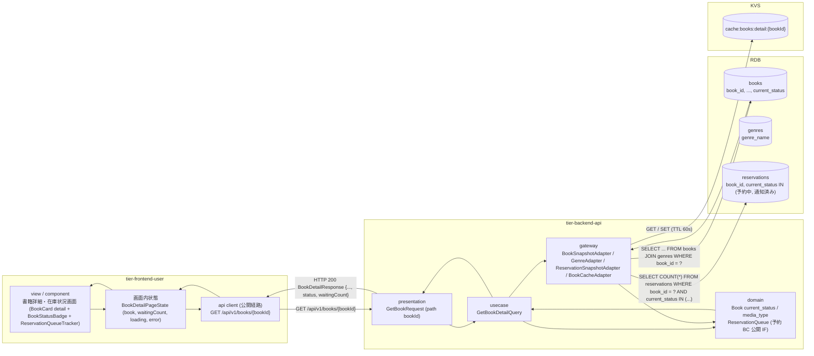
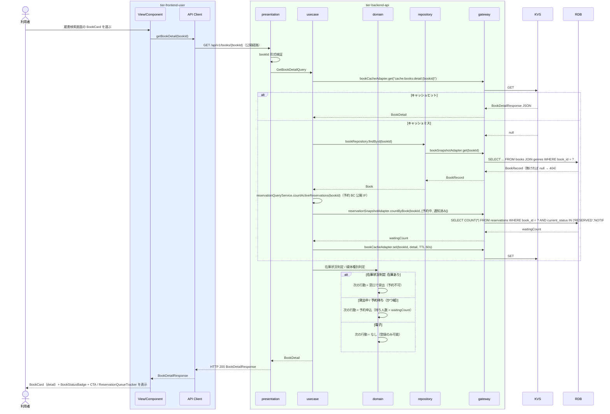

# 書籍詳細を参照する

## 概要

利用者が検索結果から書籍を選び、書籍詳細・在庫状況画面で書籍の詳細と在庫状況（在庫あり・貸出中・予約待ち）を確認する。
在庫状況に応じて次の行動を切り替えて示す: 在庫あり → 「窓口でお借りいただけます」、貸出中 / 予約待ち → 予約申込画面への CTA と現在の予約待ち人数（ReservationQueueTracker）。

## データフロー



| レイヤー | データモデル | 変換内容 |
|---------|------------|---------|
| FE view | 書籍詳細（title, author, isbn, publisher, genreName, mediaType, status, waitingCount） | status と mediaType から CTA を切替。waitingCount を ReservationQueueTracker の総数に表示 |
| FE api client | GET /api/v1/books/{bookId}（公開経路） | trace_id 付与、HTTP エラーの正規化（LR-023） |
| BE presentation | GetBookRequest(bookId) | path 形式検証。GetBookDetailQuery に変換 |
| BE usecase | GetBookDetailQuery → BookDetail | Cache-Aside で KVS 参照。ミス時に書籍取得 + 予約 BC の公開 IF（countActiveReservations）で待ち人数取得（LR-003） |
| BE domain | Book / ReservationQueue（予約中・通知済み件数） | 在庫状況判定（current_status → 表示状態）、媒体種別判定（電子は予約導線なし） |
| BE gateway | books JOIN genres SELECT + reservations COUNT / KVS GET・SET | BookRecord → Book 復元 |
| Response | BookDetailResponse { bookId, title, author, isbn, publisher, genreId, genreName, mediaType, status, waitingCount, registeredAt, updatedAt } | 詳細表示と CTA 切替 |

## 処理フロー



## バリエーション一覧

| バリエーション名 | 値 | 処理内容 | 適用 tier | 適用箇所 |
|----------------|---|---------|----------|---------|
| 媒体種別 | 紙、電子 | 紙のみ予約 CTA を表示。電子は「電子書籍は貸出・予約の対象外です」を表示 | tier-frontend-user, tier-backend-api | 書籍詳細・在庫状況画面 / GetBookDetailQuery |
| ジャンル | 文学、社会科学、自然科学、技術、芸術、歴史、児童書、その他 | genreName を表示 | tier-frontend-user | BookCard（detail） |

## 分岐条件一覧

| 条件名 | 判定ルール | 適用 tier | 適用箇所 | BDD Scenario |
|--------|----------|----------|---------|-------------|
| 在庫状況判定 | status = AVAILABLE → BookStatusBadge「在庫あり」+「窓口でお借りいただけます」（CTA なし）/ ON_LOAN → 「貸出中」+「予約できます」+ 予約申込 CTA / RESERVED → 「予約待ち」+ ReservationQueueTracker（待ち人数）+ 予約申込 CTA（ux-design「ページ間の遷移ルール」） | tier-backend-api, tier-frontend-user | GetBookDetailQuery / 書籍詳細・在庫状況画面 | 在庫ありの書籍詳細 / 貸出中の書籍詳細 / 予約待ちの書籍詳細 |
| 媒体種別判定 | mediaType = ELECTRONIC のとき予約 CTA を表示しない（初期リリースは紙のみ貸出・予約対象） | tier-frontend-user, tier-backend-api | 書籍詳細・在庫状況画面 | 電子書籍には予約導線が表示されない |

## 計算ルール一覧

| 計算名 | 入力情報 | 計算式/ロジック | 出力情報 | 適用 tier |
|--------|---------|---------------|---------|----------|
| 予約待ち人数 | 予約（book_id, 予約の状態） | COUNT(予約 WHERE book_id = 対象 AND 状態 IN (予約中, 通知済み)) | waitingCount | tier-backend-api |
| 申込時の予約順位（表示用） | waitingCount | waitingCount + 1（「現在 n 人待ち。申し込むと n+1 番目」） | ReservationQueueTracker の表示 | tier-frontend-user |

## 状態遷移一覧

| 状態モデル | 遷移元 | 遷移先 | トリガー | 事前条件 | 事後処理 | 適用 tier |
|-----------|--------|--------|---------|---------|---------|----------|
| 書籍の状態 | （参照のみ） | （遷移なし） | 書籍詳細を参照する | なし | なし（在庫状況判定の表示と CTA 切替に使用） | tier-backend-api |
| 予約の状態 | （参照のみ） | （遷移なし） | 書籍詳細を参照する | なし | 予約中・通知済みの件数を待ち人数として表示 | tier-backend-api |

## 関連 RDRA モデル

| モデル種別 | 要素名 | 関連 |
|-----------|--------|------|
| 業務 | 蔵書管理業務 | このUCが属する業務 |
| BUC | 書籍を検索するフロー | このUCを含むBUC |
| アクター | 利用者 | 操作するアクター（価値受益） |
| 画面 | 書籍詳細・在庫状況画面 | 詳細画面 |
| 情報 | 書籍 | 参照する情報（詳細） |
| 情報 | ジャンル | 参照する情報（ジャンル名） |
| 情報 | 予約 | 参照する情報（予約待ち人数） |
| 状態 | 書籍の状態 | 在庫状況の表示と CTA 切替 |
| 条件 | 在庫状況判定 | 在庫状況の表示 |
| 条件 | 媒体種別判定 | 予約導線の有無 |
| バリエーション | 媒体種別、ジャンル | 表示切替 |

## E2E 完了条件（BDD）

### 正常系

```gherkin
Feature: 書籍詳細を参照する

  Scenario: 在庫ありの書籍詳細を表示する
    Given 書籍「B-0001 吾輩は猫である」（著者「夏目漱石」、ISBN「978-4-10-101001-1」、出版社「新潮社」、ジャンル「文学」、紙、在庫あり）が登録済み
    When 利用者が蔵書検索画面の BookCard から書籍詳細・在庫状況画面（/books/B-0001）を開く
    Then BookCard（detail）にタイトル・著者・ISBN・出版社・ジャンル「文学」・媒体種別「紙」が表示される
    And BookStatusBadge「在庫あり」と「窓口でお借りいただけます」が表示され、予約申込 CTA は表示されない

  Scenario: 貸出中の書籍詳細を表示すると予約申込 CTA が表示される
    Given 書籍「B-0002 坊っちゃん」（紙）が貸出中で予約が 0 件である
    When 利用者が書籍詳細・在庫状況画面（/books/B-0002）を開く
    Then BookStatusBadge「貸出中」と「予約できます」が表示される
    And Button「予約を申し込む」が表示され、押すと予約申込画面（/books/B-0002/reserve）へ遷移する

  Scenario: 予約待ちの書籍詳細を表示すると待ち人数が表示される
    Given 書籍「B-0003 こころ」（紙）が予約待ちで、予約中の予約が 2 件ある
    When 利用者が書籍詳細・在庫状況画面（/books/B-0003）を開く
    Then BookStatusBadge「予約待ち」と ReservationQueueTracker「現在 2 人待ち」が表示される
    And Button「予約を申し込む」が表示される
```

### 異常系

```gherkin
  Scenario: 電子書籍には予約導線が表示されない
    Given 書籍「B-0100 デジタル図書館入門」（電子、在庫あり）が登録済み
    When 利用者が書籍詳細・在庫状況画面（/books/B-0100）を開く
    Then 媒体種別「電子」と「電子書籍は貸出・予約の対象外です」が表示される
    And 予約申込 CTA は表示されない

  Scenario: 存在しない書籍は不在メッセージを表示する
    Given 書籍 ID「B-9999」の書籍は登録されていない（削除済み）
    When 利用者が書籍詳細・在庫状況画面（/books/B-9999）を開く
    Then GET /api/v1/books/B-9999 が HTTP 404（code: BOOK_NOT_FOUND）を返す
    And EmptyState（with-action）「この書籍は見つかりませんでした」と「蔵書検索へ戻る」ボタンが表示される

  Scenario: API がエラーを返した場合は利用者向けメッセージと再試行が表示される
    Given GET /api/v1/books/B-0001 が HTTP 500 を返す
    When 利用者が書籍詳細・在庫状況画面（/books/B-0001）を開く
    Then Alert（destructive）「書籍情報を取得できませんでした。しばらくしてからもう一度お試しください」と「再試行」ボタンが表示される
```

## ティア別仕様

- [利用者向けフロントエンド](tier-frontend-user.md)
- [Backend API](tier-backend-api.md)

### 統合 API Spec

- [OpenAPI Spec](../../../_cross-cutting/api/openapi.yaml)（全 UC 統合、Contract First 開発用）
