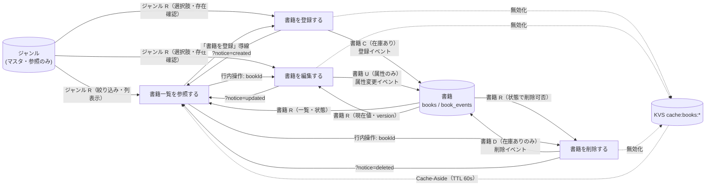
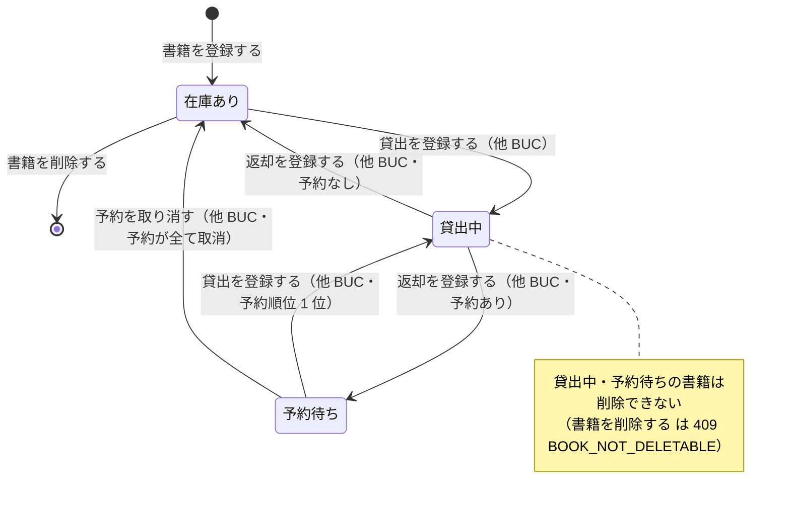

# 蔵書を管理するフロー

## 概要

司書が蔵書一覧で登録状況を確認しながら、書籍を登録・編集・削除して蔵書を最新に保つ BUC。書籍は登録時に「在庫あり」で蔵書に加わり、在庫ありの書籍のみ削除できる（貸出中・予約待ちは削除不可）。書籍の状態を変えるのは登録と削除だけで、貸出・返却・予約による遷移は貸出業務の BUC が担当する。

## 所属 UC 一覧

| UC名 | アクター | 主な操作 | 関連情報 |
|------|---------|---------|---------|
| [書籍一覧を参照する](書籍一覧を参照する/spec.md) | 司書（価値受益） | 蔵書一覧画面で登録済み書籍を状態つきで一覧参照し、絞り込み・ページ送りする。登録・編集・削除の起点 | 書籍、ジャンル |
| [書籍を登録する](書籍を登録する/spec.md) | 司書（価値提供） | 書籍登録画面でタイトル・著者・ISBN・出版社・ジャンル・媒体種別を入力して登録する（状態は在庫あり） | 書籍、ジャンル |
| [書籍を編集する](書籍を編集する/spec.md) | 司書（価値提供） | 書籍編集画面で属性を修正して保存する（楽観ロック）。状態は変更しない | 書籍、ジャンル |
| [書籍を削除する](書籍を削除する/spec.md) | 司書（価値提供） | 書籍削除確認画面で確認のうえ削除する。在庫ありの書籍のみ削除可 | 書籍 |

## UC 横断データフロー

BUC 内の UC 間で情報がどう流れるかを示す。情報がどの UC で作成（C）・参照（R）・更新（U）・削除（D）されるかを明記する。

### データフロー図

### 情報 CRUD マトリクス

| 情報名 | 書籍一覧を参照する | 書籍を登録する | 書籍を編集する | 書籍を削除する |
|--------|:-------:|:-------:|:-------:|:-------:|
| 書籍 | R | C | R / U | R / D |
| ジャンル | R | R | R | |

補足:

- 書籍の C / U / D はいずれも `book_events` へのイベント記録と `books` スナップショットの更新を 1 トランザクションで行い、更新後に `cache:books:*` を無効化する。
- 書籍を編集する は属性のみ更新し、書籍の状態（current_status）は変更しない。

## 状態遷移全体図

BUC 内で関連する状態モデルの全遷移パスと、各遷移を担当する UC を示す。本 BUC が担当する遷移は「（初期）→ 在庫あり」と「在庫あり → 削除」の 2 本で、それ以外の遷移は貸出業務の UC（他 BUC）が担当する。

### 状態遷移 UC マッピング

| 状態モデル | 遷移元 | 遷移先 | 担当 UC |
|-----------|--------|--------|--------|
| 書籍の状態 | （初期） | 在庫あり | [書籍を登録する](書籍を登録する/spec.md) |
| 書籍の状態 | 在庫あり | （削除・終了） | [書籍を削除する](書籍を削除する/spec.md) |
| 書籍の状態 | （参照のみ） | （遷移なし） | [書籍一覧を参照する](書籍一覧を参照する/spec.md)（在庫状況判定の表示に使用） |
| 書籍の状態 | （参照のみ） | （遷移なし） | [書籍を編集する](書籍を編集する/spec.md)（BookStatusBadge に現在状態を表示。媒体種別変更の可否判定に使用） |
| 書籍の状態 | 在庫あり / 予約待ち | 貸出中 | 貸出を登録する（貸出業務 / 書籍を貸し出すフロー） |
| 書籍の状態 | 貸出中 | 在庫あり / 予約待ち | 返却を登録する（貸出業務 / 書籍を返却するフロー） |
| 書籍の状態 | 予約待ち | 在庫あり | 予約を取り消す（貸出業務 / 書籍を予約するフロー） |

## BUC 内共有条件一覧

BUC 内の複数 UC で共有される条件の一覧。各条件がどの UC で適用されるかを明記する。

| 条件名 | 条件の説明 | 適用 UC |
|--------|----------|--------|
| 在庫状況判定 | books.current_status（在庫あり / 貸出中 / 予約待ち）をそのまま BookStatusBadge の state として表示する。削除では削除可否の根拠として現在の状態を表示する | 書籍一覧を参照する, 書籍を削除する |
| 媒体種別判定 | 媒体種別（紙 / 電子）の受理・表示ルール。一覧では媒体列に表示し電子も含める。登録では PAPER / ELECTRONIC を受理し、いずれも在庫ありで登録する。編集では在庫ありの書籍のみ紙 ⇄ 電子の変更を受理し、貸出中・予約待ちの書籍を電子へ変更する要求は 409（MEDIA_TYPE_CHANGE_NOT_ALLOWED） | 書籍一覧を参照する, 書籍を登録する, 書籍を編集する |
| ジャンル存在判定 | genreId が genres に存在しない場合は 422（GENRE_NOT_FOUND）とし、登録・更新しない | 書籍を登録する, 書籍を編集する |
| 楽観ロック判定 | リクエストの version（If-Match）が books.version と一致する場合のみ UPDATE / DELETE を実行する。件数 0 は 409（OPTIMISTIC_LOCK_CONFLICT） | 書籍を編集する, 書籍を削除する |

BUC 内で 1 つの UC でしか使われない条件（UC Spec 側のみ）:

- 書籍検索条件判定（書籍一覧を参照する）
- 削除可否判定（書籍を削除する。状態.tsv「在庫あり → 書籍を削除する」の不変条件）

## BUC 内共有バリエーション一覧

BUC 内の複数 UC で共有されるバリエーションの一覧。

| バリエーション名 | 値 | 適用 UC |
|----------------|---|--------|
| ジャンル | 文学、社会科学、自然科学、技術、芸術、歴史、児童書、その他 | 書籍一覧を参照する（絞り込み・ジャンル列）, 書籍を登録する（Select 選択肢・存在確認）, 書籍を編集する（Select 選択肢・存在確認） |
| 媒体種別 | 紙、電子 | 書籍一覧を参照する（媒体列）, 書籍を登録する（受理値。初期リリースは紙固定表示）, 書籍を編集する（ToggleGroup。貸出中・予約待ちは電子へ変更不可） |

BUC 内で 1 つの UC でしか使われないバリエーション（UC Spec 側のみ）:

- 検索条件種別（書籍一覧を参照する）
