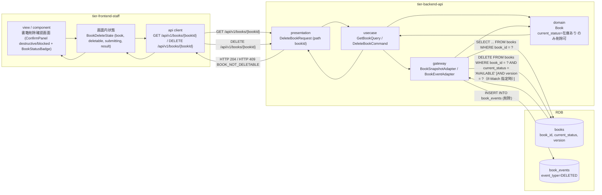
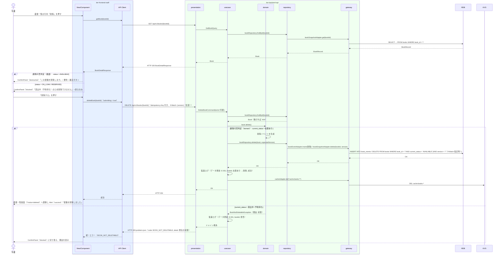

# 書籍を削除する

## 概要

司書が不要になった書籍を書籍削除確認画面で確認のうえ削除し、蔵書一覧から除外する。
削除できるのは書籍の状態が「在庫あり」の書籍のみで、貸出中・予約待ちの書籍は削除できない（状態.tsv / 集約 AG-001 の不変条件）。削除は削除イベントを記録したうえでスナップショットを除去する。

## データフロー



| レイヤー | データモデル | 変換内容 |
|---------|------------|---------|
| FE view | 対象書籍の要約（bookId, title, author, status）と削除可否 | GET の応答から `deletable = (status === 'AVAILABLE')` を導出し ConfirmPanel の variant（destructive / blocked）と impact 文言を切り替え |
| FE api client | DELETE /api/v1/books/{bookId} | trace_id と Idempotency-Key を付与。409 の理由コード（BOOK_NOT_DELETABLE）を保持して正規化（LR-027） |
| BE presentation | DeleteBookRequest(bookId) | path の形式検証。認可コンテキスト（司書）を付与して DeleteBookCommand に変換 |
| BE usecase | DeleteBookCommand | 書籍取得（無ければ 404）、Book.delete() で不変条件検証、repository.delete（削除イベント INSERT + スナップショット DELETE）を 1 トランザクションで実行。監査ログ出力（LP-006）。キャッシュ無効化 |
| BE domain | Book（current_status が在庫ありのときのみ削除可） | 状態遷移「在庫あり → （削除）」（LP-010 / LR-005） |
| BE gateway | book_events INSERT（event_type=DELETED、payload に削除前属性）+ books DELETE | 削除件数 0 なら競合例外 |
| Response | 204 No Content / 409 problem+json | 蔵書一覧画面へ戻る際の Alert（success）/ ConfirmPanel（blocked） |

## 処理フロー



## バリエーション一覧

| バリエーション名 | 値 | 処理内容 | 適用 tier | 適用箇所 |
|----------------|---|---------|----------|---------|
| （該当なし） | - | 本 UC はバリエーションによる分岐を持たない | - | - |

## 分岐条件一覧

| 条件名 | 判定ルール | 適用 tier | 適用箇所 | BDD Scenario |
|--------|----------|----------|---------|-------------|
| 削除可否判定（状態.tsv「在庫あり → 書籍を削除する」） | books.current_status が `AVAILABLE` の場合のみ削除する。`ON_LOAN` / `RESERVED` は 409（code: BOOK_NOT_DELETABLE）。画面側は GET の status で ConfirmPanel を destructive / blocked に切り替える（補助判定。最終判定は API） | tier-backend-api, tier-frontend-staff | Book.delete() / 書籍削除確認画面 | 在庫ありの書籍を削除できる / 貸出中の書籍は削除できない |
| 楽観ロック判定 | DELETE の WHERE に version を含め、削除件数 0 は 409（code: OPTIMISTIC_LOCK_CONFLICT）とする | tier-backend-api | bookRepository.delete() | （API ティア完了条件で検証） |

## 計算ルール一覧

| 計算名 | 入力情報 | 計算式/ロジック | 出力情報 | 適用 tier |
|--------|---------|---------------|---------|----------|
| 削除可否（画面補助） | BookDetailResponse.status | `deletable = status === 'AVAILABLE'` | ConfirmPanel.blocked | tier-frontend-staff |

## 状態遷移一覧

| 状態モデル | 遷移元 | 遷移先 | トリガー | 事前条件 | 事後処理 | 適用 tier |
|-----------|--------|--------|---------|---------|---------|----------|
| 書籍の状態 | 在庫あり | （削除・終了） | 書籍を削除する | 書籍の状態が在庫あり（貸出中・予約待ちは不可） | book_events に「削除」イベント記録、books スナップショット除去、監査ログ、`cache:books:*` 無効化 | tier-backend-api |

## 関連 RDRA モデル

| モデル種別 | 要素名 | 関連 |
|-----------|--------|------|
| 業務 | 蔵書管理業務 | このUCが属する業務 |
| BUC | 蔵書を管理するフロー | このUCを含むBUC |
| アクター | 司書 | 操作するアクター（価値提供） |
| 画面 | 書籍削除確認画面 | 確認画面 |
| 情報 | 書籍 | 削除する情報（貸出中・予約待ちは削除できない） |
| 状態 | 書籍の状態 | 在庫あり → 削除（終了） |
| 条件 | 在庫状況判定 | 削除可否の根拠として現在の状態を表示 |

## E2E 完了条件（BDD）

### 正常系

```gherkin
Feature: 書籍を削除する

  Scenario: 在庫ありの書籍を削除できる
    Given 司書「佐藤花子」が司書ポータルにログイン済み
    And 書籍「B-0001 吾輩は猫である」（在庫あり）が登録済み
    When 蔵書一覧画面の行内「削除」で書籍削除確認画面（/staff/books/B-0001/delete）を開き、ConfirmPanel（destructive）で「削除する」を押す
    Then HTTP 204 が返る
    And 蔵書一覧画面に Alert（success）「書籍を削除しました」が表示され、BookTable に「吾輩は猫である」は表示されない

  Scenario: 確認画面で「戻る」を押すと削除されずに一覧へ戻る
    Given 司書「佐藤花子」が書籍「B-0001」（在庫あり）の削除確認画面を「?page=2」から開いている
    When 「戻る」を押す
    Then DELETE /api/v1/books/B-0001 は呼び出されない
    And 蔵書一覧画面が「?page=2」で表示され「吾輩は猫である」が残っている
```

### 異常系

```gherkin
  Scenario: 貸出中の書籍は削除できない
    Given 司書「佐藤花子」が司書ポータルにログイン済み
    And 書籍「B-0002 坊っちゃん」が貸出中である
    When 書籍削除確認画面（/staff/books/B-0002/delete）を開く
    Then ConfirmPanel（blocked）「貸出中のため削除できません」と BookStatusBadge「貸出中」が表示される
    And 「削除する」ボタンは表示されず「戻る」のみ表示される

  Scenario: 確認画面表示後に貸し出された書籍は API で拒否される
    Given 司書「佐藤花子」が書籍「B-0003 こころ」（在庫あり）の削除確認画面を開いている
    And 別の司書が「B-0003」の貸出を登録して状態が貸出中になった
    When 「削除する」を押す
    Then HTTP 409 と problem+json（code: BOOK_NOT_DELETABLE, detail: "貸出中"）が返る
    And ConfirmPanel が blocked に切り替わり「貸出中のため削除できません」が表示される

  Scenario: 予約待ちの書籍は API で削除できない
    Given 司書「佐藤花子」のアクセストークンを保持している
    And 書籍「B-0004」が予約待ちである
    When DELETE /api/v1/books/B-0004 を送信する
    Then HTTP 409 と problem+json（code: BOOK_NOT_DELETABLE, detail: "予約待ち"）が返る
    And books に「B-0004」が残っている

  Scenario: 存在しない書籍の削除は 404 になる
    Given 司書「佐藤花子」が司書ポータルにログイン済み
    When 書籍削除確認画面（/staff/books/B-9999/delete）を開く
    Then GET /api/v1/books/B-9999 が HTTP 404（code: BOOK_NOT_FOUND）を返す
    And EmptyState「書籍が見つかりません」と「蔵書一覧へ戻る」ボタンが表示される
```

## ティア別仕様

- [司書向けフロントエンド](tier-frontend-staff.md)
- [Backend API](tier-backend-api.md)

### 統合 API Spec

- [OpenAPI Spec](../../../_cross-cutting/api/openapi.yaml)（全 UC 統合、Contract First 開発用）
